# Review: gh_numpy_numpy_23074

**Importing NumPy 1.24.1 abruptly exits Python on 32-bit Windows 7**

- source: https://github.com/numpy/numpy/issues/23074
- kind: LLM draft (needs review)
- reviewed: `True`
- graph: `data/github_v0/graphs/gh_numpy_numpy_23074.json` · raw thread: `data/github_v0/raw/gh_numpy_numpy_23074.json`

```mermaid
flowchart LR
    N0["<b>N0 import crash with local source workaround</b><br/><small>info: 5</small>"]
    N1["<b>N1 clean installed code reproduces crash</b><br/><small>info: 8</small>"]
    N2["<b>N2 crash narrowed to array ufunc types and old hardware</b><br/><small>info: 13</small>"]
    N3["<b>N3 CPU-feature environment probe does not reach runtime output</b><br/><small>info: 14</small>"]
    N4["<b>N4 local bypass in use but safety unresolved</b><br/><small>info: 16</small>"]
    N_terminal["<b>terminal closed without reporter verification</b><br/><small>info: 18</small>"]
    N0 ==>|"🔀 ❓pip_list_numpy_and_opencv_versions, windows7_32bit_native_not_vm, unmodified_numpy_import_still_exits + ⚡Restore the installed NumPy source before collecting diagnostic results so the behavior of the distributed package can be reproduced independently of the local workaround."| N1
    linkStyle 0 stroke:#a855f7,stroke-width:2px
    N1 -.->|"❓ float_scalar_and_longdouble_probe_outputs, float16_float32_array_power_exits_but_float64_int_work, runtime_reports_sse_features_and_nehalem_openblas, systeminfo_reports_family6_model37_x86_pc"| N2
    linkStyle 1 stroke:#3b82f6,stroke-width:2px
    N2 -.->|"❓ cpu_feature_disable_probe_original_code_exits"| N3
    linkStyle 2 stroke:#3b82f6,stroke-width:2px
    N3 ==>|"⚡ Reapply the reporter's local getlimits bypasses so NumPy can import temporarily while documenting that this only avoids the crashing array operations and is not an upstream or validated platform fix."| N4
    linkStyle 3 stroke:#f97316,stroke-width:2px
    N4 ==>|"⚡ Treat the crash as an incompatibility in NumPy's compiled ufunc/SIMD path on the reporter's unsupported old 32-bit Windows and Westmere-era hardware, not as a getlimits formula bug; use an older pre-SIMD NumPy with a compatible OpenCV build or move the workload to supported hardware or a cloud environment, and verify imports and array operations before declaring success."| N_terminal
    linkStyle 4 stroke:#f97316,stroke-width:2px
    class N0 start
    class N1 normal
    class N2 normal
    class N3 normal
    class N4 normal
    class N_terminal terminal
    classDef start fill:#fee2e2,stroke:#b91c1c,color:#000
    classDef terminal fill:#dcfce7,stroke:#15803d,color:#000
    classDef normal fill:#fef3c7,stroke:#a16207,color:#000
```

## Opening (body)

> I am learning OpenCV, but importing cv2 caused Python to crash. I traced that to cv2 importing NumPy: a simple script prints 2143 and then abruptly returns to the command prompt when it reaches `import numpy`, without an exception. I am using NumPy 1.24.1 with Python 3.8.10 32-bit. I traced the exit through `core.getlimits._register_known_types()` to the `MachArLike` resolution calculation. Changing `self._float_conv(10)` to `self._float_conv(10)[0]` lets the import proceed, and I would like to contribute a fix.

## Satisfaction conditions

1. Must identify the accepted diagnosis as an unsupported old 32-bit Windows and Westmere-era hardware path failing in compiled NumPy array operations, rather than a Python list exponentiation error or a defect specifically proven in the getlimits formula.
2. Diagnosis must be grounded in the collected dtype probes, NumPy runtime output, and processor/system information; it must not be asserted solely from the abrupt import exit.
3. Must not claim that disabling SSE3, SSSE3, SSE41, POPCNT, and SSE42 fixed the original package, because the unmodified import still exited during that probe.
4. Must not present the reporter's math.log10 and scalar-index source edits as a safe upstream fix; they bypassed multiple crashing ufunc calls without validating the rest of NumPy or OpenCV.
5. The practical recommendation is to test an older NumPy with a compatible OpenCV package or use supported newer hardware or a cloud environment.
6. Must ask the reporter to verify NumPy import and affected array operations in the replacement environment before declaring resolution; this thread ended without that verification.

## Edges

| edge | type | gates / info | payload |
|---|---|---|---|
| `e1_N0__N1` | mixed | req_info: local_scalar_index_edit_allows_import elements: asks_to_reproduce_with_unmodified_installed_code | Restore the installed NumPy source before collecting diagnostic results so the behavior of the distributed package can be reproduced independently of the local workaround. |
| `e2_N1__N2` | clarification_only | asks: float_scalar_and_longdouble_probe_outputs, float16_float32_array_power_exits_but_float64_int_work, runtime_reports_sse_features_and_nehalem_openblas, systeminfo_reports_family6_model37_x86_pc | `10.0 ** -500` returns 0.0, `np.float64(10.0) ** -500` also returns 0.0, and `np.dtype(np.longdouble).itemsize / `np.array([10], np.float16) ** 3` and the float32 version close Python. Integer and float64 arrays return arra / `np.show_runtime()` reports SSE and SSE2 as baseline; SSE3, SSSE3, SSE41, POPCNT, and SSE42 as found; AVX and  / `systeminfo` says Windows 7 Home Basic Service Pack 1, x86-based PC, Lenovo model 20060, with `x64 Family 6 Mo |
| `e3_N2__N3` | clarification_only | asks: cpu_feature_disable_probe_original_code_exits | With the original code restored, I set `OPENBLAS_CORETYPE=Haswell`, `OPENBLAS_NUM_THREADS=1`, and `NPY_DISABLE |
| `e4_N3__N4` | solution_only | req_info: local_scalar_index_edit_allows_import, local_math_log10_edit_was_also_required, float16_float32_array_power_exits_but_float64_int_work elements: treats_source_edits_as_an_unvalidated_local_bypass | Reapply the reporter's local getlimits bypasses so NumPy can import temporarily while documenting that this only avoids the crashing array operations and is not an upstream or validated platform fix. |
| `e5_N4__N_terminal` | solution_only | req_info: numpy_1_24_1_python_3_8_10_32bit, opencv_import_reaches_numpy_crash, local_scalar_index_edit_allows_import, local_math_log10_edit_was_also_required, windows7_32bit_native_not_vm, float_scalar_and_longdouble_probe_outputs, float16_float32_array_power_exits_but_float64_int_work, runtime_reports_sse_features_and_nehalem_openblas, systeminfo_reports_family6_model37_x86_pc, cpu_feature_disable_probe_original_code_exits elements: identifies_the_old_32bit_windows_and_cpu_platform_as_unsupported, connects_the_exit_to_compiled_numpy_array_operations_not_python_list_power, recommends_an_older_compatible_numpy_opencv_environment_or_supported_hardware, does_not_present_the_getlimits_edits_as_an_upstream_fix, asks_user_to_verify_import_and_array_operations_in_the_replacement_environment | Treat the crash as an incompatibility in NumPy's compiled ufunc/SIMD path on the reporter's unsupported old 32-bit Windows and Westmere-era hardware, not as a getlimits formula bug; use an older pre-SIMD NumPy with a compatible OpenCV build or move the workload to supported hardware or a cloud environment, and verify imports and array operations before declaring success. |

## Nodes

| node | terminal | volunteered | images | symptoms |
|---|---|---|---|---|
| `N0` |  | 2 | 0 | My script prints 2143, reaches `import numpy`, and then Python abruptly returns to the command prompt without printing an exception. Changin |
| `N1` |  | 1 | 0 | After reverting my source changes, even `import sys, numpy; print(numpy.version)` abruptly closes the Python shell. This is a native 32-bit  |
| `N2` |  | 1 | 0 | `10.0 ** -500` and `np.float64(10.0) ** -500` both return 0.0, and long double has an item size of 8. Array exponentiation with float16 or f |
| `N3` |  | 0 | 0 | With the original NumPy code, setting the requested OpenBLAS variables and disabling SSE3, SSSE3, SSE41, POPCNT, and SSE42 still makes the p |
| `N4` |  | 1 | 0 | After applying my local getlimits changes again, NumPy imports and `show_runtime()` prints output with the optional CPU features disabled. O |
| `N_terminal` | ✓ | 0 | 0 | The unmodified NumPy 1.24.1 installation still abruptly exits on my computer, while my local source edits only bypass the operations that cr |

## Machine review (audit pass, adversarially verified)

Auditor verdict: **n/a** · 0 of 0 findings survived independent refutation.

__

## Review checklist

> The graph is the case's ANSWER KEY, not a transcript: edge order need
> not mirror thread chronology. Do not file chronology mismatch as a
> defect; what must be faithful is who knew what, when.

Structural (machine-checked by `scripts/validate.py`, re-verify after edits):

- [ ] validates: schema + info-containment + terminal reachability

Semantic (the defect catalog — check each against the source thread):

- [ ] **Faithful blind paths** — every `is_known_blind_path` edge corresponds
  to an attempt actually falsified in the thread (or a brush-off the
  reporter rejected). No invented failures; no ACCEPTED fix mislabeled as
  a blind path (the most common LLM defect class).
- [ ] **Gettable required info** — every id in any `solution.required_info`
  is obtainable: a clarification on some edge, or in the start node's
  info_state, or volunteered (with matching `volunteered_info` text).
  Engineer-only inference belongs in `info_inferred_by_engineer` /
  `inference_hint`, not in hard required_info.
- [ ] **Measurement-class rule** — handler-initiated measurements the user
  executed (bisections, test builds, config probes, version checks) are
  clarification edges, not solutions; their answers state what the
  measurement showed.
- [ ] **No logistics gates** — `required_elements_for_full_match` encode the
  technical diagnostic→fix chain, not release/packaging/scheduling
  remarks the engineer merely mentioned.
- [ ] **Coherent reveals** — each `user_answer_in_this_oncall` is consistent
  with the thread, delivers what it promises, and stays in the user's
  voice (no future knowledge, no diagnosis the user never made).
- [ ] **Symptoms are observations** — `symptoms_visible` contains only what
  the user can see; no causes or advice.
- [ ] **Terminal semantics** — satisfaction_conditions demand root cause +
  evidence grounding + prohibition of falsified moves + user verification;
  the terminal node is the verified-resolved state.
- [ ] **Image assignment** — referenced attachments exist and sit on the
  right hook (opening / node symptom / clarification evidence).
- [ ] **Persona** — matches the reporter's actual expertise and style.

## How to sign off

1. Edit the graph JSON if needed (authored fields only; keep
   `concrete_example` as the factual record).
2. `uv run scripts/validate.py '<graph path>'`
3. Set `metadata.hitl_reviewed: true` in the graph JSON.
4. Re-run `uv run scripts/make_review_docs.py` to refresh this page.
