# Review: gh_numpy_numpy_25464

**Intermittent sort and argsort crashes on macOS arm64**

- source: https://github.com/numpy/numpy/issues/25464
- kind: LLM draft (needs review)
- reviewed: `True`
- graph: `data/github_v0/graphs/gh_numpy_numpy_25464.json` · raw thread: `data/github_v0/raw/gh_numpy_numpy_25464.json`

```mermaid
flowchart LR
    N0["<b>N0 intermittent macOS arm64 crashes reported</b><br/><small>info: 4</small>"]
    N1["<b>N1 full failing CI run supplied</b><br/><small>info: 5</small>"]
    N2_x["<b>N2_x Highway 1.1.0 update aftermath</b><br/><small>info: 7</small>"]
    N3["<b>N3 ARM NEON crash localized under debugger</b><br/><small>info: 10</small>"]
    N4["<b>N4 macOS arm64 Highway sorting mitigated</b><br/><small>info: 12</small>"]
    N_terminal["<b>terminal crashes no longer observed</b><br/><small>info: 15</small>"]
    N0 -.->|"❓ full_cirrus_run_4660394644471808"| N1
    linkStyle 0 stroke:#3b82f6,stroke-width:2px
    N1 ==>|"💥 blind: Update the vendored Highway dependency from 1.0.7 to the newly released 1.1.0, on the theory that intervening VQSort fixes may eliminate the intermittent crash."| N2_x
    linkStyle 1 stroke:#ef4444,stroke-width:2px
    N2_x -.->|"❓ failures_observed_only_in_arm64_jobs, failures_cross_macos_and_python_versions, local_lldb_crash_in_highway_neon_partition_store"| N3
    linkStyle 2 stroke:#3b82f6,stroke-width:2px
    N3 ==>|"⚡ Mitigate the release-blocking crashes by disabling the Highway sorting implementation specifically on macOS arm64 while retaining it on Linux arm64."| N4
    linkStyle 3 stroke:#f97316,stroke-width:2px
    N4 ==>|"⚡ Update the vendored Highway code to include the upstream fix for the PartitionRightmost NEON out-of-bounds access, then monitor macOS arm64 CI before declaring the intermittent crash resolved."| N_terminal
    linkStyle 4 stroke:#f97316,stroke-width:2px
    class N0 start
    class N1 normal
    class N2_x normal
    class N3 normal
    class N4 normal
    class N_terminal terminal
    classDef start fill:#fee2e2,stroke:#b91c1c,color:#000
    classDef terminal fill:#dcfce7,stroke:#15803d,color:#000
    classDef normal fill:#fef3c7,stroke:#a16207,color:#000
```

## Opening (body)

> Our macOS arm64 CI jobs on Cirrus are crashing fairly regularly in sort-related tests. The worker process dies in multiple tests and with multiple input values, not just one case. This happened both before and after downgrading the Highway git submodule to 1.0.7. I initially thought the changes from gh-25247 were the first thing to investigate.

## Satisfaction conditions

1. Must identify the accepted root cause: Highway's PartitionRightmost corner case accessed memory beyond the array when the rightmost keys all belonged to the left partition, which could fault in the NEON path when the array was near a memory-page boundary.
2. The diagnosis must be grounded in the arm64-only CI pattern and the raw lldb crash in Highway's NEON partition/store path, while distinguishing that evidence from the upstream maintainer's precise root-cause analysis.
3. Must not treat updating to Highway 1.1.0 as sufficient; macOS arm64 sort, argsort, and partition-related crashes continued after that update.
4. The macOS arm64 platform restriction is an acceptable immediate mitigation but must not be confused with the underlying fix.
5. The durable fix must update the vendored Highway code with the partition corner-case correction and require monitoring or retesting macOS arm64 CI on a build containing it before declaring resolution.
6. Must not retain the opening gh-25247 suspicion as the final diagnosis.

## Edges

| edge | type | gates / info | payload |
|---|---|---|---|
| `e1_N0__N1` | clarification_only | asks: full_cirrus_run_4660394644471808 | Sure, here is a full example run: https://cirrus-ci.com/task/4660394644471808 |
| `e2_N1__N2_x` | solution_only **BLIND** | req_info: highway_1_0_7_downgrade_did_not_stop_crashes, full_cirrus_run_4660394644471808 elements: proposes_updating_highway_to_the_new_stable_release | Update the vendored Highway dependency from 1.0.7 to the newly released 1.1.0, on the theory that intervening VQSort fixes may eliminate the intermittent crash. |
| `e3_N2_x__N3` | clarification_only | asks: failures_observed_only_in_arm64_jobs, failures_cross_macos_and_python_versions, local_lldb_crash_in_highway_neon_partition_store | Yes, I have only seen these crashes in the arm64 jobs. / There does not seem to be a correlation. One failing job used Python 3.10 on Sonoma and another used Python 3. / I managed to hit it once locally outside the Tart VM. lldb stopped with EXC_BAD_ACCESS at address 0x122600000. |
| `e4_N3__N4` | solution_only | req_info: failures_observed_only_in_arm64_jobs, failures_cross_macos_and_python_versions, local_lldb_crash_in_highway_neon_partition_store elements: disables_highway_sort_specifically_for_macos_arm64, treats_the_change_as_a_temporary_mitigation, does_not_unnecessarily_disable_the_linux_arm64_path | Mitigate the release-blocking crashes by disabling the Highway sorting implementation specifically on macOS arm64 while retaining it on Linux arm64. |
| `e5_N4__N_terminal` | solution_only | req_info: macos_arm64_ci_intermittently_crashes_in_sort_tests, highway_1_1_0_update_did_not_stop_arm64_crashes, post_update_failures_span_sort_argsort_and_partition_tests, failures_cross_macos_and_python_versions, full_cirrus_run_4660394644471808, local_lldb_crash_in_highway_neon_partition_store elements: identifies_the_partitionrightmost_out_of_bounds_corner_case, explains_that_neon_cannot_mask_the_beyond_array_access, updates_vendored_highway_with_the_upstream_fix, asks_user_to_verify_on_ci_using_a_build_containing_the_fix | Update the vendored Highway code to include the upstream fix for the PartitionRightmost NEON out-of-bounds access, then monitor macOS arm64 CI before declaring the intermittent crash resolved. |

## Nodes

| node | terminal | volunteered | images | symptoms |
|---|---|---|---|---|
| `N0` |  | 2 | 0 | Our macOS arm64 Cirrus jobs regularly lose a pytest worker while running sort-related tests, including test_sort_float, across multiple inpu |
| `N1` |  | 0 | 0 | The linked full Cirrus run contains a macOS arm64 worker crash while running a sort test. |
| `N2_x` |  | 2 | 0 | After updating to Highway 1.1.0, macOS arm64 wheel jobs still intermittently crash in test_partition, test_argsort, and test_sort. In one ru |
| `N3` |  | 0 | 0 | The failures have only appeared in arm64 jobs and have occurred on both Sonoma and Monterey with different Python versions. A local run stop |
| `N4` |  | 0 | 0 | Our macOS arm64 builds now avoid the Highway sorting path, while Linux arm64 builds retain it. |
| `N_terminal` | ✓ | 1 | 0 | After the Highway update containing the partition fix, the intermittent macOS arm64 sorting crashes have not reappeared in our observed CI r |

## Machine review (audit pass, adversarially verified)

Auditor verdict: **n/a** · 0 of 0 findings survived independent refutation.

__

## Review checklist

> The graph is the case's ANSWER KEY, not a transcript: edge order need
> not mirror thread chronology. Do not file chronology mismatch as a
> defect; what must be faithful is who knew what, when.

Structural (machine-checked by `scripts/validate.py`, re-verify after edits):

- [ ] validates: schema + info-containment + terminal reachability

Semantic (the defect catalog — check each against the source thread):

- [ ] **Faithful blind paths** — every `is_known_blind_path` edge corresponds
  to an attempt actually falsified in the thread (or a brush-off the
  reporter rejected). No invented failures; no ACCEPTED fix mislabeled as
  a blind path (the most common LLM defect class).
- [ ] **Gettable required info** — every id in any `solution.required_info`
  is obtainable: a clarification on some edge, or in the start node's
  info_state, or volunteered (with matching `volunteered_info` text).
  Engineer-only inference belongs in `info_inferred_by_engineer` /
  `inference_hint`, not in hard required_info.
- [ ] **Measurement-class rule** — handler-initiated measurements the user
  executed (bisections, test builds, config probes, version checks) are
  clarification edges, not solutions; their answers state what the
  measurement showed.
- [ ] **No logistics gates** — `required_elements_for_full_match` encode the
  technical diagnostic→fix chain, not release/packaging/scheduling
  remarks the engineer merely mentioned.
- [ ] **Coherent reveals** — each `user_answer_in_this_oncall` is consistent
  with the thread, delivers what it promises, and stays in the user's
  voice (no future knowledge, no diagnosis the user never made).
- [ ] **Symptoms are observations** — `symptoms_visible` contains only what
  the user can see; no causes or advice.
- [ ] **Terminal semantics** — satisfaction_conditions demand root cause +
  evidence grounding + prohibition of falsified moves + user verification;
  the terminal node is the verified-resolved state.
- [ ] **Image assignment** — referenced attachments exist and sit on the
  right hook (opening / node symptom / clarification evidence).
- [ ] **Persona** — matches the reporter's actual expertise and style.

## How to sign off

1. Edit the graph JSON if needed (authored fields only; keep
   `concrete_example` as the factual record).
2. `uv run scripts/validate.py '<graph path>'`
3. Set `metadata.hitl_reviewed: true` in the graph JSON.
4. Re-run `uv run scripts/make_review_docs.py` to refresh this page.
