# Review: gh_numpy_numpy_26197

**BUG: numpy.any returns True given a boolean array of all False with the intel compiler**

- source: https://github.com/numpy/numpy/issues/26197
- kind: LLM draft (needs review)
- reviewed: `True`
- graph: `data/github_v0/graphs/gh_numpy_numpy_26197.json` · raw thread: `data/github_v0/raw/gh_numpy_numpy_26197.json`

```mermaid
flowchart LR
    N0["<b>N0 incorrect boolean reduction reported</b><br/><small>info: 6</small>"]
    N1["<b>N1 compiler and SIMD dependence established</b><br/><small>info: 8</small>"]
    N2_x["<b>N2_x NumPy update aftermath</b><br/><small>info: 11</small>"]
    N3_x["<b>N3_x older Intel Classic compiler aftermath</b><br/><small>info: 12</small>"]
    N4["<b>N4 Intel LLVM and Classic builds compared</b><br/><small>info: 14</small>"]
    N_terminal["<b>terminal compiler defect diagnosed without final NumPy-side fix confirmation</b><br/><small>info: 17</small>"]
    N0 -.->|"❓ numpy_built_from_source_for_mkl_with_intel_classic, disabling_avx512_skx_returns_false_up_to_2pow32"| N1
    linkStyle 0 stroke:#3b82f6,stroke-width:2px
    N1 ==>|"💥 blind: Upgrade from NumPy 1.26.2 to 1.26.4 in case a related reduction or SIMD fix was already included."| N2_x
    linkStyle 1 stroke:#ef4444,stroke-width:2px
    N2_x ==>|"💥 blind: Rebuild with an older Intel oneAPI Compiler Classic release to determine whether the behavior is confined to the initially used compiler version."| N3_x
    linkStyle 2 stroke:#ef4444,stroke-width:2px
    N3_x ==>|"⚡ Rebuild NumPy with the Intel LLVM compiler rather than Intel Compiler Classic, retain AVX512 support, and compare correctness and performance."| N4
    linkStyle 3 stroke:#f97316,stroke-width:2px
    N4 ==>|"⚡ Diagnose the failure as an Intel Compiler Classic optimizer defect in the AVX512_SKX boolean-reduction path, not a NumPy-version or MKL semantic error; avoid the affected Classic-generated path by using Intel LLVM or temporarily disabling AVX512_SKX, and require a retest before claiming any future NumPy-side workaround is resolved."| N_terminal
    linkStyle 4 stroke:#f97316,stroke-width:2px
    class N0 start
    class N1 normal
    class N2_x normal
    class N3_x normal
    class N4 normal
    class N_terminal terminal
    classDef start fill:#fee2e2,stroke:#b91c1c,color:#000
    classDef terminal fill:#dcfce7,stroke:#15803d,color:#000
    classDef normal fill:#fef3c7,stroke:#a16207,color:#000
```

## Opening (body)

> I installed NumPy 1.26.2 on an x86_64 Linux HPC system. For a one-dimensional boolean array containing only False, np.any returns False at length 63 but True at length 64 or greater. Python 3.11.6 reports a GCC Intel C++ 11.3.1 mode build. The runtime information reports Intel MKL 2023.1 and support for AVX512_SKX among the detected SIMD extensions. This operation has returned False across the other NumPy versions and platforms I have used, and I rely on it regularly for filtering data.

## Satisfaction conditions

1. Must identify the final accepted root cause as an Intel Compiler Classic optimizer bug in the AVX512_SKX mask/reduction path, rather than a general np.any defect, an MKL computation error, or a NumPy 1.26.2-only regression.
2. The diagnosis must be grounded in the collected evidence: disabling AVX512_SKX restores correct output, NumPy 1.26.4 and an older Intel Classic compiler still fail, and an AVX512-enabled Intel LLVM build returns the correct result.
3. Must not present upgrading to NumPy 1.26.4 or downgrading to an older Intel Compiler Classic release as the fix; both were tried on the reporter's system and retained the incorrect result.
4. A practical workaround may use an Intel LLVM icx build or disable AVX512_SKX, but it must acknowledge the reporter's measured performance penalty rather than claiming an equivalent optimized fix.
5. Must not declare a NumPy-side fix fully resolved without asking the affected user to verify a rebuilt or patched NumPy on the affected system; the thread ends after the maintainer's compiler diagnosis without such a follow-up confirmation.

## Edges

| edge | type | gates / info | payload |
|---|---|---|---|
| `e1_N0__N1` | clarification_only | asks: numpy_built_from_source_for_mkl_with_intel_classic, disabling_avx512_skx_returns_false_up_to_2pow32 | I compiled NumPy from source because I wanted to link it to Intel MKL, and I used the Intel compiler. / I tried disabling different CPU features. With export NPY_DISABLE_CPU_FEATURES="AVX512_SKX", the problem goes  |
| `e2_N1__N2_x` | solution_only **BLIND** | req_info: numpy_1_26_2_installed, np_any_all_false_is_false_at_63_but_true_at_64 elements: suggests_testing_a_newer_numpy_build | Upgrade from NumPy 1.26.2 to 1.26.4 in case a related reduction or SIMD fix was already included. |
| `e3_N2_x__N3_x` | solution_only **BLIND** | req_info: np_any_all_false_is_false_at_63_but_true_at_64, numpy_built_from_source_for_mkl_with_intel_classic, disabling_avx512_skx_returns_false_up_to_2pow32 elements: tests_an_older_intel_classic_compiler | Rebuild with an older Intel oneAPI Compiler Classic release to determine whether the behavior is confined to the initially used compiler version. |
| `e4_N3_x__N4` | solution_only | req_info: avx512_skx_reported_available, numpy_built_from_source_for_mkl_with_intel_classic, oneapi_2022_2_1_classic_has_same_bug_and_workaround elements: uses_intel_llvm_instead_of_intel_classic, retests_with_avx512_enabled, compares_correctness_and_performance | Rebuild NumPy with the Intel LLVM compiler rather than Intel Compiler Classic, retain AVX512 support, and compare correctness and performance. |
| `e5_N4__N_terminal` | solution_only | req_info: np_any_all_false_is_false_at_63_but_true_at_64, avx512_skx_reported_available, numpy_built_from_source_for_mkl_with_intel_classic, disabling_avx512_skx_returns_false_up_to_2pow32, numpy_1_26_4_intel_classic_still_wrong_at_64, oneapi_2022_2_1_classic_has_same_bug_and_workaround, intel_llvm_icx_avx512_build_is_correct_but_takes_about_9_seconds, intel_classic_icc_avx512_build_is_wrong_but_takes_about_2_seconds elements: identifies_intel_compiler_classic_optimizer_as_root_cause, connects_failure_to_avx512_boolean_reduction, distinguishes_intel_llvm_from_intel_classic, offers_icx_or_disabling_avx512_skx_as_workarounds, acknowledges_the_observed_performance_tradeoff, asks_user_to_verify_any_final_rebuilt_or_patched_numpy_before_declaring_resolution | Diagnose the failure as an Intel Compiler Classic optimizer defect in the AVX512_SKX boolean-reduction path, not a NumPy-version or MKL semantic error; avoid the affected Classic-generated path by using Intel LLVM or temporarily disabling AVX512_SKX, and require a retest before claiming any future NumPy-side workaround is resolved. |

## Nodes

| node | terminal | volunteered | images | symptoms |
|---|---|---|---|---|
| `N0` |  | 4 | 0 | With NumPy 1.26.2, np.any(np.zeros(63, bool)) prints False, but np.any(np.zeros(64, bool)) prints True even though every element is False. |
| `N1` |  | 0 | 0 | My source-built Intel-compiler NumPy returns True for an all-False array at length 64 or greater in its normal configuration. When I set NPY |
| `N2_x` |  | 3 | 0 | After updating the Intel-compiler build to NumPy 1.26.4, np.any still returns True for all-False arrays of length 64 or greater. Disabling A |
| `N3_x` |  | 1 | 0 | After rebuilding Python and NumPy with Intel oneAPI 2022.2.1, the all-False length-64 test still returns True with AVX512_SKX enabled and re |
| `N4` |  | 2 | 0 | My Intel LLVM icx build has AVX512 enabled and returns False for the original all-False test, but the benchmark takes about 9 seconds. The c |
| `N_terminal` | ✓ | 0 | 0 | The Intel LLVM build returns the correct False result with AVX512 enabled, although it is slower; the Intel Classic build still produces the |

## Machine review (audit pass, adversarially verified)

Auditor verdict: **n/a** · 0 of 0 findings survived independent refutation.

__

## Review checklist

> The graph is the case's ANSWER KEY, not a transcript: edge order need
> not mirror thread chronology. Do not file chronology mismatch as a
> defect; what must be faithful is who knew what, when.

Structural (machine-checked by `scripts/validate.py`, re-verify after edits):

- [ ] validates: schema + info-containment + terminal reachability

Semantic (the defect catalog — check each against the source thread):

- [ ] **Faithful blind paths** — every `is_known_blind_path` edge corresponds
  to an attempt actually falsified in the thread (or a brush-off the
  reporter rejected). No invented failures; no ACCEPTED fix mislabeled as
  a blind path (the most common LLM defect class).
- [ ] **Gettable required info** — every id in any `solution.required_info`
  is obtainable: a clarification on some edge, or in the start node's
  info_state, or volunteered (with matching `volunteered_info` text).
  Engineer-only inference belongs in `info_inferred_by_engineer` /
  `inference_hint`, not in hard required_info.
- [ ] **Measurement-class rule** — handler-initiated measurements the user
  executed (bisections, test builds, config probes, version checks) are
  clarification edges, not solutions; their answers state what the
  measurement showed.
- [ ] **No logistics gates** — `required_elements_for_full_match` encode the
  technical diagnostic→fix chain, not release/packaging/scheduling
  remarks the engineer merely mentioned.
- [ ] **Coherent reveals** — each `user_answer_in_this_oncall` is consistent
  with the thread, delivers what it promises, and stays in the user's
  voice (no future knowledge, no diagnosis the user never made).
- [ ] **Symptoms are observations** — `symptoms_visible` contains only what
  the user can see; no causes or advice.
- [ ] **Terminal semantics** — satisfaction_conditions demand root cause +
  evidence grounding + prohibition of falsified moves + user verification;
  the terminal node is the verified-resolved state.
- [ ] **Image assignment** — referenced attachments exist and sit on the
  right hook (opening / node symptom / clarification evidence).
- [ ] **Persona** — matches the reporter's actual expertise and style.

## How to sign off

1. Edit the graph JSON if needed (authored fields only; keep
   `concrete_example` as the factual record).
2. `uv run scripts/validate.py '<graph path>'`
3. Set `metadata.hitl_reviewed: true` in the graph JSON.
4. Re-run `uv run scripts/make_review_docs.py` to refresh this page.
