# Review: gh_ollama_ollama_10433

**Ollama 0.6.6 leaves runner processes and VRAM allocated after models disappear from ollama ps**

- source: https://github.com/ollama/ollama/issues/10433
- kind: LLM draft (needs review)
- reviewed: `False`
- graph: `data/github_v0/graphs/gh_ollama_ollama_10433.json` · raw thread: `data/github_v0/raw/gh_ollama_ollama_10433.json`

```mermaid
flowchart LR
    N0["<b>N0 retained VRAM reported</b><br/><small>info: 3</small>"]
    N1["<b>N1 hidden runners and load-unload sequence collected</b><br/><small>info: 6</small>"]
    N2["<b>N2 workload and client pattern narrowed</b><br/><small>info: 10</small>"]
    N3["<b>N3 persistent scheduler and process mismatch documented</b><br/><small>info: 12</small>"]
    N4["<b>N4 version 0.6.7 test unchanged</b><br/><small>info: 13</small>"]
    N5["<b>N5 early-startup failure isolated with 0.6.8 logging</b><br/><small>info: 15</small>"]
    N6["<b>N6 version 0.7.0 test still fails</b><br/><small>info: 16</small>"]
    N7["<b>N7 decisive PID-correlated debug evidence collected</b><br/><small>info: 18</small>"]
    N_terminal["<b>terminal resolved on 0.7.1</b><br/><small>info: 19</small>"]
    N0 -.->|"❓ multiple_model_families_show_same_behavior, runner_processes_remain_but_are_absent_from_ollama_ps, logs_show_health_check_then_overlapping_load_and_unload"| N1
    linkStyle 0 stroke:#3b82f6,stroke-width:2px
    N1 -.->|"❓ no_clients_intentionally_set_keep_alive, nginx_reverse_proxy_and_preloaded_models_in_use, problem_associated_with_vscode_continue_workload, simple_python_api_script_does_not_reproduce"| N2
    linkStyle 1 stroke:#3b82f6,stroke-width:2px
    N2 -.->|"❓ detector_confirms_runner_count_exceeds_active_model_count, expired_event_positive_refcount_repeats_over_one_million_times"| N3
    linkStyle 2 stroke:#3b82f6,stroke-width:2px
    N3 -.->|"❓ ollama_067_still_leaves_extra_runner"| N4
    linkStyle 3 stroke:#3b82f6,stroke-width:2px
    N4 -.->|"❓ ollama_068_reproduces_with_offending_pid_absent_from_scheduler_log"| N5
    linkStyle 4 stroke:#3b82f6,stroke-width:2px
    N5 -.->|"❓ ollama_070_still_leaves_untracked_runners"| N6
    linkStyle 5 stroke:#3b82f6,stroke-width:2px
    N6 -.->|"❓ debug_logs_capture_exact_retained_runner_pids"| N7
    linkStyle 6 stroke:#3b82f6,stroke-width:2px
    N7 ==>|"⚡ Fix the scheduler's early runner-startup lifecycle race so concurrent reloads and request cancellation cannot leave a runner outside scheduler tracking, release the fix in Ollama 0.7.1, and require the reporter to verify it under the real Continue workload before closing."| N_terminal
    linkStyle 7 stroke:#f97316,stroke-width:2px
    class N0 start
    class N1 normal
    class N2 normal
    class N3 normal
    class N4 normal
    class N5 normal
    class N6 normal
    class N7 normal
    class N_terminal terminal
    classDef start fill:#fee2e2,stroke:#b91c1c,color:#000
    classDef terminal fill:#dcfce7,stroke:#15803d,color:#000
    classDef normal fill:#fef3c7,stroke:#a16207,color:#000
```

## Opening (body)

> For the last few weeks, VRAM has remained in use after an LLM was used, even though `ollama ps` shows nothing. I first noticed it with `deepseek-coder-v2:16b` and a derived model whose Modelfile sets `num_ctx 24576` and `num_predict 8192`. I am running Ollama 0.6.6 on Linux with an Nvidia GPU and AMD CPU. I believe this also happened on 0.6.5 and 0.6.4.

## Satisfaction conditions

1. Must identify the true cause as an Ollama scheduler/runner lifecycle race during very early runner startup: many concurrent requests with varying context sizes trigger model reloads while clients abort before loading completes, allowing a runner to continue outside scheduler tracking and retain resources.
2. Must ground the diagnosis in the collected evidence: live child runner processes outnumber models in `ollama ps`, load and unload overlap around startup/health checks, the 0.6.8 offending PID is absent from scheduler logs, and the later debug capture correlates retained PIDs with scheduling activity.
3. Must not describe this as the already-fixed Gemma 3 classical memory leak, an intentional `keep_alive`, or merely an orphan caused by the main server being killed; the retained runners are observed beneath a live `ollama serve` process.
4. Must not claim that upgrading to 0.6.7 or 0.7.0 resolved the case, because the reporter reproduced the runner-count mismatch on both versions.
5. The resolution must fix tracking and cleanup in the early runner-startup scheduler path, identify Ollama 0.7.1 as the fixed release, and require verification under the reporter's real concurrent VS Code Continue workload.
6. Must declare the issue resolved only after the reporter confirms that 0.7.1 runs without recurrence, including the later follow-up that the problem has not returned.

## Edges

| edge | type | gates / info | payload |
|---|---|---|---|
| `e1_N0__N1` | clarification_only | asks: multiple_model_families_show_same_behavior, runner_processes_remain_but_are_absent_from_ollama_ps, logs_show_health_check_then_overlapping_load_and_unload | It also happened with qwen2.5-coder:32b and phi4:14b, in addition to both the original and Modelfile-derived d / The service is running and the process listing shows child `ollama runner` processes. Later `ollama ps` shows  / The logs show a runner starting, a health request receiving connection refused shortly before the runner begin |
| `e2_N1__N2` | clarification_only | asks: no_clients_intentionally_set_keep_alive, nginx_reverse_proxy_and_preloaded_models_in_use, problem_associated_with_vscode_continue_workload, simple_python_api_script_does_not_reproduce | As far as I know, no one sets `keep_alive`. / Clients use an nginx reverse proxy with long timeouts and buffering disabled. Models are normally preloaded in / It occurs when users work in Visual Studio Code with the Continue plugin and use its AI features. Open WebUI c / No. My Python script making streaming API calls could not reproduce the issue. |
| `e3_N2__N3` | clarification_only | asks: detector_confirms_runner_count_exceeds_active_model_count, expired_event_positive_refcount_repeats_over_one_million_times | I wrote a bash detector that compares active models from `ollama ps` with `ollama runner` processes. It detect / The journal contains 1,220,404 `expired event with positive ref count, retrying` lines in about 26.5 hours, re |
| `e4_N3__N4` | clarification_only | asks: ollama_067_still_leaves_extra_runner | No change. On 0.6.7 the detector shows one active model but two runner processes, with an older runner identif |
| `e5_N4__N5` | clarification_only | asks: ollama_068_reproduces_with_offending_pid_absent_from_scheduler_log | On 0.6.8 the detector again found two runners for one active model. The offending older PID did not appear in  |
| `e6_N5__N6` | clarification_only | asks: ollama_070_still_leaves_untracked_runners | The problem remains on 0.7.0. I observed three runners for one active model, and on another day one runner rem |
| `e7_N6__N7` | clarification_only | asks: debug_logs_capture_exact_retained_runner_pids | Yes. With debug enabled, the detector caught three runners for one active model and the relevant runner PIDs w |
| `e8_N7__N_terminal` | solution_only | req_info: runner_processes_remain_but_are_absent_from_ollama_ps, multiple_model_families_show_same_behavior, problem_associated_with_vscode_continue_workload, leaked_runner_occurs_during_very_early_startup, logs_show_health_check_then_overlapping_load_and_unload, debug_logs_capture_exact_retained_runner_pids, ollama_067_still_leaves_extra_runner, ollama_070_still_leaves_untracked_runners elements: identifies_early_startup_scheduler_race_as_root_cause, connects_race_to_concurrent_varying_context_reloads_and_client_aborts, ensures_unneeded_runners_remain_tracked_and_are_terminated, names_ollama_071_as_fixed_release, requires_reporter_verification_under_real_workload | Fix the scheduler's early runner-startup lifecycle race so concurrent reloads and request cancellation cannot leave a runner outside scheduler tracking, release the fix in Ollama 0.7.1, and require the reporter to verify it under the real Continue workload before closing. |

## Nodes

| node | terminal | volunteered | images | symptoms |
|---|---|---|---|---|
| `N0` |  | 3 | 0 | After deepseek-coder-v2:16b or its Modelfile-derived model is used, GPU memory remains occupied while `ollama ps` shows no active model. |
| `N1` |  | 0 | 0 | The same retained-resource behavior occurs with qwen2.5-coder:32b and phi4:14b as well as deepseek-coder-v2. Process listings show runner pr |
| `N2` |  | 0 | 0 | The issue is observed during normal shared use, especially while users exercise Visual Studio Code Continue features, but a simple Python st |
| `N3` |  | 0 | 0 | A detector script repeatedly reports more `ollama runner` processes than models listed by `ollama ps`, including four runners while only one |
| `N4` |  | 0 | 0 | After upgrading to Ollama 0.6.7, the detector still reports two runner processes for one active model, with the older runner continuing to o |
| `N5` |  | 0 | 0 | On Ollama 0.6.8, the detector again reports two runner processes for one active model. The PID of the older retained runner does not appear  |
| `N6` |  | 0 | 0 | Ollama 0.7.0 still shows the problem: examples include three runner processes for one active model and one runner process while `ollama ps`  |
| `N7` |  | 0 | 0 | With `OLLAMA_DEBUG=1`, Ollama 0.7.0 again leaves two or three runner processes while only one model is listed, and the retained process PIDs |
| `N_terminal` | ✓ | 1 | 0 | After upgrading to Ollama 0.7.1, the reporter observes no extra hidden runners for about two days and later confirms that the problem has no |

## Review checklist

Structural (machine-checked by `scripts/validate.py`, re-verify after edits):

- [ ] validates: schema + info-containment + terminal reachability

Semantic (the defect catalog — check each against the source thread):

- [ ] **Faithful blind paths** — every `is_known_blind_path` edge corresponds
  to an attempt actually falsified in the thread (or a brush-off the
  reporter rejected). No invented failures; no ACCEPTED fix mislabeled as
  a blind path (the most common LLM defect class).
- [ ] **Gettable required info** — every id in any `solution.required_info`
  is obtainable: a clarification on some edge, or in the start node's
  info_state, or volunteered (with matching `volunteered_info` text).
  Engineer-only inference belongs in `info_inferred_by_engineer` /
  `inference_hint`, not in hard required_info.
- [ ] **Measurement-class rule** — handler-initiated measurements the user
  executed (bisections, test builds, config probes, version checks) are
  clarification edges, not solutions; their answers state what the
  measurement showed.
- [ ] **No logistics gates** — `required_elements_for_full_match` encode the
  technical diagnostic→fix chain, not release/packaging/scheduling
  remarks the engineer merely mentioned.
- [ ] **Coherent reveals** — each `user_answer_in_this_oncall` is consistent
  with the thread, delivers what it promises, and stays in the user's
  voice (no future knowledge, no diagnosis the user never made).
- [ ] **Symptoms are observations** — `symptoms_visible` contains only what
  the user can see; no causes or advice.
- [ ] **Terminal semantics** — satisfaction_conditions demand root cause +
  evidence grounding + prohibition of falsified moves + user verification;
  the terminal node is the verified-resolved state.
- [ ] **Image assignment** — referenced attachments exist and sit on the
  right hook (opening / node symptom / clarification evidence).
- [ ] **Persona** — matches the reporter's actual expertise and style.

## How to sign off

1. Edit the graph JSON if needed (authored fields only; keep
   `concrete_example` as the factual record).
2. `uv run scripts/validate.py '<graph path>'`
3. Set `metadata.hitl_reviewed: true` in the graph JSON.
4. Re-run `uv run scripts/make_review_docs.py` to refresh this page.
