# Review: gh_ollama_ollama_10433

**Ollama leaves orphaned runner processes consuming VRAM after models unload**

- source: https://github.com/ollama/ollama/issues/10433
- kind: LLM draft (needs review)
- reviewed: `True`
- graph: `data/github_v0/graphs/gh_ollama_ollama_10433.json` · raw thread: `data/github_v0/raw/gh_ollama_ollama_10433.json`

```mermaid
flowchart LR
    N0["<b>N0 retained VRAM reported</b><br/><small>info: 7</small>"]
    N1["<b>N1 orphaned runners and workload pattern established</b><br/><small>info: 13</small>"]
    N2_x["<b>N2_x 0.6.7 update aftermath</b><br/><small>info: 14</small>"]
    N3["<b>N3 enhanced PID logging captured failure</b><br/><small>info: 16</small>"]
    N4_x["<b>N4_x 0.7.0 update aftermath</b><br/><small>info: 17</small>"]
    N5["<b>N5 decisive debug capture collected</b><br/><small>info: 19</small>"]
    N_terminal["<b>terminal resolved after sustained verification</b><br/><small>info: 21</small>"]
    N0 -.->|"❓ extra_runner_processes_remain_after_model_disappears_from_ollama_ps, server_logs_show_overlapping_runner_load_and_unload_events"| N1
    linkStyle 0 stroke:#3b82f6,stroke-width:2px
    N1 ==>|"💥 blind: Update to the release containing the first scheduler race-condition change and monitor whether extra runners still appear."| N2_x
    linkStyle 1 stroke:#ef4444,stroke-width:2px
    N2_x ==>|"🔀 ❓ollama_0_6_8_pid_logging_capture_still_shows_extra_runner + ⚡Use the release with runner-PID scheduling logs to capture the orphaned process at the point it is created."| N3
    linkStyle 2 stroke:#a855f7,stroke-width:2px
    N3 ==>|"💥 blind: Update to the next release expected to contain the race-condition fix and monitor the reporter's concurrent workload for orphaned runners."| N4_x
    linkStyle 3 stroke:#ef4444,stroke-width:2px
    N4_x -.->|"❓ debug_log_captures_exact_orphaned_runner_pids"| N5
    linkStyle 4 stroke:#3b82f6,stroke-width:2px
    N5 ==>|"⚡ Update to a build containing the final scheduler race fix for runners abandoned during model startup, then verify under the real concurrent Continue workload that runner processes disappear with their models and VRAM is released."| N_terminal
    linkStyle 5 stroke:#f97316,stroke-width:2px
    class N0 start
    class N1 normal
    class N2_x normal
    class N3 normal
    class N4_x normal
    class N5 normal
    class N_terminal terminal
    classDef start fill:#fee2e2,stroke:#b91c1c,color:#000
    classDef terminal fill:#dcfce7,stroke:#15803d,color:#000
    classDef normal fill:#fef3c7,stroke:#a16207,color:#000
```



## Opening (body)

> For the last several weeks, VRAM has stayed allocated after an LLM was used even though `ollama ps` shows nothing. I first found it with `deepseek-coder-v2:16b` and with a model created from this Modelfile:
> 
> ```
> FROM deepseek-coder-v2:16b
> PARAMETER num_ctx 24576
> PARAMETER num_predict 8192
> ```
> 
> I am running Ollama 0.6.6 on Linux with an Nvidia GPU and AMD CPU. I think the same problem was present in 0.6.5 and 0.6.4 as well.

## Satisfaction conditions

1. Must identify the final accepted root cause as a scheduler race during early runner startup: concurrent requests with varying context sizes cause reload pressure, and clients aborting before loading completes can leave a runner alive but no longer tracked by `ollama ps`.
2. The diagnosis must be grounded in the collected process and log evidence: extra child runner processes remain while `ollama ps` is empty or lists fewer models, load and unload activity overlaps, and the decisive debug capture contains the orphaned runner PIDs.
3. Must distinguish this from a classical model-specific memory leak or merely orphaning caused by killing the main server; the behavior affects several models and occurs while the Ollama server remains alive.
4. Must not claim that the earlier scheduler update or the subsequent candidate release resolved the issue; both were followed by reporter-observed extra runners.
5. Must recommend updating to a build containing the final scheduler race fix and ask the user to verify under the real concurrent VS Code Continue workload that runner counts match `ollama ps` and VRAM is released.
6. Must not declare resolution until the reporter has monitored the fixed build and confirmed that the problem no longer recurs.

## Edges

| edge | type | gates / info | payload |
|---|---|---|---|
| `e1_N0__N1` | clarification_only | asks: extra_runner_processes_remain_after_model_disappears_from_ollama_ps, server_logs_show_overlapping_runner_load_and_unload_events | After the problem occurs, `ollama ps` shows nothing, but `ps` still shows an `ollama runner` child of the live / I enabled `OLLAMA_DEBUG` and attached the logs. Around 14:53:22 and 14:53:24 they show the same model's runner |
| `e2_N1__N2_x` | solution_only **BLIND** | req_info: vram_remains_allocated_after_model_use, extra_runner_processes_remain_after_model_disappears_from_ollama_ps, server_logs_show_overlapping_runner_load_and_unload_events<br>elements: updates_to_the_first_scheduler_race_change, checks_runner_count_against_ollama_ps | Update to the release containing the first scheduler race-condition change and monitor whether extra runners still appear. |
| `e3_N2_x__N3` | mixed | req_info: ollama_0_6_7_still_leaves_extra_runner, extra_runner_processes_remain_after_model_disappears_from_ollama_ps<br>elements: enables_runner_pid_debug_logging, correlates_process_pid_with_overlapping_server_log | Use the release with runner-PID scheduling logs to capture the orphaned process at the point it is created. |
| `e4_N3__N4_x` | solution_only **BLIND** | req_info: continue_vscode_concurrent_usage_associated_with_occurrence, ollama_0_6_8_pid_logging_capture_still_shows_extra_runner<br>elements: updates_to_the_next_candidate_fix, retests_under_the_real_concurrent_workload | Update to the next release expected to contain the race-condition fix and monitor the reporter's concurrent workload for orphaned runners. |
| `e5_N4_x__N5` | clarification_only | asks: debug_log_captures_exact_orphaned_runner_pids | With `OLLAMA_DEBUG=1` on 0.7.0, my script found three runner processes while `ollama ps` listed one model. I c |
| `e6_N5__N_terminal` | solution_only | req_info: continue_vscode_concurrent_usage_associated_with_occurrence, multiple_models_and_context_sizes_reproduce, concurrent_requests_use_varying_context_sizes_and_can_abort_during_load, extra_runner_processes_remain_after_model_disappears_from_ollama_ps, server_logs_show_overlapping_runner_load_and_unload_events, debug_log_captures_exact_orphaned_runner_pids<br>elements: identifies_scheduler_race_during_model_startup, connects_trigger_to_concurrent_requests_with_varying_context_sizes_and_request_abort, recommends_a_build_containing_the_final_scheduler_fix, asks_user_to_verify_runner_count_and_vram_under_the_real_workload | Update to a build containing the final scheduler race fix for runners abandoned during model startup, then verify under the real concurrent Continue workload that runner processes disappear with their models and VRAM is released. |

## Nodes

| node | terminal | volunteered | images | symptoms |
|---|---|---|---|---|
| `N0` |  | 3 | 0 | After I use deepseek-coder-v2:16b or the model made from my Modelfile, VRAM stays allocated even though `ollama ps` shows nothing. |
| `N1` |  | 4 | 0 | `ollama ps` can show no active model while an `ollama runner` process remains and continues using VRAM. The same retained runner behavior oc |
| `N2_x` |  | 1 | 0 | After updating to 0.6.7, my detector still finds two runner processes while `ollama ps` lists only one active model. |
| `N3` |  | 0 | 0 | On 0.6.8, `ollama ps` lists one active model while two runner processes remain. Restarting the Ollama service removes the extra processes an |
| `N4_x` |  | 1 | 0 | On 0.7.0, I still see three runner processes for one active model; after the active model finishes, two runner processes remain while `ollam |
| `N5` |  | 1 | 0 | With debug logging enabled on 0.7.0, my detector again records multiple runner processes for one active model, and the captured log includes |
| `N_terminal` | ✓ | 2 | 0 | After updating, I saw no extra runner processes or retained-VRAM problem during about two days of use, and I still had not seen it recur mor |

## Machine review (audit pass, adversarially verified)

Auditor verdict: **n/a** · 0 of 0 findings survived independent refutation.

__


## Review checklist

> The graph is the case's ANSWER KEY, not a transcript: edge order need
> not mirror thread chronology. Do not file chronology mismatch as a
> defect; what must be faithful is who knew what, when.

Structural (machine-checked by `scripts/validate.py`, re-verify after edits):

- [ ] validates: schema + info-containment + terminal reachability

Semantic (the defect catalog — check each against the source thread):

- [ ] **Faithful blind paths** — every `is_known_blind_path` edge corresponds
  to an attempt actually falsified in the thread (or a brush-off the
  reporter rejected). No invented failures; no ACCEPTED fix mislabeled as
  a blind path (the most common LLM defect class).
- [ ] **Gettable required info** — every id in any `solution.required_info`
  is obtainable: a clarification on some edge, or in the start node's
  info_state, or volunteered (with matching `volunteered_info` text).
  Engineer-only inference belongs in `info_inferred_by_engineer` /
  `inference_hint`, not in hard required_info.
- [ ] **Measurement-class rule** — handler-initiated measurements the user
  executed (bisections, test builds, config probes, version checks) are
  clarification edges, not solutions; their answers state what the
  measurement showed.
- [ ] **No logistics gates** — `required_elements_for_full_match` encode the
  technical diagnostic→fix chain, not release/packaging/scheduling
  remarks the engineer merely mentioned.
- [ ] **Coherent reveals** — each `user_answer_in_this_oncall` is consistent
  with the thread, delivers what it promises, and stays in the user's
  voice (no future knowledge, no diagnosis the user never made).
- [ ] **Symptoms are observations** — `symptoms_visible` contains only what
  the user can see; no causes or advice.
- [ ] **Terminal semantics** — satisfaction_conditions demand root cause +
  evidence grounding + prohibition of falsified moves + user verification;
  the terminal node is the verified-resolved state.
- [ ] **Image assignment** — referenced attachments exist and sit on the
  right hook (opening / node symptom / clarification evidence).
- [ ] **Persona** — matches the reporter's actual expertise and style.

## How to sign off

1. Edit the graph JSON if needed (authored fields only; keep
   `concrete_example` as the factual record).
2. `uv run scripts/validate.py '<graph path>'`
3. Set `metadata.hitl_reviewed: true` in the graph JSON.
4. Re-run `uv run scripts/make_review_docs.py` to refresh this page.
