# Review: gh_ollama_ollama_10433

**Ollama leaves orphaned runner processes consuming VRAM after models unload**

- source: https://github.com/ollama/ollama/issues/10433
- kind: LLM draft (needs review)
- reviewed: `False`
- graph: `data/github_v0/graphs/gh_ollama_ollama_10433.json` · raw thread: `data/github_v0/raw/gh_ollama_ollama_10433.json`

```mermaid
flowchart LR
    N0["<b>N0 retained VRAM reported</b><br/><small>info: 4</small>"]
    N1["<b>N1 untracked runner confirmed</b><br/><small>info: 9</small>"]
    N2["<b>N2 workload and startup evidence collected</b><br/><small>info: 14</small>"]
    N3_x["<b>N3_x 0.6.7 update aftermath</b><br/><small>info: 16</small>"]
    N4["<b>N4 PID-instrumented failure captured</b><br/><small>info: 18</small>"]
    N5_x["<b>N5_x 0.7.0 update aftermath</b><br/><small>info: 21</small>"]
    N6["<b>N6 decisive PID-correlated debug log captured</b><br/><small>info: 22</small>"]
    N7["<b>N7 fix verified on 0.7.1</b><br/><small>info: 23</small>"]
    N_terminal["<b>terminal resolved on 0.7.1</b><br/><small>info: 23</small>"]
    N0 -.->|"❓ ps_shows_runner_missing_from_ollama_ps, runner_parent_is_live_ollama_server, high_vram_visible_while_unlisted_runner_remains, server_debug_logs_collected, affected_models_include_qwen_phi4_and_deepseek"| N1
    linkStyle 0 stroke:#3b82f6,stroke-width:2px
    N1 -.->|"❓ no_clients_intentionally_set_keep_alive, continue_plugin_generates_concurrent_varied_requests, requests_use_varying_context_sizes_and_can_be_cancelled, detector_reports_more_runners_than_active_models, logs_show_health_check_unload_overlap_during_model_startup"| N2
    linkStyle 1 stroke:#3b82f6,stroke-width:2px
    N2 ==>|"💥 blind: Diagnose an Ollama scheduler startup race that loses track of a live runner, then test the scheduler startup changes in Ollama 0.6.7."| N3_x
    linkStyle 2 stroke:#ef4444,stroke-width:2px
    N3_x -.->|"❓ ollama_068_pid_instrumented_failure_captured, offending_runner_absent_from_scheduler_log"| N4
    linkStyle 3 stroke:#3b82f6,stroke-width:2px
    N4 ==>|"💥 blind: Narrow the scheduler race to very early runner initialization, account for concurrent context-size changes and abandoned requests, and test the expected fix in Ollama 0.7.0."| N5_x
    linkStyle 4 stroke:#ef4444,stroke-width:2px
    N5_x -.->|"❓ ollama_070_debug_log_contains_orphan_runner_pids"| N6
    linkStyle 5 stroke:#3b82f6,stroke-width:2px
    N6 -.->|"❓ ollama_071_verified_no_recurrence"| N7
    linkStyle 6 stroke:#3b82f6,stroke-width:2px
    N7 ==>|"⚡ Use Ollama 0.7.1 or later, which fixes the scheduler race that leaked runners during concurrent reload and aborted-startup conditions, after verifying that the affected workload no longer leaves unlisted processes or retained VRAM."| N_terminal
    linkStyle 7 stroke:#f97316,stroke-width:2px
    class N0 start
    class N1 normal
    class N2 normal
    class N3_x normal
    class N4 normal
    class N5_x normal
    class N6 normal
    class N7 normal
    class N_terminal terminal
    classDef start fill:#fee2e2,stroke:#b91c1c,color:#000
    classDef terminal fill:#dcfce7,stroke:#15803d,color:#000
    classDef normal fill:#fef3c7,stroke:#a16207,color:#000
```

## Opening (body)

> I'm running Ollama 0.6.6 on Linux with Nvidia GPUs and an AMD CPU. After using deepseek-coder-v2:16b, including a model made from a Modelfile with num_ctx 24576 and num_predict 8192, the VRAM stays allocated even though `ollama ps` shows nothing. I have seen this for several weeks and think it was also present in 0.6.5 and 0.6.4.

## Satisfaction conditions

1. Must identify the root cause as an Ollama scheduler/runner-lifecycle race, not a model-specific classical memory leak: concurrent requests with varying context sizes trigger reload activity, and clients can abort while a runner is still starting, allowing a live runner to fall out of scheduler state and remain absent from `ollama ps` while retaining resources.
2. The diagnosis must be grounded in the collected evidence: live runner processes under the current server despite an empty or smaller `ollama ps`, startup health-check and unload overlap, varying context-size runners, and PID-correlated debug logs.
3. Must recommend Ollama 0.7.1 or later as the durable fix and require monitoring under the affected concurrent Continue workload.
4. Must not treat updating to 0.6.7 or 0.7.0 as the solution; both were tried in-case and orphaned runners recurred.
5. Restarting the Ollama service may be described only as temporary cleanup for retained processes and VRAM, not as the root-cause fix.
6. Must treat the issue as resolved only after the reporter verifies that extra runners and retained VRAM no longer recur on 0.7.1.

## Edges

| edge | type | gates / info | payload |
|---|---|---|---|
| `e1_N0__N1` | clarification_only | asks: ps_shows_runner_missing_from_ollama_ps, runner_parent_is_live_ollama_server, high_vram_visible_while_unlisted_runner_remains, server_debug_logs_collected, affected_models_include_qwen_phi4_and_deepseek | After `ollama ps` became empty, `ps` still showed `/usr/local/bin/ollama runner` PID 2275563 with model blob f / The runner's PPID is the PID of the current `/usr/local/bin/ollama serve` process. I restarted the service bef / The GPU still shows tens of gigabytes in use while the runner remains, even though `ollama ps` shows nothing. / I enabled `OLLAMA_DEBUG` in my ollama.service and attached the logs covering the incident. / No. I have seen it with deepseek-coder-v2:16b, qwen2.5-coder:32b, and phi4:14b, including the custom deepseek  |
| `e2_N1__N2` | clarification_only | asks: no_clients_intentionally_set_keep_alive, continue_plugin_generates_concurrent_varied_requests, requests_use_varying_context_sizes_and_can_be_cancelled, detector_reports_more_runners_than_active_models, logs_show_health_check_unload_overlap_during_model_startup | As far as I know, none of our clients set `keep_alive`. We also put Ollama behind nginx, but the proxy only ha / I see it when other users access Ollama from VS Code with the Continue plugin and use its AI features, especia / My own streaming Python client uses `num_ctx=32768` and supports cancellation. The process captures show the s / My script compares `ollama ps` with `ps`. In one capture it reported one active model and four runner processe / The log has a runner start at 14:53:22, a health request failing with connection refused, an immediate-expiry  |
| `e3_N2__N3_x` | solution_only **BLIND** | req_info: affected_models_include_qwen_phi4_and_deepseek, no_clients_intentionally_set_keep_alive, runner_parent_is_live_ollama_server, logs_show_health_check_unload_overlap_during_model_startup, ps_shows_runner_missing_from_ollama_ps, detector_reports_more_runners_than_active_models elements: identifies_scheduler_startup_race, explains_runner_remains_alive_but_missing_from_ollama_ps, distinguishes_from_model_specific_memory_leak, tests_ollama_067_scheduler_changes | Diagnose an Ollama scheduler startup race that loses track of a live runner, then test the scheduler startup changes in Ollama 0.6.7. |
| `e4_N3_x__N4` | clarification_only | asks: ollama_068_pid_instrumented_failure_captured, offending_runner_absent_from_scheduler_log | On 0.6.8, my script showed one model in `ollama ps` but two runner processes. The older runner was PID 3228400 / The process list identifies PID 3228400 as the extra runner, and I attached the overlapping log. I could not f |
| `e5_N4__N5_x` | solution_only **BLIND** | req_info: continue_plugin_generates_concurrent_varied_requests, requests_use_varying_context_sizes_and_can_be_cancelled, offending_runner_absent_from_scheduler_log, ollama_068_pid_instrumented_failure_captured elements: places_failure_before_runner_initialization_completes, connects_race_to_concurrent_varied_context_requests, mentions_client_abort_during_model_loading, tests_ollama_070 | Narrow the scheduler race to very early runner initialization, account for concurrent context-size changes and abandoned requests, and test the expected fix in Ollama 0.7.0. |
| `e6_N5_x__N6` | clarification_only | asks: ollama_070_debug_log_contains_orphan_runner_pids | With `OLLAMA_DEBUG=1`, my detector found three runners for one active model. The runners included PIDs 1027376 |
| `e7_N6__N7` | clarification_only | asks: ollama_071_verified_no_recurrence | Ollama 0.7.1 has been running for about two days and it looks good. I kept monitoring afterward and have not s |
| `e8_N7__N_terminal` | solution_only | req_info: affected_models_include_qwen_phi4_and_deepseek, continue_plugin_generates_concurrent_varied_requests, logs_show_health_check_unload_overlap_during_model_startup, concurrent_varied_context_requests_and_aborts_trigger_race, detector_reports_more_runners_than_active_models, ollama_070_debug_log_contains_orphan_runner_pids, ollama_071_verified_no_recurrence elements: identifies_concurrent_runner_startup_reload_race_as_root_cause, recommends_ollama_071_or_later, grounds_resolution_in_process_and_vram_monitoring, requires_user_verification_before_resolution | Use Ollama 0.7.1 or later, which fixes the scheduler race that leaked runners during concurrent reload and aborted-startup conditions, after verifying that the affected workload no longer leaves unlisted processes or retained VRAM. |

## Nodes

| node | terminal | volunteered | images | symptoms |
|---|---|---|---|---|
| `N0` |  | 3 | 0 | After I use deepseek-coder-v2:16b, the VRAM remains occupied even though `ollama ps` shows no loaded model. |
| `N1` |  | 1 | 0 | I can still see an `ollama runner` process under the live `ollama serve` process after `ollama ps` becomes empty, and the GPU memory remains |
| `N2` |  | 0 | 0 | When the problem occurs, my detector counts more `ollama runner` processes than models listed by `ollama ps`; restarting the service removes |
| `N3_x` |  | 1 | 1 | On Ollama 0.6.7, my script shows two runner processes while `ollama ps` lists only one active model; the older runner remains present. |
| `N4` |  | 0 | 0 | On Ollama 0.6.8, my detector again shows two runner processes for one model in `ollama ps`; after I restart the service, the extra runner an |
| `N5_x` |  | 1 | 0 | On Ollama 0.7.0, I see three runner processes while `ollama ps` lists one model; after that active model finishes, two runner processes rema |
| `N6` |  | 0 | 0 | With debug logging enabled on 0.7.0, my script again records multiple runner PIDs for one active model, and the matching server log covers t |
| `N7` |  | 0 | 0 | Ollama 0.7.1 has been running for about two days without extra runner processes or retained VRAM, and I still have not seen the problem afte |
| `N_terminal` | ✓ | 0 | 0 | With Ollama 0.7.1, models unload without leaving unlisted runner processes or their VRAM allocated. |

## Machine review (audit pass, adversarially verified)

Auditor verdict: **needs_rework** · 3 of 7 findings survived independent refutation.

_The case is a long-running Ollama scheduler race: runners survive an unload decision taken while they are still starting, so they stay alive under the live `ollama serve`, hold VRAM, and never appear in `ollama ps`; two candidate releases (0.6.7, 0.7.0) failed before 0.7.1 fixed it. The graph reconstructs that chronology accurately, maps all seven images to the right comments, and ends on the right root cause and fix. The blocking problem is that the terminal solution hard-requires `concurrent_varied_context_requests_and_aborts_trigger_race`, which is engineer-only inference (participant3, c42) that no clarification, start state, or volunteered_info ever grants. Secondary issues: the two blind edges bundle the still-valid diagnosis with the falsified version bumps, and two user answers speak in the maintainer's analytical voice._

### Confirmed findings

- [ ] 🟠 **required_but_ungettable** (medium) — `n/a`
  - claim: [required_but_ungettable / high] at edges[e8_N7__N_terminal].solution.required_info.L2 -> "concurrent_varied_context_requests_and_aborts_trigger_race": the final solution edge hard-requires an info_id that is pure engineer inference and is granted by no clarification, no start-node info_state, and no volunteered_info.
  - thread evidence: None
  - suggested fix: None
  - verifier: Independently confirmed by machine check over the graph: gettable set = 14 clarification info_ids + 6 volunteered + 4 start-node ids; the only ungettable id in any solution's required_info across all three solution edges is exactly e8.L2 'concurrent_varied_context_requests_and_aborts_trigger_race'. It is declared in edges[e5_N4__N5_x].solution.info_inferred_by_engineer, and e8.info_inferred_by_eng
- [ ] 🟠 **node_state_semantics** (medium) — `n/a`
  - claim: [node_state_semantics / medium] nodes N3_x/N4/N5_x/N6/N7 all keep system_state_id="S1" across four real Ollama upgrades, while the terminal edge e8 flips S1->S2 although no system change happens on it.
  - thread evidence: None
  - suggested fix: None
  - verifier: Confirmed on both halves. Thread-side the four user-side system changes are real and dated: 0.6.7 (c26 "I'll install the new version on Monday" / c27 running it), 0.6.8 (c37 "I installed the new version" / c38 "ollama version is 0.6.8"), 0.7.0 (c45 "I installed yesterday the v0.7.0 version"), 0.7.1 (c56 "v0.7.1 is now running for ~2 days"). Graph-side every node N0..N7 carries system_state_id "S1"
- [ ] 🟡 **future_knowledge_leak** (low) — `n/a`
  - claim: [future_knowledge_leak / low] edges[e2].clarifications[requests_use_varying_context_sizes_and_can_be_cancelled].user_answer cites context size 49152, which had not yet been observed at this point in the thread.
  - thread evidence: None
  - suggested fix: None
  - verifier: The literal fact-check holds. Grep over the raw thread: '49152' appears only in c27, c45, c47, c51, c53 — c27 is the 2025-05-04 post-0.6.7 capture, i.e. graph position N3_x, one node AFTER this edge. '98304' appears only in c24; the sizes actually on the record by the N1->N2 position are 32768 (c8/c9/c20), 8192 and 4096 (c8, c21), 98304 and 24576 (c24). So the trio "98304, 49152, and 24576" is an 

### Refuted claims (auditor was wrong — do not act on these)

- ~~blind_path_mislabeled~~: [blind_path_mislabeled / medium] edges e3 and e5 bundle the diagnosis the thread ACCEPTED with the version upgrades that were actually falsified, so the correct root-cause statement is encoded as part of a scored dead en
  - why refuted: The thread facts are as the reviewer states (c25 participant3 proposes 0.6.7 -> c27 reporter "I see no changes"; c33/c42 reasoning -> c45 "I installed yesterday the v0.7.0 version. And I see the the problem"), but the encoding is legitimate, not defective. A blind path in this contract is an attempt actually falsified 
- ~~unfaithful_reveal~~: [unfaithful_reveal / medium] edges[e2].clarifications[logs_show_health_check_unload_overlap_during_model_startup].user_answer recites the maintainer's own log dissection, including his derived "31 ms" figure, in the repo
  - why refuted: Provenance as described is accurate (reporter posts only archives in c6/c11; the line selection and the 31ms phrasing are participant1's in c14/c15; the reporter's reaction in c18 is "Is this a feature or bug? ;)"), but that does not make the encoding a defect. The content of the answer is raw log evidence that lives i
- ~~unfaithful_reveal~~: [unfaithful_reveal / low] edges[e4].clarifications[offending_runner_absent_from_scheduler_log].user_answer makes the user report "I could not find that PID in the log entries" — a finding produced by the maintainer, not 
  - why refuted: Provenance is as stated (c38 reporter ships the capture and asks "Is this helpful?"; c39 participant3 replies "The offending PID does not appear in the log at all which indicates the leak is during the very early startup of the runner before it finished initialization"), but the graph already encodes this the way the r
- ~~future_knowledge_leak~~: [future_knowledge_leak / low] the case title "Ollama leaves orphaned runner processes consuming VRAM after models unload" states the runner-process mechanism that edge e1 is supposed to establish, whereas the reporter's 
  - why refuted: The contract scopes the no-later-knowledge rule to the Task body, and the body here is clean: "the VRAM stays allocated even though `ollama ps` shows nothing", model names, 0.6.6 on Linux/Nvidia/AMD, seen in 0.6.5/0.6.4 — no runner processes, no scheduler, no fix, faithful to the c0-era report. The title is curator-fac

## Review checklist

> The graph is the case's ANSWER KEY, not a transcript: edge order need
> not mirror thread chronology. Do not file chronology mismatch as a
> defect; what must be faithful is who knew what, when.

Structural (machine-checked by `scripts/validate.py`, re-verify after edits):

- [ ] validates: schema + info-containment + terminal reachability

Semantic (the defect catalog — check each against the source thread):

- [ ] **Faithful blind paths** — every `is_known_blind_path` edge corresponds
  to an attempt actually falsified in the thread (or a brush-off the
  reporter rejected). No invented failures; no ACCEPTED fix mislabeled as
  a blind path (the most common LLM defect class).
- [ ] **Gettable required info** — every id in any `solution.required_info`
  is obtainable: a clarification on some edge, or in the start node's
  info_state, or volunteered (with matching `volunteered_info` text).
  Engineer-only inference belongs in `info_inferred_by_engineer` /
  `inference_hint`, not in hard required_info.
- [ ] **Measurement-class rule** — handler-initiated measurements the user
  executed (bisections, test builds, config probes, version checks) are
  clarification edges, not solutions; their answers state what the
  measurement showed.
- [ ] **No logistics gates** — `required_elements_for_full_match` encode the
  technical diagnostic→fix chain, not release/packaging/scheduling
  remarks the engineer merely mentioned.
- [ ] **Coherent reveals** — each `user_answer_in_this_oncall` is consistent
  with the thread, delivers what it promises, and stays in the user's
  voice (no future knowledge, no diagnosis the user never made).
- [ ] **Symptoms are observations** — `symptoms_visible` contains only what
  the user can see; no causes or advice.
- [ ] **Terminal semantics** — satisfaction_conditions demand root cause +
  evidence grounding + prohibition of falsified moves + user verification;
  the terminal node is the verified-resolved state.
- [ ] **Image assignment** — referenced attachments exist and sit on the
  right hook (opening / node symptom / clarification evidence).
- [ ] **Persona** — matches the reporter's actual expertise and style.

## How to sign off

1. Edit the graph JSON if needed (authored fields only; keep
   `concrete_example` as the factual record).
2. `uv run scripts/validate.py '<graph path>'`
3. Set `metadata.hitl_reviewed: true` in the graph JSON.
4. Re-run `uv run scripts/make_review_docs.py` to refresh this page.
