# Review: gh_ollama_ollama_10433

**Ollama leaves orphaned runner processes consuming VRAM after models unload**

- source: https://github.com/ollama/ollama/issues/10433
- kind: LLM draft (needs review)
- reviewed: `False`
- graph: `data/github_v0/graphs/gh_ollama_ollama_10433.json` · raw thread: `data/github_v0/raw/gh_ollama_ollama_10433.json`

```mermaid
flowchart LR
    N0["<b>N0 retained VRAM reported</b><br/><small>info: 4</small>"]
    N1["<b>N1 untracked runner confirmed</b><br/><small>info: 9</small>"]
    N2["<b>N2 workload and startup evidence collected</b><br/><small>info: 14</small>"]
    N3_x["<b>N3_x 0.6.7 update aftermath</b><br/><small>info: 16</small>"]
    N4["<b>N4 PID-instrumented failure captured</b><br/><small>info: 18</small>"]
    N5_x["<b>N5_x 0.7.0 update aftermath</b><br/><small>info: 21</small>"]
    N6["<b>N6 decisive PID-correlated debug log captured</b><br/><small>info: 22</small>"]
    N7["<b>N7 fix verified on 0.7.1 (fix applied, unverified)</b><br/><small>info: 22</small>"]
    N_terminal["<b>terminal resolved on 0.7.1</b><br/><small>info: 23</small>"]
    N0 -.->|"❓ ps_shows_runner_missing_from_ollama_ps, runner_parent_is_live_ollama_server, high_vram_visible_while_unlisted_runner_remains, server_debug_logs_collected, affected_models_include_qwen_phi4_and_deepseek"| N1
    linkStyle 0 stroke:#3b82f6,stroke-width:2px
    N1 -.->|"❓ no_clients_intentionally_set_keep_alive, continue_plugin_generates_concurrent_varied_requests, requests_use_varying_context_sizes_and_can_be_cancelled, detector_reports_more_runners_than_active_models, logs_show_health_check_unload_overlap_during_model_startup"| N2
    linkStyle 1 stroke:#3b82f6,stroke-width:2px
    N2 ==>|"💥 blind: Diagnose an Ollama scheduler startup race that loses track of a live runner, then test the scheduler startup changes in Ollama 0.6.7."| N3_x
    linkStyle 2 stroke:#ef4444,stroke-width:2px
    N3_x -.->|"❓ ollama_068_pid_instrumented_failure_captured, offending_runner_absent_from_scheduler_log"| N4
    linkStyle 3 stroke:#3b82f6,stroke-width:2px
    N4 ==>|"💥 blind: Narrow the scheduler race to very early runner initialization, account for concurrent context-size changes and abandoned requests, and test the expected fix in Ollama 0.7.0."| N5_x
    linkStyle 4 stroke:#ef4444,stroke-width:2px
    N5_x -.->|"❓ ollama_070_debug_log_contains_orphan_runner_pids"| N6
    linkStyle 5 stroke:#3b82f6,stroke-width:2px
    N6 ==>|"⚡ Use Ollama 0.7.1 or later, which fixes the scheduler race that leaked runners during concurrent reload and aborted-startup conditions, after verifying that the affected workload no longer leaves unlisted processes or retained VRAM."| N7
    linkStyle 6 stroke:#f97316,stroke-width:2px
    N7 -.->|"❓ ollama_071_verified_no_recurrence"| N_terminal
    linkStyle 7 stroke:#3b82f6,stroke-width:2px
    class N0 start
    class N1 normal
    class N2 normal
    class N3_x normal
    class N4 normal
    class N5_x normal
    class N6 normal
    class N7 normal
    class N_terminal terminal
    classDef start fill:#fee2e2,stroke:#b91c1c,color:#000
    classDef terminal fill:#dcfce7,stroke:#15803d,color:#000
    classDef normal fill:#fef3c7,stroke:#a16207,color:#000
```

## Opening (body)

> I'm running Ollama 0.6.6 on Linux with Nvidia GPUs and an AMD CPU. After using deepseek-coder-v2:16b, including a model made from a Modelfile with num_ctx 24576 and num_predict 8192, the VRAM stays allocated even though `ollama ps` shows nothing. I have seen this for several weeks and think it was also present in 0.6.5 and 0.6.4.

## Satisfaction conditions

1. Must identify the root cause as an Ollama scheduler/runner-lifecycle race, not a model-specific classical memory leak: concurrent requests with varying context sizes trigger reload activity, and clients can abort while a runner is still starting, allowing a live runner to fall out of scheduler state and remain absent from `ollama ps` while retaining resources.
2. The diagnosis must be grounded in the collected evidence: live runner processes under the current server despite an empty or smaller `ollama ps`, startup health-check and unload overlap, varying context-size runners, and PID-correlated debug logs.
3. Must recommend Ollama 0.7.1 or later as the durable fix and require monitoring under the affected concurrent Continue workload.
4. Must not treat updating to 0.6.7 or 0.7.0 as the solution; both were tried in-case and orphaned runners recurred.
5. Restarting the Ollama service may be described only as temporary cleanup for retained processes and VRAM, not as the root-cause fix.
6. Must treat the issue as resolved only after the reporter verifies that extra runners and retained VRAM no longer recur on 0.7.1.

## Edges

| edge | type | gates / info | payload |
|---|---|---|---|
| `e1_N0__N1` | clarification_only | asks: ps_shows_runner_missing_from_ollama_ps, runner_parent_is_live_ollama_server, high_vram_visible_while_unlisted_runner_remains, server_debug_logs_collected, affected_models_include_qwen_phi4_and_deepseek | After `ollama ps` became empty, `ps` still showed `/usr/local/bin/ollama runner` PID 2275563 with model blob f / The runner's PPID is the PID of the current `/usr/local/bin/ollama serve` process. I restarted the service bef / The GPU still shows tens of gigabytes in use while the runner remains, even though `ollama ps` shows nothing. / I enabled `OLLAMA_DEBUG` in my ollama.service and attached the logs covering the incident. / No. I have seen it with deepseek-coder-v2:16b, qwen2.5-coder:32b, and phi4:14b, including the custom deepseek  |
| `e2_N1__N2` | clarification_only | asks: no_clients_intentionally_set_keep_alive, continue_plugin_generates_concurrent_varied_requests, requests_use_varying_context_sizes_and_can_be_cancelled, detector_reports_more_runners_than_active_models, logs_show_health_check_unload_overlap_during_model_startup | As far as I know, none of our clients set `keep_alive`. We also put Ollama behind nginx, but the proxy only ha / I see it when other users access Ollama from VS Code with the Continue plugin and use its AI features, especia / My own streaming Python client uses `num_ctx=32768` and supports cancellation. The process captures show the s / My script compares `ollama ps` with `ps`. In one capture it reported one active model and four runner processe / The log has a runner start at 14:53:22, a health request failing with connection refused, an immediate-expiry  |
| `e3_N2__N3_x` | solution_only **BLIND** | req_info: affected_models_include_qwen_phi4_and_deepseek, no_clients_intentionally_set_keep_alive, runner_parent_is_live_ollama_server, logs_show_health_check_unload_overlap_during_model_startup, ps_shows_runner_missing_from_ollama_ps, detector_reports_more_runners_than_active_models elements: identifies_scheduler_startup_race, explains_runner_remains_alive_but_missing_from_ollama_ps, distinguishes_from_model_specific_memory_leak, tests_ollama_067_scheduler_changes | Diagnose an Ollama scheduler startup race that loses track of a live runner, then test the scheduler startup changes in Ollama 0.6.7. |
| `e4_N3_x__N4` | clarification_only | asks: ollama_068_pid_instrumented_failure_captured, offending_runner_absent_from_scheduler_log | On 0.6.8, my script showed one model in `ollama ps` but two runner processes. The older runner was PID 3228400 / The process list identifies PID 3228400 as the extra runner, and I attached the overlapping log. I could not f |
| `e5_N4__N5_x` | solution_only **BLIND** | req_info: continue_plugin_generates_concurrent_varied_requests, requests_use_varying_context_sizes_and_can_be_cancelled, offending_runner_absent_from_scheduler_log, ollama_068_pid_instrumented_failure_captured elements: places_failure_before_runner_initialization_completes, connects_race_to_concurrent_varied_context_requests, mentions_client_abort_during_model_loading, tests_ollama_070 | Narrow the scheduler race to very early runner initialization, account for concurrent context-size changes and abandoned requests, and test the expected fix in Ollama 0.7.0. |
| `e6_N5_x__N6` | clarification_only | asks: ollama_070_debug_log_contains_orphan_runner_pids | With `OLLAMA_DEBUG=1`, my detector found three runners for one active model. The runners included PIDs 1027376 |
| `e7_N6__N7` | solution_only | req_info: affected_models_include_qwen_phi4_and_deepseek, continue_plugin_generates_concurrent_varied_requests, logs_show_health_check_unload_overlap_during_model_startup, detector_reports_more_runners_than_active_models, ollama_070_debug_log_contains_orphan_runner_pids elements: identifies_concurrent_runner_startup_reload_race_as_root_cause, recommends_ollama_071_or_later, grounds_resolution_in_process_and_vram_monitoring, requires_user_verification_before_resolution | Use Ollama 0.7.1 or later, which fixes the scheduler race that leaked runners during concurrent reload and aborted-startup conditions, after verifying that the affected workload no longer leaves unlisted processes or retained VRAM. |
| `e8_N7__N_terminal` | clarification_only | asks: ollama_071_verified_no_recurrence | Ollama 0.7.1 has been running for about two days and it looks good. I kept monitoring afterward and have not s |

## Nodes

| node | terminal | volunteered | images | symptoms |
|---|---|---|---|---|
| `N0` |  | 3 | 0 | After I use deepseek-coder-v2:16b, the VRAM remains occupied even though `ollama ps` shows no loaded model. |
| `N1` |  | 1 | 0 | I can still see an `ollama runner` process under the live `ollama serve` process after `ollama ps` becomes empty, and the GPU memory remains |
| `N2` |  | 0 | 0 | When the problem occurs, my detector counts more `ollama runner` processes than models listed by `ollama ps`; restarting the service removes |
| `N3_x` |  | 1 | 1 | On Ollama 0.6.7, my script shows two runner processes while `ollama ps` lists only one active model; the older runner remains present. |
| `N4` |  | 0 | 0 | On Ollama 0.6.8, my detector again shows two runner processes for one model in `ollama ps`; after I restart the service, the extra runner an |
| `N5_x` |  | 1 | 0 | On Ollama 0.7.0, I see three runner processes while `ollama ps` lists one model; after that active model finishes, two runner processes rema |
| `N6` |  | 0 | 0 | With debug logging enabled on 0.7.0, my script again records multiple runner PIDs for one active model, and the matching server log covers t |
| `N7` |  | 0 | 0 | I've installed Ollama 0.7.1; I haven't watched for leaked runners yet. |
| `N_terminal` | ✓ | 0 | 0 | With Ollama 0.7.1, models unload without leaving unlisted runner processes or their VRAM allocated. |

## Machine review (audit pass, adversarially verified)

Auditor verdict: **minor_issues** · 3 of 6 findings survived independent refutation.

_The case tests a long upstream-bug investigation: retained VRAM with an empty `ollama ps` turns out to be an Ollama scheduler race that loses track of live runner processes, diagnosed over three failed release upgrades (0.6.7, 0.6.8-instrumented, 0.7.0) and finally fixed in 0.7.1. The graph is a highly faithful reconstruction: every PID, context size, timestamp and version in the clarification answers is traceable to a specific comment, the two blind paths correspond to real falsified upgrades, and the terminal split (0.7.1 installed but unwatched → verified after monitoring) matches c56/c57 exactly. The main weakness is that both blind solution edges bundle diagnostic conclusions the thread ACCEPTED (and that satisfaction_conditions demands verbatim) with the release-upgrade attempt that was actually falsified, so an agent stating the correct root cause early matches a wrong-direction edge. Remaining issues are small fidelity slips (one later-than-position context-size value, one maintainer finding voiced by the user, inconsistent system_state bookkeeping across version installs)._

### Confirmed findings

- [ ] 🟡 **future_knowledge_leak** (low) — `graph.edges[e2_N1__N2].clarifications[requests_use_varying_context_sizes_and_can_be_cancelled].user_answer_in_this_oncall`
  - claim: The answer cites context size 49152 among the observed runner context sizes, but at this graph position (pre-0.6.7, i.e. up to c24) the reporter had only ever shown 8192, 16384, 24576, 32768 and 98304; 49152 first appears after the 0.6.7 upgrade.
  - thread evidence: c8 shows '--ctx-size 32768' and '--ctx-size 8192'; c21 '--ctx-size 8192'; c24 (the capture this edge is built from) shows '--ctx-size 98304' and three runners at '--ctx-size 24576'. The first occurrence of '--ctx-size 49152' in the thread is c27 (2025-05-04, on 0.6.7), i.e. after edge e3.
  - suggested fix: Drop '49152' from the answer (leave '98304 and 24576', which the c24 capture supports); the variation point is already made without it.
  - verifier: Independently confirmed by grepping the thread for each context-size literal: '49152' occurs only in c27, c45, c47, c51, c53 - the earliest is c27 (2025-05-04, on 0.6.7), i.e. strictly after edge e3. Up to c24, the reporter had shown 32768 (c8/c9/c14/c15/c20), 8192 (c8/c21/c24), 4096 (c8), 98304 and 24576 (c24). Edge e2 sits between N1 and N2, before the 0.6.7 install, so the authored user_answer 
- [ ] 🟡 **graph_shape** (low) — `graph.nodes N3_x / N4 / N5_x / N6 (system_state_id) vs N7`
  - claim: Installing Ollama 0.6.7, 0.6.8 and 0.7.0 leaves system_state_id at S1 while installing 0.7.1 bumps it to S2, even though all four are equally real changes to the user's system; the state bookkeeping is therefore inconsistent with the edges that model 0.6.7/0.7.0 installs as solution_only (system-changing) actions.
  - thread evidence: c26/c27 (0.6.7 installed and observed), c37/c38 (0.6.8 installed), c45 ('I installed yesterday the v0.7.0 version'), c56 ('v0.7.1 is now running for ~2 days') — the reporter physically upgraded the server four times.
  - suggested fix: Give each installed version its own system_state_id (S1→S2 at 0.6.7, S3 at 0.6.8, S4 at 0.7.0, S5 at 0.7.1), or, if version bumps that do not change behaviour are deliberately treated as non-changes, keep S1 through 0.7.1 as well and reclassify e3/e5 consistently with e4.
  - verifier: Confirmed against the pipeline's own rule text, which is unambiguous. prompts.py SEMANTIC RULE 1: 'system_state_id changes on EVERY persistent change to the user's system - each version installed, each landed attempt kept (S1, S1b, S1c, ...)'; the carve-out is only for 'testing a build in a throwaway profile/directory that the user does not keep'. The thread shows four kept, persistent installs on
- [ ] 🟡 **terminal_semantics** (low) — `graph.nodes.N7.label`
  - claim: The node label contradicts itself and the node's own content: it reads 'N7 fix verified on 0.7.1 (fix applied, unverified)' while symptoms_visible says 'I haven't watched for leaked runners yet' and user_perceives_resolved=false.
  - thread evidence: The applied-but-unverified state corresponds to the gap between the 0.7.1 install and c56 ('v0.7.1 is now running for ~2 days and it looks good') / c57 ('I haven't seen the problem since the update'), which the graph correctly places on N_terminal.
  - suggested fix: Rename the label to 'N7 0.7.1 installed, not yet verified'.
  - verifier: Confirmed by direct read of the graph: N7.label is literally 'N7 fix verified on 0.7.1 (fix applied, unverified)' while N7.symptoms_visible is "I've installed Ollama 0.7.1; I haven't watched for leaked runners yet." and user_perceives_resolved=false. The two halves of the label assert opposite things. The residue is explained by e7's own comment, 'Reshaped (rule 4d): the fix is proposed here on pr

### Refuted claims (auditor was wrong — do not act on these)

- ~~blind_path_mislabeled~~: The edge marked as a blind path carries the thread's ACCEPTED final root cause (early-startup race driven by concurrent varying-context reloads plus client aborts) as 3 of its 4 required elements and 4 of its 5 approach_
  - why refuted: The reviewer's factual premises check out (c39 early-startup, c42 concurrent-varying-context + aborts, never retracted; only the 0.7.0 install falsified at c45), but the encoding is legitimate under the contract, not a defect. (a) 'Edge = one assistant turn' - the maintainer turn at this point genuinely contained BOTH 
- ~~blind_path_mislabeled~~: Same bundling on the first blind edge: 'identifies_scheduler_startup_race', 'explains_runner_remains_alive_but_missing_from_ollama_ps' and 'distinguishes_from_model_specific_memory_leak' were all confirmed by the maintai
  - why refuted: Same adjudication as finding 1, and the cited evidence is accurate (c15 health-check/unload overlap 'the ollama server has forgotten about it'; c19 'not a classical memory leak... It looks like a race condition'; c25 -> c27 falsifies only the 0.6.7 test). But e3 encodes one real assistant turn that contained both the c
- ~~unfaithful_reveal~~: The sentence 'I could not find that PID in the log entries' is put in the reporter's mouth, but in the thread this determination was made by the maintainer from the attached log, not reported by the user; the reporter on
  - why refuted: The chronology claim is accurate (c38 reporter posts ps output + zip and asks 'Is this helpful?'; c39 participant3 states the PID is absent), but this is not a defect and the proposed fix is a no-op. docs/method.md states the graph is an ANSWER KEY with authored clarification answers, 'not a replay of what the historic

## Review checklist

> The graph is the case's ANSWER KEY, not a transcript: edge order need
> not mirror thread chronology. Do not file chronology mismatch as a
> defect; what must be faithful is who knew what, when.

Structural (machine-checked by `scripts/validate.py`, re-verify after edits):

- [ ] validates: schema + info-containment + terminal reachability

Semantic (the defect catalog — check each against the source thread):

- [ ] **Faithful blind paths** — every `is_known_blind_path` edge corresponds
  to an attempt actually falsified in the thread (or a brush-off the
  reporter rejected). No invented failures; no ACCEPTED fix mislabeled as
  a blind path (the most common LLM defect class).
- [ ] **Gettable required info** — every id in any `solution.required_info`
  is obtainable: a clarification on some edge, or in the start node's
  info_state, or volunteered (with matching `volunteered_info` text).
  Engineer-only inference belongs in `info_inferred_by_engineer` /
  `inference_hint`, not in hard required_info.
- [ ] **Measurement-class rule** — handler-initiated measurements the user
  executed (bisections, test builds, config probes, version checks) are
  clarification edges, not solutions; their answers state what the
  measurement showed.
- [ ] **No logistics gates** — `required_elements_for_full_match` encode the
  technical diagnostic→fix chain, not release/packaging/scheduling
  remarks the engineer merely mentioned.
- [ ] **Coherent reveals** — each `user_answer_in_this_oncall` is consistent
  with the thread, delivers what it promises, and stays in the user's
  voice (no future knowledge, no diagnosis the user never made).
- [ ] **Symptoms are observations** — `symptoms_visible` contains only what
  the user can see; no causes or advice.
- [ ] **Terminal semantics** — satisfaction_conditions demand root cause +
  evidence grounding + prohibition of falsified moves + user verification;
  the terminal node is the verified-resolved state.
- [ ] **Image assignment** — referenced attachments exist and sit on the
  right hook (opening / node symptom / clarification evidence).
- [ ] **Persona** — matches the reporter's actual expertise and style.

## How to sign off

1. Edit the graph JSON if needed (authored fields only; keep
   `concrete_example` as the factual record).
2. `uv run scripts/validate.py '<graph path>'`
3. Set `metadata.hitl_reviewed: true` in the graph JSON.
4. Re-run `uv run scripts/make_review_docs.py` to refresh this page.
