# Review: gh_ollama_ollama_12618

**Ollama serve fails to detect Nvidia GPUs after updating to the latest version**

- source: https://github.com/ollama/ollama/issues/12618
- kind: LLM draft (needs review)
- reviewed: `False`
- graph: `data/github_v0/graphs/gh_ollama_ollama_12618.json` · raw thread: `data/github_v0/raw/gh_ollama_ollama_12618.json`

```mermaid
flowchart LR
    N0["<b>N0 GPU discovery regression reported</b><br/><small>info: 5</small>"]
    N1["<b>N1 environment override ruled out</b><br/><small>info: 8</small>"]
    N2_x["<b>N2_x downgrade aftermath</b><br/><small>info: 9</small>"]
    N3_x["<b>N3_x software reinstall aftermath</b><br/><small>info: 12</small>"]
    N4_x["<b>N4_x dynamic library load failure isolated</b><br/><small>info: 16</small>"]
    N5_x["<b>N5_x 0.13.0 partial improvement aftermath</b><br/><small>info: 18</small>"]
    N6["<b>N6 conflicting PATH copy checked</b><br/><small>info: 19</small>"]
    N_terminal["<b>terminal GPU inference restored</b><br/><small>info: 21</small>"]
    N0 -.->|"❓ debug_log_without_cuda_visible_still_cpu_only, nvidia_smi_lists_three_healthy_gpus_driver_58157"| N1
    linkStyle 0 stroke:#3b82f6,stroke-width:2px
    N1 ==>|"💥 blind: Downgrade to Ollama 0.11.11 because that version previously enumerated the GPUs."| N2_x
    linkStyle 1 stroke:#ef4444,stroke-width:2px
    N2_x ==>|"💥 blind: Refresh the installed Ollama and NVIDIA/CUDA software stack and retry with Ollama 0.12.6."| N3_x
    linkStyle 2 stroke:#ef4444,stroke-width:2px
    N3_x ==>|"💥 blind: Update to Ollama 0.12.9 with enhanced loader diagnostics and compare the behavior in clean Windows environments."| N4_x
    linkStyle 3 stroke:#ef4444,stroke-width:2px
    N4_x ==>|"💥 blind: Install Ollama 0.13.0 and retry GPU discovery and model loading."| N5_x
    linkStyle 4 stroke:#ef4444,stroke-width:2px
    N5_x -.->|"❓ no_other_ggml_base_dll_found_in_path"| N6
    linkStyle 5 stroke:#3b82f6,stroke-width:2px
    N6 ==>|"⚡ Correct the Windows DLL-resolution failure so Ollama's backend libraries load the matching `ggml-base.dll` from the same Ollama release; treat the reporter's system-wide DLL placement only as a diagnostic workaround and verify actual VRAM use."| N_terminal
    linkStyle 6 stroke:#f97316,stroke-width:2px
    class N0 start
    class N1 normal
    class N2_x normal
    class N3_x normal
    class N4_x normal
    class N5_x normal
    class N6 normal
    class N_terminal terminal
    classDef start fill:#fee2e2,stroke:#b91c1c,color:#000
    classDef terminal fill:#dcfce7,stroke:#15803d,color:#000
    classDef normal fill:#fef3c7,stroke:#a16207,color:#000
```

## Opening (body)

> After updating Ollama from 0.11.11 to 0.12.5 on Windows 11 Enterprise 25H2 without Docker, `ollama serve` no longer detects my NVIDIA GPUs and reports only CPU inference with 0 B VRAM. Older 0.11.11 logs show that the GPUs were detected. I tried setting CUDA_VISIBLE_DEVICES=0,1,2, but it still falls back to CPU.

## Satisfaction conditions

1. Must identify the technical root cause as a Windows dynamic-library resolution/loading failure involving Ollama's matching `ggml-base.dll` and backend `ggml-*.dll` files, rather than failure of NVIDIA hardware enumeration or CUDA_VISIBLE_DEVICES.
2. The diagnosis must be grounded in the collected evidence: all CPU and CUDA backends returned `The specified procedure could not be found`, the GPUs worked in other applications and clean 24H2 environments, and making the current `ggml-base.dll` visible through a Windows search location restored VRAM loading.
3. Must not present downgrading, reinstalling CUDA or NVIDIA drivers, simplifying PATH, changing CUDA_VISIBLE_DEVICES, or merely updating through 0.13.0 as the fix; each was tried without restoring GPU inference.
4. Must not recommend leaving `ggml-base.dll` in `C:\Windows` as a durable fix. It may be described as the reporter's successful diagnostic workaround, but the response must warn that system-wide copies can become stale and binary-incompatible after an Ollama update.
5. Must ask the user to verify that a model actually loads into GPU VRAM and uses GPU inference before declaring resolution; detecting the GPUs at startup alone is insufficient.

## Edges

| edge | type | gates / info | payload |
|---|---|---|---|
| `e1_N0__N1` | clarification_only | asks: debug_log_without_cuda_visible_still_cpu_only, nvidia_smi_lists_three_healthy_gpus_driver_58157 | I removed CUDA_VISIBLE_DEVICES, set OLLAMA_DEBUG=2, and ran `ollama serve`. It still ends with only `inference / My `nvidia-smi` output lists an RTX 5070 and two RTX 3060 cards, all in WDDM mode, with driver 581.57 and CUDA |
| `e2_N1__N2_x` | solution_only **BLIND** | req_info: ollama_0125_after_update_from_01111, older_01111_logs_show_nvidia_gpus_detected elements: recommends_downgrade_to_01111 | Downgrade to Ollama 0.11.11 because that version previously enumerated the GPUs. |
| `e3_N2_x__N3_x` | solution_only **BLIND** | req_info: downgrade_01111_enumerates_gpus_but_models_run_on_cpu, nvidia_smi_lists_three_healthy_gpus_driver_58157 elements: recommends_clean_driver_or_cuda_reinstall | Refresh the installed Ollama and NVIDIA/CUDA software stack and retry with Ollama 0.12.6. |
| `e4_N3_x__N4_x` | solution_only **BLIND** | req_info: ollama_0126_still_detects_no_gpus elements: requests_updated_loader_diagnostics | Update to Ollama 0.12.9 with enhanced loader diagnostics and compare the behavior in clean Windows environments. |
| `e5_N4_x__N5_x` | solution_only **BLIND** | req_info: windows_sandbox_24h2_detects_all_three_gpus, clean_enterprise_24h2_works_then_25h2_reproduces_failure, ollama_0129_log_reports_procedure_not_found_for_all_ggml_backends elements: recommends_testing_0130 | Install Ollama 0.13.0 and retry GPU discovery and model loading. |
| `e6_N5_x__N6` | clarification_only | asks: no_other_ggml_base_dll_found_in_path | No, there are no other `ggml-base.dll` files in PATH. ComfyUI, SwarmUI, Whisper, and my other tools are all in |
| `e7_N6__N_terminal` | solution_only | req_info: other_cuda_applications_use_all_three_gpus, windows_sandbox_24h2_detects_all_three_gpus, clean_enterprise_24h2_works_then_25h2_reproduces_failure, ollama_0130_detects_gpus_but_models_still_use_ram_and_cpu, bare_25h2_install_without_third_party_av_still_fails, debug_log_without_cuda_visible_still_cpu_only, ollama_0129_log_reports_procedure_not_found_for_all_ggml_backends, no_other_ggml_base_dll_found_in_path elements: identifies_ggml_base_or_backend_dll_resolution_as_root_cause, requires_same_release_install_local_dlls, warns_system_wide_ggml_base_copy_is_update_unsafe, asks_user_to_verify_model_layers_load_into_vram | Correct the Windows DLL-resolution failure so Ollama's backend libraries load the matching `ggml-base.dll` from the same Ollama release; treat the reporter's system-wide DLL placement only as a diagnostic workaround and verify actual VRAM use. |

## Nodes

| node | terminal | volunteered | images | symptoms |
|---|---|---|---|---|
| `N0` |  | 0 | 0 | After updating from Ollama 0.11.11 to 0.12.5, `ollama serve` detects only the CPU, reports 0 B VRAM, and enters low-VRAM mode even though ol |
| `N1` |  | 1 | 0 | Ollama 0.12.5 still reports only CPU inference after I remove CUDA_VISIBLE_DEVICES, while `nvidia-smi` lists all three GPUs and other CUDA a |
| `N2_x` |  | 1 | 0 | With Ollama 0.11.11 installed again, startup lists my GPUs, but every model I try still loads into RAM and runs on the CPU. |
| `N3_x` |  | 3 | 0 | Ollama 0.12.6 still detects no GPUs after I reinstall the NVIDIA software stack, reinstall Ollama, and try a simplified PATH. |
| `N4_x` |  | 4 | 3 | Ollama 0.12.9 on my Windows 11 Enterprise 25H2 installation prints `The specified procedure could not be found` for every ggml CPU library a |
| `N5_x` |  | 2 | 1 | Ollama 0.13.0 finally lists my GPUs, but models still load into system RAM and use about 70–80% CPU instead of VRAM. When I start `ollama se |
| `N6` |  | 0 | 0 | Ollama 0.13.0 still loads models into system RAM and uses the CPU even though startup now lists the GPUs. |
| `N_terminal` | ✓ | 1 | 0 | After making the current Ollama `ggml-base.dll` available through the Windows system DLL search location, my models load into the GPUs' VRAM |

## Review checklist

> The graph is the case's ANSWER KEY, not a transcript: edge order need
> not mirror thread chronology. Do not file chronology mismatch as a
> defect; what must be faithful is who knew what, when.

Structural (machine-checked by `scripts/validate.py`, re-verify after edits):

- [ ] validates: schema + info-containment + terminal reachability

Semantic (the defect catalog — check each against the source thread):

- [ ] **Faithful blind paths** — every `is_known_blind_path` edge corresponds
  to an attempt actually falsified in the thread (or a brush-off the
  reporter rejected). No invented failures; no ACCEPTED fix mislabeled as
  a blind path (the most common LLM defect class).
- [ ] **Gettable required info** — every id in any `solution.required_info`
  is obtainable: a clarification on some edge, or in the start node's
  info_state, or volunteered (with matching `volunteered_info` text).
  Engineer-only inference belongs in `info_inferred_by_engineer` /
  `inference_hint`, not in hard required_info.
- [ ] **Measurement-class rule** — handler-initiated measurements the user
  executed (bisections, test builds, config probes, version checks) are
  clarification edges, not solutions; their answers state what the
  measurement showed.
- [ ] **No logistics gates** — `required_elements_for_full_match` encode the
  technical diagnostic→fix chain, not release/packaging/scheduling
  remarks the engineer merely mentioned.
- [ ] **Coherent reveals** — each `user_answer_in_this_oncall` is consistent
  with the thread, delivers what it promises, and stays in the user's
  voice (no future knowledge, no diagnosis the user never made).
- [ ] **Symptoms are observations** — `symptoms_visible` contains only what
  the user can see; no causes or advice.
- [ ] **Terminal semantics** — satisfaction_conditions demand root cause +
  evidence grounding + prohibition of falsified moves + user verification;
  the terminal node is the verified-resolved state.
- [ ] **Image assignment** — referenced attachments exist and sit on the
  right hook (opening / node symptom / clarification evidence).
- [ ] **Persona** — matches the reporter's actual expertise and style.

## How to sign off

1. Edit the graph JSON if needed (authored fields only; keep
   `concrete_example` as the factual record).
2. `uv run scripts/validate.py '<graph path>'`
3. Set `metadata.hitl_reviewed: true` in the graph JSON.
4. Re-run `uv run scripts/make_review_docs.py` to refresh this page.
