# Review: gh_ollama_ollama_12618

**Ollama serve fails to detect Nvidia GPUs after updating to the latest version**

- source: https://github.com/ollama/ollama/issues/12618
- kind: LLM draft (needs review)
- reviewed: `True`
- graph: `data/github_v0/graphs/gh_ollama_ollama_12618.json` · raw thread: `data/github_v0/raw/gh_ollama_ollama_12618.json`

```mermaid
flowchart LR
    N0["<b>N0 GPU discovery regression reported</b><br/><small>info: 3</small>"]
    N1["<b>N1 debug and NVIDIA evidence collected</b><br/><small>info: 7</small>"]
    N2_x["<b>N2_x reinstall aftermath</b><br/><small>info: 8</small>"]
    N2_y["<b>N2_y downgrade aftermath</b><br/><small>info: 9</small>"]
    N3["<b>N3 current release still CPU-only</b><br/><small>info: 10</small>"]
    N4["<b>N4 dynamic-library loading failure isolated</b><br/><small>info: 14</small>"]
    N5["<b>N5 GPU enumeration restored but inference still on CPU</b><br/><small>info: 17</small>"]
    N_terminal["<b>terminal current workaround restores GPU inference</b><br/><small>info: 19</small>"]
    N0 -.->|"❓ debug_log_0125_loads_library_paths_but_lists_only_cpu, nvidia_smi_lists_three_working_gpus_driver_58157"| N1
    linkStyle 0 stroke:#3b82f6,stroke-width:2px
    N1 ==>|"💥 blind: Repair a potentially damaged Ollama installation by uninstalling and reinstalling the same release."| N2_x
    linkStyle 1 stroke:#ef4444,stroke-width:2px
    N2_x ==>|"💥 blind: Downgrade to the older Ollama build whose startup logs previously detected the GPUs."| N2_y
    linkStyle 2 stroke:#ef4444,stroke-width:2px
    N2_y ==>|"💥 blind: Install the newer release containing expanded diagnostics and retry GPU discovery."| N3
    linkStyle 3 stroke:#ef4444,stroke-width:2px
    N3 -.->|"❓ enhanced_log_reports_procedure_not_found_for_all_ggml_cpu_and_cuda_dlls, sandbox_24h2_same_ollama_detects_all_three_gpus"| N4
    linkStyle 4 stroke:#3b82f6,stroke-width:2px
    N4 ==>|"💥 blind: Install the next Ollama release and retry both GPU enumeration and actual model loading."| N5
    linkStyle 5 stroke:#ef4444,stroke-width:2px
    N5 ==>|"⚡ Treat the failure as Windows DLL resolution of Ollama's matching `ggml-base.dll`, not as missing CUDA hardware: ensure the runner resolves the release-matched DLL from the Ollama installation, use the reporter's system-directory copy only as diagnostic proof, and do not retain a system-wide copy across updates."| N_terminal
    linkStyle 6 stroke:#f97316,stroke-width:2px
    class N0 start
    class N1 normal
    class N2_x normal
    class N2_y normal
    class N3 normal
    class N4 normal
    class N5 normal
    class N_terminal terminal
    classDef start fill:#fee2e2,stroke:#b91c1c,color:#000
    classDef terminal fill:#dcfce7,stroke:#15803d,color:#000
    classDef normal fill:#fef3c7,stroke:#a16207,color:#000
```

## Opening (body)

> After updating Ollama on my Windows 11 Enterprise 25H2 machine, running `ollama serve` no longer detects my NVIDIA GPUs and reports only CPU inference with 0 B VRAM. The current log is from Ollama 0.12.5. Older logs from 0.11.11 show that Ollama previously detected the GPUs.

## Satisfaction conditions

1. Must identify the accepted failure boundary as dynamic-library resolution/loading of Ollama's release-matched `ggml-base.dll`; the evidence is that all GGML CPU and CUDA DLLs reported procedure-not-found errors and making the matching base DLL globally discoverable restored VRAM loading.
2. Must ground the diagnosis in the collected DLL errors and clean-environment comparison rather than attributing the issue solely to CUDA, the NVIDIA driver, or GPU visibility settings.
3. Must not present reinstalling Ollama, downgrading, changing `CUDA_VISIBLE_DEVICES`, reinstalling CUDA/drivers, or merely updating Ollama as the fix; those directions were tried while CPU-only model execution persisted.
4. Must not recommend leaving `ggml-base.dll` in `C:\Windows` or another system-wide directory as a permanent solution, because the maintainer states that it changes between releases and is not binary-compatible.
5. Must ask the reporter to verify that a model loads into GPU VRAM after the runner is made to resolve the matching DLL from the Ollama installation before declaring a durable resolution.

## Edges

| edge | type | gates / info | payload |
|---|---|---|---|
| `e1_N0__N1` | clarification_only | asks: debug_log_0125_loads_library_paths_but_lists_only_cpu, nvidia_smi_lists_three_working_gpus_driver_58157 | I ran it with `OLLAMA_DEBUG=2` and attached the log. It shows Ollama trying the main library directory and `cu / `nvidia-smi` reports driver 581.57 with CUDA 13.0 and lists GPU 0 as an RTX 5070 and GPUs 1 and 2 as RTX 3060  |
| `e2_N1__N2_x` | solution_only **BLIND** | req_info: ollama_0125_reports_cpu_only_zero_vram, debug_log_0125_loads_library_paths_but_lists_only_cpu elements: reinstalls_the_current_ollama_build | Repair a potentially damaged Ollama installation by uninstalling and reinstalling the same release. |
| `e3_N2_x__N2_y` | solution_only **BLIND** | req_info: ollama_01111_preupdate_logs_detected_nvidia_gpus elements: downgrades_to_the_pre_regression_build | Downgrade to the older Ollama build whose startup logs previously detected the GPUs. |
| `e4_N2_y__N3` | solution_only **BLIND** | req_info: ollama_0125_reports_cpu_only_zero_vram, debug_log_0125_loads_library_paths_but_lists_only_cpu elements: updates_to_build_with_expanded_diagnostics | Install the newer release containing expanded diagnostics and retry GPU discovery. |
| `e5_N3__N4` | clarification_only | asks: enhanced_log_reports_procedure_not_found_for_all_ggml_cpu_and_cuda_dlls, sandbox_24h2_same_ollama_detects_all_three_gpus | The log says `The specified procedure could not be found` for every listed `ggml-cpu-*.dll`, and it says the s / I installed Ollama in Windows Sandbox, quit the tray application, and ran `ollama serve`. It detected all thre |
| `e6_N4__N5` | solution_only **BLIND** | req_info: ollama_0125_reports_cpu_only_zero_vram, enhanced_log_reports_procedure_not_found_for_all_ggml_cpu_and_cuda_dlls elements: checks_gpu_enumeration_and_actual_vram_use | Install the next Ollama release and retry both GPU enumeration and actual model loading. |
| `e7_N5__N_terminal` | solution_only | req_info: ollama_0125_reports_cpu_only_zero_vram, ollama_01111_preupdate_logs_detected_nvidia_gpus, other_gpu_applications_use_all_three_gpus, enhanced_log_reports_procedure_not_found_for_all_ggml_cpu_and_cuda_dlls, sandbox_24h2_same_ollama_detects_all_three_gpus, no_other_ggml_base_dll_found_in_path elements: identifies_ggml_base_dll_resolution_as_the_failure_boundary, requires_release_matched_ggml_base_from_the_ollama_installation, warns_that_copying_ggml_base_to_a_system_directory_is_not_a_durable_fix, asks_user_to_verify_model_vram_use_after_correcting_library_resolution | Treat the failure as Windows DLL resolution of Ollama's matching `ggml-base.dll`, not as missing CUDA hardware: ensure the runner resolves the release-matched DLL from the Ollama installation, use the reporter's system-directory copy only as diagnostic proof, and do not retain a system-wide copy across updates. |

## Nodes

| node | terminal | volunteered | images | symptoms |
|---|---|---|---|---|
| `N0` |  | 0 | 0 | After updating to Ollama 0.12.5 on Windows 11 Enterprise 25H2, `ollama serve` reports only CPU inference, enters low-VRAM mode with 0 B VRAM |
| `N1` |  | 2 | 0 | Ollama 0.12.5 still lists only CPU inference, while `nvidia-smi` lists my RTX 5070 and two RTX 3060 GPUs. Other GPU applications can use the |
| `N2_x` |  | 1 | 0 | After uninstalling and reinstalling Ollama 0.12.5 and removing `CUDA_VISIBLE_DEVICES`, `ollama serve` still reports only CPU inference. |
| `N2_y` |  | 1 | 0 | With Ollama 0.11.11 installed again, startup detects my GPUs, but loading even a small model puts the work in system RAM and uses the CPU. |
| `N3` |  | 1 | 0 | Ollama 0.12.9 still does not detect my GPUs on Windows 11 Enterprise 25H2, although LM Studio detects them and loads models into VRAM. |
| `N4` |  | 2 | 0 | On my Windows 11 Enterprise 25H2 installation, Ollama reports 'The specified procedure could not be found' for every listed GGML CPU library |
| `N5` |  | 3 | 1 | Ollama 0.13.0 now detects my GPUs, but models still load into system RAM and CPU usage reaches roughly 70–80%. When I start `ollama serve`,  |
| `N_terminal` | ✓ | 1 | 0 | After making the matching `ggml-base.dll` discoverable through `C:\Windows`, my models load into the GPUs' VRAM again instead of system RAM  |

## Machine review (audit pass, adversarially verified)

Auditor verdict: **n/a** · 0 of 0 findings survived independent refutation.

__

## Review checklist

> The graph is the case's ANSWER KEY, not a transcript: edge order need
> not mirror thread chronology. Do not file chronology mismatch as a
> defect; what must be faithful is who knew what, when.

Structural (machine-checked by `scripts/validate.py`, re-verify after edits):

- [ ] validates: schema + info-containment + terminal reachability

Semantic (the defect catalog — check each against the source thread):

- [ ] **Faithful blind paths** — every `is_known_blind_path` edge corresponds
  to an attempt actually falsified in the thread (or a brush-off the
  reporter rejected). No invented failures; no ACCEPTED fix mislabeled as
  a blind path (the most common LLM defect class).
- [ ] **Gettable required info** — every id in any `solution.required_info`
  is obtainable: a clarification on some edge, or in the start node's
  info_state, or volunteered (with matching `volunteered_info` text).
  Engineer-only inference belongs in `info_inferred_by_engineer` /
  `inference_hint`, not in hard required_info.
- [ ] **Measurement-class rule** — handler-initiated measurements the user
  executed (bisections, test builds, config probes, version checks) are
  clarification edges, not solutions; their answers state what the
  measurement showed.
- [ ] **No logistics gates** — `required_elements_for_full_match` encode the
  technical diagnostic→fix chain, not release/packaging/scheduling
  remarks the engineer merely mentioned.
- [ ] **Coherent reveals** — each `user_answer_in_this_oncall` is consistent
  with the thread, delivers what it promises, and stays in the user's
  voice (no future knowledge, no diagnosis the user never made).
- [ ] **Symptoms are observations** — `symptoms_visible` contains only what
  the user can see; no causes or advice.
- [ ] **Terminal semantics** — satisfaction_conditions demand root cause +
  evidence grounding + prohibition of falsified moves + user verification;
  the terminal node is the verified-resolved state.
- [ ] **Image assignment** — referenced attachments exist and sit on the
  right hook (opening / node symptom / clarification evidence).
- [ ] **Persona** — matches the reporter's actual expertise and style.

## How to sign off

1. Edit the graph JSON if needed (authored fields only; keep
   `concrete_example` as the factual record).
2. `uv run scripts/validate.py '<graph path>'`
3. Set `metadata.hitl_reviewed: true` in the graph JSON.
4. Re-run `uv run scripts/make_review_docs.py` to refresh this page.
