# Review: gh_ollama_ollama_6685

**AMD 7900 XTX fails with "Could not initialize Tensile host: No devices found"**

- source: https://github.com/ollama/ollama/issues/6685
- kind: LLM draft (needs review)
- reviewed: `True`
- graph: `data/github_v0/graphs/gh_ollama_ollama_6685.json` · raw thread: `data/github_v0/raw/gh_ollama_ollama_6685.json`

```mermaid
flowchart LR
    N0["<b>N0 ROCm inference failure reported</b><br/><small>info: 5</small>"]
    N1["<b>N1 container device access checked</b><br/><small>info: 7</small>"]
    N1_x["<b>N1_x device passthrough alone aftermath</b><br/><small>info: 8</small>"]
    N2["<b>N2 HSA failure details collected</b><br/><small>info: 10</small>"]
    N2_x["<b>N2_x privileged-container aftermath</b><br/><small>info: 11</small>"]
    N2_y["<b>N2_y gfx-override aftermath</b><br/><small>info: 12</small>"]
    N3["<b>N3 container group mapping isolated</b><br/><small>info: 14</small>"]
    N_terminal["<b>terminal GPU inference working</b><br/><small>info: 14</small>"]
    N0 -.->|"❓ host_kfd_and_dri_devices_exist_with_video_render_groups, container_rocminfo_cannot_open_kfd_read_write"| N1
    linkStyle 0 stroke:#3b82f6,stroke-width:2px
    N1 ==>|"💥 blind: Pass the AMD KFD and DRI device paths into the ROCm container."| N1_x
    linkStyle 1 stroke:#ef4444,stroke-width:2px
    N1_x -.->|"❓ amd_debug_log_hsa_init_1008_and_hip_no_device, host_dmesg_kfd_created_one_gpu_node"| N2
    linkStyle 2 stroke:#3b82f6,stroke-width:2px
    N2 ==>|"💥 blind: Run the Ollama container as privileged to bypass container device-access restrictions."| N2_x
    linkStyle 3 stroke:#ef4444,stroke-width:2px
    N2_x ==>|"💥 blind: Work around a presumed GPU architecture mismatch by overriding the HSA gfx version."| N2_y
    linkStyle 4 stroke:#ef4444,stroke-width:2px
    N2_y -.->|"❓ ollama_container_maps_kfd_and_card_to_bin_group, pytorch_container_group_probe_accesses_gpu"| N3
    linkStyle 5 stroke:#3b82f6,stroke-width:2px
    N3 ==>|"⚡ Grant the Ollama container effective access to the mapped AMD device nodes by passing both `/dev/kfd` and `/dev/dri` and adding the group that owns those nodes inside the Ollama container; for this reporter that group is `bin`."| N_terminal
    linkStyle 6 stroke:#f97316,stroke-width:2px
    class N0 start
    class N1 normal
    class N1_x normal
    class N2 normal
    class N2_x normal
    class N2_y normal
    class N3 normal
    class N_terminal terminal
    classDef start fill:#fee2e2,stroke:#b91c1c,color:#000
    classDef terminal fill:#dcfce7,stroke:#15803d,color:#000
    classDef normal fill:#fef3c7,stroke:#a16207,color:#000
```

## Opening (body)

> I installed the AMD drivers on Ubuntu 24.04.1 LTS and have ROCm 6.2.0, a Ryzen 9 7950X3D, and a Radeon RX 7900 XTX. I started Ollama 0.3.9 with `docker run --gpus=all -v ollama:/root/.ollama -p 11434:11434 --name ollama ollama/ollama:rocm`, successfully pulled `llama3.1`, and then ran it with debug logging. The container appears to detect the GPU initially, but inference fails with `Could not initialize Tensile host: No devices found`. I linked the Ollama log.

## Satisfaction conditions

1. Must identify the root cause as container permission/group mapping for `/dev/kfd` and the DRI devices: Ollama's sysfs discovery could see the RX 7900 XTX, but the ROCm HSA runtime could not open the device and returned status 1008 and `hipErrorNoDevice`.
2. The diagnosis must be grounded in the collected evidence: host KFD creation, in-container `rocminfo` permission denial, AMD debug output, and the differing device groups visible inside the Ollama and ROCm base images.
3. The working configuration must pass both `/dev/kfd` and `/dev/dri` and add the group owning the relevant device nodes inside the container; for the reporter's Ollama image this was `--group-add bin`.
4. Must not treat `--device` alone, `--privileged`, or `HSA_OVERRIDE_GFX_VERSION` as the fix because each was tried without resolving the failure.
5. Must ask the reporter to verify that `rocminfo` enumerates the GPU and that llama3.1 completes inference before declaring the issue resolved.

## Edges

| edge | type | gates / info | payload |
|---|---|---|---|
| `e1_N0__N1` | clarification_only | asks: host_kfd_and_dri_devices_exist_with_video_render_groups, container_rocminfo_cannot_open_kfd_read_write | On the host, `/dev/kfd` and `/dev/dri/card1` are owned by `root:video`, and `/dev/dri/renderD128` is `root:ren / `rocminfo` inside the container prints `Unable to open /dev/kfd read-write: Permission denied`. It also says r |
| `e2_N1__N1_x` | solution_only **BLIND** | req_info: radeon_7900_xtx_gfx1100, host_kfd_and_dri_devices_exist_with_video_render_groups elements: passes_dev_kfd, passes_dev_dri | Pass the AMD KFD and DRI device paths into the ROCm container. |
| `e3_N1_x__N2` | clarification_only | asks: amd_debug_log_hsa_init_1008_and_hip_no_device, host_dmesg_kfd_created_one_gpu_node | With `AMD_LOG_LEVEL=3`, I get `Initializing HSA stack`, `hsa_init failed with 1008`, `Runtime initialization f / The host log says KFD allocated memory, `Total number of KFD nodes to be created: 1`, and `added device 1002:7 |
| `e4_N2__N2_x` | solution_only **BLIND** | req_info: amd_debug_log_hsa_init_1008_and_hip_no_device elements: adds_privileged_flag | Run the Ollama container as privileged to bypass container device-access restrictions. |
| `e5_N2_x__N2_y` | solution_only **BLIND** | req_info: radeon_7900_xtx_gfx1100 elements: uses_hsa_override_gfx_version | Work around a presumed GPU architecture mismatch by overriding the HSA gfx version. |
| `e6_N2_y__N3` | clarification_only | asks: ollama_container_maps_kfd_and_card_to_bin_group, pytorch_container_group_probe_accesses_gpu | Inside the Ollama container, root initially has only group 0. `/dev/kfd` and `/dev/dri/card1` show user 65534  / In `rocm/pytorch:latest`, `docker run -it --device=/dev/kfd --device=/dev/dri --group-add daemon ... rocminfo` |
| `e7_N3__terminal` | solution_only | req_info: radeon_7900_xtx_gfx1100, llama31_pull_succeeds_but_inference_reports_no_devices, host_kfd_and_dri_devices_exist_with_video_render_groups, container_rocminfo_cannot_open_kfd_read_write, amd_debug_log_hsa_init_1008_and_hip_no_device, host_dmesg_kfd_created_one_gpu_node, ollama_container_maps_kfd_and_card_to_bin_group, pytorch_container_group_probe_accesses_gpu elements: passes_both_kfd_and_dri_devices, adds_the_container_visible_device_group, uses_bin_for_this_reporters_ollama_image, explains_that_startup_sysfs_detection_does_not_prove_rocm_device_access, asks_user_to_verify_rocminfo_gpu_enumeration_and_llama_inference | Grant the Ollama container effective access to the mapped AMD device nodes by passing both `/dev/kfd` and `/dev/dri` and adding the group that owns those nodes inside the Ollama container; for this reporter that group is `bin`. |

## Nodes

| node | terminal | volunteered | images | symptoms |
|---|---|---|---|---|
| `N0` |  | 1 | 0 | The ROCm container initially reports my Radeon RX 7900 XTX as a supported gfx1100 GPU with about 24 GiB, but running llama3.1 terminates wit |
| `N1` |  | 0 | 0 | The host has `/dev/kfd`, `/dev/dri/card1`, and `/dev/dri/renderD128`, but `rocminfo` inside the Ollama container says it cannot open `/dev/k |
| `N1_x` |  | 1 | 0 | After recreating the container with both `/dev/kfd` and `/dev/dri` passed through, llama3.1 still terminates with `Could not initialize Tens |
| `N2` |  | 0 | 0 | With AMD debug logging enabled, the container prints `hsa_init failed with 1008`, `Runtime initialization failed`, and `hipGetDeviceCount: R |
| `N2_x` |  | 1 | 0 | The privileged container still prints the same HSA initialization and no-device errors when I run llama3.1. |
| `N2_y` |  | 1 | 0 | The container continues to report the same no-device failure after I try the gfx1100-series overrides and a long list of older `HSA_OVERRIDE |
| `N3` |  | 0 | 0 | Inside the Ollama image, `/dev/kfd` and `/dev/dri/card1` appear with group `bin`, while a ROCm PyTorch container can access the GPU when I a |
| `N_terminal` | ✓ | 0 | 0 | With both AMD device paths passed through and the container-visible `bin` group added, llama3.1 runs on the GPU and replies normally instead |

## Machine review (audit pass, adversarially verified)

Auditor verdict: **n/a** · 0 of 0 findings survived independent refutation.

__

## Review checklist

> The graph is the case's ANSWER KEY, not a transcript: edge order need
> not mirror thread chronology. Do not file chronology mismatch as a
> defect; what must be faithful is who knew what, when.

Structural (machine-checked by `scripts/validate.py`, re-verify after edits):

- [ ] validates: schema + info-containment + terminal reachability

Semantic (the defect catalog — check each against the source thread):

- [ ] **Faithful blind paths** — every `is_known_blind_path` edge corresponds
  to an attempt actually falsified in the thread (or a brush-off the
  reporter rejected). No invented failures; no ACCEPTED fix mislabeled as
  a blind path (the most common LLM defect class).
- [ ] **Gettable required info** — every id in any `solution.required_info`
  is obtainable: a clarification on some edge, or in the start node's
  info_state, or volunteered (with matching `volunteered_info` text).
  Engineer-only inference belongs in `info_inferred_by_engineer` /
  `inference_hint`, not in hard required_info.
- [ ] **Measurement-class rule** — handler-initiated measurements the user
  executed (bisections, test builds, config probes, version checks) are
  clarification edges, not solutions; their answers state what the
  measurement showed.
- [ ] **No logistics gates** — `required_elements_for_full_match` encode the
  technical diagnostic→fix chain, not release/packaging/scheduling
  remarks the engineer merely mentioned.
- [ ] **Coherent reveals** — each `user_answer_in_this_oncall` is consistent
  with the thread, delivers what it promises, and stays in the user's
  voice (no future knowledge, no diagnosis the user never made).
- [ ] **Symptoms are observations** — `symptoms_visible` contains only what
  the user can see; no causes or advice.
- [ ] **Terminal semantics** — satisfaction_conditions demand root cause +
  evidence grounding + prohibition of falsified moves + user verification;
  the terminal node is the verified-resolved state.
- [ ] **Image assignment** — referenced attachments exist and sit on the
  right hook (opening / node symptom / clarification evidence).
- [ ] **Persona** — matches the reporter's actual expertise and style.

## How to sign off

1. Edit the graph JSON if needed (authored fields only; keep
   `concrete_example` as the factual record).
2. `uv run scripts/validate.py '<graph path>'`
3. Set `metadata.hitl_reviewed: true` in the graph JSON.
4. Re-run `uv run scripts/make_review_docs.py` to refresh this page.
