# Review: gh_ollama_ollama_6685

**AMD 7900 XTX fails with "Could not initialize Tensile host: No devices found"**

- source: https://github.com/ollama/ollama/issues/6685
- kind: LLM draft (needs review)
- reviewed: `False`
- graph: `data/github_v0/graphs/gh_ollama_ollama_6685.json` · raw thread: `data/github_v0/raw/gh_ollama_ollama_6685.json`

```mermaid
flowchart LR
    N0["<b>N0 ROCm inference failure reported</b><br/><small>info: 5</small>"]
    N1["<b>N1 host device nodes inspected</b><br/><small>info: 6</small>"]
    N1_x["<b>N1_x explicit device passthrough aftermath</b><br/><small>info: 7</small>"]
    N2["<b>N2 graphics-version override probes completed</b><br/><small>info: 8</small>"]
    N3["<b>N3 HSA failure evidence collected</b><br/><small>info: 10</small>"]
    N4_x["<b>N4_x privileged-container aftermath</b><br/><small>info: 11</small>"]
    N5["<b>N5 container device-group mismatch exposed</b><br/><small>info: 14</small>"]
    N_terminal["<b>terminal GPU inference working</b><br/><small>info: 15</small>"]
    N0 -.->|"❓ host_kfd_and_dri_devices_owned_by_video_and_render"| N1
    linkStyle 0 stroke:#3b82f6,stroke-width:2px
    N1 ==>|"💥 blind: Pass the AMD KFD and DRM devices explicitly into the ROCm container."| N1_x
    linkStyle 1 stroke:#ef4444,stroke-width:2px
    N1_x -.->|"❓ gfx_override_probe_all_values_same_failure"| N2
    linkStyle 2 stroke:#3b82f6,stroke-width:2px
    N2 -.->|"❓ amd_debug_log_hsa_init_1008_and_hip_no_device, host_dmesg_reports_kfd_node_and_gpu_added"| N3
    linkStyle 3 stroke:#3b82f6,stroke-width:2px
    N3 ==>|"💥 blind: Run the ROCm container as privileged to test whether broad container privileges restore GPU access."| N4_x
    linkStyle 4 stroke:#ef4444,stroke-width:2px
    N4_x -.->|"❓ rocminfo_inside_ollama_reports_kfd_permission_denied, ollama_container_device_nodes_map_to_bin_and_daemon_groups, pytorch_container_group_probe_can_access_gpu"| N5
    linkStyle 5 stroke:#3b82f6,stroke-width:2px
    N5 ==>|"⚡ Give the Ollama container the supplemental group that owns the mapped AMD device nodes inside that container, while passing both `/dev/kfd` and `/dev/dri`, then verify GPU inference."| N_terminal
    linkStyle 6 stroke:#f97316,stroke-width:2px
    N0 ==>|"🚀 Correct the ROCm device permissions by passing both AMD device paths and adding the supplemental group that owns those mapped nodes inside the Ollama container, then verify inference. (skip 9)"| N_terminal
    linkStyle 7 stroke:#0ea5e9,stroke-width:2px
    class N0 start
    class N1 normal
    class N1_x normal
    class N2 normal
    class N3 normal
    class N4_x normal
    class N5 normal
    class N_terminal terminal
    classDef start fill:#fee2e2,stroke:#b91c1c,color:#000
    classDef terminal fill:#dcfce7,stroke:#15803d,color:#000
    classDef normal fill:#fef3c7,stroke:#a16207,color:#000
```

## Opening (body)

> I installed the AMD drivers on Ubuntu 24.04.1 LTS and am using ROCm 6.2.0, a Ryzen 9 7950X3D, and a Radeon RX 7900 XTX. With Ollama 0.3.9, I started the ROCm container using `docker run --gpus=all -v ollama:/root/.ollama -p 11434:11434 --name ollama ollama/ollama:rocm`. After successfully pulling llama3.1, running it ends with `Could not initialize Tensile host: No devices found`. The startup log appears to detect the GPU correctly, but inference cannot use it.

## Satisfaction conditions

1. Must identify the accepted root cause: the ROCm container could see GPU metadata through sysfs but could not open the passed-through AMD device nodes because its root process lacked the supplemental group owning those mapped nodes inside the container.
2. Diagnosis must be grounded in the collected evidence: host KFD initialization succeeded, ROCm reported HSA status 1008/no device, `rocminfo` inside the container reported `/dev/kfd` permission denied, and the container-side device ownership mapped to groups such as `bin` and `daemon`.
3. The fix must pass both `/dev/kfd` and `/dev/dri` and add the device-owning supplemental group visible inside the affected container; on the reporter's Ollama image that working group was `bin`.
4. Must not treat a graphics-version override, explicit device passthrough alone, or `--privileged` alone as the fix; each was tried without clearing the error.
5. Must ask the reporter to verify access with `rocminfo` and an actual Ollama GPU inference run before declaring the issue resolved.

## Edges

| edge | type | gates / info | payload |
|---|---|---|---|
| `e1_N0__N1` | clarification_only | asks: host_kfd_and_dri_devices_owned_by_video_and_render | On the host, `/dev/kfd` and `/dev/dri/card1` are owned by `root:video` with mode `crw-rw----`, while `/dev/dri |
| `e2_N1__N1_x` | solution_only **BLIND** | req_info: ollama_0_3_9_rocm_container_started_with_gpus_all, host_kfd_and_dri_devices_owned_by_video_and_render elements: passes_both_kfd_and_dri_devices | Pass the AMD KFD and DRM devices explicitly into the ROCm container. |
| `e3_N1_x__N2` | clarification_only | asks: gfx_override_probe_all_values_same_failure | I tried `gfx1102`, `11.0.2`, and then scripted a sweep of GFX 11, 10, 9, 8, and 7 version values. Every run fa |
| `e4_N2__N3` | clarification_only | asks: amd_debug_log_hsa_init_1008_and_hip_no_device, host_dmesg_reports_kfd_node_and_gpu_added | With `AMD_LOG_LEVEL=3`, I get `hsa_init failed with 1008`, `Runtime initialization failed`, and `hipGetDeviceC / The host log says KFD allocated memory, created one node, and `added device 1002:744c`. |
| `e5_N3__N4_x` | solution_only **BLIND** | req_info: llama31_fails_with_tensile_no_devices, amd_debug_log_hsa_init_1008_and_hip_no_device elements: runs_container_with_privileged_flag | Run the ROCm container as privileged to test whether broad container privileges restore GPU access. |
| `e6_N4_x__N5` | clarification_only | asks: rocminfo_inside_ollama_reports_kfd_permission_denied, ollama_container_device_nodes_map_to_bin_and_daemon_groups, pytorch_container_group_probe_can_access_gpu | Inside the Ollama container, `rocminfo` says `Unable to open /dev/kfd read-write: Permission denied`. It initi / Inside the Ollama image, root has only group 0. The passed-through nodes show user 65534; `/dev/kfd` and `/dev / In `rocm/pytorch:latest`, passing both devices and adding the `daemon` group makes `rocminfo` list a GPU. With |
| `e7_N5__N_terminal` | solution_only | req_info: ollama_0_3_9_rocm_container_started_with_gpus_all, ollama_startup_reports_gpu_detected, amd_debug_log_hsa_init_1008_and_hip_no_device, host_dmesg_reports_kfd_node_and_gpu_added, rocminfo_inside_ollama_reports_kfd_permission_denied, ollama_container_device_nodes_map_to_bin_and_daemon_groups, pytorch_container_group_probe_can_access_gpu elements: identifies_container_device_group_permission_mismatch, passes_both_kfd_and_dri_devices, adds_the_group_owning_the_mapped_devices_inside_the_container, does_not_assume_video_or_render_is_always_the_container_group, asks_user_to_verify_with_rocminfo_and_gpu_inference | Give the Ollama container the supplemental group that owns the mapped AMD device nodes inside that container, while passing both `/dev/kfd` and `/dev/dri`, then verify GPU inference. |
| `e8_N0__N_terminal` | solution_only | req_info: ollama_0_3_9_rocm_container_started_with_gpus_all, llama31_fails_with_tensile_no_devices, ollama_startup_reports_gpu_detected elements: identifies_container_device_group_permission_mismatch, passes_both_kfd_and_dri_devices, adds_the_group_owning_the_mapped_devices_inside_the_container, asks_user_to_verify_with_rocminfo_and_gpu_inference | Correct the ROCm device permissions by passing both AMD device paths and adding the supplemental group that owns those mapped nodes inside the Ollama container, then verify inference. |

## Nodes

| node | terminal | volunteered | images | symptoms |
|---|---|---|---|---|
| `N0` |  | 1 | 0 | The ROCm container starts and reports my Radeon RX 7900 XTX, but running llama3.1 terminates with `Could not initialize Tensile host: No dev |
| `N1` |  | 0 | 0 | The container still starts and reports the GPU, but llama3.1 cannot initialize a ROCm device. |
| `N1_x` |  | 1 | 0 | After restarting the container with both `/dev/kfd` and `/dev/dri` passed through, llama3.1 still terminates with the same Tensile `No devic |
| `N2` |  | 0 | 0 | Every tested HSA graphics-version override still ends with `Could not initialize Tensile host: No devices found`. |
| `N3` |  | 0 | 0 | With AMD debugging enabled, the run prints `hsa_init failed with 1008`, `Runtime initialization failed`, and `hipGetDeviceCount: Returned hi |
| `N4_x` |  | 1 | 0 | The privileged container still prints `hsa_init failed with 1008` and terminates with the same Tensile `No devices found` error. |
| `N5` |  | 0 | 0 | Inside the Ollama container, `rocminfo` says it cannot open `/dev/kfd` read-write because permission is denied. The passed-through device no |
| `N_terminal` | ✓ | 0 | 0 | With both `/dev/kfd` and `/dev/dri` passed through and the Ollama container given the `bin` supplemental group, llama3.1 runs on the GPU and |

## Review checklist

> The graph is the case's ANSWER KEY, not a transcript: edge order need
> not mirror thread chronology. Do not file chronology mismatch as a
> defect; what must be faithful is who knew what, when.

Structural (machine-checked by `scripts/validate.py`, re-verify after edits):

- [ ] validates: schema + info-containment + terminal reachability

Semantic (the defect catalog — check each against the source thread):

- [ ] **Faithful blind paths** — every `is_known_blind_path` edge corresponds
  to an attempt actually falsified in the thread (or a brush-off the
  reporter rejected). No invented failures; no ACCEPTED fix mislabeled as
  a blind path (the most common LLM defect class).
- [ ] **Gettable required info** — every id in any `solution.required_info`
  is obtainable: a clarification on some edge, or in the start node's
  info_state, or volunteered (with matching `volunteered_info` text).
  Engineer-only inference belongs in `info_inferred_by_engineer` /
  `inference_hint`, not in hard required_info.
- [ ] **Measurement-class rule** — handler-initiated measurements the user
  executed (bisections, test builds, config probes, version checks) are
  clarification edges, not solutions; their answers state what the
  measurement showed.
- [ ] **No logistics gates** — `required_elements_for_full_match` encode the
  technical diagnostic→fix chain, not release/packaging/scheduling
  remarks the engineer merely mentioned.
- [ ] **Coherent reveals** — each `user_answer_in_this_oncall` is consistent
  with the thread, delivers what it promises, and stays in the user's
  voice (no future knowledge, no diagnosis the user never made).
- [ ] **Symptoms are observations** — `symptoms_visible` contains only what
  the user can see; no causes or advice.
- [ ] **Terminal semantics** — satisfaction_conditions demand root cause +
  evidence grounding + prohibition of falsified moves + user verification;
  the terminal node is the verified-resolved state.
- [ ] **Image assignment** — referenced attachments exist and sit on the
  right hook (opening / node symptom / clarification evidence).
- [ ] **Persona** — matches the reporter's actual expertise and style.

## How to sign off

1. Edit the graph JSON if needed (authored fields only; keep
   `concrete_example` as the factual record).
2. `uv run scripts/validate.py '<graph path>'`
3. Set `metadata.hitl_reviewed: true` in the graph JSON.
4. Re-run `uv run scripts/make_review_docs.py` to refresh this page.
