# Review: gh_ollama_ollama_6756

**Yet another "segmentation fault" issue with AMD GPU**

- source: https://github.com/ollama/ollama/issues/6756
- kind: LLM draft (needs review)
- reviewed: `True`
- graph: `data/github_v0/graphs/gh_ollama_ollama_6756.json` · raw thread: `data/github_v0/raw/gh_ollama_ollama_6756.json`

```mermaid
flowchart LR
    N0["<b>N0 large AMD models segfault</b><br/><small>info: 7</small>"]
    N1["<b>N1 configuration and load log collected</b><br/><small>info: 11</small>"]
    N2_x["<b>N2_x VRAM-overhead workaround aftermath</b><br/><small>info: 13</small>"]
    N3["<b>N3 older Ollama version works</b><br/><small>info: 14</small>"]
    N4_x["<b>N4_x official bundled build aftermath</b><br/><small>info: 15</small>"]
    N5["<b>N5 regression boundary established</b><br/><small>info: 17</small>"]
    N_terminal["<b>terminal fixed build verified</b><br/><small>info: 19</small>"]
    N0 -.->|"❓ no_custom_model_parameters, full_load_log_shows_all_41_layers_offloaded, arch_rocm_6_0_2_packages"| N1
    linkStyle 0 stroke:#3b82f6,stroke-width:2px
    N1 ==>|"💥 blind: Treat the crash as a VRAM prediction or over-allocation problem and reserve progressively more GPU memory with `OLLAMA_GPU_OVERHEAD`."| N2_x
    linkStyle 1 stroke:#ef4444,stroke-width:2px
    N2_x ==>|"⚡ Use the last empirically working older Ollama build as a temporary regression workaround."| N3
    linkStyle 2 stroke:#f97316,stroke-width:2px
    N3 ==>|"💥 blind: Test whether the Arch package and its system ROCm libraries are mismatched by replacing them with Ollama's official build and bundled ROCm."| N4_x
    linkStyle 3 stroke:#ef4444,stroke-width:2px
    N4_x -.->|"❓ detailed_arch_kernel_rocm_environment, affected_user_confirms_0_3_6_good_0_3_7_bad"| N5
    linkStyle 4 stroke:#3b82f6,stroke-width:2px
    N5 ==>|"⚡ Treat the main failure as an Ollama AMD/ROCm version regression beginning in the first bad release, update to the build containing its fix rather than relying on VRAM reservations or package-library replacement, and ask the reporter to verify the original model before declaring resolution."| N_terminal
    linkStyle 5 stroke:#f97316,stroke-width:2px
    class N0 start
    class N1 normal
    class N2_x normal
    class N3 normal
    class N4_x normal
    class N5 normal
    class N_terminal terminal
    classDef start fill:#fee2e2,stroke:#b91c1c,color:#000
    classDef terminal fill:#dcfce7,stroke:#15803d,color:#000
    classDef normal fill:#fef3c7,stroke:#a16207,color:#000
```

## Opening (body)

> On Linux with an AMD RX 7900 XTX and Ollama 0.3.10, loading larger models terminates the llama runner with `signal: segmentation fault (core dumped)`, even though the models appear to fit within the card's 24 GB of VRAM. `command-r:35b-08-2024-q4_K_M` is 19 GB and `gemma2:27b-instruct-q4_K_M` is 16 GB, but both fail; models around 13 GB such as `codestral:22b-v0.1-q4_K_M` load. The logs report 23.5 GiB available VRAM and then say the LLM server is not responding. I think models this size worked on an older Ollama version, but I do not know the last working version.

## Satisfaction conditions

1. Must identify the final supported diagnosis at the thread's evidence level: the main crash is an Ollama AMD/ROCm regression that appears in the first bad build after 0.3.6, rather than a model simply exceeding the reported VRAM capacity.
2. The diagnosis must be grounded in the fit estimates, the failed large-model load, the working downgrade, and the adjacent good-versus-bad version test.
3. Must not present increasing `OLLAMA_GPU_OVERHEAD` as the resolution; reservations up to 10 GB did not stop the reporter's segmentation fault.
4. Must not present switching from the Arch package to the official build with bundled ROCm as the resolution; the reporter reproduced the same crash after that replacement.
5. The forward resolution is to update to a build containing the regression fix, then have the reporter retry the original failing large model before declaring the issue resolved.
6. Must not promote the tentative `--no-mmap` or library-mismatch hypotheses to the final root cause, because the thread did not establish either as the reporter's accepted diagnosis.

## Edges

| edge | type | gates / info | payload |
|---|---|---|---|
| `e1_N0__N1` | clarification_only | asks: no_custom_model_parameters, full_load_log_shows_all_41_layers_offloaded, arch_rocm_6_0_2_packages | I'm not specifying a custom context size or any other parameters. A plain `ollama run command-r:35b-08-2024-q4 / The log says the model will fit in one GPU, with 22.7 GiB available and 21.7 GiB required. It requests and off / I'm using Arch Linux's `ollama-rocm` package and the local ROCm-related packages are version 6.0.2, including  |
| `e2_N1__N2_x` | solution_only **BLIND** | req_info: large_models_segfault_on_linux_amd, logs_report_model_fits_available_vram, full_load_log_shows_all_41_layers_offloaded elements: mentions_reserving_gpu_memory_with_gpu_overhead | Treat the crash as a VRAM prediction or over-allocation problem and reserve progressively more GPU memory with `OLLAMA_GPU_OVERHEAD`. |
| `e3_N2_x__N3` | solution_only | req_info: suspected_regression_from_unknown_older_version, gpu_overhead_up_to_10gb_still_segfaults elements: frames_downgrade_as_temporary_workaround, retests_the_same_large_model | Use the last empirically working older Ollama build as a temporary regression workaround. |
| `e4_N3__N4_x` | solution_only **BLIND** | req_info: arch_rocm_6_0_2_packages, downgrade_to_0_3_6_loads_command_r_on_gpu elements: replaces_distribution_package_with_official_bundled_build | Test whether the Arch package and its system ROCm libraries are mismatched by replacing them with Ollama's official build and bundled ROCm. |
| `e5_N4_x__N5` | clarification_only | asks: detailed_arch_kernel_rocm_environment, affected_user_confirms_0_3_6_good_0_3_7_bad | I'm on Arch Linux with an RX 7900 XTX, 32 GB system RAM, the kernel-bundled amdgpu driver on kernel 6.11.3, an / I can confirm on an affected setup: Ollama 0.3.6 works, while 0.3.7 segfaults. |
| `e6_N5__N_terminal` | solution_only | req_info: downgrade_to_0_3_6_loads_command_r_on_gpu, logs_report_model_fits_available_vram, gpu_overhead_up_to_10gb_still_segfaults, official_build_with_bundled_rocm_still_segfaults, detailed_arch_kernel_rocm_environment, affected_user_confirms_0_3_6_good_0_3_7_bad elements: identifies_an_ollama_regression_beginning_with_the_first_bad_build, recommends_updating_to_a_build_containing_the_regression_fix, does_not_treat_gpu_overhead_as_the_fix, asks_user_to_verify_on_a_build_containing_the_fix | Treat the main failure as an Ollama AMD/ROCm version regression beginning in the first bad release, update to the build containing its fix rather than relying on VRAM reservations or package-library replacement, and ask the reporter to verify the original model before declaring resolution. |

## Nodes

| node | terminal | volunteered | images | symptoms |
|---|---|---|---|---|
| `N0` |  | 2 | 0 | Loading 16–19 GB models on my 24 GB RX 7900 XTX ends with `llama runner process has terminated: signal: segmentation fault (core dumped)`. M |
| `N1` |  | 1 | 0 | A plain `ollama run command-r:35b-08-2024-q4_K_M` still segfaults while loading, without custom model parameters. The log says all 41 layers |
| `N2_x` |  | 2 | 0 | The same model still segfaults after increasing `OLLAMA_GPU_OVERHEAD` as high as 10 GB. Two large requests can run sequentially, but after t |
| `N3` |  | 1 | 0 | After downgrading to Ollama 0.3.6, `command-r:35b-08-2024-q4_K_M` loads as a 21 GB model with 100% GPU processing. |
| `N4_x` |  | 1 | 0 | After uninstalling the Arch package and installing Ollama's official build with bundled ROCm, the same large model still segfaults. |
| `N5` |  | 0 | 0 | The crash remains reproducible on a current official build with a plain `ollama run` command, while Ollama 0.3.6 loads the model successfull |
| `N_terminal` | ✓ | 1 | 0 | The previously failing large model loads and runs correctly after updating to the fixed candidate build. |

## Machine review (audit pass, adversarially verified)

Auditor verdict: **n/a** · 0 of 0 findings survived independent refutation.

__

## Review checklist

> The graph is the case's ANSWER KEY, not a transcript: edge order need
> not mirror thread chronology. Do not file chronology mismatch as a
> defect; what must be faithful is who knew what, when.

Structural (machine-checked by `scripts/validate.py`, re-verify after edits):

- [ ] validates: schema + info-containment + terminal reachability

Semantic (the defect catalog — check each against the source thread):

- [ ] **Faithful blind paths** — every `is_known_blind_path` edge corresponds
  to an attempt actually falsified in the thread (or a brush-off the
  reporter rejected). No invented failures; no ACCEPTED fix mislabeled as
  a blind path (the most common LLM defect class).
- [ ] **Gettable required info** — every id in any `solution.required_info`
  is obtainable: a clarification on some edge, or in the start node's
  info_state, or volunteered (with matching `volunteered_info` text).
  Engineer-only inference belongs in `info_inferred_by_engineer` /
  `inference_hint`, not in hard required_info.
- [ ] **Measurement-class rule** — handler-initiated measurements the user
  executed (bisections, test builds, config probes, version checks) are
  clarification edges, not solutions; their answers state what the
  measurement showed.
- [ ] **No logistics gates** — `required_elements_for_full_match` encode the
  technical diagnostic→fix chain, not release/packaging/scheduling
  remarks the engineer merely mentioned.
- [ ] **Coherent reveals** — each `user_answer_in_this_oncall` is consistent
  with the thread, delivers what it promises, and stays in the user's
  voice (no future knowledge, no diagnosis the user never made).
- [ ] **Symptoms are observations** — `symptoms_visible` contains only what
  the user can see; no causes or advice.
- [ ] **Terminal semantics** — satisfaction_conditions demand root cause +
  evidence grounding + prohibition of falsified moves + user verification;
  the terminal node is the verified-resolved state.
- [ ] **Image assignment** — referenced attachments exist and sit on the
  right hook (opening / node symptom / clarification evidence).
- [ ] **Persona** — matches the reporter's actual expertise and style.

## How to sign off

1. Edit the graph JSON if needed (authored fields only; keep
   `concrete_example` as the factual record).
2. `uv run scripts/validate.py '<graph path>'`
3. Set `metadata.hitl_reviewed: true` in the graph JSON.
4. Re-run `uv run scripts/make_review_docs.py` to refresh this page.
