# Review: gh_ollama_ollama_6756

**Yet another "segmentation fault" issue with AMD GPU**

- source: https://github.com/ollama/ollama/issues/6756
- kind: LLM draft (needs review)
- reviewed: `False`
- graph: `data/github_v0/graphs/gh_ollama_ollama_6756.json` · raw thread: `data/github_v0/raw/gh_ollama_ollama_6756.json`

```mermaid
flowchart LR
    N0["<b>N0 large-model segmentation fault reported</b><br/><small>info: 3</small>"]
    N1["<b>N1 environment and trigger established</b><br/><small>info: 6</small>"]
    N2_x["<b>N2_x GPU-overhead workaround aftermath</b><br/><small>info: 7</small>"]
    N3["<b>N3 version regression demonstrated</b><br/><small>info: 9</small>"]
    N4_x["<b>N4_x official bundled ROCm aftermath</b><br/><small>info: 10</small>"]
    N5["<b>N5 regression narrowed to 0.3.7</b><br/><small>info: 12</small>"]
    N6["<b>N6 fixed release candidate verified</b><br/><small>info: 13</small>"]
    N_terminal["<b>terminal resolved in 0.3.14</b><br/><small>info: 13</small>"]
    N0 -.->|"❓ no_custom_model_parameters, arch_rocm_6_0_2_and_32_gb_ram, logs_show_full_gpu_offload_before_crash"| N1
    linkStyle 0 stroke:#3b82f6,stroke-width:2px
    N1 ==>|"💥 blind: Treat the crash as inaccurate VRAM prediction and reserve memory by increasing OLLAMA_GPU_OVERHEAD or manually reducing num_gpu."| N2_x
    linkStyle 1 stroke:#ef4444,stroke-width:2px
    N2_x -.->|"❓ parallel_model_sequence_can_trigger_crash, downgrade_to_0_3_6_loads_21_gb_model_on_gpu"| N3
    linkStyle 2 stroke:#3b82f6,stroke-width:2px
    N3 ==>|"💥 blind: Replace the distribution-built Ollama and system ROCm stack with Ollama's official build and bundled ROCm to address a suspected driver, ROCm, or packaging mismatch."| N4_x
    linkStyle 3 stroke:#ef4444,stroke-width:2px
    N4_x -.->|"❓ regression_boundary_0_3_6_to_0_3_7_confirmed"| N5
    linkStyle 4 stroke:#3b82f6,stroke-width:2px
    N5 -.->|"❓ reporter_verified_0_3_14_rc0_works"| N6
    linkStyle 5 stroke:#3b82f6,stroke-width:2px
    N6 ==>|"⚡ Ship the AMD regression fix in the Ollama 0.3.14 release line after confirming that the compile-related regression introduced in 0.3.7, rather than ordinary VRAM over-allocation or Arch packaging, caused the main failure."| N_terminal
    linkStyle 6 stroke:#f97316,stroke-width:2px
    class N0 start
    class N1 normal
    class N2_x normal
    class N3 normal
    class N4_x normal
    class N5 normal
    class N6 normal
    class N_terminal terminal
    classDef start fill:#fee2e2,stroke:#b91c1c,color:#000
    classDef terminal fill:#dcfce7,stroke:#15803d,color:#000
    classDef normal fill:#fef3c7,stroke:#a16207,color:#000
```

## Opening (body)

> Ollama 0.3.10 exits with `llama runner process has terminated: signal: segmentation fault (core dumped)` while loading larger models on Linux with an RX 7900 XTX. `command-r:35b-08-2024-q4_K_M` is about 19 GB and `gemma2:27b-instruct-q4_K_M` is about 16 GB, both within the card's 24 GB VRAM, but they crash; models around 13 GB and smaller load fine. Ollama reports 23.5 GiB available VRAM. I think models this size used to work on an older Ollama version, but I do not know the last working version.

## Satisfaction conditions

1. Must identify the main issue as an Ollama AMD regression introduced between 0.3.6 and 0.3.7, associated with the AMD compile-configuration change the maintainer isolated, rather than concluding that the 16–21 GB models simply exceed the RX 7900 XTX's VRAM.
2. Must ground the diagnosis in the collected evidence: 0.3.6 loads the same 21 GB model at 100% GPU, 0.3.7 and later affected builds segfault, and the behavior also reproduces with Ollama's official build and bundled ROCm.
3. Must not present increasing OLLAMA_GPU_OVERHEAD or switching from the Arch package to the official bundled-ROCm build as the resolution; overhead up to 10 GB and the official build were both tried without resolving the reporter's crash.
4. Must provide the corrected 0.3.14 release line as the resolution and require the original reporter's successful 0.3.14-rc0 test before declaring the issue resolved.
5. Must acknowledge that the thread may contain additional AMD crash causes for other configurations, while keeping this reporter's answer keyed to the confirmed 0.3.6-to-0.3.7 regression.

## Edges

| edge | type | gates / info | payload |
|---|---|---|---|
| `e1_N0__N1` | clarification_only | asks: no_custom_model_parameters, arch_rocm_6_0_2_and_32_gb_ram, logs_show_full_gpu_offload_before_crash | No custom context size or other parameters are set. A plain `ollama run command-r:35b-08-2024-q4_K_M` is suffi / Arch Linux with the distribution's ollama-rocm and ROCm 6.0.2 packages; the machine has 32 GB RAM with more th / The logs detect the RX 7900 XTX as gfx1100, report about 23.5 GiB available, select ROCm, attempt to offload t |
| `e2_N1__N2_x` | solution_only **BLIND** | req_info: large_amd_models_segfault_on_ollama_0_3_10, rx7900xtx_reports_23_5_gib_available, logs_show_full_gpu_offload_before_crash elements: suggests_reserving_gpu_memory_or_reducing_gpu_layers | Treat the crash as inaccurate VRAM prediction and reserve memory by increasing OLLAMA_GPU_OVERHEAD or manually reducing num_gpu. |
| `e3_N2_x__N3` | clarification_only | asks: parallel_model_sequence_can_trigger_crash, downgrade_to_0_3_6_loads_21_gb_model_on_gpu | Two larger models requested together are handled sequentially and work. If two small models run in parallel an / After downgrading to v0.3.6, the same command-r model works again. `ollama ps` shows it as 21 GB and 100% GPU. |
| `e4_N3__N4_x` | solution_only **BLIND** | req_info: arch_rocm_6_0_2_and_32_gb_ram, downgrade_to_0_3_6_loads_21_gb_model_on_gpu elements: asks_to_test_official_build_with_bundled_rocm | Replace the distribution-built Ollama and system ROCm stack with Ollama's official build and bundled ROCm to address a suspected driver, ROCm, or packaging mismatch. |
| `e5_N4_x__N5` | clarification_only | asks: regression_boundary_0_3_6_to_0_3_7_confirmed | Yes. With the same affected AMD behavior, Ollama 0.3.6 works and 0.3.7 segfaults. |
| `e6_N5__N6` | clarification_only | asks: reporter_verified_0_3_14_rc0_works | Ollama 0.3.14-rc0 works great; the previously failing setup and model work successfully. |
| `e7_N6__N_terminal` | solution_only | req_info: large_amd_models_segfault_on_ollama_0_3_10, downgrade_to_0_3_6_loads_21_gb_model_on_gpu, official_build_with_bundled_rocm_also_crashes, regression_boundary_0_3_6_to_0_3_7_confirmed, reporter_verified_0_3_14_rc0_works elements: identifies_the_0_3_7_amd_regression, connects_fix_to_the_compile_configuration_change, specifies_0_3_14_as_the_fixed_release_line, mentions_reporter_verification_on_0_3_14_rc0 | Ship the AMD regression fix in the Ollama 0.3.14 release line after confirming that the compile-related regression introduced in 0.3.7, rather than ordinary VRAM over-allocation or Arch packaging, caused the main failure. |

## Nodes

| node | terminal | volunteered | images | symptoms |
|---|---|---|---|---|
| `N0` |  | 1 | 0 | On Linux with an RX 7900 XTX, loading 16–19 GB models in Ollama 0.3.10 terminates the llama runner with a segmentation fault even though Oll |
| `N1` |  | 0 | 0 | A plain `ollama run command-r:35b-08-2024-q4_K_M` with no custom parameters attempts to load the model on the GPU and then the runner exits  |
| `N2_x` |  | 1 | 0 | The same large model still terminates with a segmentation fault after reserving progressively more GPU overhead, including as much as 10 GB, |
| `N3` |  | 0 | 0 | On affected newer versions, a larger model can crash when requested after two smaller models have run in parallel, while two larger models h |
| `N4_x` |  | 1 | 0 | After removing the Arch package and installing Ollama's official build with bundled ROCm, the same large-model segmentation fault remains re |
| `N5` |  | 0 | 0 | Affected AMD systems load the models with Ollama 0.3.6 but segfault with 0.3.7 and later builds before the fix. |
| `N6` |  | 0 | 0 | The reporter can load and use the previously failing large model successfully with Ollama 0.3.14-rc0. |
| `N_terminal` | ✓ | 0 | 0 | The AMD large-model regression is fixed in the 0.3.14 release line, and the reporter has verified the fix with 0.3.14-rc0. |

## Machine review (audit pass, adversarially verified)

Auditor verdict: **needs_rework** · 5 of 7 findings survived independent refutation.

_The case tests whether an agent resists the "your model just doesn't fit in 24 GB VRAM" reading and instead isolates an Ollama regression between 0.3.6 and 0.3.7 on AMD/ROCm, after two workarounds (OLLAMA_GPU_OVERHEAD and swapping to the official bundled-ROCm build) are falsified. The evidence chain (logs, ROCm package list, parallel-load finding, 0.3.6 downgrade at 100% GPU, official-build retest, 0.3.6-vs-0.3.7 confirmation, 0.3.14-rc0 verification) is faithfully transcribed and both blind paths are genuinely falsified in the thread — no blind_path_mislabeled. The graph fails on two scoring-relevant points: it hardens the maintainer's explicit *suspicion* about commit 0b03b9c into a required root cause, and it inverts the fix/verification order so the terminal solution is only reachable after the user has already verified the fix._

### Confirmed findings

- [ ] 🟠 **wrong_root_cause** (medium) — `n/a`
  - claim: The graph requires the agent to attribute the regression to the reintroduced AMD compile-flag commit and calls it something 'the maintainer isolated', but the thread only ever floats that commit as an unverified guess and never states what actually fixed 0.3.14.
  - thread evidence: None
  - suggested fix: None
  - verifier: Confirmed against the source. c43 is explicitly hedged twice ('it MAY be this commit', 'MAYBE we need to back that out') and ends in a question ('Does anyone have confirmation the regression was in v0.3.7?'). c44 confirms only the version boundary ('ollama 3.6 works, 3.7 segfaults'), not the commit. c46 (same maintainer, later) still says 'There might be multiple issues lurking in here... I haven'
- [ ] 🟠 **terminal_semantics** (medium) — `n/a`
  - claim: The fix is proposed only AFTER the user has already installed and verified it: e6 makes 'test 0.3.14-rc0 containing the fix' a clarification the agent must ask before e7, and e7's own required_info includes reporter_verified_0_3_14_rc0_works.
  - thread evidence: None
  - suggested fix: None
  - verifier: The circularity is real and verifiable in the graph: e7 is the solution that proposes the 0.3.14 fix, and its required_info.L3 lists reporter_verified_0_3_14_rc0_works, whose only gettable source is e6 -- the edge immediately upstream. The proposal's precondition is its own outcome. Thread order is the reverse of the graph's: c53 (maintainer) announces the fix first, c56 (reporter) verifies afterw
- [ ] 🟠 **measurement_class_violation** (medium) — `n/a`
  - claim: e4 (try the official build with bundled ROCm) is a handler-initiated try-build measurement but is modeled as solution_only flagged as a blind path.
  - thread evidence: None
  - suggested fix: None
  - verifier: The e4 half is confirmed and lands squarely on the contract's explicit list. c22: 'can you try using our official build with our bundled ROCm? If that fixes it, then we can shift this issue over to the archlinux maintainers of the package. If it still fails, then we know it's something else.' -- the stated purpose is discrimination between causes, i.e. a try-build probe, which the MEASUREMENT-CLAS
- [ ] 🟡 **future_knowledge_leak** (low) — `n/a`
  - claim: N5.symptoms_visible says the models segfault on '0.3.7 and later builds before the fix', revealing that a fix exists at a graph position where the thread has only an untested hypothesis.
  - thread evidence: None
  - suggested fix: None
  - verifier: The wording is in the file as quoted, and at the corresponding thread point (c43/c44) no fix exists -- c46, later than c43, still has the maintainer saying 'I haven't managed to reproduce so far'; the first statement of a fix is c53, downstream of N5. So the phrase is a genuine forward reference. But I downgrade the severity: the leak is three words of framing inside a symptom string, it names no 
- [ ] 🟡 **symptom_contains_diagnosis** (low) — `n/a`
  - claim: N_terminal.symptoms_visible states a conclusion ('The AMD large-model regression is fixed in the 0.3.14 release line') rather than an observable phenomenon in the user's words.
  - thread evidence: None
  - suggested fix: None
  - verifier: Confirmed but minor. The contract says symptoms_visible must be observable phenomena in the user's words only; 'The AMD large-model regression is fixed in the 0.3.14 release line' is a release-level conclusion the reporter never states -- c56 is only 'Ollama 0.3.14-rc0 works great! Thanks @participant2 !', and the release-line claim belongs to the maintainer (c53), not the user. The second clause 

### Refuted claims (auditor was wrong — do not act on these)

- ~~fabricated_blind_path~~: The e2 blind path bundles 'lower num_gpu / reduce GPU layers' with the OLLAMA_GPU_OVERHEAD attempt, but only the overhead route was falsified, so an agent proposing num_gpu is marked falsified on evidence that does not e
  - why refuted: REFUTED as a defect. An edge is ONE assistant turn, and the actual turn (c5, participant2) proposed exactly this pair as one memory-prediction remedy: 'you can set num_gpu to a smaller value (try 40, 39, ...) or use the new env-var OLLAMA_GPU_OVERHEAD to reserve some VRAM so our algorithm calculates less layers to load
- ~~logistics_gate~~: e7 is framed as a maintainer release action and satisfaction_conditions[4] demands the agent acknowledge the thread may contain additional AMD crash causes -- meta-knowledge the single simulated user side never surfaces.
  - why refuted: REFUTED on both halves. (a) The intent is faithful to the actual handler turn: the handler in this thread IS the ollama maintainer, and c53 literally says 'the main issue should be resolved in 0.3.14 when we release that in the coming days' -- 'ship the fix in the 0.3.14 release line' is that turn, not an invented logi

## Review checklist

Structural (machine-checked by `scripts/validate.py`, re-verify after edits):

- [ ] validates: schema + info-containment + terminal reachability

Semantic (the defect catalog — check each against the source thread):

- [ ] **Faithful blind paths** — every `is_known_blind_path` edge corresponds
  to an attempt actually falsified in the thread (or a brush-off the
  reporter rejected). No invented failures; no ACCEPTED fix mislabeled as
  a blind path (the most common LLM defect class).
- [ ] **Gettable required info** — every id in any `solution.required_info`
  is obtainable: a clarification on some edge, or in the start node's
  info_state, or volunteered (with matching `volunteered_info` text).
  Engineer-only inference belongs in `info_inferred_by_engineer` /
  `inference_hint`, not in hard required_info.
- [ ] **Measurement-class rule** — handler-initiated measurements the user
  executed (bisections, test builds, config probes, version checks) are
  clarification edges, not solutions; their answers state what the
  measurement showed.
- [ ] **No logistics gates** — `required_elements_for_full_match` encode the
  technical diagnostic→fix chain, not release/packaging/scheduling
  remarks the engineer merely mentioned.
- [ ] **Coherent reveals** — each `user_answer_in_this_oncall` is consistent
  with the thread, delivers what it promises, and stays in the user's
  voice (no future knowledge, no diagnosis the user never made).
- [ ] **Symptoms are observations** — `symptoms_visible` contains only what
  the user can see; no causes or advice.
- [ ] **Terminal semantics** — satisfaction_conditions demand root cause +
  evidence grounding + prohibition of falsified moves + user verification;
  the terminal node is the verified-resolved state.
- [ ] **Image assignment** — referenced attachments exist and sit on the
  right hook (opening / node symptom / clarification evidence).
- [ ] **Persona** — matches the reporter's actual expertise and style.

## How to sign off

1. Edit the graph JSON if needed (authored fields only; keep
   `concrete_example` as the factual record).
2. `uv run scripts/validate.py '<graph path>'`
3. Set `metadata.hitl_reviewed: true` in the graph JSON.
4. Re-run `uv run scripts/make_review_docs.py` to refresh this page.
