# Review: gh_ollama_ollama_6756

**Large models segfault while loading on AMD GPU despite fitting in VRAM**

- source: https://github.com/ollama/ollama/issues/6756
- kind: LLM draft (needs review)
- reviewed: `False`
- graph: `data/github_v0/graphs/gh_ollama_ollama_6756.json` · raw thread: `data/github_v0/raw/gh_ollama_ollama_6756.json`

```mermaid
flowchart LR
    N0["<b>N0 large AMD model load crash reported</b><br/><small>info: 6</small>"]
    N1["<b>N1 parameters and server logs collected</b><br/><small>info: 9</small>"]
    N2_x["<b>N2_x GPU-overhead workaround aftermath</b><br/><small>info: 11</small>"]
    N3["<b>N3 older version works as temporary workaround</b><br/><small>info: 12</small>"]
    N4_x["<b>N4_x official bundled ROCm build aftermath</b><br/><small>info: 13</small>"]
    N5["<b>N5 regression boundary and environment established</b><br/><small>info: 16</small>"]
    N_terminal["<b>terminal reporter confirms fixed build works</b><br/><small>info: 17</small>"]
    N0 -.->|"❓ no_custom_model_parameters_used, server_log_full_gpu_offload_then_runner_segfault"| N1
    linkStyle 0 stroke:#3b82f6,stroke-width:2px
    N1 ==>|"💥 blind: Treat the crash as a VRAM prediction or over-allocation problem and reserve additional VRAM with OLLAMA_GPU_OVERHEAD so fewer layers are selected."| N2_x
    linkStyle 1 stroke:#ef4444,stroke-width:2px
    N2_x ==>|"🔀 ❓downgrade_to_0_3_6_loads_command_r_on_gpu + ⚡Use the older working Ollama build temporarily and compare its behavior with the failing releases to establish whether this is an Ollama regression."| N3
    linkStyle 2 stroke:#a855f7,stroke-width:2px
    N3 ==>|"💥 blind: Treat the crash as an Arch packaging or system-ROCm mismatch and replace the distribution package with Ollama's official build and bundled ROCm."| N4_x
    linkStyle 3 stroke:#ef4444,stroke-width:2px
    N4_x -.->|"❓ version_test_0_3_6_works_0_3_7_segfaults, reporter_environment_arch_kernel_6_11_3_rocm_6_0_2, latest_log_starts_all_41_gpu_layers_with_no_mmap_then_crashes"| N5
    linkStyle 4 stroke:#3b82f6,stroke-width:2px
    N5 ==>|"⚡ Remove the AMD build regression introduced after the known-good release, publish a corrected Ollama build, and have the reporter retest the original large model before declaring the issue resolved."| N_terminal
    linkStyle 5 stroke:#f97316,stroke-width:2px
    class N0 start
    class N1 normal
    class N2_x normal
    class N3 normal
    class N4_x normal
    class N5 normal
    class N_terminal terminal
    classDef start fill:#fee2e2,stroke:#b91c1c,color:#000
    classDef terminal fill:#dcfce7,stroke:#15803d,color:#000
    classDef normal fill:#fef3c7,stroke:#a16207,color:#000
```

## Opening (body)

> On Linux with Ollama 0.3.10 and an AMD RX 7900 XTX with 24 GB VRAM, loading larger models terminates the llama runner with a segmentation fault even though Ollama reports that they fit in available VRAM. command-r:35b-08-2024-q4_K_M is about 19 GB, and gemma2:27b-instruct-q4_K_M is about 16 GB; models around 13 GB or smaller load successfully. Ollama reports about 23.5 GiB available VRAM. I think models of this size worked on an older Ollama version, but I do not know the latest working version.

## Satisfaction conditions

1. Must identify the main issue as an AMD/ROCm runner build regression introduced after the known-good release, tied to the reintroduced AMD compile flag, rather than treating the reported VRAM estimate alone as proof of over-allocation.
2. The diagnosis must be grounded in the collected evidence: the model fits according to the logs, reserving up to 10 GB of GPU overhead does not stop the crash, the official bundled-ROCm build also fails, the older build works, and the adjacent release segfaults.
3. Must not present OLLAMA_GPU_OVERHEAD or switching from the Arch package to bundled ROCm as the resolution; both directions were tried without resolving the reporter's crash.
4. Must not use the speculative --no-mmap theory as the final root cause because the thread later reports that the corresponding llama.cpp build works with --no-mmap.
5. Must recommend a build containing the AMD regression correction and ask the reporter to retry the original large model before declaring resolution.
6. Resolution requires the reporter's confirmation that the corrected release-candidate build loads and runs the large model successfully.

## Edges

| edge | type | gates / info | payload |
|---|---|---|---|
| `e1_N0__N1` | clarification_only | asks: no_custom_model_parameters_used, server_log_full_gpu_offload_then_runner_segfault | I'm not specifying a custom context size or any other parameters. I reproduce it with a plain ollama run comma / The logs say the model fits in one GPU, with 22.7 GiB available and 21.7 GiB required. They request and offloa |
| `e2_N1__N2_x` | solution_only **BLIND** | req_info: large_amd_models_segfault_during_load, ollama_reports_model_fits_available_vram, server_log_full_gpu_offload_then_runner_segfault elements: suggests_reserving_vram_with_gpu_overhead | Treat the crash as a VRAM prediction or over-allocation problem and reserve additional VRAM with OLLAMA_GPU_OVERHEAD so fewer layers are selected. |
| `e3_N2_x__N3` | mixed | req_info: larger_models_may_have_worked_on_older_ollama, server_log_full_gpu_offload_then_runner_segfault elements: tests_an_older_known_good_ollama_build, keeps_the_model_and_hardware_constant | Use the older working Ollama build temporarily and compare its behavior with the failing releases to establish whether this is an Ollama regression. |
| `e4_N3__N4_x` | solution_only **BLIND** | req_info: downgrade_to_0_3_6_loads_command_r_on_gpu, arch_rocm_packages_6_0_2_and_32gb_ram elements: tests_official_build_with_bundled_rocm | Treat the crash as an Arch packaging or system-ROCm mismatch and replace the distribution package with Ollama's official build and bundled ROCm. |
| `e5_N4_x__N5` | clarification_only | asks: version_test_0_3_6_works_0_3_7_segfaults, reporter_environment_arch_kernel_6_11_3_rocm_6_0_2, latest_log_starts_all_41_gpu_layers_with_no_mmap_then_crashes | I tested the same affected setup: 0.3.6 works, while 0.3.7 segfaults. / I'm on Arch Linux with an RX 7900 XTX, 32 GB RAM, kernel 6.11.3 and its bundled amdgpu driver. My system ROCm  / On the current build, the log says the 20.1 GiB requirement fits in 22.7 GiB, selects all 41 GPU layers, start |
| `e6_N5__N_terminal` | solution_only | req_info: large_amd_models_segfault_during_load, downgrade_to_0_3_6_loads_command_r_on_gpu, server_log_full_gpu_offload_then_runner_segfault, gpu_overhead_up_to_10gb_still_segfaults, official_build_with_bundled_rocm_also_segfaults, version_test_0_3_6_works_0_3_7_segfaults, reporter_environment_arch_kernel_6_11_3_rocm_6_0_2, latest_log_starts_all_41_gpu_layers_with_no_mmap_then_crashes elements: identifies_an_amd_rocm_runner_build_regression_rather_than_simple_vram_overallocation, removes_or_backs_out_the_reintroduced_amd_compile_flag, recommends_updating_to_a_build_containing_the_correction, asks_user_to_verify_on_a_build_containing_the_fix | Remove the AMD build regression introduced after the known-good release, publish a corrected Ollama build, and have the reporter retest the original large model before declaring the issue resolved. |

## Nodes

| node | terminal | volunteered | images | symptoms |
|---|---|---|---|---|
| `N0` |  | 0 | 0 | Loading command-r:35b-08-2024-q4_K_M or gemma2:27b-instruct-q4_K_M terminates the llama runner with a segmentation fault, while models aroun |
| `N1` |  | 1 | 0 | A plain ollama run of the larger model reaches the loading stage and then the runner exits with a segmentation fault. |
| `N2_x` |  | 2 | 0 | The larger model still terminates with a segmentation fault after I reserve as much as 10 GB using OLLAMA_GPU_OVERHEAD. Two larger requests  |
| `N3` |  | 0 | 0 | After downgrading, command-r:35b-08-2024-q4_K_M loads and appears in ollama ps as 21 GB and 100% GPU. |
| `N4_x` |  | 1 | 0 | After replacing the Arch package with Ollama's official build and bundled ROCm, loading the same large model still ends in the same segmenta |
| `N5` |  | 0 | 0 | The affected build still crashes while loading the model on the GPU; an older build loads it successfully. The crash occurs with a plain oll |
| `N_terminal` | ✓ | 1 | 0 | The release-candidate build loads and runs the large model successfully on my RX 7900 XTX without the runner segmentation fault. |

## Machine review (audit pass, adversarially verified)

Auditor verdict: **n/a** · 0 of 0 findings survived independent refutation.

__

## Review checklist

> The graph is the case's ANSWER KEY, not a transcript: edge order need
> not mirror thread chronology. Do not file chronology mismatch as a
> defect; what must be faithful is who knew what, when.

Structural (machine-checked by `scripts/validate.py`, re-verify after edits):

- [ ] validates: schema + info-containment + terminal reachability

Semantic (the defect catalog — check each against the source thread):

- [ ] **Faithful blind paths** — every `is_known_blind_path` edge corresponds
  to an attempt actually falsified in the thread (or a brush-off the
  reporter rejected). No invented failures; no ACCEPTED fix mislabeled as
  a blind path (the most common LLM defect class).
- [ ] **Gettable required info** — every id in any `solution.required_info`
  is obtainable: a clarification on some edge, or in the start node's
  info_state, or volunteered (with matching `volunteered_info` text).
  Engineer-only inference belongs in `info_inferred_by_engineer` /
  `inference_hint`, not in hard required_info.
- [ ] **Measurement-class rule** — handler-initiated measurements the user
  executed (bisections, test builds, config probes, version checks) are
  clarification edges, not solutions; their answers state what the
  measurement showed.
- [ ] **No logistics gates** — `required_elements_for_full_match` encode the
  technical diagnostic→fix chain, not release/packaging/scheduling
  remarks the engineer merely mentioned.
- [ ] **Coherent reveals** — each `user_answer_in_this_oncall` is consistent
  with the thread, delivers what it promises, and stays in the user's
  voice (no future knowledge, no diagnosis the user never made).
- [ ] **Symptoms are observations** — `symptoms_visible` contains only what
  the user can see; no causes or advice.
- [ ] **Terminal semantics** — satisfaction_conditions demand root cause +
  evidence grounding + prohibition of falsified moves + user verification;
  the terminal node is the verified-resolved state.
- [ ] **Image assignment** — referenced attachments exist and sit on the
  right hook (opening / node symptom / clarification evidence).
- [ ] **Persona** — matches the reporter's actual expertise and style.

## How to sign off

1. Edit the graph JSON if needed (authored fields only; keep
   `concrete_example` as the factual record).
2. `uv run scripts/validate.py '<graph path>'`
3. Set `metadata.hitl_reviewed: true` in the graph JSON.
4. Re-run `uv run scripts/make_review_docs.py` to refresh this page.
