# Review: gh_ollama_ollama_6756

**Yet another "segmentation fault" issue with AMD GPU**

- source: https://github.com/ollama/ollama/issues/6756
- kind: LLM draft (needs review)
- reviewed: `False`
- graph: `data/github_v0/graphs/gh_ollama_ollama_6756.json` · raw thread: `data/github_v0/raw/gh_ollama_ollama_6756.json`

```mermaid
flowchart LR
    N0["<b>N0 large AMD models segfault</b><br/><small>info: 5</small>"]
    N1["<b>N1 configuration and loading log collected</b><br/><small>info: 8</small>"]
    N1_x["<b>N1_x GPU-overhead workaround aftermath</b><br/><small>info: 9</small>"]
    N2["<b>N2 temporary downgrade works</b><br/><small>info: 10</small>"]
    N2_x["<b>N2_x official bundled ROCm aftermath</b><br/><small>info: 11</small>"]
    N3["<b>N3 regression boundary confirmed</b><br/><small>info: 12</small>"]
    N4["<b>N4 reproducible environment matrix collected</b><br/><small>info: 14</small>"]
    N5["<b>N5 fix verified on release candidate</b><br/><small>info: 15</small>"]
    N_terminal["<b>terminal resolved</b><br/><small>info: 17</small>"]
    N0 -.->|"❓ no_custom_model_parameters, runner_log_all_41_layers_rocm_no_mmap_then_segfault"| N1
    linkStyle 0 stroke:#3b82f6,stroke-width:2px
    N1 ==>|"💥 blind: Treat the crash as inaccurate VRAM prediction and reserve progressively more GPU memory with `OLLAMA_GPU_OVERHEAD` or reduce `num_gpu` so fewer layers are loaded."| N1_x
    linkStyle 1 stroke:#ef4444,stroke-width:2px
    N1_x ==>|"🚀 Use Ollama 0.3.6 temporarily because the reporter recalls that an older release could load the same large models. (skip 2)"| N2
    linkStyle 2 stroke:#0ea5e9,stroke-width:2px
    N2 -.->|"❓ official_build_with_bundled_rocm_also_segfaults"| N2_x
    linkStyle 3 stroke:#3b82f6,stroke-width:2px
    N2_x -.->|"❓ version_boundary_036_works_037_segfaults"| N3
    linkStyle 4 stroke:#3b82f6,stroke-width:2px
    N3 -.->|"❓ detailed_arch_kernel_rocm_model_matrix, latest_log_shows_model_fits_and_runner_crashes_during_load"| N4
    linkStyle 5 stroke:#3b82f6,stroke-width:2px
    N4 -.->|"❓ ollama_0314_rc0_verified_large_model_works"| N5
    linkStyle 6 stroke:#3b82f6,stroke-width:2px
    N5 ==>|"⚡ Update to Ollama 0.3.14 or newer, which contains the correction for the main ROCm runner build regression introduced in 0.3.7; do not treat GPU-overhead tuning, a permanent downgrade, or swapping ROCm packages as the fix."| N_terminal
    linkStyle 7 stroke:#f97316,stroke-width:2px
    class N0 start
    class N1 normal
    class N1_x normal
    class N2 normal
    class N2_x normal
    class N3 normal
    class N4 normal
    class N5 normal
    class N_terminal terminal
    classDef start fill:#fee2e2,stroke:#b91c1c,color:#000
    classDef terminal fill:#dcfce7,stroke:#15803d,color:#000
    classDef normal fill:#fef3c7,stroke:#a16207,color:#000
```

## Opening (body)

> On Linux with an RX 7900 XTX and Ollama 0.3.10, loading larger models fails with `Error: llama runner process has terminated: signal: segmentation fault (core dumped)`, even though Ollama reports enough VRAM. For example, `command-r:35b-08-2024-q4_K_M` is about 19 GB and my GPU has 24 GB; `gemma2:27b-instruct-q4_K_M` also fails, while models around 13 GB or smaller load. The logs report about 23.5 GiB available. I think models this size used to work on an older Ollama version, but I do not know which version last worked.

## Satisfaction conditions

1. Must identify an Ollama-side ROCm regression introduced between 0.3.6 and 0.3.7 (not a VRAM-capacity problem), fixed by 0.3.14; commit 0b03b9c may be mentioned only as the maintainer's unconfirmed hypothesis.
2. Diagnosis must be grounded in the collected evidence: Ollama calculated that the model fit and selected all GPU layers, 0.3.6 worked while 0.3.7 failed, and both system ROCm and Ollama's bundled ROCm reproduced the newer-version crash.
3. Must not present `OLLAMA_GPU_OVERHEAD`, reducing GPU layers, or switching to the official bundled ROCm build as the resolution; GPU overhead up to 10 GB and the official bundled build were both tried without removing the segmentation fault.
4. Downgrading to 0.3.6 may be offered only as a temporary workaround; the permanent recommendation is to update to Ollama 0.3.14 or newer.
5. Must require user verification with the original large-model workload before declaring resolution; the reporter verified that Ollama 0.3.14-rc0 worked.

## Edges

| edge | type | gates / info | payload |
|---|---|---|---|
| `e1_N0__N1` | clarification_only | asks: no_custom_model_parameters, runner_log_all_41_layers_rocm_no_mmap_then_segfault | I'm not specifying a custom context size or any other parameters. A plain `ollama run command-r:35b-08-2024-q4 / The log says 22.7 GiB is available and 21.7 GiB is required, requests and offloads all 41 layers to ROCm, and  |
| `e2_N1__N1_x` | solution_only **BLIND** | req_info: ollama_reports_over_22gb_available_vram, runner_log_all_41_layers_rocm_no_mmap_then_segfault elements: mentions_reserving_vram_or_reducing_gpu_layers | Treat the crash as inaccurate VRAM prediction and reserve progressively more GPU memory with `OLLAMA_GPU_OVERHEAD` or reduce `num_gpu` so fewer layers are loaded. |
| `e3_N1_x__N2` | solution_only | req_info: reporter_recall_of_older_working_version_uncertain, gpu_overhead_up_to_10gb_still_segfaults elements: mentions_temporary_downgrade_to_0.3.6 | Use Ollama 0.3.6 temporarily because the reporter recalls that an older release could load the same large models. |
| `e4_N2__N2_x` | clarification_only | asks: official_build_with_bundled_rocm_also_segfaults | Installed the official build with bundled ROCm: same failure as before. |
| `e5_N2_x__N3` | clarification_only | asks: version_boundary_036_works_037_segfaults | Confirmed with the affected workload: Ollama 0.3.6 works, while 0.3.7 segfaults. |
| `e6_N3__N4` | clarification_only | asks: detailed_arch_kernel_rocm_model_matrix, latest_log_shows_model_fits_and_runner_crashes_during_load | I'm on Arch Linux with kernel 6.11.3 and its bundled amdgpu driver, an RX 7900 XTX, and 32 GB of RAM. I normal / On Ollama 0.3.12, the log says the model fits in one GPU: 22.7 GiB available and 20.1 GiB required, with all 4 |
| `e7_N4__N5` | clarification_only | asks: ollama_0314_rc0_verified_large_model_works | Ollama 0.3.14-rc0 works great with my setup and the large model. |
| `e8_N5__N_terminal` | solution_only | req_info: ollama_036_loads_command_r_entirely_on_gpu, version_boundary_036_works_037_segfaults, ollama_0314_rc0_verified_large_model_works, runner_log_all_41_layers_rocm_no_mmap_then_segfault, official_build_with_bundled_rocm_also_segfaults, latest_log_shows_model_fits_and_runner_crashes_during_load elements: identifies_regression_as_introduced_in_0.3.7_rocm_runner_build_change, recommends_ollama_0.3.14_or_newer, distinguishes_root_cause_from_simple_vram_overallocation, mentions_reporter_verification_on_0.3.14_rc0 | Update to Ollama 0.3.14 or newer, which contains the correction for the main ROCm runner build regression introduced in 0.3.7; do not treat GPU-overhead tuning, a permanent downgrade, or swapping ROCm packages as the fix. |

## Nodes

| node | terminal | volunteered | images | symptoms |
|---|---|---|---|---|
| `N0` |  | 2 | 0 | Loading `command-r:35b-08-2024-q4_K_M` or `gemma2:27b-instruct-q4_K_M` ends with `llama runner process has terminated: signal: segmentation  |
| `N1` |  | 1 | 0 | A plain `ollama run command-r:35b-08-2024-q4_K_M` starts loading all 41 layers through ROCm and then the runner exits with a segmentation fa |
| `N1_x` |  | 1 | 0 | The same model still ends in a segmentation fault after setting `OLLAMA_GPU_OVERHEAD` as high as 10 GB. |
| `N2` |  | 1 | 0 | After downgrading to Ollama 0.3.6, `command-r:35b-08-2024-q4_K_M` loads successfully and `ollama ps` reports a 21 GB model running 100% on t |
| `N2_x` |  | 1 | 0 | After removing the Arch package and installing Ollama's official build with bundled ROCm, the same large model still ends in a segmentation  |
| `N3` |  | 0 | 0 | The affected large-model workload runs on Ollama 0.3.6 but segfaults on Ollama 0.3.7. |
| `N4` |  | 0 | 0 | On Arch Linux with kernel 6.11.3, the plain command still segfaults during model loading on Ollama 0.3.12, with either ROCm 6.0.2 or the off |
| `N5` |  | 0 | 0 | The same large model loads and runs correctly with Ollama 0.3.14-rc0. |
| `N_terminal` | ✓ | 0 | 0 | Large models that previously crashed now load and run on the RX 7900 XTX with Ollama 0.3.14 or newer. |

## Machine review (audit pass, adversarially verified)

Auditor verdict: **minor_issues** · 0 of 2 findings survived independent refutation.

_The case tests whether an agent can resist the obvious "your VRAM prediction is off, reserve memory / drop layers" reading of an AMD segfault and instead drive to a version-boundary bisection that fingers an Ollama-side ROCm regression between 0.3.6 and 0.3.7, fixed in 0.3.14. The graph is a faithful and well-structured rendering of the thread: every node, clarification answer, and the one blind path are backed by specific comments, and no approach the thread accepted is tagged as a dead end. The two issues found are both about the final solution's confidence level rather than its direction: the graph asserts commit 0b03b9c's ROCm build change as the established cause (the thread only floated it as an unconfirmed guess, and the graph's own satisfaction_conditions say so), and the blind edge bundles a num_gpu reduction the reporter never actually reported trying. Neither inverts the scored diagnostic chain._

### Refuted claims (auditor was wrong — do not act on these)

- ~~wrong_root_cause~~: The final solution states the 0.3.7 regression as being caused by "the ROCm runner build change associated with commit 0b03b9c" and makes identifying that build change a hard full-match requirement, but the thread only e
  - why refuted: The graph's actual root cause is right and is exactly what the thread supports: c44 (participant9) 'Can confirm. ollama 3.6 works, 3.7 segfaults'; c53 (participant2) 'the main issue should be resolved in 0.3.14'; c56 reporter 'Ollama 0.3.14-rc0 works great!'. The hard grading slot required_elements_for_full_match[0] is
- ~~fabricated_blind_path~~: The single blind edge bundles "reduce `num_gpu` so fewer layers are loaded" into the falsified attempt, but the reporter only ever reported testing OLLAMA_GPU_OVERHEAD; lowering num_gpu was suggested and never reported b
  - why refuted: Legitimate encoding under the contract. An edge is ONE assistant turn, and c5 (participant2) is a single turn proposing both options as one memory-prediction workaround: 'you can set `num_gpu` to a smaller value (try 40, 39, ...) or use the new env-var `OLLAMA_GPU_OVERHEAD` to reserve some VRAM so our algorithm calcula

## Review checklist

> The graph is the case's ANSWER KEY, not a transcript: edge order need
> not mirror thread chronology. Do not file chronology mismatch as a
> defect; what must be faithful is who knew what, when.

Structural (machine-checked by `scripts/validate.py`, re-verify after edits):

- [ ] validates: schema + info-containment + terminal reachability

Semantic (the defect catalog — check each against the source thread):

- [ ] **Faithful blind paths** — every `is_known_blind_path` edge corresponds
  to an attempt actually falsified in the thread (or a brush-off the
  reporter rejected). No invented failures; no ACCEPTED fix mislabeled as
  a blind path (the most common LLM defect class).
- [ ] **Gettable required info** — every id in any `solution.required_info`
  is obtainable: a clarification on some edge, or in the start node's
  info_state, or volunteered (with matching `volunteered_info` text).
  Engineer-only inference belongs in `info_inferred_by_engineer` /
  `inference_hint`, not in hard required_info.
- [ ] **Measurement-class rule** — handler-initiated measurements the user
  executed (bisections, test builds, config probes, version checks) are
  clarification edges, not solutions; their answers state what the
  measurement showed.
- [ ] **No logistics gates** — `required_elements_for_full_match` encode the
  technical diagnostic→fix chain, not release/packaging/scheduling
  remarks the engineer merely mentioned.
- [ ] **Coherent reveals** — each `user_answer_in_this_oncall` is consistent
  with the thread, delivers what it promises, and stays in the user's
  voice (no future knowledge, no diagnosis the user never made).
- [ ] **Symptoms are observations** — `symptoms_visible` contains only what
  the user can see; no causes or advice.
- [ ] **Terminal semantics** — satisfaction_conditions demand root cause +
  evidence grounding + prohibition of falsified moves + user verification;
  the terminal node is the verified-resolved state.
- [ ] **Image assignment** — referenced attachments exist and sit on the
  right hook (opening / node symptom / clarification evidence).
- [ ] **Persona** — matches the reporter's actual expertise and style.

## How to sign off

1. Edit the graph JSON if needed (authored fields only; keep
   `concrete_example` as the factual record).
2. `uv run scripts/validate.py '<graph path>'`
3. Set `metadata.hitl_reviewed: true` in the graph JSON.
4. Re-run `uv run scripts/make_review_docs.py` to refresh this page.
