# Review: gh_onnx_onnx_5579

**[Feature request] upgrade protobuf to 4.x**

- source: https://github.com/onnx/onnx/issues/5579
- kind: LLM draft (needs review)
- reviewed: `True`
- graph: `data/github_v0/graphs/gh_onnx_onnx_5579.json` · raw thread: `data/github_v0/raw/gh_onnx_onnx_5579.json`

```mermaid
flowchart LR
    N0["<b>N0 protobuf upgrade requested</b><br/><small>info: 5</small>"]
    N1["<b>N1 concrete versions and compiler failure collected</b><br/><small>info: 8</small>"]
    N2_x["<b>N2_x universal C++14 attempt aftermath</b><br/><small>info: 11</small>"]
    N3["<b>N3 platform-specific behavior isolated</b><br/><small>info: 12</small>"]
    N_terminal["<b>terminal platform-specific build configuration verified</b><br/><small>info: 14</small>"]
    N0 -.->|"❓ protobuf_3_24_python_4_24_and_abseil_build_details, protobuf_requires_cxx14_static_assert"| N1
    linkStyle 0 stroke:#3b82f6,stroke-width:2px
    N1 ==>|"💥 blind: Configure the ONNX CMake build for C++14 through CMAKE_ARGS instead of relying on CXXFLAGS."| N2_x
    linkStyle 1 stroke:#ef4444,stroke-width:2px
    N2_x -.->|"❓ same_dependency_versions_used_on_linux_and_macos_via_nix"| N3
    linkStyle 2 stroke:#3b82f6,stroke-width:2px
    N3 ==>|"⚡ Build protobuf and Abseil with compatible C++ standards on each platform: use C++14 for both dependencies on Darwin, while using C++17 for the Linux build, then verify both package builds."| N_terminal
    linkStyle 3 stroke:#f97316,stroke-width:2px
    N0 ==>|"🚀 Treat the packaging failure as a platform-specific protobuf/Abseil C++ compatibility problem rather than requiring a protobuf-major upgrade: use C++14 for both dependencies on Darwin and C++17 on Linux, then verify both builds. (skip 6)"| N_terminal
    linkStyle 4 stroke:#0ea5e9,stroke-width:2px
    class N0 start
    class N1 normal
    class N2_x normal
    class N3 normal
    class N_terminal terminal
    classDef start fill:#fee2e2,stroke:#b91c1c,color:#000
    classDef terminal fill:#dcfce7,stroke:#15803d,color:#000
    classDef normal fill:#fef3c7,stroke:#a16207,color:#000
```

## Opening (body)

> I'm packaging ONNX 1.14.1 and packages that depend on it for NixOS. Since protobuf was updated to 4.x, finding a compatible set of packages has become difficult, and several downstream applications are currently broken. Upgrading ONNX's protobuf dependency to 4.x, ideally with a minor release, would make downstream packaging easier. I don't think this should influence the current API. I'm a maintainer of affected NixOS packages, but I don't have time to contribute the ONNX change myself.

## Satisfaction conditions

1. Must identify the accepted technical cause as incompatible C++ language-standard or ABI configuration across ONNX's protobuf and Abseil dependency builds, rather than the absence of protobuf 4.x support by itself.
2. Must ground the diagnosis in the collected evidence: protobuf rejects C++11, manually selecting C++14 works on macOS, Linux then reports protobuf symbols involving Abseil string_view as undefined, and Nix is using closely aligned dependency versions on both platforms.
3. Must recommend the verified platform-specific configuration: build protobuf and Abseil with C++14 on Darwin, while using C++17 for the Linux build.
4. Must not present setting ONNX universally to C++14 as the complete fix, because the Linux build still produced ArenaStringPtr/Abseil linker errors with that configuration.
5. Must not treat adding protobuf include directories or merely upgrading the protobuf major version as the established resolution.
6. Must ask the reporter to verify successful ONNX package and test builds on both platforms before declaring the issue resolved.

## Edges

| edge | type | gates / info | payload |
|---|---|---|---|
| `e1_N0__N1` | clarification_only | asks: protobuf_3_24_python_4_24_and_abseil_build_details, protobuf_requires_cxx14_static_assert | I'm using the latest protobuf release available to me: protobuf 3.24 with Python package version 4.24. My buil / Sometimes I get: `static_assert failed due to requirement '201103L >= 201402L' "Protobuf only supports C++14 a |
| `e2_N1__N2_x` | solution_only **BLIND** | req_info: cxxflags_std_cxx14_not_honored, protobuf_requires_cxx14_static_assert elements: uses_cmake_args_to_set_the_cmake_cxx_standard, sets_the_onnx_build_to_at_least_cxx14 | Configure the ONNX CMake build for C++14 through CMAKE_ARGS instead of relying on CXXFLAGS. |
| `e3_N2_x__N3` | clarification_only | asks: same_dependency_versions_used_on_linux_and_macos_via_nix | Yes, that is the weird thing. I'm using Nix to build this, so I'm sure the dependencies are as close as possib |
| `e4_N3__N_terminal` | solution_only | req_info: cxx14_build_works_on_macos, linux_cxx14_build_has_arena_string_abseil_undefined_references, using_onnx_1_14_1, protobuf_3_24_python_4_24_and_abseil_build_details, protobuf_requires_cxx14_static_assert, same_dependency_versions_used_on_linux_and_macos_via_nix elements: builds_protobuf_and_abseil_with_compatible_language_standards, uses_cxx14_for_both_dependencies_on_darwin, uses_cxx17_for_the_linux_build, asks_user_to_verify_the_package_build_on_both_platforms | Build protobuf and Abseil with compatible C++ standards on each platform: use C++14 for both dependencies on Darwin, while using C++17 for the Linux build, then verify both package builds. |
| `e5_N0__N_terminal` | solution_only | req_info: nixos_downstream_packaging_broken_with_new_protobuf, reporter_maintains_affected_nixos_packages elements: does_not_assume_a_protobuf_major_upgrade_alone_is_the_fix, uses_cxx14_for_protobuf_and_abseil_on_darwin, uses_cxx17_for_the_linux_build, asks_user_to_verify_the_package_build_on_both_platforms | Treat the packaging failure as a platform-specific protobuf/Abseil C++ compatibility problem rather than requiring a protobuf-major upgrade: use C++14 for both dependencies on Darwin and C++17 on Linux, then verify both builds. |

## Nodes

| node | terminal | volunteered | images | symptoms |
|---|---|---|---|---|
| `N0` |  | 1 | 0 | I cannot find a working dependency set for packaging ONNX 1.14.1 and its downstream applications on NixOS; several downstream packages are c |
| `N1` |  | 1 | 0 | My build sometimes stops with 'Protobuf only supports C++14 and newer', and setting CXXFLAGS="-std=c++14" does not change it. |
| `N2_x` |  | 2 | 0 | After manually configuring ONNX for C++14, the build works on macOS, but the Linux build reaches the link step and reports undefined referen |
| `N3` |  | 0 | 0 | The macOS build completes with the C++14 configuration, while Linux still fails at the linker even though I use the same dependency versions |
| `N_terminal` | ✓ | 1 | 0 | I can build the package successfully when protobuf and Abseil are both built with C++14 on Darwin and the Linux build uses C++17. |

## Machine review (audit pass, adversarially verified)

Auditor verdict: **n/a** · 0 of 0 findings survived independent refutation.

__

## Review checklist

> The graph is the case's ANSWER KEY, not a transcript: edge order need
> not mirror thread chronology. Do not file chronology mismatch as a
> defect; what must be faithful is who knew what, when.

Structural (machine-checked by `scripts/validate.py`, re-verify after edits):

- [ ] validates: schema + info-containment + terminal reachability

Semantic (the defect catalog — check each against the source thread):

- [ ] **Faithful blind paths** — every `is_known_blind_path` edge corresponds
  to an attempt actually falsified in the thread (or a brush-off the
  reporter rejected). No invented failures; no ACCEPTED fix mislabeled as
  a blind path (the most common LLM defect class).
- [ ] **Gettable required info** — every id in any `solution.required_info`
  is obtainable: a clarification on some edge, or in the start node's
  info_state, or volunteered (with matching `volunteered_info` text).
  Engineer-only inference belongs in `info_inferred_by_engineer` /
  `inference_hint`, not in hard required_info.
- [ ] **Measurement-class rule** — handler-initiated measurements the user
  executed (bisections, test builds, config probes, version checks) are
  clarification edges, not solutions; their answers state what the
  measurement showed.
- [ ] **No logistics gates** — `required_elements_for_full_match` encode the
  technical diagnostic→fix chain, not release/packaging/scheduling
  remarks the engineer merely mentioned.
- [ ] **Coherent reveals** — each `user_answer_in_this_oncall` is consistent
  with the thread, delivers what it promises, and stays in the user's
  voice (no future knowledge, no diagnosis the user never made).
- [ ] **Symptoms are observations** — `symptoms_visible` contains only what
  the user can see; no causes or advice.
- [ ] **Terminal semantics** — satisfaction_conditions demand root cause +
  evidence grounding + prohibition of falsified moves + user verification;
  the terminal node is the verified-resolved state.
- [ ] **Image assignment** — referenced attachments exist and sit on the
  right hook (opening / node symptom / clarification evidence).
- [ ] **Persona** — matches the reporter's actual expertise and style.

## How to sign off

1. Edit the graph JSON if needed (authored fields only; keep
   `concrete_example` as the factual record).
2. `uv run scripts/validate.py '<graph path>'`
3. Set `metadata.hitl_reviewed: true` in the graph JSON.
4. Re-run `uv run scripts/make_review_docs.py` to refresh this page.
