# Review: gh_onnx_onnx_6998

**PyTorch ONNX exporter produces invalid Gemm node**

- source: https://github.com/onnx/onnx/issues/6998
- kind: LLM draft (needs review)
- reviewed: `True`
- graph: `data/github_v0/graphs/gh_onnx_onnx_6998.json` · raw thread: `data/github_v0/raw/gh_onnx_onnx_6998.json`

```mermaid
flowchart LR
    N0["<b>N0 ONNX rank error reported</b><br/><small>info: 3</small>"]
    N1["<b>N1 initial dynamo report collected</b><br/><small>info: 4</small>"]
    N2["<b>N2 verified export evidence collected</b><br/><small>info: 5</small>"]
    N3["<b>N3 invalid Gemm source identified</b><br/><small>info: 8</small>"]
    N_terminal["<b>terminal original Gemm error resolved</b><br/><small>info: 9</small>"]
    N0 -.->|"❓ latest_nightly_dynamo_export_report_shared"| N1
    linkStyle 0 stroke:#3b82f6,stroke-width:2px
    N1 -.->|"❓ verified_export_runtime_report_and_call_shared"| N2
    linkStyle 1 stroke:#3b82f6,stroke-width:2px
    N2 ==>|"⚡ Trace the verified runtime failure from the named ONNX node in the export report back to the corresponding PyTorch source operation and explain the rank mismatch."| N3
    linkStyle 2 stroke:#f97316,stroke-width:2px
    N3 ==>|"⚡ Correct the source operation so the one-dimensional project tensor is not passed as a Gemm weight: use matrix multiplication for the intended vector operation or reshape the project tensor to rank 2 before calling linear, then re-export and verify the model."| N_terminal
    linkStyle 3 stroke:#f97316,stroke-width:2px
    class N0 start
    class N1 normal
    class N2 normal
    class N3 normal
    class N_terminal terminal
    classDef start fill:#fee2e2,stroke:#b91c1c,color:#000
    classDef terminal fill:#dcfce7,stroke:#15803d,color:#000
    classDef normal fill:#fef3c7,stroke:#a16207,color:#000
```

## Opening (body)

> Hello everyone,
> 
> I am not familiar with ONNX. I exported a model from Torch to ONNX. The Torch model works fine, but when I try to run inference with the ONNX file, I get this error:
> 
> `[ShapeInferenceError] All inputs to Concat must have same rank. Input 1 has rank 0 != 1`
> 
> How could I solve this error?

## Satisfaction conditions

1. Must identify the accepted root cause: the reported F.linear call uses `project` with shape `[33]`, so the exporter lowers it to a Gemm whose second input is rank 1 even though Gemm requires rank-2 inputs.
2. Must ground the diagnosis in the verified export report by tracing the failing Gemm node back to the F.linear source operation, rather than diagnosing from the opening Concat message alone.
3. Must recommend either using matmul for the intended operation or reshaping the project tensor to the intended two-dimensional weight before calling linear.
4. Must not conflate the ONNX simplifier assertion or the later Floor-on-int64 error with the root cause of the original invalid Gemm node.
5. Must ask the reporter to re-export and verify the generated model with ONNX Runtime before declaring the original rank error resolved.

## Edges

| edge | type | gates / info | payload |
|---|---|---|---|
| `e1_N0__N1` | clarification_only | asks: latest_nightly_dynamo_export_report_shared | I ran the requested export and attached `onnx_export_2025-05-25_04-44-35-030550_success.md`. It still generate |
| `e2_N1__N2` | clarification_only | asks: verified_export_runtime_report_and_call_shared | I enabled verification and report generation and attached `onnx_export_2025-05-25_05-42-45-931230_runtime.md`, |
| `e3_N2__N3` | solution_only | req_info: onnx_inference_fails_with_concat_rank_error, latest_nightly_dynamo_export_report_shared, verified_export_runtime_report_and_call_shared elements: identifies_the_invalid_node_as_gemm, identifies_the_second_gemm_input_as_rank_one, maps_the_node_back_to_the_f_linear_source_call, explains_that_the_weight_tensor_has_shape_33_and_must_be_rank_two | Trace the verified runtime failure from the named ONNX node in the export report back to the corresponding PyTorch source operation and explain the rank mismatch. |
| `e4_N3__terminal` | solution_only | req_info: torch_model_works_before_onnx_export, verified_export_runtime_report_and_call_shared elements: changes_the_offending_f_linear_operation_to_matmul_or_a_rank_two_weight, preserves_the_intended_tensor_operation_instead_of_suppressing_validation, asks_user_to_reexport_and_verify_with_onnx_runtime, does_not_treat_the_later_floor_error_as_the_same_gemm_problem | Correct the source operation so the one-dimensional project tensor is not passed as a Gemm weight: use matrix multiplication for the intended vector operation or reshape the project tensor to rank 2 before calling linear, then re-export and verify the model. |

## Nodes

| node | terminal | volunteered | images | symptoms |
|---|---|---|---|---|
| `N0` |  | 1 | 0 | My Torch model works, but inference with the exported ONNX file fails with '[ShapeInferenceError] All inputs to Concat must have same rank.  |
| `N1` |  | 0 | 0 | The exporter produced an ONNX file and a report, but I still cannot use the model successfully for ONNX inference. |
| `N2` |  | 0 | 0 | With verification enabled, the export reaches ONNX checking, but the generated runtime report records a model validation failure; my subsequ |
| `N3` |  | 1 | 0 | The exported ONNX model still fails validation at the rank-related inference error. |
| `N_terminal` | ✓ | 1 | 0 | After changing the source as recommended and exporting again, the previous Gemm/rank error is gone; validation proceeds until a different Fl |

## Machine review (audit pass, adversarially verified)

Auditor verdict: **n/a** · 0 of 0 findings survived independent refutation.

__

## Review checklist

> The graph is the case's ANSWER KEY, not a transcript: edge order need
> not mirror thread chronology. Do not file chronology mismatch as a
> defect; what must be faithful is who knew what, when.

Structural (machine-checked by `scripts/validate.py`, re-verify after edits):

- [ ] validates: schema + info-containment + terminal reachability

Semantic (the defect catalog — check each against the source thread):

- [ ] **Faithful blind paths** — every `is_known_blind_path` edge corresponds
  to an attempt actually falsified in the thread (or a brush-off the
  reporter rejected). No invented failures; no ACCEPTED fix mislabeled as
  a blind path (the most common LLM defect class).
- [ ] **Gettable required info** — every id in any `solution.required_info`
  is obtainable: a clarification on some edge, or in the start node's
  info_state, or volunteered (with matching `volunteered_info` text).
  Engineer-only inference belongs in `info_inferred_by_engineer` /
  `inference_hint`, not in hard required_info.
- [ ] **Measurement-class rule** — handler-initiated measurements the user
  executed (bisections, test builds, config probes, version checks) are
  clarification edges, not solutions; their answers state what the
  measurement showed.
- [ ] **No logistics gates** — `required_elements_for_full_match` encode the
  technical diagnostic→fix chain, not release/packaging/scheduling
  remarks the engineer merely mentioned.
- [ ] **Coherent reveals** — each `user_answer_in_this_oncall` is consistent
  with the thread, delivers what it promises, and stays in the user's
  voice (no future knowledge, no diagnosis the user never made).
- [ ] **Symptoms are observations** — `symptoms_visible` contains only what
  the user can see; no causes or advice.
- [ ] **Terminal semantics** — satisfaction_conditions demand root cause +
  evidence grounding + prohibition of falsified moves + user verification;
  the terminal node is the verified-resolved state.
- [ ] **Image assignment** — referenced attachments exist and sit on the
  right hook (opening / node symptom / clarification evidence).
- [ ] **Persona** — matches the reporter's actual expertise and style.

## How to sign off

1. Edit the graph JSON if needed (authored fields only; keep
   `concrete_example` as the factual record).
2. `uv run scripts/validate.py '<graph path>'`
3. Set `metadata.hitl_reviewed: true` in the graph JSON.
4. Re-run `uv run scripts/make_review_docs.py` to refresh this page.
