# Review: gh_open-telemetry_opentelemetry-collector_8216

**Excessively high memory usage when using client-side zstd compression in confighttp**

- source: https://github.com/open-telemetry/opentelemetry-collector/issues/8216
- kind: LLM draft (needs review)
- reviewed: `True`
- graph: `data/github_v0/graphs/gh_open-telemetry_opentelemetry-collector_8216.json` · raw thread: `data/github_v0/raw/gh_open-telemetry_opentelemetry-collector_8216.json`

```mermaid
flowchart LR
    N0["<b>N0 client-side zstd memory increase reproduced</b><br/><small>info: 8</small>"]
    N1["<b>N1 newer-version cluster comparison collected</b><br/><small>info: 9</small>"]
    N2["<b>N2 version comparison shows remaining zstd overhead</b><br/><small>info: 13</small>"]
    N3["<b>N3 concurrency allocation benchmark prepared</b><br/><small>info: 14</small>"]
    N_terminal["<b>terminal fix merged without post-merge client measurement</b><br/><small>info: 16</small>"]
    N0 -.->|"❓ collector_094_gzip_74mib_zstd_106mib_after_one_hour"| N1
    linkStyle 0 stroke:#3b82f6,stroke-width:2px
    N1 -.->|"❓ collector_092_gzip_84mib_zstd_250mib, collector_094_gzip_73mib_zstd_118mib"| N2
    linkStyle 1 stroke:#3b82f6,stroke-width:2px
    N2 -.->|"❓ draft_pr_9749_benchmarks_concurrency_enabled_vs_disabled"| N3
    linkStyle 2 stroke:#3b82f6,stroke-width:2px
    N3 ==>|"⚡ Reduce client-side zstd encoder memory by disabling its default parallel concurrency, so repeatedly created or cold-pooled encoders do not each retain the much larger concurrent working set."| N_terminal
    linkStyle 3 stroke:#f97316,stroke-width:2px
    class N0 start
    class N1 normal
    class N2 normal
    class N3 normal
    class N_terminal terminal
    classDef start fill:#fee2e2,stroke:#b91c1c,color:#000
    classDef terminal fill:#dcfce7,stroke:#15803d,color:#000
    classDef normal fill:#fef3c7,stroke:#a16207,color:#000
```

## Opening (body)

> I rolled out zstd compression for OTLP traffic between an agent and gateway in Kubernetes and saw the client-side otlphttp exporter use more than ten times as much memory as gzip on Collector 0.82.0. My exporter uses zstd with batch sizes of 1000/2000 and a one-second timeout on EKS. I reproduced it with a synthetic workload producing 10,000 log lines per second: gzip used 79 MiB while zstd used 469 MiB. My profiles and benchmarks suggest that zstd allocates substantial memory for each encoder and that the encoder sync.Pool is often cold because requests are not frequent enough. A test branch using a different pooling mechanism brought memory usage back to a reasonable level.

## Satisfaction conditions

1. Must identify the accepted client-side cause: default zstd encoder concurrency creates a large per-encoder memory cost that is amplified when timing-sensitive sync.Pool reuse is ineffective and encoders are repeatedly created.
2. The diagnosis must be grounded in the gzip-versus-zstd Kubernetes readings, the cold-pool hypothesis, the successful alternative-pooling experiment, and the benchmark comparing concurrency configurations.
3. The fix must disable parallel concurrency for the client-side zstd encoder rather than treating the compress-library upgrade alone as sufficient; newer-library runs improved the numbers but still left zstd above gzip.
4. Must not conflate the later server-side HTTP receiver crash or panic reports with this original client-side exporter memory chain.
5. Must ask an affected user to verify memory consumption on a build containing the fix and must not claim that post-merge client-side verification occurred in this thread.

## Edges

| edge | type | gates / info | payload |
|---|---|---|---|
| `e1_N0__N1` | clarification_only | asks: collector_094_gzip_74mib_zstd_106mib_after_one_hour | I deployed Collector 0.94.0 with at least 50 nginx pods producing a log every second and let it run for at lea |
| `e2_N1__N2` | clarification_only | asks: collector_092_gzip_84mib_zstd_250mib, collector_094_gzip_73mib_zstd_118mib | With Collector 0.92.0, kubectl top showed 84 MiB for gzip and 250 MiB for zstd. / With Collector 0.94.0, another run showed 73 MiB for gzip and 118 MiB for zstd. |
| `e3_N2__N3` | clarification_only | asks: draft_pr_9749_benchmarks_concurrency_enabled_vs_disabled | I created draft PR #9749 with a benchmark comparing zstd memory allocation with concurrency enabled and disabl |
| `e4_N3__N_terminal` | solution_only | req_info: client_otlphttp_zstd_memory_over_10x_gzip_on_082, k8s_gzip_79mib_zstd_469mib, reporter_hypothesis_zstd_encoder_allocations_and_cold_sync_pool, alternative_encoder_pooling_branch_restores_reasonable_memory, collector_092_gzip_84mib_zstd_250mib, collector_094_gzip_73mib_zstd_118mib, zstd_sync_pool_concurrency_leak_research, compress_1175_reduces_but_does_not_remove_zstd_overhead, draft_pr_9749_benchmarks_concurrency_enabled_vs_disabled elements: identifies_default_zstd_encoder_concurrency_as_the_memory_amplifier, connects_the_cost_to_repeated_encoder_creation_or_cold_sync_pool_reuse, configures_client_side_zstd_encoding_without_parallel_concurrency, asks_user_to_verify_memory_on_a_build_containing_the_fix | Reduce client-side zstd encoder memory by disabling its default parallel concurrency, so repeatedly created or cold-pooled encoders do not each retain the much larger concurrent working set. |

## Nodes

| node | terminal | volunteered | images | symptoms |
|---|---|---|---|---|
| `N0` |  | 5 | 0 | With the same 10,000-log-lines-per-second workload, kubectl top reports 79 MiB for gzip and 469 MiB for zstd. The otlphttp exporter using zs |
| `N1` |  | 0 | 0 | On Collector 0.94.0 after at least an hour, my gzip deployment uses 74 MiB and my zstd deployment uses 106 MiB. |
| `N2` |  | 2 | 0 | On Collector 0.92.0 I measure 84 MiB with gzip and 250 MiB with zstd. On Collector 0.94.0 I measure 73 MiB with gzip and 118 MiB with zstd;  |
| `N3` |  | 0 | 0 | The draft benchmark compares zstd memory allocation with concurrency enabled and disabled. |
| `N_terminal` | ✓ | 1 | 0 | I marked the client-side issue resolved in #9749, but I did not post a new client-side cluster memory measurement from a build containing th |

## Machine review (audit pass, adversarially verified)

Auditor verdict: **n/a** · 0 of 0 findings survived independent refutation.

__

## Review checklist

> The graph is the case's ANSWER KEY, not a transcript: edge order need
> not mirror thread chronology. Do not file chronology mismatch as a
> defect; what must be faithful is who knew what, when.

Structural (machine-checked by `scripts/validate.py`, re-verify after edits):

- [ ] validates: schema + info-containment + terminal reachability

Semantic (the defect catalog — check each against the source thread):

- [ ] **Faithful blind paths** — every `is_known_blind_path` edge corresponds
  to an attempt actually falsified in the thread (or a brush-off the
  reporter rejected). No invented failures; no ACCEPTED fix mislabeled as
  a blind path (the most common LLM defect class).
- [ ] **Gettable required info** — every id in any `solution.required_info`
  is obtainable: a clarification on some edge, or in the start node's
  info_state, or volunteered (with matching `volunteered_info` text).
  Engineer-only inference belongs in `info_inferred_by_engineer` /
  `inference_hint`, not in hard required_info.
- [ ] **Measurement-class rule** — handler-initiated measurements the user
  executed (bisections, test builds, config probes, version checks) are
  clarification edges, not solutions; their answers state what the
  measurement showed.
- [ ] **No logistics gates** — `required_elements_for_full_match` encode the
  technical diagnostic→fix chain, not release/packaging/scheduling
  remarks the engineer merely mentioned.
- [ ] **Coherent reveals** — each `user_answer_in_this_oncall` is consistent
  with the thread, delivers what it promises, and stays in the user's
  voice (no future knowledge, no diagnosis the user never made).
- [ ] **Symptoms are observations** — `symptoms_visible` contains only what
  the user can see; no causes or advice.
- [ ] **Terminal semantics** — satisfaction_conditions demand root cause +
  evidence grounding + prohibition of falsified moves + user verification;
  the terminal node is the verified-resolved state.
- [ ] **Image assignment** — referenced attachments exist and sit on the
  right hook (opening / node symptom / clarification evidence).
- [ ] **Persona** — matches the reporter's actual expertise and style.

## How to sign off

1. Edit the graph JSON if needed (authored fields only; keep
   `concrete_example` as the factual record).
2. `uv run scripts/validate.py '<graph path>'`
3. Set `metadata.hitl_reviewed: true` in the graph JSON.
4. Re-run `uv run scripts/make_review_docs.py` to refresh this page.
