# Review: gh_opensearch-project_OpenSearch_18314

**Snapshot_deletion threadpool active thread count stuck at 1 after encountering failure**

- source: https://github.com/opensearch-project/OpenSearch/issues/18314
- kind: LLM draft (needs review)
- reviewed: `False`
- graph: `data/github_v0/graphs/gh_opensearch-project_OpenSearch_18314.json` · raw thread: `data/github_v0/raw/gh_opensearch-project_OpenSearch_18314.json`

```mermaid
flowchart LR
    N0["<b>N0 stuck snapshot deletion workers reported</b><br/><small>info: 6</small>"]
    N1["<b>N1 production reproduction context collected</b><br/><small>info: 7</small>"]
    N2["<b>N2 thread dump and complete logging evidence collected</b><br/><small>info: 9</small>"]
    N2_x["<b>N2_x newer maintenance release aftermath</b><br/><small>info: 10</small>"]
    N_terminal["<b>terminal resolved after fixed-build upgrade</b><br/><small>info: 13</small>"]
    N0 -.->|"❓ scheduled_snapshot_policy_and_large_cluster_reproduction_context"| N1
    linkStyle 0 stroke:#3b82f6,stroke-width:2px
    N1 -.->|"❓ full_failed_blob_warning_still_has_no_exception, thread_dump_raw_snapshot_workers_waiting_in_deletecontainer"| N2
    linkStyle 1 stroke:#3b82f6,stroke-width:2px
    N2 ==>|"💥 blind: Try upgrading the affected production clusters to the then-current newer 2.x maintenance release in case the snapshot deletion hang has already been corrected."| N2_x
    linkStyle 2 stroke:#ef4444,stroke-width:2px
    N2_x ==>|"⚡ Treat the nonzero count as real blocked snapshot deletion work, not a stale statistic: deploy a build containing the async snapshot deletion completion fix, preferably validate it outside production first, and monitor subsequent scheduled deletions before declaring resolution."| N_terminal
    linkStyle 3 stroke:#f97316,stroke-width:2px
    class N0 start
    class N1 normal
    class N2 normal
    class N2_x normal
    class N_terminal terminal
    classDef start fill:#fee2e2,stroke:#b91c1c,color:#000
    classDef terminal fill:#dcfce7,stroke:#15803d,color:#000
    classDef normal fill:#fef3c7,stroke:#a16207,color:#000
```

## Opening (body)

> After upgrading from OpenSearch 2.15.0 to 2.18.0, snapshot deletion sometimes leaves the snapshot_deletion thread-pool active count stuck above zero after warnings that blobs could not be deleted from our S3 repository. There are no pending cluster tasks. Restarting the cluster-manager node clears the active count, and the deleted snapshot is no longer listed, but the next deletion can become stuck again and report both new blobs and blobs from the previous deletion. The warnings list the affected blobs without an exception or cause. I expect the active count to return to zero even when deletion encounters a failure.

## Satisfaction conditions

1. Must identify the accepted diagnosis at the level established by the thread: snapshot_deletion workers are genuinely blocked in BlobStoreRepository.deleteContainer while waiting for asynchronous S3 blob-deletion completion, rather than the active count merely being a stale statistic.
2. Must ground the diagnosis in the collected evidence: the live thread dump shows WAITING workers in BaseFuture.get and BlobStoreRepository.deleteContainer, while the blob-failure warnings and surrounding logs contain no explanatory exception.
3. Must not claim that the disproved completion-handler registration race is the root cause, and must not treat the earlier newer-maintenance-release upgrade as the fix because the reporter reproduced the stuck threads after that upgrade.
4. Must recommend deploying a build containing the snapshot deletion completion fix rather than relying on repeated cluster-manager restarts as the resolution.
5. Must ask the reporter to verify the result over subsequent snapshot deletion cycles on a build containing the fix before declaring the issue resolved; the thread's resolution is supported by the reporter observing no recurrence for several days after upgrading.

## Edges

| edge | type | gates / info | payload |
|---|---|---|---|
| `e1_N0__N1` | clarification_only | asks: scheduled_snapshot_policy_and_large_cluster_reproduction_context | We run a snapshot management policy for the entire cluster at 12am and 12pm, with deletion at 2am and 2pm, ret |
| `e2_N1__N2` | clarification_only | asks: full_failed_blob_warning_still_has_no_exception, thread_dump_raw_snapshot_workers_waiting_in_deletecontainer | The full warning is a very long list of blob tuples, so I only removed the middle portion that repeats more tu / I captured and shared a thread dump while the snapshot deletion thread count was stuck at 4 on this node. The  |
| `e3_N2__N2_x` | solution_only **BLIND** | req_info: upgraded_from_2_15_to_2_18, snapshot_deletion_active_count_stays_nonzero_after_blob_failures elements: suggests_trying_a_newer_maintenance_release | Try upgrading the affected production clusters to the then-current newer 2.x maintenance release in case the snapshot deletion hang has already been corrected. |
| `e4_N2_x__N_terminal` | solution_only | req_info: snapshot_deletion_active_count_stays_nonzero_after_blob_failures, failed_blob_delete_warnings_have_no_cause, upgrade_to_2_19_1_did_not_stop_stuck_snapshot_threads, no_pending_cluster_tasks, cluster_manager_restart_temporarily_clears_active_count, scheduled_snapshot_policy_and_large_cluster_reproduction_context, full_failed_blob_warning_still_has_no_exception, thread_dump_raw_snapshot_workers_waiting_in_deletecontainer elements: identifies_workers_blocked_waiting_for_async_blob_deletion_completion, recommends_a_build_containing_the_snapshot_deletion_fix, grounds_diagnosis_in_the_live_thread_dump, asks_user_to_verify_across_snapshot_deletion_cycles_on_a_build_containing_the_fix | Treat the nonzero count as real blocked snapshot deletion work, not a stale statistic: deploy a build containing the async snapshot deletion completion fix, preferably validate it outside production first, and monitor subsequent scheduled deletions before declaring resolution. |

## Nodes

| node | terminal | volunteered | images | symptoms |
|---|---|---|---|---|
| `N0` |  | 0 | 0 | After a snapshot deletion logs 'Failed to delete following blobs', the snapshot_deletion active thread count sometimes remains above zero in |
| `N1` |  | 0 | 0 | The active snapshot deletion count intermittently remains nonzero after scheduled deletions on our large production clusters. |
| `N2` |  | 0 | 0 | On the affected node the snapshot_deletion active count is stuck at 4, and the only snapshot-related logs are long lists of blobs that faile |
| `N2_x` |  | 1 | 0 | After upgrading the affected production clusters to 2.19.1, snapshot deletion threads still become stuck above zero with the same failed-blo |
| `N_terminal` | ✓ | 1 | 0 | For several days after upgrading to the build containing the snapshot deletion fix, the snapshot thread count has not become stuck again. |

## Review checklist

> The graph is the case's ANSWER KEY, not a transcript: edge order need
> not mirror thread chronology. Do not file chronology mismatch as a
> defect; what must be faithful is who knew what, when.

Structural (machine-checked by `scripts/validate.py`, re-verify after edits):

- [ ] validates: schema + info-containment + terminal reachability

Semantic (the defect catalog — check each against the source thread):

- [ ] **Faithful blind paths** — every `is_known_blind_path` edge corresponds
  to an attempt actually falsified in the thread (or a brush-off the
  reporter rejected). No invented failures; no ACCEPTED fix mislabeled as
  a blind path (the most common LLM defect class).
- [ ] **Gettable required info** — every id in any `solution.required_info`
  is obtainable: a clarification on some edge, or in the start node's
  info_state, or volunteered (with matching `volunteered_info` text).
  Engineer-only inference belongs in `info_inferred_by_engineer` /
  `inference_hint`, not in hard required_info.
- [ ] **Measurement-class rule** — handler-initiated measurements the user
  executed (bisections, test builds, config probes, version checks) are
  clarification edges, not solutions; their answers state what the
  measurement showed.
- [ ] **No logistics gates** — `required_elements_for_full_match` encode the
  technical diagnostic→fix chain, not release/packaging/scheduling
  remarks the engineer merely mentioned.
- [ ] **Coherent reveals** — each `user_answer_in_this_oncall` is consistent
  with the thread, delivers what it promises, and stays in the user's
  voice (no future knowledge, no diagnosis the user never made).
- [ ] **Symptoms are observations** — `symptoms_visible` contains only what
  the user can see; no causes or advice.
- [ ] **Terminal semantics** — satisfaction_conditions demand root cause +
  evidence grounding + prohibition of falsified moves + user verification;
  the terminal node is the verified-resolved state.
- [ ] **Image assignment** — referenced attachments exist and sit on the
  right hook (opening / node symptom / clarification evidence).
- [ ] **Persona** — matches the reporter's actual expertise and style.

## How to sign off

1. Edit the graph JSON if needed (authored fields only; keep
   `concrete_example` as the factual record).
2. `uv run scripts/validate.py '<graph path>'`
3. Set `metadata.hitl_reviewed: true` in the graph JSON.
4. Re-run `uv run scripts/make_review_docs.py` to refresh this page.
