# Review: gh_opensearch-project_OpenSearch_19120

**[BUG] (v3.2.0) `_cat/nodes` API shows negative values in cpu stats**

- source: https://github.com/opensearch-project/OpenSearch/issues/19120
- kind: LLM draft (needs review)
- reviewed: `True`
- graph: `data/github_v0/graphs/gh_opensearch-project_OpenSearch_19120.json` · raw thread: `data/github_v0/raw/gh_opensearch-project_OpenSearch_19120.json`

```mermaid
flowchart LR
    N0["<b>N0 negative CPU statistic reported</b><br/><small>info: 5</small>"]
    N1["<b>N1 issue isolated from exporter plugin</b><br/><small>info: 9</small>"]
    N2_x["<b>N2_x systemd permission attempt aftermath</b><br/><small>info: 10</small>"]
    N2["<b>N2 JDK-dependent regression established</b><br/><small>info: 14</small>"]
    N3_x["<b>N3_x initial cgroup permission fix incomplete</b><br/><small>info: 16</small>"]
    N4["<b>N4 first-call behavior separated from OpenSearch failure</b><br/><small>info: 20</small>"]
    N_terminal["<b>terminal patch reported effective, original deployment unverified</b><br/><small>info: 24</small>"]
    N0 -.->|"❓ macos_docker_reports_normal_cpu_with_and_without_plugin, linux_ubuntu_wsl2_without_kubernetes_reports_minus_one, other_kubernetes_and_rhel_deployments_report_minus_one, nodes_stats_os_process_also_reports_minus_one"| N1
    linkStyle 0 stroke:#3b82f6,stroke-width:2px
    N1 ==>|"💥 blind: Treat the failure as systemd blocking `/proc/stat` and add that file to the OpenSearch service's readable paths before restarting."| N2_x
    linkStyle 1 stroke:#ef4444,stroke-width:2px
    N2_x -.->|"❓ tarball_without_systemd_still_reports_minus_one, opensearch_310_jdk21_reports_nonnegative_cpu, opensearch_320_with_jdk21_reports_valid_cpu, opensearch_320_and_332_bundled_jdk24_report_minus_one"| N2
    linkStyle 2 stroke:#3b82f6,stroke-width:2px
    N2 ==>|"💥 blind: Permit the OpenSearch Java agent to read the combined cgroup v1 CPU hierarchy used on affected hosts."| N3_x
    linkStyle 3 stroke:#ef4444,stroke-width:2px
    N3_x -.->|"❓ standalone_mxbean_initial_call_order_test, swapped_repeated_mxbean_calls_return_valid_values, opensearch_logs_have_no_proc_exception, opensearch_api_remains_minus_one_while_standalone_mxbean_is_valid"| N4
    linkStyle 4 stroke:#3b82f6,stroke-width:2px
    N4 ==>|"⚡ Use a build containing the linked OpenSearch CPU-stat probe fix, preserve diagnostics for exceptions currently converted to `-1`, and ask the original affected deployment to verify the result before declaring the issue resolved."| N_terminal
    linkStyle 5 stroke:#f97316,stroke-width:2px
    class N0 start
    class N1 normal
    class N2_x normal
    class N2 normal
    class N3_x normal
    class N4 normal
    class N_terminal terminal
    classDef start fill:#fee2e2,stroke:#b91c1c,color:#000
    classDef terminal fill:#dcfce7,stroke:#15803d,color:#000
    classDef normal fill:#fef3c7,stroke:#a16207,color:#000
```

## Opening (body)

> I am running OpenSearch 3.2.0, and every node reports the same CPU usage value of `-1` through `_cat/nodes`; `_cluster/stats` also reports the CPU value incorrectly. The cluster runs on Kubernetes v1.31.4 worker nodes based on RHEL 8.10 with a 4.18.0 kernel. My Docker image only adds prometheus-exporter 3.2.0.0 to the OpenSearch 3.2.0 image. The environment is air-gapped, although I do not believe that is relevant.

## Satisfaction conditions

1. Must identify the final diagnosed failure mode at the level established by the thread: on affected JDK 24+ environments, OpenSearch's CPU probe or Java-agent security handling can encounter a runtime access failure that is silently converted to CPU `-1`.
2. Diagnosis must be grounded in the environment and JVM comparisons: OpenSearch 3.1.0 or 3.2.0 on Java 21 reports non-negative CPU, while affected Java 24+ OpenSearch processes report `-1`, even though repeated standalone MXBean calls can return valid values.
3. Must distinguish the JVM's possible `0.0` result on the first CPU-load invocation from the unresolved OpenSearch `-1`; the swapped-call test showed that first-call behavior does not explain the negative value.
4. Must not settle on prometheus-exporter or systemd `/proc/stat` permissions as the root cause: the stock image, tarball deployments, and non-systemd environments reproduce the issue, and the `/proc/stat` service change did not correct it.
5. Must not present the narrow combined cgroup-v1 path permission as a universal fix; it corrected one AL2 reproduction but OpenSearch 3.6.0 with JDK 25 still failed in another affected container environment.
6. The recommendation must use a build containing the CPU-stat probe fix and must request verification through `_cat/nodes` or nodes OS stats on the affected deployment before declaring the original report resolved.
7. Must acknowledge that only another affected operator reported the linked patch effective; the original reporter had not retested a fixed build by the end of the thread.

## Edges

| edge | type | gates / info | payload |
|---|---|---|---|
| `e1_N0__N1` | clarification_only | asks: macos_docker_reports_normal_cpu_with_and_without_plugin, linux_ubuntu_wsl2_without_kubernetes_reports_minus_one, other_kubernetes_and_rhel_deployments_report_minus_one, nodes_stats_os_process_also_reports_minus_one | On macOS Sequoia with Docker Compose, OpenSearch 3.2.0 reports normal positive CPU values both without the plu / Yes. I ran the stock OpenSearch 3.2.0 Docker image on Ubuntu 20.04 under WSL2, outside Kubernetes, and `_cat/n / It is not limited to my cluster. We also see every node reporting `-1` in operator-managed Kubernetes deployme / The internal `/_nodes/stats/os,process` response also contains `"cpu": { "percent": -1 }`, so it is not limite |
| `e2_N1__N2_x` | solution_only **BLIND** | req_info: original_environment_kubernetes_rhel8_kernel_418, nodes_stats_os_process_also_reports_minus_one elements: adds_proc_stat_to_systemd_readable_paths | Treat the failure as systemd blocking `/proc/stat` and add that file to the OpenSearch service's readable paths before restarting. |
| `e3_N2_x__N2` | clarification_only | asks: tarball_without_systemd_still_reports_minus_one, opensearch_310_jdk21_reports_nonnegative_cpu, opensearch_320_with_jdk21_reports_valid_cpu, opensearch_320_and_332_bundled_jdk24_report_minus_one | I ran the 3.3.2 tarball directly on a RHEL 8.10 lab machine with the same 4.18 kernel. `_cat/nodes` still repo / OpenSearch 3.1.0 reports CPU `45` in Docker and CPU `0` from the tarball on the affected host. Both are non-ne / I set `OPENSEARCH_JAVA_HOME` for OpenSearch 3.2.0 to the Java 21 runtime from the 3.1.0 release. The node star / The working 3.1.0 release uses Java 21. The failing 3.2.0 and 3.3.2 installations use Java 24, and changing 3. |
| `e4_N2__N3_x` | solution_only **BLIND** | req_info: opensearch_320_and_332_bundled_jdk24_report_minus_one, opensearch_320_with_jdk21_reports_valid_cpu elements: allows_reading_the_combined_cgroup_v1_cpu_hierarchy | Permit the OpenSearch Java agent to read the combined cgroup v1 CPU hierarchy used on affected hosts. |
| `e5_N3_x__N4` | clarification_only | asks: standalone_mxbean_initial_call_order_test, swapped_repeated_mxbean_calls_return_valid_values, opensearch_logs_have_no_proc_exception, opensearch_api_remains_minus_one_while_standalone_mxbean_is_valid | In a standalone Java 25 test inside the affected OpenSearch 3.6.0 pod, the first method returned a small valid / I reversed the call order, waited two seconds, and ran the calls again. The initial `0.0` moved to whichever m / I checked `/usr/share/opensearch/logs/` and found no exception referencing `/proc`. The only error was an unre / Yes. The standalone JVM test returns valid values, but `/_nodes/_local/stats/os` in OpenSearch still reports ` |
| `e6_N4__N_terminal` | solution_only | req_info: opensearch_320_all_nodes_report_cpu_minus_one, macos_docker_reports_normal_cpu_with_and_without_plugin, opensearch_320_and_332_bundled_jdk24_report_minus_one, opensearch_api_remains_minus_one_while_standalone_mxbean_is_valid, opensearch_320_with_jdk21_reports_valid_cpu, swapped_repeated_mxbean_calls_return_valid_values elements: identifies_the_failure_as_opensearch_probe_or_java_agent_handling_under_jdk24_or_newer, distinguishes_first_call_zero_from_the_minus_one_failure, surfaces_instead_of_silently_masking_cpu_probe_exceptions, uses_a_build_containing_the_cpu_stat_fix, asks_user_to_verify_on_a_build_containing_the_fix | Use a build containing the linked OpenSearch CPU-stat probe fix, preserve diagnostics for exceptions currently converted to `-1`, and ask the original affected deployment to verify the result before declaring the issue resolved. |

## Nodes

| node | terminal | volunteered | images | symptoms |
|---|---|---|---|---|
| `N0` |  | 1 | 0 | Every OpenSearch 3.2.0 node shows the same CPU value of `-1` in `_cat/nodes`, and the CPU value is also wrong through `_cluster/stats`. |
| `N1` |  | 0 | 0 | The CPU value is normal in my macOS Docker Compose tests, with or without prometheus-exporter, but it is `-1` on affected Linux, RHEL, Docke |
| `N2_x` |  | 1 | 0 | After adding `/proc/stat` to the systemd `ReadOnlyPaths`, reloading systemd, and restarting OpenSearch, `_cat/nodes` still reports CPU as `- |
| `N2` |  | 0 | 0 | OpenSearch 3.2.0 and 3.3.2 with their bundled Java 24 report CPU as `-1` on the affected host. OpenSearch 3.1.0 and OpenSearch 3.2.0 run wit |
| `N3_x` |  | 2 | 0 | The added permission for the combined cgroup v1 CPU path made CPU reporting work on one AL2 host, but an affected OpenSearch 3.6.0 container |
| `N4` |  | 1 | 0 | A standalone JVM test returns valid CPU-load values after repeated calls, regardless of which CPU-load method is called first, while the Ope |
| `N_terminal` | ✓ | 2 | 0 | On another affected deployment, the linked patch seems to stop the CPU statistic from reporting `-1`; I have not yet retested a build contai |

## Machine review (audit pass, adversarially verified)

Auditor verdict: **n/a** · 0 of 0 findings survived independent refutation.

__

## Review checklist

> The graph is the case's ANSWER KEY, not a transcript: edge order need
> not mirror thread chronology. Do not file chronology mismatch as a
> defect; what must be faithful is who knew what, when.

Structural (machine-checked by `scripts/validate.py`, re-verify after edits):

- [ ] validates: schema + info-containment + terminal reachability

Semantic (the defect catalog — check each against the source thread):

- [ ] **Faithful blind paths** — every `is_known_blind_path` edge corresponds
  to an attempt actually falsified in the thread (or a brush-off the
  reporter rejected). No invented failures; no ACCEPTED fix mislabeled as
  a blind path (the most common LLM defect class).
- [ ] **Gettable required info** — every id in any `solution.required_info`
  is obtainable: a clarification on some edge, or in the start node's
  info_state, or volunteered (with matching `volunteered_info` text).
  Engineer-only inference belongs in `info_inferred_by_engineer` /
  `inference_hint`, not in hard required_info.
- [ ] **Measurement-class rule** — handler-initiated measurements the user
  executed (bisections, test builds, config probes, version checks) are
  clarification edges, not solutions; their answers state what the
  measurement showed.
- [ ] **No logistics gates** — `required_elements_for_full_match` encode the
  technical diagnostic→fix chain, not release/packaging/scheduling
  remarks the engineer merely mentioned.
- [ ] **Coherent reveals** — each `user_answer_in_this_oncall` is consistent
  with the thread, delivers what it promises, and stays in the user's
  voice (no future knowledge, no diagnosis the user never made).
- [ ] **Symptoms are observations** — `symptoms_visible` contains only what
  the user can see; no causes or advice.
- [ ] **Terminal semantics** — satisfaction_conditions demand root cause +
  evidence grounding + prohibition of falsified moves + user verification;
  the terminal node is the verified-resolved state.
- [ ] **Image assignment** — referenced attachments exist and sit on the
  right hook (opening / node symptom / clarification evidence).
- [ ] **Persona** — matches the reporter's actual expertise and style.

## How to sign off

1. Edit the graph JSON if needed (authored fields only; keep
   `concrete_example` as the factual record).
2. `uv run scripts/validate.py '<graph path>'`
3. Set `metadata.hitl_reviewed: true` in the graph JSON.
4. Re-run `uv run scripts/make_review_docs.py` to refresh this page.
