# Review: gh_openssl_openssl_22013

**OpenSSL 3.2.0-alpha1 04-test_bio_dgram fails on NonStop**

- source: https://github.com/openssl/openssl/issues/22013
- kind: LLM draft (needs review)
- reviewed: `True`
- graph: `data/github_v0/graphs/gh_openssl_openssl_22013.json` · raw thread: `data/github_v0/raw/gh_openssl_openssl_22013.json`

```mermaid
flowchart LR
    N0["<b>N0 NonStop datagram failures reported</b><br/><small>info: 4</small>"]
    N1["<b>N1 missing IPv6 configuration identified</b><br/><small>info: 6</small>"]
    N2_x["<b>N2_x IPv6 change aftermath with dgram-pair failure remaining</b><br/><small>info: 9</small>"]
    N3["<b>N3 platform-specific buffer measurements collected</b><br/><small>info: 14</small>"]
    N4["<b>N4 first candidate test output</b><br/><small>info: 15</small>"]
    N_terminal["<b>N_terminal updated fix verified with clean NonStop regression run</b><br/><small>info: 18</small>"]
    N0 -.->|"❓ gdb_socket_call_af_inet6_sock_dgram_protocol_17"| N1
    linkStyle 0 stroke:#3b82f6,stroke-width:2px
    N1 ==>|"💥 blind: Enable IPv6 on the NonStop test system so the AF_INET6 socket tests can run."| N2_x
    linkStyle 1 stroke:#ef4444,stroke-width:2px
    N2_x -.->|"❓ dgram_pair_mtu_is_1472, dgram_header_size_is_2064, ring_buffer_length_is_17408, ring_buffer_trace_reaches_237_bytes_free, partial_header_write_triggers_transient_error"| N3
    linkStyle 2 stroke:#3b82f6,stroke-width:2px
    N3 -.->|"❓ first_candidate_reaches_seven_but_expected_nine"| N4
    linkStyle 3 stroke:#3b82f6,stroke-width:2px
    N4 ==>|"🔀 ❓updated_build_bio_dgram_test_passes, full_nonstop_ci_clean_with_updated_fix + ⚡Update the dgram-pair handling and test expectations to account for the platform-dependent BIO_ADDR/header size instead of assuming a fixed minimum number of datagrams will fit, then have the reporter verify the resulting build."| N_terminal
    linkStyle 4 stroke:#a855f7,stroke-width:2px
    class N0 start
    class N1 normal
    class N2_x normal
    class N3 normal
    class N4 normal
    class N_terminal terminal
    classDef start fill:#fee2e2,stroke:#b91c1c,color:#000
    classDef terminal fill:#dcfce7,stroke:#15803d,color:#000
    classDef normal fill:#fef3c7,stroke:#a16207,color:#000
```

## Opening (body)

> A significant number of tests are failing on NonStop with OpenSSL 3.2.0-alpha1. In 04-test_bio_dgram, the AF_INET6 socket iterations fail with EAFNOSUPPORT, and the in-memory test_bio_dgram_pair stops after six datagrams with a non-fatal or transient error where the test expects at least nine. I configured with `perl ./Configure nonstop-nsx_64 --with-rand-seed=rdcpu enable-fips`. Ports 0-1024 are restricted to root for both UDP and TCP on this platform, and I cannot change that.

## Satisfaction conditions

1. Must identify the final root cause: NonStop's platform-dependent BIO_ADDR/datagram header is unusually large, so the dgram-pair test's fixed assumption that at least nine datagrams fit in the default buffer is invalid.
2. Diagnosis must be grounded in the collected measurements: MTU 1472, header size 2064, buffer size 17408, the 237-byte partial write, and the observed six-then-seven datagram results.
3. Must distinguish the initial missing-IPv6 socket error from the remaining in-memory dgram-pair defect; enabling IPv6 fixed the AF_INET6 iterations but must not be presented as the complete solution.
4. Must not treat the initial candidate change as sufficient because its test output still reported seven datagrams compared with nine.
5. Must use the updated header-size-aware dgram-pair fix and ask the reporter to verify a build containing it with both 04-test_bio_dgram and the full NonStop CI run before declaring the issue resolved.

## Edges

| edge | type | gates / info | payload |
|---|---|---|---|
| `e1_N0__N1` | clarification_only | asks: gdb_socket_call_af_inet6_sock_dgram_protocol_17 | I put it into gdb at BIO_socket. The failing call resolves to `socket(AF_INET6, SOCK_DGRAM, 17)`, and I get EA |
| `e2_N1__N2_x` | solution_only **BLIND** | req_info: af_inet6_dgram_tests_return_eafnosupport, gdb_socket_call_af_inet6_sock_dgram_protocol_17 elements: enables_ipv6_for_the_af_inet6_socket_error | Enable IPv6 on the NonStop test system so the AF_INET6 socket tests can run. |
| `e3_N2_x__N3` | clarification_only | asks: dgram_pair_mtu_is_1472, dgram_header_size_is_2064, ring_buffer_length_is_17408, ring_buffer_trace_reaches_237_bytes_free, partial_header_write_triggers_transient_error | In test_bio_dgram_pair, `mtu1=1472`. / `sizeof(hdr)=2064` on this build. / The ring buffer length is 17408. Its count increases from 0 through 17171, leaving 237 bytes before it reaches / The final useful entries have `count=16296, max_len=1112`, then `count=17171, max_len=237`; after that the cou / In dgram_pair_write_inner, `total_written=237` while `sizeof(hdr)=2064`, and it drops through to the transient |
| `e4_N3__N4` | clarification_only | asks: first_candidate_reaches_seven_but_expected_nine | I picked up the latest change and restarted. The socket subtest passes. In test_bio_dgram_pair, iterations 1 a |
| `e5_N4__N_terminal` | mixed | req_info: dgram_pair_stops_after_six_of_expected_nine, dgram_pair_mtu_is_1472, dgram_header_size_is_2064, ring_buffer_length_is_17408, ring_buffer_trace_reaches_237_bytes_free, partial_header_write_triggers_transient_error, first_candidate_reaches_seven_but_expected_nine elements: identifies_platform_dependent_bio_addr_or_header_size_as_the_root_cause, removes_the_fixed_nine_datagram_capacity_assumption_or_makes_it_header_size_aware, uses_an_updated_change_instead_of_the_initial_incomplete_candidate, asks_user_to_verify_on_a_build_containing_the_fix_with_focused_and_full_nonstop_tests | Update the dgram-pair handling and test expectations to account for the platform-dependent BIO_ADDR/header size instead of assuming a fixed minimum number of datagrams will fit, then have the reporter verify the resulting build. |

## Nodes

| node | terminal | volunteered | images | symptoms |
|---|---|---|---|---|
| `N0` |  | 1 | 0 | On NonStop, the AF_INET6 iterations of 04-test_bio_dgram cannot create a socket and report EAFNOSUPPORT. The in-memory test_bio_dgram_pair w |
| `N1` |  | 1 | 0 | The failing call is `socket(AF_INET6, SOCK_DGRAM, 17)` and returns EAFNOSUPPORT on my test system. The dgram-pair test still stops after six |
| `N2_x` |  | 3 | 0 | After IPv6 was enabled, all four AF_INET and AF_INET6 socket iterations pass. The in-memory test_bio_dgram_pair still writes only six datagr |
| `N3` |  | 0 | 0 | With an MTU of 1472, the dgram-pair buffer fills until only 237 bytes remain; the write records 237 bytes even though the header size is 206 |
| `N4` |  | 0 | 0 | With the first candidate build, one dgram-pair iteration still reports that only seven datagrams fit where at least nine are expected; the o |
| `N_terminal` | ✓ | 0 | 0 | After merging the updated changes into the current master build, every 04-test_bio_dgram iteration passes and the full NonStop CI run is cle |

## Machine review (audit pass, adversarially verified)

Auditor verdict: **n/a** · 0 of 0 findings survived independent refutation.

__

## Review checklist

> The graph is the case's ANSWER KEY, not a transcript: edge order need
> not mirror thread chronology. Do not file chronology mismatch as a
> defect; what must be faithful is who knew what, when.

Structural (machine-checked by `scripts/validate.py`, re-verify after edits):

- [ ] validates: schema + info-containment + terminal reachability

Semantic (the defect catalog — check each against the source thread):

- [ ] **Faithful blind paths** — every `is_known_blind_path` edge corresponds
  to an attempt actually falsified in the thread (or a brush-off the
  reporter rejected). No invented failures; no ACCEPTED fix mislabeled as
  a blind path (the most common LLM defect class).
- [ ] **Gettable required info** — every id in any `solution.required_info`
  is obtainable: a clarification on some edge, or in the start node's
  info_state, or volunteered (with matching `volunteered_info` text).
  Engineer-only inference belongs in `info_inferred_by_engineer` /
  `inference_hint`, not in hard required_info.
- [ ] **Measurement-class rule** — handler-initiated measurements the user
  executed (bisections, test builds, config probes, version checks) are
  clarification edges, not solutions; their answers state what the
  measurement showed.
- [ ] **No logistics gates** — `required_elements_for_full_match` encode the
  technical diagnostic→fix chain, not release/packaging/scheduling
  remarks the engineer merely mentioned.
- [ ] **Coherent reveals** — each `user_answer_in_this_oncall` is consistent
  with the thread, delivers what it promises, and stays in the user's
  voice (no future knowledge, no diagnosis the user never made).
- [ ] **Symptoms are observations** — `symptoms_visible` contains only what
  the user can see; no causes or advice.
- [ ] **Terminal semantics** — satisfaction_conditions demand root cause +
  evidence grounding + prohibition of falsified moves + user verification;
  the terminal node is the verified-resolved state.
- [ ] **Image assignment** — referenced attachments exist and sit on the
  right hook (opening / node symptom / clarification evidence).
- [ ] **Persona** — matches the reporter's actual expertise and style.

## How to sign off

1. Edit the graph JSON if needed (authored fields only; keep
   `concrete_example` as the factual record).
2. `uv run scripts/validate.py '<graph path>'`
3. Set `metadata.hitl_reviewed: true` in the graph JSON.
4. Re-run `uv run scripts/make_review_docs.py` to refresh this page.
