# Review: gh_openssl_openssl_22819

**evp_extra_test fails on NonStop builds in openssl-3.0**

- source: https://github.com/openssl/openssl/issues/22819
- kind: LLM draft (needs review)
- reviewed: `True`
- graph: `data/github_v0/graphs/gh_openssl_openssl_22819.json` · raw thread: `data/github_v0/raw/gh_openssl_openssl_22819.json`

```mermaid
flowchart LR
    N0["<b>N0 NonStop evp_extra_test failure reported</b><br/><small>info: 3</small>"]
    N1["<b>N1 build scope and module paths established</b><br/><small>info: 5</small>"]
    N2["<b>N2 exit-time SIGSEGV reproduced directly</b><br/><small>info: 7</small>"]
    N3["<b>N3 trace-handler hypotheses ruled out</b><br/><small>info: 9</small>"]
    N4["<b>N4 duplicate cleanup registration traced</b><br/><small>info: 12</small>"]
    N5["<b>N5 failure isolated to current openssl-3.0 test composition</b><br/><small>info: 13</small>"]
    N_terminal["<b>terminal fix merged without affected-system verification</b><br/><small>info: 14</small>"]
    N0 -.->|"❓ failure_occurs_in_all_nonstop_build_types, engine_modules_built_and_runtime_paths_correct"| N1
    linkStyle 0 stroke:#3b82f6,stroke-width:2px
    N1 -.->|"❓ direct_context_run_exits_139_after_tests, backtrace_sigsegv_in_process_atexit_functions"| N2
    linkStyle 1 stroke:#3b82f6,stroke-width:2px
    N2 -.->|"❓ openssl_no_trace_build_same_sigsegv, duplicate_trace_stack_declaration_removal_same_sigsegv"| N3
    linkStyle 2 stroke:#3b82f6,stroke-width:2px
    N3 -.->|"❓ instrumentation_shows_cleanup_registered_twice_before_crash"| N4
    linkStyle 3 stroke:#3b82f6,stroke-width:2px
    N4 -.->|"❓ older_debug_base_and_master_pass_but_openssl_3_0_fails"| N5
    linkStyle 4 stroke:#3b82f6,stroke-width:2px
    N5 ==>|"⚡ Avoid loading a second dynamically linked libcrypto instance in evp_extra_test by statically linking the legacy provider into that test, preventing duplicate exit-handler registration across the static and DLL copies; then have the reporter verify the merged change on the affected openssl-3.0 NonStop build."| N_terminal
    linkStyle 5 stroke:#f97316,stroke-width:2px
    class N0 start
    class N1 normal
    class N2 normal
    class N3 normal
    class N4 normal
    class N5 normal
    class N_terminal terminal
    classDef start fill:#fee2e2,stroke:#b91c1c,color:#000
    classDef terminal fill:#dcfce7,stroke:#15803d,color:#000
    classDef normal fill:#fef3c7,stroke:#a16207,color:#000
```

## Opening (body)

> The openssl-3.0 branch started failing tests on NonStop at or near commit 48fe8d4e53d5572ff77215e3336a1c71b0b4517b. evp_extra_test fails, and I have included the test output and build configuration. Assistance requested.

## Satisfaction conditions

1. Must identify the accepted root cause: evp_extra_test combines a statically linked libcrypto with a dynamically loaded legacy provider linked to libcrypto.so, giving the two libcrypto copies distinct RUN_ONCE state and registering OPENSSL_cleanup more than once.
2. Must connect the crash to NonStop CRE exit handling: after a DLL unload, the retained atexit entry can refer to an inaccessible procedure address and produce the exit-time SIGSEGV.
3. Diagnosis must be grounded in the direct exit-139 run, the __process_atexit_functions backtrace, and instrumentation showing two OPENSSL_cleanup registrations after all test cases themselves complete.
4. Must not treat the engine path or missing dasync.so theory as the resolution; the modules were built and dlopen used the build-tree paths.
5. Must not present OPENSSL_NO_TRACE or removal of the duplicate trace_data_stack declaration as fixes; both were tested and the same SIGSEGV remained.
6. The corrective approach must statically link the legacy provider into evp_extra_test to avoid the mixed static/dynamic libcrypto combination.
7. Must ask the reporter to verify an openssl-3.0 build containing the merged change before declaring the affected NonStop system resolved; the thread contains no successful reporter retest.

## Edges

| edge | type | gates / info | payload |
|---|---|---|---|
| `e1_N0__N1` | clarification_only | asks: failure_occurs_in_all_nonstop_build_types, engine_modules_built_and_runtime_paths_correct | It happens in all builds. We normally monitor with the unthreaded 64-bit build, and it happens there too, so t / The top-level Makefile lists engines/dasync.so, and dasync.so, ossltest.so, the legacy provider and the other  |
| `e2_N1__N2` | clarification_only | asks: direct_context_run_exits_139_after_tests, backtrace_sigsegv_in_process_atexit_functions | The direct -context run reaches ok 57 and ok 58, then receives non-deferrable signal SIGSEGV number 11. The wr / The backtrace is __process_atexit_functions, CRE_TERMINATOR_, exit, then _MAIN. The tests themselves ran witho |
| `e3_N2__N3` | clarification_only | asks: openssl_no_trace_build_same_sigsegv, duplicate_trace_stack_declaration_removal_same_sigsegv | Building with OPENSSL_NO_TRACE did not change the outcome at all. I get the same SIGSEGV in the same place. / Removing the duplicate declaration of trace_data_stack compiled fine, but I still had the same problem. |
| `e4_N3__N4` | clarification_only | asks: instrumentation_shows_cleanup_registered_twice_before_crash | In the failing middle run I see 'Enter ossl_init_register_atexit(OPENSSL_cleanup)' and its exit twice. The run |
| `e5_N4__N5` | clarification_only | asks: older_debug_base_and_master_pass_but_openssl_3_0_fails | The first debug branch passed because it was based on the old 3.0.0 release. After it was rebased, the master  |
| `e6_N5__N_terminal` | solution_only | req_info: openssl_3_0_nonstop_evp_extra_test_failure, failure_occurs_in_all_nonstop_build_types, mixed_static_dynamic_libcrypto_has_distinct_run_once_state, nonstop_cre_reinvokes_stale_dll_atexit_address, engine_modules_built_and_runtime_paths_correct, direct_context_run_exits_139_after_tests, backtrace_sigsegv_in_process_atexit_functions, openssl_no_trace_build_same_sigsegv, instrumentation_shows_cleanup_registered_twice_before_crash, older_debug_base_and_master_pass_but_openssl_3_0_fails elements: identifies_mixed_static_and_dynamic_libcrypto_copies_as_the_source_of_duplicate_cleanup_registration, explains_that_nonstop_cre_can_call_a_retained_handler_address_after_the_dll_unloads, statically_links_the_legacy_provider_into_evp_extra_test, asks_user_to_verify_on_an_openssl_3_0_build_containing_the_fix, does_not_declare_the_reporters_system_verified | Avoid loading a second dynamically linked libcrypto instance in evp_extra_test by statically linking the legacy provider into that test, preventing duplicate exit-handler registration across the static and DLL copies; then have the reporter verify the merged change on the affected openssl-3.0 NonStop build. |

## Nodes

| node | terminal | volunteered | images | symptoms |
|---|---|---|---|---|
| `N0` |  | 2 | 0 | On NonStop, the openssl-3.0 test run fails in evp_extra_test at or near commit 48fe8d4e53d5572ff77215e3336a1c71b0b4517b. |
| `N1` |  | 0 | 0 | The same evp_extra_test failure occurs in all of my NonStop build types, including the normally monitored unthreaded 64-bit build. dasync.so |
| `N2` |  | 0 | 0 | The direct -context run completes all 58 tests and then receives SIGSEGV 11 while exiting. The backtrace ends in __process_atexit_functions, |
| `N3` |  | 0 | 0 | Building with OPENSSL_NO_TRACE produces the same SIGSEGV in the same exit-time location. Removing the duplicate trace_data_stack declaration |
| `N4` |  | 2 | 0 | The instrumented middle run prints two registrations of OPENSSL_cleanup and then completes all 58 tests before receiving SIGSEGV; OPENSSL_cl |
| `N5` |  | 0 | 0 | The debug branch based on the old 3.0.0 release passes, and the rebased master test also passes, while the current openssl-3.0 branch is whe |
| `N_terminal` | ✓ | 1 | 0 | The change intended to avoid the mixed-linkage exit crash has been merged, but I have not reported a successful NonStop build and test run w |

## Machine review (audit pass, adversarially verified)

Auditor verdict: **n/a** · 0 of 0 findings survived independent refutation.

__

## Review checklist

> The graph is the case's ANSWER KEY, not a transcript: edge order need
> not mirror thread chronology. Do not file chronology mismatch as a
> defect; what must be faithful is who knew what, when.

Structural (machine-checked by `scripts/validate.py`, re-verify after edits):

- [ ] validates: schema + info-containment + terminal reachability

Semantic (the defect catalog — check each against the source thread):

- [ ] **Faithful blind paths** — every `is_known_blind_path` edge corresponds
  to an attempt actually falsified in the thread (or a brush-off the
  reporter rejected). No invented failures; no ACCEPTED fix mislabeled as
  a blind path (the most common LLM defect class).
- [ ] **Gettable required info** — every id in any `solution.required_info`
  is obtainable: a clarification on some edge, or in the start node's
  info_state, or volunteered (with matching `volunteered_info` text).
  Engineer-only inference belongs in `info_inferred_by_engineer` /
  `inference_hint`, not in hard required_info.
- [ ] **Measurement-class rule** — handler-initiated measurements the user
  executed (bisections, test builds, config probes, version checks) are
  clarification edges, not solutions; their answers state what the
  measurement showed.
- [ ] **No logistics gates** — `required_elements_for_full_match` encode the
  technical diagnostic→fix chain, not release/packaging/scheduling
  remarks the engineer merely mentioned.
- [ ] **Coherent reveals** — each `user_answer_in_this_oncall` is consistent
  with the thread, delivers what it promises, and stays in the user's
  voice (no future knowledge, no diagnosis the user never made).
- [ ] **Symptoms are observations** — `symptoms_visible` contains only what
  the user can see; no causes or advice.
- [ ] **Terminal semantics** — satisfaction_conditions demand root cause +
  evidence grounding + prohibition of falsified moves + user verification;
  the terminal node is the verified-resolved state.
- [ ] **Image assignment** — referenced attachments exist and sit on the
  right hook (opening / node symptom / clarification evidence).
- [ ] **Persona** — matches the reporter's actual expertise and style.

## How to sign off

1. Edit the graph JSON if needed (authored fields only; keep
   `concrete_example` as the factual record).
2. `uv run scripts/validate.py '<graph path>'`
3. Set `metadata.hitl_reviewed: true` in the graph JSON.
4. Re-run `uv run scripts/make_review_docs.py` to refresh this page.
