# Review: gh_openssl_openssl_27197

**Test failures on big endian ARMv9 with enable-asm**

- source: https://github.com/openssl/openssl/issues/27197
- kind: LLM draft (needs review)
- reviewed: `False`
- graph: `data/github_v0/graphs/gh_openssl_openssl_27197.json` · raw thread: `data/github_v0/raw/gh_openssl_openssl_27197.json`

```mermaid
flowchart LR
    N0["<b>N0 big-endian assembly failures reported</b><br/><small>info: 6</small>"]
    N1["<b>N1 feature probes and regression evidence collected</b><br/><small>info: 15</small>"]
    N2_x["<b>N2_x first ChaCha patch aftermath</b><br/><small>info: 16</small>"]
    N3_x["<b>N3_x revised ChaCha patch aftermath</b><br/><small>info: 17</small>"]
    N4_x["<b>N4_x partial ARM64 endian patch aftermath</b><br/><small>info: 20</small>"]
    N5["<b>N5 complete candidate patch passes</b><br/><small>info: 22</small>"]
    N6["<b>N6 SM3-refined candidate passes</b><br/><small>info: 23</small>"]
    N7["<b>N7 final candidate verified across endianness</b><br/><small>info: 26</small>"]
    N_terminal["<b>terminal resolved</b><br/><small>info: 29</small>"]
    N0 -.->|"❓ master_and_320_match_333_failures, older_releases_have_different_failure_sets, bisect_first_bad_commit_37f1828d8701662c40cc98172001a533fe49764c, disabling_sm4_detection_reduces_failures_from_14_to_4, openssl_version_reports_big_endian_armcap_0x6efd, armcap_probe_0x0afd_all_pass, armcap_probe_sve2_enabled_reproduces_four_failures, arm_midr_0x410fd811, verbose_chacha_log_has_mismatched_output_bytes"| N1
    linkStyle 0 stroke:#3b82f6,stroke-width:2px
    N1 ==>|"💥 blind: Remove the big-endian byte-reversal operations around SVE loads and stores in the ChaCha assembly and retest the relevant capability masks."| N2_x
    linkStyle 1 stroke:#ef4444,stroke-width:2px
    N2_x ==>|"💥 blind: Revise the placement of big-endian byte reversal within the ChaCha SVE transform and rerun the verbose internal test."| N3_x
    linkStyle 2 stroke:#ef4444,stroke-width:2px
    N3_x ==>|"💥 blind: Broaden the ARM assembly endian corrections beyond the incomplete ChaCha edit and account for the compiler's actual AArch64 big-endian preprocessor behavior."| N4_x
    linkStyle 3 stroke:#ef4444,stroke-width:2px
    N4_x ==>|"⚡ Apply the complete second candidate correcting the big-endian ARM64 assembly paths implicated by the capability probes and verbose failures, then test both participant10 and affected applications."| N5
    linkStyle 4 stroke:#f97316,stroke-width:2px
    N5 ==>|"⚡ Extend the working correction to the analogous SM3 assembly issue, where the endian mistakes cancel functionally but prevent the intended efficient path."| N6
    linkStyle 5 stroke:#f97316,stroke-width:2px
    N6 ==>|"⚡ Use the final revised assembly patch and validate it on current master in both big-endian and little-endian environments."| N7
    linkStyle 6 stroke:#f97316,stroke-width:2px
    N7 ==>|"⚡ Ship the reporter-verified corrections for big-endian AArch64 ChaCha SVE2 and SM4 assembly, including the related SM3 efficiency correction, rather than disabling assembly globally."| N_terminal
    linkStyle 7 stroke:#f97316,stroke-width:2px
    class N0 start
    class N1 normal
    class N2_x normal
    class N3_x normal
    class N4_x normal
    class N5 normal
    class N6 normal
    class N7 normal
    class N_terminal terminal
    classDef start fill:#fee2e2,stroke:#b91c1c,color:#000
    classDef terminal fill:#dcfce7,stroke:#15803d,color:#000
    classDef normal fill:#fef3c7,stroke:#a16207,color:#000
```

## Opening (body)

> When building participant10 3.3.3 in a big endian Gentoo VM on a Radxa Orion O6 with Cortex-A720 cores, 14 tests fail with `enable-asm`; wget over HTTPS and ssh also fail. Building with `no-asm` makes all of the problems go away. The same build works with `enable-asm` on an Nvidia Jetson TX2 with Cortex-A57 cores. The Orion exposes newer features including SM3, SM4, SVE and SVE2 that the Jetson does not. The failures include ChaCha, CMAC, encryption, PKCS8, EVP, QUIC record and BIO encryption tests.

## Satisfaction conditions

1. Must identify the accepted root cause as multiple big-endian AArch64 assembly defects: ChaCha's SVE2 path mishandled byte order, and the SM4 path mishandled AArch64 big-endian conditions and transformations; the related SM3 mistakes cancelled functionally but reduced efficiency.
2. Diagnosis must be grounded in the collected evidence: failures disappear with no-asm, capability-mask probes separate the SM4 and SVE2 groups, the compiler defines __AARCH64EB__ rather than __ARMEB__, and verbose ChaCha output contains byte-order mismatches.
3. Must not present the first ChaCha reversal-removal patch, its revised incomplete form, or the partial endian-guard patch as sufficient; each was tested and failures remained.
4. The final remedy must correct the affected assembly paths while retaining enable-asm, rather than treating no-asm or capability masking as the permanent fix.
5. Must distinguish the little-endian AFALG failure from this bug because it also occurs without the patch and is associated with unavailable kernel AFALG AES support.
6. Must have the reporter verify a build containing the complete fix with the full big-endian test suite and affected applications before treating the issue as resolved.

## Edges

| edge | type | gates / info | payload |
|---|---|---|---|
| `e1_N0__N1` | clarification_only | asks: master_and_320_match_333_failures, older_releases_have_different_failure_sets, bisect_first_bad_commit_37f1828d8701662c40cc98172001a533fe49764c, disabling_sm4_detection_reduces_failures_from_14_to_4, openssl_version_reports_big_endian_armcap_0x6efd, armcap_probe_0x0afd_all_pass, armcap_probe_sve2_enabled_reproduces_four_failures, arm_midr_0x410fd811, verbose_chacha_log_has_mismatched_output_bytes | Master and 3.2.0 have exactly the same failures as 3.3.3. participant10 3.0.0 and 3.1.0 also fail, but their f / 3.0.0 has 36 failures and 3.1.0 has 74. There is little overlap with the 3.2.0-and-later set, so I focused the / Git bisect reports `37f1828d8701662c40cc98172001a533fe49764c is the first bad commit`. / On 3.3.3, commenting out the two lines that set the SM4 arm capability reduces the total from 14 failures to f / It reports platform `linux-aarch64`, compiler flags including `-DB_ENDIAN`, and `CPUINFO: OPENSSL_armcap=0x6ef / On unmodified 3.3.3, `OPENSSL_armcap=0x0efd` gives 10 failures, `0x0afd` gives zero failures, `0x4afd` passes, / `OPENSSL_armcap=0x6afd` reproduces those four failures, while `0x2afd` and `0x4afd` pass. / `OPENSSL_arm_midr = 0x410fd811`. / I ran the requested tests with `V=1` and shared the log. The internal ChaCha output includes comparisons such  |
| `e2_N1__N2_x` | solution_only **BLIND** | req_info: armv9_cortex_a720_exposes_sm3_sm4_sve_sve2, armcap_probe_sve2_enabled_reproduces_four_failures, verbose_chacha_log_has_mismatched_output_bytes elements: removes_the_initial_sve_load_store_reversals, requests_tests_with_both_relevant_capability_masks | Remove the big-endian byte-reversal operations around SVE loads and stores in the ChaCha assembly and retest the relevant capability masks. |
| `e3_N2_x__N3_x` | solution_only **BLIND** | req_info: first_chacha_patch_still_has_four_failures, verbose_chacha_log_has_mismatched_output_bytes elements: moves_endian_conversion_into_the_sve_transform, asks_for_verbose_chacha_retest | Revise the placement of big-endian byte reversal within the ChaCha SVE transform and rerun the verbose internal test. |
| `e4_N3_x__N4_x` | solution_only **BLIND** | req_info: revised_chacha_patch_changes_verbose_output_but_still_fails, arm_midr_0x410fd811 elements: uses_the_aarch64_big_endian_guard, requests_verbose_output_for_remaining_failures | Broaden the ARM assembly endian corrections beyond the incomplete ChaCha edit and account for the compiler's actual AArch64 big-endian preprocessor behavior. |
| `e5_N4_x__N5` | solution_only | req_info: compiler_defines_aarch64eb_not_armeb, changing_endian_guard_fixes_two_sm4_tests_only, armcap_probe_0x0afd_all_pass, armcap_probe_sve2_enabled_reproduces_four_failures, verbose_chacha_log_has_mismatched_output_bytes elements: corrects_both_chacha_and_sm4_big_endian_paths, runs_the_complete_test_suite, checks_ssh_and_wget_after_install | Apply the complete second candidate correcting the big-endian ARM64 assembly paths implicated by the capability probes and verbose failures, then test both participant10 and affected applications. |
| `e6_N5__N6` | solution_only | req_info: patch2_all_3695_tests_pass elements: includes_the_related_sm3_assembly_correction, requires_a_full_retest | Extend the working correction to the analogous SM3 assembly issue, where the endian mistakes cancel functionally but prevent the intended efficient path. |
| `e7_N6__N7` | solution_only | req_info: patch3_still_passes elements: tests_the_final_patch_on_big_endian, tests_the_final_patch_on_little_endian, distinguishes_preexisting_unrelated_failures | Use the final revised assembly patch and validate it on current master in both big-endian and little-endian environments. |
| `e8_N7__N_terminal` | solution_only | req_info: compiler_defines_aarch64eb_not_armeb, patch2_system_install_restores_ssh_and_wget, final_patch_little_endian_result_matches_unpatched_afalg_failure, bisect_first_bad_commit_37f1828d8701662c40cc98172001a533fe49764c, armcap_probe_0x0afd_all_pass, armcap_probe_sve2_enabled_reproduces_four_failures, verbose_chacha_log_has_mismatched_output_bytes, final_patch_big_endian_master_passes elements: identifies_both_chacha_sve2_and_sm4_big_endian_defects, includes_the_related_sm3_correction, keeps_assembly_enabled, grounds_the_fix_in_armcap_macro_log_and_test_evidence, asks_user_to_verify_on_a_build_containing_the_fix | Ship the reporter-verified corrections for big-endian AArch64 ChaCha SVE2 and SM4 assembly, including the related SM3 efficiency correction, rather than disabling assembly globally. |

## Nodes

| node | terminal | volunteered | images | symptoms |
|---|---|---|---|---|
| `N0` |  | 0 | 0 | On my big endian Cortex-A720 VM, participant10 3.3.3 with enable-asm reports 14 failed tests, and ssh and wget over HTTPS fail. The same mac |
| `N1` |  | 0 | 0 | Master, 3.2.0 and 3.3.3 show the same failures on the big endian VM. Disabling the SM4 capability reduces the total from 14 failures to four |
| `N2_x` |  | 1 | 0 | With the first ChaCha patch, OPENSSL_armcap=0x2afd passes, but OPENSSL_armcap=0x6afd still fails internal ChaCha, EVP test 42, QUIC record a |
| `N3_x` |  | 1 | 0 | The revised ChaCha patch changes the verbose test output, but test_internal_chacha still reports FAIL. |
| `N4_x` |  | 3 | 0 | My compiler defines __AARCH64EB__ and __ARM_BIG_ENDIAN, but not __ARMEB__. Changing the endian guard makes tests 91 and 92 in 20-test_enc pa |
| `N5` |  | 2 | 0 | With patch2, all 3695 tests pass on the big endian VM. After installing that patched build, ssh and wget over HTTPS work correctly. |
| `N6` |  | 1 | 0 | The updated patch that also covers the related SM3 assembly still passes the complete test suite. |
| `N7` |  | 3 | 0 | Current master with the final patch passes on big endian. On little endian, the only failure is test_afalg, and that same failure occurs wit |
| `N_terminal` | ✓ | 0 | 0 | On a build containing the final assembly corrections, the complete participant10 test suite passes on the big endian Cortex-A720 VM, and ssh |

## Review checklist

> The graph is the case's ANSWER KEY, not a transcript: edge order need
> not mirror thread chronology. Do not file chronology mismatch as a
> defect; what must be faithful is who knew what, when.

Structural (machine-checked by `scripts/validate.py`, re-verify after edits):

- [ ] validates: schema + info-containment + terminal reachability

Semantic (the defect catalog — check each against the source thread):

- [ ] **Faithful blind paths** — every `is_known_blind_path` edge corresponds
  to an attempt actually falsified in the thread (or a brush-off the
  reporter rejected). No invented failures; no ACCEPTED fix mislabeled as
  a blind path (the most common LLM defect class).
- [ ] **Gettable required info** — every id in any `solution.required_info`
  is obtainable: a clarification on some edge, or in the start node's
  info_state, or volunteered (with matching `volunteered_info` text).
  Engineer-only inference belongs in `info_inferred_by_engineer` /
  `inference_hint`, not in hard required_info.
- [ ] **Measurement-class rule** — handler-initiated measurements the user
  executed (bisections, test builds, config probes, version checks) are
  clarification edges, not solutions; their answers state what the
  measurement showed.
- [ ] **No logistics gates** — `required_elements_for_full_match` encode the
  technical diagnostic→fix chain, not release/packaging/scheduling
  remarks the engineer merely mentioned.
- [ ] **Coherent reveals** — each `user_answer_in_this_oncall` is consistent
  with the thread, delivers what it promises, and stays in the user's
  voice (no future knowledge, no diagnosis the user never made).
- [ ] **Symptoms are observations** — `symptoms_visible` contains only what
  the user can see; no causes or advice.
- [ ] **Terminal semantics** — satisfaction_conditions demand root cause +
  evidence grounding + prohibition of falsified moves + user verification;
  the terminal node is the verified-resolved state.
- [ ] **Image assignment** — referenced attachments exist and sit on the
  right hook (opening / node symptom / clarification evidence).
- [ ] **Persona** — matches the reporter's actual expertise and style.

## How to sign off

1. Edit the graph JSON if needed (authored fields only; keep
   `concrete_example` as the factual record).
2. `uv run scripts/validate.py '<graph path>'`
3. Set `metadata.hitl_reviewed: true` in the graph JSON.
4. Re-run `uv run scripts/make_review_docs.py` to refresh this page.
