# Review: gh_openssl_openssl_28501

**QUIC double-free during concurrent connection resets in a multithreaded static OpenSSL build**

- source: https://github.com/openssl/openssl/issues/28501
- kind: LLM draft (needs review)
- reviewed: `True`
- graph: `data/github_v0/graphs/gh_openssl_openssl_28501.json` · raw thread: `data/github_v0/raw/gh_openssl_openssl_28501.json`

```mermaid
flowchart LR
    N0["<b>N0 concurrent QUIC double-free reported</b><br/><small>info: 4</small>"]
    N1["<b>N1 newer branch also reproduces</b><br/><small>info: 5</small>"]
    N2["<b>N2 connection and thread architecture clarified</b><br/><small>info: 9</small>"]
    N3_x["<b>N3_x same-thread lifecycle aftermath</b><br/><small>info: 10</small>"]
    N4["<b>N4 isolation and port hypotheses tested</b><br/><small>info: 14</small>"]
    N5["<b>N5 non-threaded backend exposed</b><br/><small>info: 18</small>"]
    N_terminal["<b>terminal resolved with thread-enabled build</b><br/><small>info: 19</small>"]
    N0 -.->|"❓ openssl_36_alpha1_still_double_frees"| N1
    linkStyle 0 stroke:#3b82f6,stroke-width:2px
    N1 -.->|"❓ two_separate_quic_connections_and_sockets, one_default_stream_per_connection, openssl_io_objects_not_shared_between_connection_threads"| N2
    linkStyle 1 stroke:#3b82f6,stroke-width:2px
    N2 ==>|"💥 blind: Restructure the application so each SSL object is created, used, shut down, and freed by one dedicated thread."| N3_x
    linkStyle 2 stroke:#ef4444,stroke-width:2px
    N3_x -.->|"❓ openssl_36_beta1_asan_double_free_raw_report, port_thread_instrumentation_did_not_abort, public_linux_reproducer_available"| N4
    linkStyle 3 stroke:#3b82f6,stroke-width:2px
    N4 -.->|"❓ config_dump_for_failing_build_supplied, exact_static_configuration_fails_dynamic_build_runs"| N5
    linkStyle 4 stroke:#3b82f6,stroke-width:2px
    N5 ==>|"⚡ Reconfigure and rebuild OpenSSL with threading enabled so the multithreaded application uses the platform thread-local implementation rather than threads_none, then rerun the concurrent QUIC stress test. Do not treat static linkage or no-shared alone as the root cause."| N_terminal
    linkStyle 5 stroke:#f97316,stroke-width:2px
    class N0 start
    class N1 normal
    class N2 normal
    class N3_x normal
    class N4 normal
    class N5 normal
    class N_terminal terminal
    classDef start fill:#fee2e2,stroke:#b91c1c,color:#000
    classDef terminal fill:#dcfce7,stroke:#15803d,color:#000
    classDef normal fill:#fef3c7,stroke:#a16207,color:#000
```

## Opening (body)

> I am using OpenSSL 3.5.2 on Linux x86_64 with GCC 13. During intensive testing with multiple concurrent QUIC connections, AddressSanitizer sporadically reports a double-free when one connection is reset by its peer. One thread frees the memory through OpenSSL error handling and another later frees the same address. The test rapidly creates and tears down connections: the server accepts about 4–5 KB from the data connection and closes it while a separate signaling connection handles control messages.

## Satisfaction conditions

1. Must identify the final root cause as an OpenSSL build selecting the non-threaded threads_none implementation while the application uses OpenSSL concurrently, defeating the expected per-thread error-state isolation.
2. Diagnosis must be grounded in the exact-build comparison and the reporter's CRYPTO_THREAD_get_local(none) logging, not inferred solely from QUIC reset symptoms or the original ASAN stack.
3. Must recommend rebuilding OpenSSL with platform thread support and must not claim that static linkage or Configure no-shared inherently disables threading.
4. Must not present same-thread SSL creation, use, and destruction as the fix; the reporter implemented that architecture and the double-free persisted.
5. Must not retain the shared QUIC_PORT or stream-conclude race hypotheses as the root cause; the diagnostic port checks did not fire and the proposed ordering patch had no impact.
6. Must ask the reporter to verify the rebuilt thread-enabled library with the concurrent reset stress test under AddressSanitizer before declaring resolution.

## Edges

| edge | type | gates / info | payload |
|---|---|---|---|
| `e1_N0__N1` | clarification_only | asks: openssl_36_alpha1_still_double_frees | I reproduced it with 3.6 alpha1. ASAN again says 'attempting double-free'; cas_qm_signalin frees it through ER |
| `e2_N1__N2` | clarification_only | asks: two_separate_quic_connections_and_sockets, one_default_stream_per_connection, openssl_io_objects_not_shared_between_connection_threads | They are two separate RFC 9000 QUIC connections, not streams on one connection. I monitor two QUIC sockets wit / Each separate QUIC connection uses only its one default stream. / The connection threads do not share QUIC connection objects. Each has its own SSL connection and BIO resources |
| `e3_N2__N3_x` | solution_only **BLIND** | req_info: initial_ssl_lifecycle_can_cross_threads, openssl_io_objects_not_shared_between_connection_threads, two_separate_quic_connections_and_sockets elements: keeps_entire_ssl_lifecycle_in_one_thread | Restructure the application so each SSL object is created, used, shut down, and freed by one dedicated thread. |
| `e4_N3_x__N4` | clarification_only | asks: openssl_36_beta1_asan_double_free_raw_report, port_thread_instrumentation_did_not_abort, public_linux_reproducer_available | On 3.6.0-beta1 I still got 'AddressSanitizer: attempting double-free'. One run frees through raise_error in qu / I applied the diagnostic patch to both reported runs. None of the patch's explicit abort checks fired; Address / I made a standalone reproducer with a Go QUIC service and C OpenSSL client: https://github.com/reporter/reprod |
| `e5_N4__N5` | clarification_only | asks: config_dump_for_failing_build_supplied, exact_static_configuration_fails_dynamic_build_runs | I uploaded the complete output as OpenSSLConfigData.txt and used that same configuration for the failing repro / With the exact configuration that produces the static OpenSSL libraries, the client reproduces the memory erro |
| `e6_N5__N_terminal` | solution_only | req_info: failing_build_calls_threads_none_local_storage, non_static_only_build_has_no_issue, two_threads_free_same_error_memory, config_dump_for_failing_build_supplied, exact_static_configuration_fails_dynamic_build_runs, port_thread_instrumentation_did_not_abort elements: identifies_non_threaded_openssl_backend_in_a_multithreaded_application, rebuilds_openssl_with_platform_thread_support, distinguishes_disabled_threads_from_static_linkage_itself, asks_user_to_verify_with_the_concurrent_asan_stress_test | Reconfigure and rebuild OpenSSL with threading enabled so the multithreaded application uses the platform thread-local implementation rather than threads_none, then rerun the concurrent QUIC stress test. Do not treat static linkage or no-shared alone as the root cause. |

## Nodes

| node | terminal | volunteered | images | symptoms |
|---|---|---|---|---|
| `N0` |  | 2 | 0 | During intensive concurrent QUIC connection resets, AddressSanitizer sporadically reports an attempted double-free. The first report shows o |
| `N1` |  | 0 | 0 | With OpenSSL 3.6 alpha1, AddressSanitizer still reports a double-free between the signaling and data-connection threads. |
| `N2` |  | 1 | 0 | The double-free occurs while two separate QUIC connections, each with its own socket and default stream, are active. |
| `N3_x` |  | 1 | 0 | After changing every SSL connection so creation, I/O, shutdown, and destruction all happen in its dedicated main QUIC thread, AddressSanitiz |
| `N4` |  | 1 | 0 | The isolated implementation still produces AddressSanitizer double-free reports on 3.6.0-beta1. The added port-thread checks do not print th |
| `N5` |  | 2 | 0 | The reproducer crashes when linked with the OpenSSL libraries produced by the exact failing static configuration, but runs normally with the |
| `N_terminal` | ✓ | 0 | 0 | With an OpenSSL build that uses the threaded implementation, the concurrent QUIC stress test runs without the AddressSanitizer double-free o |

## Machine review (audit pass, adversarially verified)

Auditor verdict: **n/a** · 0 of 0 findings survived independent refutation.

__

## Review checklist

> The graph is the case's ANSWER KEY, not a transcript: edge order need
> not mirror thread chronology. Do not file chronology mismatch as a
> defect; what must be faithful is who knew what, when.

Structural (machine-checked by `scripts/validate.py`, re-verify after edits):

- [ ] validates: schema + info-containment + terminal reachability

Semantic (the defect catalog — check each against the source thread):

- [ ] **Faithful blind paths** — every `is_known_blind_path` edge corresponds
  to an attempt actually falsified in the thread (or a brush-off the
  reporter rejected). No invented failures; no ACCEPTED fix mislabeled as
  a blind path (the most common LLM defect class).
- [ ] **Gettable required info** — every id in any `solution.required_info`
  is obtainable: a clarification on some edge, or in the start node's
  info_state, or volunteered (with matching `volunteered_info` text).
  Engineer-only inference belongs in `info_inferred_by_engineer` /
  `inference_hint`, not in hard required_info.
- [ ] **Measurement-class rule** — handler-initiated measurements the user
  executed (bisections, test builds, config probes, version checks) are
  clarification edges, not solutions; their answers state what the
  measurement showed.
- [ ] **No logistics gates** — `required_elements_for_full_match` encode the
  technical diagnostic→fix chain, not release/packaging/scheduling
  remarks the engineer merely mentioned.
- [ ] **Coherent reveals** — each `user_answer_in_this_oncall` is consistent
  with the thread, delivers what it promises, and stays in the user's
  voice (no future knowledge, no diagnosis the user never made).
- [ ] **Symptoms are observations** — `symptoms_visible` contains only what
  the user can see; no causes or advice.
- [ ] **Terminal semantics** — satisfaction_conditions demand root cause +
  evidence grounding + prohibition of falsified moves + user verification;
  the terminal node is the verified-resolved state.
- [ ] **Image assignment** — referenced attachments exist and sit on the
  right hook (opening / node symptom / clarification evidence).
- [ ] **Persona** — matches the reporter's actual expertise and style.

## How to sign off

1. Edit the graph JSON if needed (authored fields only; keep
   `concrete_example` as the factual record).
2. `uv run scripts/validate.py '<graph path>'`
3. Set `metadata.hitl_reviewed: true` in the graph JSON.
4. Re-run `uv run scripts/make_review_docs.py` to refresh this page.
