# Review: gh_openvinotoolkit_openvino_18371

**Visual Studio stops on handled exceptions while loading an OpenVINO model in C++**

- source: https://github.com/openvinotoolkit/openvino/issues/18371
- kind: LLM draft (needs review)
- reviewed: `False`
- graph: `data/github_v0/graphs/gh_openvinotoolkit_openvino_18371.json` · raw thread: `data/github_v0/raw/gh_openvinotoolkit_openvino_18371.json`

```mermaid
flowchart LR
    N0["<b>N0 read_model exception reported</b><br/><small>info: 5</small>"]
    N1["<b>N1 behavior checked on 2022.2</b><br/><small>info: 6</small>"]
    N2["<b>N2 older runtime comparison</b><br/><small>info: 7</small>"]
    N3_x["<b>N3_x alternate conversion aftermath</b><br/><small>info: 8</small>"]
    N4["<b>N4 standalone Release run succeeds</b><br/><small>info: 9</small>"]
    N5["<b>N5 debugger pause identified</b><br/><small>info: 12</small>"]
    N_terminal["<b>terminal debugger behavior resolved</b><br/><small>info: 13</small>"]
    N0 -.->|"❓ openvino_2022_2_read_succeeds_but_compile_stops"| N1
    linkStyle 0 stroke:#3b82f6,stroke-width:2px
    N1 -.->|"❓ openvino_2022_1_runs_model_without_exception_stops"| N2
    linkStyle 1 stroke:#3b82f6,stroke-width:2px
    N2 ==>|"💥 blind: Avoid the ONNX frontend by regenerating the IR through the PyTorch frontend, then load the newly serialized XML and BIN files in C++."| N3_x
    linkStyle 2 stroke:#ef4444,stroke-width:2px
    N3_x -.->|"❓ release_build_2023_0_1_executes_model_normally"| N4
    linkStyle 3 stroke:#3b82f6,stroke-width:2px
    N4 -.->|"❓ visual_studio_exception_breakpoints_were_enabled"| N5
    linkStyle 4 stroke:#3b82f6,stroke-width:2px
    N5 ==>|"⚡ Treat the messages as debugger-visible first-chance exceptions that OpenVINO handles internally, rather than as a failed `read_model` call; configure Visual Studio not to break on every thrown C++ exception or continue past the pause, then verify model loading and inference complete."| N_terminal
    linkStyle 5 stroke:#f97316,stroke-width:2px
    class N0 start
    class N1 normal
    class N2 normal
    class N3_x normal
    class N4 normal
    class N5 normal
    class N_terminal terminal
    classDef start fill:#fee2e2,stroke:#b91c1c,color:#000
    classDef terminal fill:#dcfce7,stroke:#15803d,color:#000
    classDef normal fill:#fef3c7,stroke:#a16207,color:#000
```

## Opening (body)

> I am using OpenVINO Runtime 2023.0.1 on 64-bit Windows with Visual Studio 2019 and CPU inference. When I call `core.read_model(model_path)` for my YOLO-NAS-s model, Visual Studio reports a `std::runtime_error`. This happens with the ONNX model and with XML or BIN files, while the model loads normally in Python. I am using the model-loading code from the official documentation.

## Satisfaction conditions

1. Must identify the accepted cause: Visual Studio was pausing on thrown, internally handled first-chance exceptions because exception breakpoints were enabled; `read_model` was not actually terminating the application.
2. The diagnosis must be grounded in the successful OpenVINO 2023.0.1 Release run and the reporter's observation that continuing or disabling the debugger break behavior lets loading and inference complete.
3. Must not treat ONNX conversion, regenerated IR, or permanent downgrade to OpenVINO 2022.1 as the fix; the alternate PyTorch/TorchScript-to-IR conversion produced the same debugger stop.
4. Must distinguish a debugger pause from an uncaught exception that terminates the process, and recommend further investigation if the process truly exits.
5. Must ask the user to verify that model reading, compilation, and inference complete after adjusting the debugger behavior before declaring the issue resolved.

## Edges

| edge | type | gates / info | payload |
|---|---|---|---|
| `e1_N0__N1` | clarification_only | asks: openvino_2022_2_read_succeeds_but_compile_stops | With 2022.2, I no longer get the original stop while reading, but Visual Studio reports `InferenceEngine::NotF |
| `e2_N1__N2` | clarification_only | asks: openvino_2022_1_runs_model_without_exception_stops | I downgraded to 2022.1. I don't get those exception stops there, and inference runs. |
| `e3_N2__N3_x` | solution_only **BLIND** | req_info: same_model_loads_in_python, onnx_xml_and_bin_appear_affected elements: regenerates_ir_through_pytorch_frontend, serializes_and_tests_the_new_ir | Avoid the ONNX frontend by regenerating the IR through the PyTorch frontend, then load the newly serialized XML and BIN files in C++. |
| `e4_N3_x__N4` | clarification_only | asks: release_build_2023_0_1_executes_model_normally | You're right, it does work. I built and ran the project with OpenVINO 2023.0.1, and the model loads and runs n |
| `e5_N4__N5` | clarification_only | asks: visual_studio_exception_breakpoints_were_enabled | I was debugging in Visual Studio and had the exception breakpoints turned on, so it stopped whenever an except |
| `e6_N5__N_terminal` | solution_only | req_info: continuing_or_disabling_break_still_runs_successfully, same_model_loads_in_python, release_build_2023_0_1_executes_model_normally, visual_studio_exception_breakpoints_were_enabled elements: distinguishes_debugger_pause_from_uncaught_runtime_failure, explains_that_the_observed_exceptions_are_handled_internally, recommends_adjusting_exception_break_behavior_or_continuing, asks_user_to_verify_model_loading_and_inference_complete | Treat the messages as debugger-visible first-chance exceptions that OpenVINO handles internally, rather than as a failed `read_model` call; configure Visual Studio not to break on every thrown C++ exception or continue past the pause, then verify model loading and inference complete. |

## Nodes

| node | terminal | volunteered | images | symptoms |
|---|---|---|---|---|
| `N0` |  | 0 | 0 | While debugging my C++ application, Visual Studio stops at `core.read_model(model_path)` and reports a Microsoft C++ `std::runtime_error`. I |
| `N1` |  | 0 | 0 | With OpenVINO 2022.2, reading the model gets past the earlier stop, but Visual Studio reports `InferenceEngine::NotFound` when I call `compi |
| `N2` |  | 0 | 0 | With OpenVINO 2022.1, the model loads and inference runs without the exception stops I saw in the newer versions. |
| `N3_x` |  | 1 | 0 | I traced the PyTorch model to TorchScript, converted it with `convert_model`, serialized the resulting IR, and Visual Studio still stops wit |
| `N4` |  | 0 | 0 | After building the provided project in Release mode with OpenVINO 2023.0.1 and running it normally, the model loads and the application exec |
| `N5` |  | 2 | 0 | I had Visual Studio exception breakpoints enabled, so the debugger paused whenever OpenVINO threw an exception. If I disable that break beha |
| `N_terminal` | ✓ | 0 | 0 | With Visual Studio no longer stopping on each thrown C++ exception, `read_model` completes and the OpenVINO C++ application runs inference s |

## Review checklist

> The graph is the case's ANSWER KEY, not a transcript: edge order need
> not mirror thread chronology. Do not file chronology mismatch as a
> defect; what must be faithful is who knew what, when.

Structural (machine-checked by `scripts/validate.py`, re-verify after edits):

- [ ] validates: schema + info-containment + terminal reachability

Semantic (the defect catalog — check each against the source thread):

- [ ] **Faithful blind paths** — every `is_known_blind_path` edge corresponds
  to an attempt actually falsified in the thread (or a brush-off the
  reporter rejected). No invented failures; no ACCEPTED fix mislabeled as
  a blind path (the most common LLM defect class).
- [ ] **Gettable required info** — every id in any `solution.required_info`
  is obtainable: a clarification on some edge, or in the start node's
  info_state, or volunteered (with matching `volunteered_info` text).
  Engineer-only inference belongs in `info_inferred_by_engineer` /
  `inference_hint`, not in hard required_info.
- [ ] **Measurement-class rule** — handler-initiated measurements the user
  executed (bisections, test builds, config probes, version checks) are
  clarification edges, not solutions; their answers state what the
  measurement showed.
- [ ] **No logistics gates** — `required_elements_for_full_match` encode the
  technical diagnostic→fix chain, not release/packaging/scheduling
  remarks the engineer merely mentioned.
- [ ] **Coherent reveals** — each `user_answer_in_this_oncall` is consistent
  with the thread, delivers what it promises, and stays in the user's
  voice (no future knowledge, no diagnosis the user never made).
- [ ] **Symptoms are observations** — `symptoms_visible` contains only what
  the user can see; no causes or advice.
- [ ] **Terminal semantics** — satisfaction_conditions demand root cause +
  evidence grounding + prohibition of falsified moves + user verification;
  the terminal node is the verified-resolved state.
- [ ] **Image assignment** — referenced attachments exist and sit on the
  right hook (opening / node symptom / clarification evidence).
- [ ] **Persona** — matches the reporter's actual expertise and style.

## How to sign off

1. Edit the graph JSON if needed (authored fields only; keep
   `concrete_example` as the factual record).
2. `uv run scripts/validate.py '<graph path>'`
3. Set `metadata.hitl_reviewed: true` in the graph JSON.
4. Re-run `uv run scripts/make_review_docs.py` to refresh this page.
