# Review: gh_openzfs_zfs_14686

**OOM triggered, suspect ARC to blame**

- source: https://github.com/openzfs/zfs/issues/14686
- kind: LLM draft (needs review)
- reviewed: `True`
- graph: `data/github_v0/graphs/gh_openzfs_zfs_14686.json` · raw thread: `data/github_v0/raw/gh_openzfs_zfs_14686.json`

```mermaid
flowchart LR
    N0["<b>N0 buildserver OOM with oversized ARC</b><br/><small>info: 5</small>"]
    N1["<b>N1 full ARC counters collected</b><br/><small>info: 7</small>"]
    N2["<b>N2 delayed ARC eviction observed</b><br/><small>info: 10</small>"]
    N3["<b>N3 candidate correction survives repeated builds</b><br/><small>info: 11</small>"]
    N_terminal["<b>terminal buildserver images verified</b><br/><small>info: 13</small>"]
    N0 -.->|"❓ full_arcstats_show_large_evictable_mru_data_and_arc_c_at_min, zfs_arc_max_is_default_zero"| N1
    linkStyle 0 stroke:#3b82f6,stroke-width:2px
    N1 -.->|"❓ drop_caches_run_arc_stayed_high_then_evicted_after_six_hours, arc_overflow_probe_returned_severe_before_eviction_and_zero_after"| N2
    linkStyle 1 stroke:#3b82f6,stroke-width:2px
    N2 -.->|"❓ candidate_patch_14692_completed_about_30_builds_without_oom"| N3
    linkStyle 2 stroke:#3b82f6,stroke-width:2px
    N3 ==>|"⚡ Correct the ARC eviction signedness error represented by the successfully tested change, deploy a build containing that correction to the affected buildserver images, and verify under the real repeated-build workload before declaring the OOM resolved."| N_terminal
    linkStyle 3 stroke:#f97316,stroke-width:2px
    class N0 start
    class N1 normal
    class N2 normal
    class N3 normal
    class N_terminal terminal
    classDef start fill:#fee2e2,stroke:#b91c1c,color:#000
    classDef terminal fill:#dcfce7,stroke:#15803d,color:#000
    classDef normal fill:#fef3c7,stroke:#a16207,color:#000
```

## Opening (body)

> Our roughly 3 GB buildserver images began suffering OOM kills and failed builds after we integrated the ZFS change from pull request 14359. On one affected EC2 system, only about 7 MB was available even though no userspace process accounted for most of the memory and nearly all 8 GB of swap remained free. arcstat showed an ARC size around 2.7 GB while its target c was about 99 MB and available memory was negative; arcstats similarly showed size around 2.9 GB, mostly MRU data. The OOM killer was terminating userspace processes such as telegraf. I expected the ARC to evict data under this pressure, but it was not doing so.

## Satisfaction conditions

1. Must identify the accepted root cause as a signedness error in ARC eviction behavior that prevented timely reclaim even while ARC size remained far above c under memory pressure.
2. Diagnosis must be grounded in the collected evidence: c was driven to its minimum, most ARC memory was reported as evictable MRU data, drop_caches took hours to result in eviction, eviction counters rose, and the candidate correction survived about 30 builds.
3. Must recommend deploying a build containing the ARC eviction signedness correction; drop_caches, zfs_arc_meta_balance changes, shrinker tuning, or increasing memory must not be presented as the permanent fix.
4. Must ask for verification with the affected repeated-build workload after deploying the corrected buildserver image and must not declare resolution solely from the pre-merge candidate test.
5. Resolution requires the reporter's terminal confirmation that the merged correction was incorporated into the actual buildserver images without the OOM failures recurring.

## Edges

| edge | type | gates / info | payload |
|---|---|---|---|
| `e1_N0__N1` | clarification_only | asks: full_arcstats_show_large_evictable_mru_data_and_arc_c_at_min, zfs_arc_max_is_default_zero | I lost access to the first system when the build timed out, but I saved the full arcstats output. It has c=104 / I have not set a numeric arc_max override. `cat /sys/module/zfs/parameters/zfs_arc_max` prints `0`. |
| `e2_N1__N2` | clarification_only | asks: drop_caches_run_arc_stayed_high_then_evicted_after_six_hours, arc_overflow_probe_returned_severe_before_eviction_and_zero_after | I reproduced it and started the drop-caches experiment. The ARC did not immediately fall; it remained high whi / While I was inspecting the system before the ARC fell, my bpftrace kretprobe repeatedly printed `returned: 2`. |
| `e3_N2__N3` | clarification_only | asks: candidate_patch_14692_completed_about_30_builds_without_oom | I got #14692 applied and ran about 30 builds with it. None of those builds failed, and I did not see the OOM d |
| `e4_N3__N_terminal` | solution_only | req_info: ooms_started_after_integrating_pr14359, arc_size_about_2_9gb_while_c_about_100mb, oom_killer_terminates_buildserver_processes, full_arcstats_show_large_evictable_mru_data_and_arc_c_at_min, drop_caches_run_arc_stayed_high_then_evicted_after_six_hours, arc_overflow_probe_returned_severe_before_eviction_and_zero_after, candidate_patch_14692_completed_about_30_builds_without_oom elements: identifies_signedness_error_in_arc_eviction_as_root_cause, recommends_a_build_containing_the_arc_eviction_correction, asks_user_to_verify_on_the_affected_buildserver_workload, does_not_present_drop_caches_or_arc_policy_tuning_as_the_permanent_fix | Correct the ARC eviction signedness error represented by the successfully tested change, deploy a build containing that correction to the affected buildserver images, and verify under the real repeated-build workload before declaring the OOM resolved. |

## Nodes

| node | terminal | volunteered | images | symptoms |
|---|---|---|---|---|
| `N0` |  | 0 | 0 | My approximately 3 GB buildserver runs out of available memory and the OOM killer terminates userspace processes during builds, even though  |
| `N1` |  | 0 | 0 | The OOM condition recurs with the ARC around 2.9 GB, c at its minimum near 100 MB, and roughly 2.7 GB reported as MRU data. |
| `N2` |  | 1 | 0 | After I started the drop-caches experiment, both CPUs remained busy and the ARC stayed large for about six hours before its size finally fel |
| `N3` |  | 0 | 0 | With the candidate change applied, I ran about 30 builds and none failed with an OOM. |
| `N_terminal` | ✓ | 1 | 0 | After pulling the merged change into our buildserver images, we have not seen the OOM failures recur. |

## Machine review (audit pass, adversarially verified)

Auditor verdict: **n/a** · 0 of 0 findings survived independent refutation.

__

## Review checklist

> The graph is the case's ANSWER KEY, not a transcript: edge order need
> not mirror thread chronology. Do not file chronology mismatch as a
> defect; what must be faithful is who knew what, when.

Structural (machine-checked by `scripts/validate.py`, re-verify after edits):

- [ ] validates: schema + info-containment + terminal reachability

Semantic (the defect catalog — check each against the source thread):

- [ ] **Faithful blind paths** — every `is_known_blind_path` edge corresponds
  to an attempt actually falsified in the thread (or a brush-off the
  reporter rejected). No invented failures; no ACCEPTED fix mislabeled as
  a blind path (the most common LLM defect class).
- [ ] **Gettable required info** — every id in any `solution.required_info`
  is obtainable: a clarification on some edge, or in the start node's
  info_state, or volunteered (with matching `volunteered_info` text).
  Engineer-only inference belongs in `info_inferred_by_engineer` /
  `inference_hint`, not in hard required_info.
- [ ] **Measurement-class rule** — handler-initiated measurements the user
  executed (bisections, test builds, config probes, version checks) are
  clarification edges, not solutions; their answers state what the
  measurement showed.
- [ ] **No logistics gates** — `required_elements_for_full_match` encode the
  technical diagnostic→fix chain, not release/packaging/scheduling
  remarks the engineer merely mentioned.
- [ ] **Coherent reveals** — each `user_answer_in_this_oncall` is consistent
  with the thread, delivers what it promises, and stays in the user's
  voice (no future knowledge, no diagnosis the user never made).
- [ ] **Symptoms are observations** — `symptoms_visible` contains only what
  the user can see; no causes or advice.
- [ ] **Terminal semantics** — satisfaction_conditions demand root cause +
  evidence grounding + prohibition of falsified moves + user verification;
  the terminal node is the verified-resolved state.
- [ ] **Image assignment** — referenced attachments exist and sit on the
  right hook (opening / node symptom / clarification evidence).
- [ ] **Persona** — matches the reporter's actual expertise and style.

## How to sign off

1. Edit the graph JSON if needed (authored fields only; keep
   `concrete_example` as the factual record).
2. `uv run scripts/validate.py '<graph path>'`
3. Set `metadata.hitl_reviewed: true` in the graph JSON.
4. Re-run `uv run scripts/make_review_docs.py` to refresh this page.
