# Review: gh_openzfs_zfs_15245

**Slow performance with encryption on an Intel Xeon E5-2407**

- source: https://github.com/openzfs/zfs/issues/15245
- kind: LLM draft (needs review)
- reviewed: `True`
- graph: `data/github_v0/graphs/gh_openzfs_zfs_15245.json` · raw thread: `data/github_v0/raw/gh_openzfs_zfs_15245.json`

```mermaid
flowchart LR
    N0["<b>N0 encrypted-read slowdown reported</b><br/><small>info: 6</small>"]
    N1["<b>N1 independent crypto and configuration evidence collected</b><br/><small>info: 11</small>"]
    N2["<b>N2 larger-file 4K comparison recorded</b><br/><small>info: 14</small>"]
    N3["<b>N3 recordsize-aligned benchmark confirms slowdown</b><br/><small>info: 16</small>"]
    N4["<b>N4 alternative encryption performs substantially faster</b><br/><small>info: 17</small>"]
    N5["<b>N5 current-kernel ICP implementation output collected</b><br/><small>info: 19</small>"]
    N6["<b>N6 cross-kernel ICP regression established</b><br/><small>info: 20</small>"]
    N_terminal["<b>terminal kernel fix reported without reporter retest</b><br/><small>info: 22</small>"]
    N0 -.->|"❓ openssl_aes256gcm_about_760mbs_large_blocks, cryptsetup_aes_xts_about_794mbs_to_989mbs, ram_32gb_arc_7gb_to_16gb"| N1
    linkStyle 0 stroke:#3b82f6,stroke-width:2px
    N1 -.->|"❓ fio_10gb_4k_encrypted_41mbs_unencrypted_595mbs, fio_psync_depth_effectively_one"| N2
    linkStyle 1 stroke:#3b82f6,stroke-width:2px
    N2 -.->|"❓ fio_1m_recordsize_1m_unencrypted_895mbs_encrypted_47mbs, fio_1m_encrypted_average_latency_22ms_vs_1_16ms"| N3
    linkStyle 2 stroke:#3b82f6,stroke-width:2px
    N3 -.->|"❓ luks2_loop_ext4_fio_1m_about_274mbs"| N4
    linkStyle 3 stroke:#3b82f6,stroke-width:2px
    N4 -.->|"❓ debian12_icp_gcm_impl_missing_avx"| N5
    linkStyle 4 stroke:#3b82f6,stroke-width:2px
    N5 -.->|"❓ corrected_debian11_icp_gcm_impl_includes_avx"| N6
    linkStyle 5 stroke:#3b82f6,stroke-width:2px
    N6 ==>|"⚡ Treat the slowdown as a Linux kernel regression affecting X86_FEATURE_OSXSAVE and therefore ZFS's availability of the AVX GCM implementation; update to a kernel containing the corresponding fix, then rerun the encrypted benchmark before declaring the performance issue resolved."| N_terminal
    linkStyle 6 stroke:#f97316,stroke-width:2px
    class N0 start
    class N1 normal
    class N2 normal
    class N3 normal
    class N4 normal
    class N5 normal
    class N6 normal
    class N_terminal terminal
    classDef start fill:#fee2e2,stroke:#b91c1c,color:#000
    classDef terminal fill:#dcfce7,stroke:#15803d,color:#000
    classDef normal fill:#fef3c7,stroke:#a16207,color:#000
```

## Opening (body)

> I am running Proxmox 8.0 (Debian 12), kernel 6.2.16-10-pve, and OpenZFS 2.1.12-pve1 on an Intel Xeon E5-2407. My encrypted pool uses three mirrored VDEVs with SATA SSDs and AES-256-GCM. A sequential fio read test with 4K blocks reaches only 66 MB/s with ZFS encryption versus about 400 MB/s without it. The CPU supports AES-NI and AVX, and aesni_intel is loaded. I can reproduce this by creating an encrypted pool on a Sandy Bridge-era Xeon and benchmarking it. There are no useful log messages.

## Satisfaction conditions

1. Must identify the final accepted root cause as a Linux kernel regression involving X86_FEATURE_OSXSAVE, which prevented the AVX GCM implementation from being available to ZFS on the affected newer kernel.
2. Diagnosis must be grounded in the collected evidence: strong independent crypto throughput, the large encrypted-versus-unencrypted ZFS gap, substantially faster LUKS performance, and AVX appearing in the older kernel's icp GCM list but not the affected newer kernel's list.
3. Must not dismiss the result as merely an inherently slow Sandy Bridge CPU or as only a 4K fio/syscall artifact; the alternative-encryption and recordsize-aligned tests contradict those explanations.
4. Must recommend using a kernel containing the OSXSAVE regression correction rather than changing pool topology or replacing the CPU as the primary fix.
5. Must ask the reporter to verify the icp implementation output and encrypted fio performance on a patched build before declaring the issue resolved; the thread contains maintainer confirmation but no reporter retest.

## Edges

| edge | type | gates / info | payload |
|---|---|---|---|
| `e1_N0__N1` | clarification_only | asks: openssl_aes256gcm_about_760mbs_large_blocks, cryptsetup_aes_xts_about_794mbs_to_989mbs, ram_32gb_arc_7gb_to_16gb | With `openssl speed -evp aes-256-gcm`, I get about 735–761 MB/s at 1 KiB through 16 KiB block sizes; OpenSSL i / Yes. `cryptsetup benchmark` reports AES-XTS at about 989 MB/s for a 256-bit key and about 794 MB/s for a 512-b / I have 32 GB of RAM. ARC is currently around 7 GB and can grow to 16 GB. |
| `e2_N1__N2` | clarification_only | asks: fio_10gb_4k_encrypted_41mbs_unencrypted_595mbs, fio_psync_depth_effectively_one | With a 10 GiB file and the default 4 KiB fio block size, I get 40.9 MB/s on the encrypted 3x2 SSD pool and 595 / Yes. fio says that synchronous I/O and iodepth are both selected, so the queue depth is capped at one. |
| `e3_N2__N3` | clarification_only | asks: fio_1m_recordsize_1m_unencrypted_895mbs_encrypted_47mbs, fio_1m_encrypted_average_latency_22ms_vs_1_16ms | With recordsize=1M, `--bs=1M`, and compression disabled, the unencrypted dataset reaches 895 MB/s. An encrypte / The encrypted run reports average latency of 22152.62 microseconds; the unencrypted run reports 1160.15 micros |
| `e4_N3__N4` | clarification_only | asks: luks2_loop_ext4_fio_1m_about_274mbs | I created a 20 GB file on the unencrypted mirror, used it as a loop device with Ext4 on LUKS2 using aes-xts-pl |
| `e5_N4__N5` | clarification_only | asks: debian12_icp_gcm_impl_missing_avx | On Debian 12 with kernel 6.2.16, I get `icp_aes_impl:cycle [fastest] generic x86_64 aesni`, `icp_gcm_avx_chunk |
| `e6_N5__N6` | clarification_only | asks: corrected_debian11_icp_gcm_impl_includes_avx | Correction: on the same E5-2407, Debian 11 with kernel 5.15.108 and ZFS 2.1.11 reports `icp_gcm_impl:cycle [fa |
| `e7_N6__N_terminal` | solution_only | req_info: xeon_e5_2407_aesni_avx, openssl_aes256gcm_about_760mbs_large_blocks, corrected_debian11_icp_gcm_impl_includes_avx, fio_1m_recordsize_1m_unencrypted_895mbs_encrypted_47mbs, luks2_loop_ext4_fio_1m_about_274mbs, debian12_icp_gcm_impl_missing_avx elements: identifies_linux_kernel_osxsave_regression_as_root_cause, explains_that_the_regression_made_avx_unavailable_to_zfs_gcm, recommends_updating_to_a_kernel_containing_the_correction, asks_user_to_verify_icp_output_and_encrypted_performance_on_a_build_containing_the_fix, does_not_declare_reporter_verified_resolution_without_a_retest | Treat the slowdown as a Linux kernel regression affecting X86_FEATURE_OSXSAVE and therefore ZFS's availability of the AVX GCM implementation; update to a kernel containing the corresponding fix, then rerun the encrypted benchmark before declaring the performance issue resolved. |

## Nodes

| node | terminal | volunteered | images | symptoms |
|---|---|---|---|---|
| `N0` |  | 0 | 0 | My 4K sequential fio read test reaches about 66 MB/s with AES-256-GCM ZFS encryption, compared with about 400 MB/s without ZFS encryption on |
| `N1` |  | 2 | 0 | The large-block OpenSSL AES-256-GCM benchmark reaches about 760 MB/s, while the ZFS encrypted read remains much slower. The affected pool us |
| `N2` |  | 1 | 0 | With a 10 GiB file and 4K reads, the encrypted pool delivers about 40.9 MB/s while the unencrypted pool delivers about 595 MB/s. Repeated te |
| `N3` |  | 0 | 0 | With recordsize and fio block size both set to 1 MiB and compression disabled, the unencrypted dataset reaches about 895 MB/s but the encryp |
| `N4` |  | 0 | 0 | On the same machine, an Ext4 filesystem inside a LUKS2 loop device reaches about 274 MB/s with the same 1 MiB fio read workload, while the Z |
| `N5` |  | 1 | 0 | On Debian 12 with kernel 6.2.16, the icp parameters list GCM implementations as 'cycle [fastest] generic pclmulqdq'; AVX is absent from that |
| `N6` |  | 1 | 0 | I corrected my comparison: on the same E5-2407, Debian 11 with kernel 5.15.108 and ZFS 2.1.11 lists 'cycle [fastest] avx generic pclmulqdq', |
| `N_terminal` | ✓ | 0 | 0 | My last posted comparison still shows AVX available to the ZFS GCM implementation on the older kernel but absent on the affected newer kerne |

## Machine review (audit pass, adversarially verified)

Auditor verdict: **n/a** · 0 of 0 findings survived independent refutation.

__

## Review checklist

> The graph is the case's ANSWER KEY, not a transcript: edge order need
> not mirror thread chronology. Do not file chronology mismatch as a
> defect; what must be faithful is who knew what, when.

Structural (machine-checked by `scripts/validate.py`, re-verify after edits):

- [ ] validates: schema + info-containment + terminal reachability

Semantic (the defect catalog — check each against the source thread):

- [ ] **Faithful blind paths** — every `is_known_blind_path` edge corresponds
  to an attempt actually falsified in the thread (or a brush-off the
  reporter rejected). No invented failures; no ACCEPTED fix mislabeled as
  a blind path (the most common LLM defect class).
- [ ] **Gettable required info** — every id in any `solution.required_info`
  is obtainable: a clarification on some edge, or in the start node's
  info_state, or volunteered (with matching `volunteered_info` text).
  Engineer-only inference belongs in `info_inferred_by_engineer` /
  `inference_hint`, not in hard required_info.
- [ ] **Measurement-class rule** — handler-initiated measurements the user
  executed (bisections, test builds, config probes, version checks) are
  clarification edges, not solutions; their answers state what the
  measurement showed.
- [ ] **No logistics gates** — `required_elements_for_full_match` encode the
  technical diagnostic→fix chain, not release/packaging/scheduling
  remarks the engineer merely mentioned.
- [ ] **Coherent reveals** — each `user_answer_in_this_oncall` is consistent
  with the thread, delivers what it promises, and stays in the user's
  voice (no future knowledge, no diagnosis the user never made).
- [ ] **Symptoms are observations** — `symptoms_visible` contains only what
  the user can see; no causes or advice.
- [ ] **Terminal semantics** — satisfaction_conditions demand root cause +
  evidence grounding + prohibition of falsified moves + user verification;
  the terminal node is the verified-resolved state.
- [ ] **Image assignment** — referenced attachments exist and sit on the
  right hook (opening / node symptom / clarification evidence).
- [ ] **Persona** — matches the reporter's actual expertise and style.

## How to sign off

1. Edit the graph JSON if needed (authored fields only; keep
   `concrete_example` as the factual record).
2. `uv run scripts/validate.py '<graph path>'`
3. Set `metadata.hitl_reviewed: true` in the graph JSON.
4. Re-run `uv run scripts/make_review_docs.py` to refresh this page.
