# Review: gh_openzfs_zfs_15351

**ZVOL data corruption with zvol_use_blk_mq=1**

- source: https://github.com/openzfs/zfs/issues/15351
- kind: LLM draft (needs review)
- reviewed: `True`
- graph: `data/github_v0/graphs/gh_openzfs_zfs_15351.json` · raw thread: `data/github_v0/raw/gh_openzfs_zfs_15351.json`

```mermaid
flowchart LR
    N0["<b>N0 blk-mq ZVOL boot failure reported</b><br/><small>info: 5</small>"]
    N1["<b>N1 block-size and firmware alternatives checked</b><br/><small>info: 8</small>"]
    N2["<b>N2 guest and host sector details collected</b><br/><small>info: 10</small>"]
    N3["<b>N3 candidate fix verified by reporter</b><br/><small>info: 11</small>"]
    N_terminal["<b>terminal blk-mq read fix resolved boot failure</b><br/><small>info: 13</small>"]
    N0 -.->|"❓ zvol_volblocksize_is_default_16k, removing_libvirt_physical_block_size_still_unbootable"| N1
    linkStyle 0 stroke:#3b82f6,stroke-width:2px
    N1 -.->|"❓ guest_reports_512_16384_with_blockio_and_512_512_without, pool_backed_by_single_4k_lba_nvme"| N2
    linkStyle 1 stroke:#3b82f6,stroke-width:2px
    N2 -.->|"❓ linked_candidate_blk_mq_fix_works_on_reporter_system"| N3
    linkStyle 2 stroke:#3b82f6,stroke-width:2px
    N3 ==>|"⚡ Use and ship the reporter-verified correction to the ZVOL blk-mq path so reads return the installed data correctly; until that correction is available, disable zvol_use_blk_mq at pool import rather than changing guest block sizes or reinstalling the VM."| N_terminal
    linkStyle 3 stroke:#f97316,stroke-width:2px
    class N0 start
    class N1 normal
    class N2 normal
    class N3 normal
    class N_terminal terminal
    classDef start fill:#fee2e2,stroke:#b91c1c,color:#000
    classDef terminal fill:#dcfce7,stroke:#15803d,color:#000
    classDef normal fill:#fef3c7,stroke:#a16207,color:#000
```

## Opening (body)

> I am running Arch Linux with kernel 6.6.0-rc4 and the zfs-2.2-release branch plus Linux 6.6 compatibility patches. Installing Ubuntu 23.10 with virt-manager onto a sparse, compressed ZVOL produces a VM that cannot boot after installation. The libvirt disk uses the raw ZVOL with native I/O, discard="unmap", and a reported physical block size of 16384. A raw image works correctly. With zvol_use_blk_mq=1 the ZVOL-backed installation is unbootable, while zvol_use_blk_mq=0 works flawlessly.

## Satisfaction conditions

1. Must identify the accepted root cause as a defect in the ZVOL blk-mq read path: data written during installation is read back incorrectly through that path, rather than the guest installation necessarily having been written corruptly.
2. The diagnosis must be grounded in the blk-mq on/off comparison, the unchanged failure with both guest physical-block-size reports, the independently reproduced behavior, and the reporter's successful test of the candidate correction.
3. Must not settle on a 16K volblocksize mismatch, the libvirt physical_block_size declaration, or UEFI as the cause; the ZVOL was 16K, omission of the declaration still failed, and BIOS also failed.
4. The durable resolution is a build containing the tested ZVOL blk-mq correction. Disabling zvol_use_blk_mq at pool import is acceptable only as a temporary workaround for an unpatched build.
5. Must have the affected reporter verify installation and boot on a build containing the correction before declaring the problem resolved.

## Edges

| edge | type | gates / info | payload |
|---|---|---|---|
| `e1_N0__N1` | clarification_only | asks: zvol_volblocksize_is_default_16k, removing_libvirt_physical_block_size_still_unbootable | My output shows volblocksize=16K with source default. The parent filesystem has recordsize=128K, but the ZVOL  / Yes. I removed the physical_block_size line and the installed system was still unbootable with zvol_use_blk_mq |
| `e2_N1__N2` | clarification_only | asks: guest_reports_512_16384_with_blockio_and_512_512_without, pool_backed_by_single_4k_lba_nvme | With the physical_block_size setting, /sys/class/block/vda/queue/{hw_sector_size,physical_block_size} prints 5 / The pool is backed by a single 4 TB WD Black SN850X NVMe drive, formatted with a 4K logical block address size |
| `e3_N2__N3` | clarification_only | asks: linked_candidate_blk_mq_fix_works_on_reporter_system | I confirm it works on my system, thanks! |
| `e4_N3__N_terminal` | solution_only | req_info: blk_mq_enabled_fails_disabled_works, raw_image_backing_boots_correctly, zvol_volblocksize_is_default_16k, removing_libvirt_physical_block_size_still_unbootable, guest_reports_512_16384_with_blockio_and_512_512_without, linked_candidate_blk_mq_fix_works_on_reporter_system elements: identifies_the_failure_as_a_zvol_blk_mq_read_path_defect, recommends_the_reporter_verified_upstream_correction, allows_disabling_blk_mq_at_import_only_as_a_temporary_workaround, does_not_blame_the_guest_physical_block_size_or_uefi, asks_user_to_verify_on_a_build_containing_the_fix | Use and ship the reporter-verified correction to the ZVOL blk-mq path so reads return the installed data correctly; until that correction is available, disable zvol_use_blk_mq at pool import rather than changing guest block sizes or reinstalling the VM. |

## Nodes

| node | terminal | volunteered | images | symptoms |
|---|---|---|---|---|
| `N0` |  | 0 | 0 | After I install Ubuntu 23.10 onto the ZVOL with zvol_use_blk_mq=1, the VM cannot boot. The same installation works with raw-image storage, a |
| `N1` |  | 1 | 0 | The ZVOL has a 16K volblocksize, matching the configured 16K physical block size, but the VM still cannot boot with zvol_use_blk_mq=1. Remov |
| `N2` |  | 0 | 0 | The VM remains unbootable with blk-mq enabled whether the guest reports a 16384-byte or 512-byte physical block size. |
| `N3` |  | 0 | 0 | With the linked candidate fix applied on my system, the ZVOL-backed VM installs and boots successfully. |
| `N_terminal` | ✓ | 0 | 0 | The Ubuntu VM stored on the ZVOL installs and boots correctly with blk-mq enabled on a build containing the tested fix. |

## Machine review (audit pass, adversarially verified)

Auditor verdict: **n/a** · 0 of 0 findings survived independent refutation.

__

## Review checklist

> The graph is the case's ANSWER KEY, not a transcript: edge order need
> not mirror thread chronology. Do not file chronology mismatch as a
> defect; what must be faithful is who knew what, when.

Structural (machine-checked by `scripts/validate.py`, re-verify after edits):

- [ ] validates: schema + info-containment + terminal reachability

Semantic (the defect catalog — check each against the source thread):

- [ ] **Faithful blind paths** — every `is_known_blind_path` edge corresponds
  to an attempt actually falsified in the thread (or a brush-off the
  reporter rejected). No invented failures; no ACCEPTED fix mislabeled as
  a blind path (the most common LLM defect class).
- [ ] **Gettable required info** — every id in any `solution.required_info`
  is obtainable: a clarification on some edge, or in the start node's
  info_state, or volunteered (with matching `volunteered_info` text).
  Engineer-only inference belongs in `info_inferred_by_engineer` /
  `inference_hint`, not in hard required_info.
- [ ] **Measurement-class rule** — handler-initiated measurements the user
  executed (bisections, test builds, config probes, version checks) are
  clarification edges, not solutions; their answers state what the
  measurement showed.
- [ ] **No logistics gates** — `required_elements_for_full_match` encode the
  technical diagnostic→fix chain, not release/packaging/scheduling
  remarks the engineer merely mentioned.
- [ ] **Coherent reveals** — each `user_answer_in_this_oncall` is consistent
  with the thread, delivers what it promises, and stays in the user's
  voice (no future knowledge, no diagnosis the user never made).
- [ ] **Symptoms are observations** — `symptoms_visible` contains only what
  the user can see; no causes or advice.
- [ ] **Terminal semantics** — satisfaction_conditions demand root cause +
  evidence grounding + prohibition of falsified moves + user verification;
  the terminal node is the verified-resolved state.
- [ ] **Image assignment** — referenced attachments exist and sit on the
  right hook (opening / node symptom / clarification evidence).
- [ ] **Persona** — matches the reporter's actual expertise and style.

## How to sign off

1. Edit the graph JSON if needed (authored fields only; keep
   `concrete_example` as the factual record).
2. `uv run scripts/validate.py '<graph path>'`
3. Set `metadata.hitl_reviewed: true` in the graph JSON.
4. Re-run `uv run scripts/make_review_docs.py` to refresh this page.
