# Review: gh_openzfs_zfs_16433

**OpenZFS DKMS build fails on Linux 6.10 with __assign_str macro error**

- source: https://github.com/openzfs/zfs/issues/16433
- kind: LLM draft (needs review)
- reviewed: `True`
- graph: `data/github_v0/graphs/gh_openzfs_zfs_16433.json` · raw thread: `data/github_v0/raw/gh_openzfs_zfs_16433.json`

```mermaid
flowchart LR
    N0["<b>N0 Linux 6.10 DKMS error reported</b><br/><small>info: 7</small>"]
    N1["<b>N1 affected kernels confirmed</b><br/><small>info: 9</small>"]
    N2_x["<b>N2_x package-upgrade aftermath</b><br/><small>info: 11</small>"]
    N3["<b>N3 configure result collected</b><br/><small>info: 14</small>"]
    N4["<b>N4 license edit isolated</b><br/><small>info: 18</small>"]
    N_terminal["<b>terminal diagnosis established without final RT verification</b><br/><small>info: 21</small>"]
    N0 -.->|"❓ error_confirmed_on_both_standard_and_rt_debian_kernels, devuan_sid_zfs_package_2251"| N1
    linkStyle 0 stroke:#3b82f6,stroke-width:2px
    N1 ==>|"💥 blind: Treat the failure as stale or mismatched Devuan packages and compiler libraries, then fully upgrade the system before rebuilding DKMS."| N2_x
    linkStyle 1 stroke:#ef4444,stroke-width:2px
    N2_x -.->|"❓ config_log_reports_zfs_license_gpl, configure_defines_have_declare_event_class, rt_and_xanmod_kernel_configs_shared"| N3
    linkStyle 2 stroke:#3b82f6,stroke-width:2px
    N3 -.->|"❓ original_meta_builds_standard_610_kernel, modified_meta_breaks_standard_and_rt_610_builds"| N4
    linkStyle 3 stroke:#3b82f6,stroke-width:2px
    N4 ==>|"⚡ Use the unmodified CDDL metadata for supported standard-kernel builds, and treat the RT build that requires falsifying the license as unsupported; correct the specific trace feature handling rather than globally claiming GPL compatibility, then ask the reporter to verify an RT build containing the maintainer's partial fix."| N_terminal
    linkStyle 4 stroke:#f97316,stroke-width:2px
    class N0 start
    class N1 normal
    class N2_x normal
    class N3 normal
    class N4 normal
    class N_terminal terminal
    classDef start fill:#fee2e2,stroke:#b91c1c,color:#000
    classDef terminal fill:#dcfce7,stroke:#15803d,color:#000
    classDef normal fill:#fef3c7,stroke:#a16207,color:#000
```

## Opening (body)

> I cannot compile zfs-dkms 2.2.5 or a 2.2.99/master build on Devuan testing with the Debian 6.10.3-amd64 and 6.10.3-rt-amd64 kernels. The build reports that macro "__assign_str" was passed two arguments but takes one, at the call `__assign_str(msg, msg)`. I have been changing the OpenZFS META license from CDDL to GPL for these builds. The same DKMS compilation succeeds with a 6.10.3 XanMod kernel.

## Satisfaction conditions

1. Must identify the final accepted root cause for the standard Debian kernel: changing OpenZFS's META license from CDDL to GPL causes configure to enable the GPL-gated DECLARE_EVENT_CLASS trace path, which exposes the two-argument `__assign_str` call to Linux 6.10's one-argument macro.
2. Diagnosis must be grounded in the collected configure output and the clean comparison: GPL plus HAVE_DECLARE_EVENT_CLASS is present in the failing build, the original META file builds the regular kernel, and the modified META file triggers the error on both regular and RT kernels.
3. Must recommend restoring the upstream CDDL metadata for supported standard-kernel builds and must not present the CDDL-to-GPL edit as a supported general solution for RT kernels.
4. Must not treat package, compiler, or library upgrades as the fix; the reporter completed a full system upgrade and observed the same compilation error.
5. Must distinguish the reporter's local removal of HAVE_DECLARE_EVENT_CLASS as a workaround from a verified permanent solution.
6. Must ask the reporter to test a build containing the maintainer's trace compatibility correction, and must not declare the RT case resolved because no such reporter verification appears in the thread.

## Edges

| edge | type | gates / info | payload |
|---|---|---|---|
| `e1_N0__N1` | clarification_only | asks: error_confirmed_on_both_standard_and_rt_debian_kernels, devuan_sid_zfs_package_2251 | It is impossible to build the module on both the regular Debian 6.10.3-amd64 kernel and the 6.10.3-rt-amd64 ke / Devuan Ceres uses the Debian Sid archives, and its package is ZFS 2.2.5.1. I also built ZFS master as a native |
| `e2_N1__N2_x` | solution_only **BLIND** | req_info: devuan_sid_zfs_package_2251, error_confirmed_on_both_standard_and_rt_debian_kernels elements: recommends_full_package_upgrade_before_rebuild | Treat the failure as stale or mismatched Devuan packages and compiler libraries, then fully upgrade the system before rebuilding DKMS. |
| `e3_N2_x__N3` | clarification_only | asks: config_log_reports_zfs_license_gpl, configure_defines_have_declare_event_class, rt_and_xanmod_kernel_configs_shared | My config.log for the 6.10.3-rt-amd64 build says `checking zfs license` and then `result: GPL`. / For me the check says `checking whether DECLARE_EVENT_CLASS() is available` and the generated configuration co / I shared config.log for the OpenZFS build against 6.10.3-rt-amd64, plus the kernel configs for 6.10.3-rt-amd64 |
| `e4_N3__N4` | clarification_only | asks: original_meta_builds_standard_610_kernel, modified_meta_breaks_standard_and_rt_610_builds | With the original META file, zfs-dkms 2.2.5 compiles without errors for the regular Debian 6.10.x-amd64 kernel / When I use my modified CDDL-to-GPL META file, the error occurs with zfs-dkms 2.2.5 on both the Linux 6.10.x-am |
| `e5_N4__N_terminal` | solution_only | req_info: meta_license_changed_from_cddl_to_gpl, rt_build_was_reason_for_longstanding_meta_edit, kernel_610_assign_str_accepts_one_argument, zfs_trace_calls_assign_str_with_two_arguments, config_log_reports_zfs_license_gpl, configure_defines_have_declare_event_class, original_meta_builds_standard_610_kernel, modified_meta_breaks_standard_and_rt_610_builds elements: identifies_the_cddl_to_gpl_meta_edit_as_the_trigger_for_the_standard_kernel_failure, connects_have_declare_event_class_to_the_linux_610_assign_str_signature_mismatch, recommends_upstream_metadata_for_supported_standard_kernel_builds, treats_the_rt_license_override_as_unsupported, asks_user_to_verify_on_a_build_containing_the_trace_compatibility_fix | Use the unmodified CDDL metadata for supported standard-kernel builds, and treat the RT build that requires falsifying the license as unsupported; correct the specific trace feature handling rather than globally claiming GPL compatibility, then ask the reporter to verify an RT build containing the maintainer's partial fix. |

## Nodes

| node | terminal | volunteered | images | symptoms |
|---|---|---|---|---|
| `N0` |  | 2 | 0 | On the Debian 6.10.3 standard and RT kernels, zfs-dkms stops in trace_dbgmsg.h because `__assign_str(msg, msg)` passes two arguments to a on |
| `N1` |  | 1 | 0 | The same `__assign_str` compilation error occurs on both the regular Debian 6.10.3-amd64 kernel and the 6.10.3-rt-amd64 kernel. ZFS 2.2.5 an |
| `N2_x` |  | 2 | 0 | After updating and upgrading the Devuan system, zfs-dkms still stops with the same `__assign_str` error. The Debian kernel and the DKMS buil |
| `N3` |  | 0 | 0 | My OpenZFS configure output reports the ZFS license as GPL and defines `HAVE_DECLARE_EVENT_CLASS`. The build still reaches the two-argument  |
| `N4` |  | 2 | 0 | With the original META file, zfs-dkms 2.2.5 compiles for the regular Debian 6.10.x kernel. With my CDDL-to-GPL META edit, the `__assign_str` |
| `N_terminal` | ✓ | 0 | 0 | The regular Debian 6.10.x kernel builds successfully when I use the original META file. A maintainer reports a partial fix for the specific  |

## Machine review (audit pass, adversarially verified)

Auditor verdict: **n/a** · 0 of 0 findings survived independent refutation.

__

## Review checklist

> The graph is the case's ANSWER KEY, not a transcript: edge order need
> not mirror thread chronology. Do not file chronology mismatch as a
> defect; what must be faithful is who knew what, when.

Structural (machine-checked by `scripts/validate.py`, re-verify after edits):

- [ ] validates: schema + info-containment + terminal reachability

Semantic (the defect catalog — check each against the source thread):

- [ ] **Faithful blind paths** — every `is_known_blind_path` edge corresponds
  to an attempt actually falsified in the thread (or a brush-off the
  reporter rejected). No invented failures; no ACCEPTED fix mislabeled as
  a blind path (the most common LLM defect class).
- [ ] **Gettable required info** — every id in any `solution.required_info`
  is obtainable: a clarification on some edge, or in the start node's
  info_state, or volunteered (with matching `volunteered_info` text).
  Engineer-only inference belongs in `info_inferred_by_engineer` /
  `inference_hint`, not in hard required_info.
- [ ] **Measurement-class rule** — handler-initiated measurements the user
  executed (bisections, test builds, config probes, version checks) are
  clarification edges, not solutions; their answers state what the
  measurement showed.
- [ ] **No logistics gates** — `required_elements_for_full_match` encode the
  technical diagnostic→fix chain, not release/packaging/scheduling
  remarks the engineer merely mentioned.
- [ ] **Coherent reveals** — each `user_answer_in_this_oncall` is consistent
  with the thread, delivers what it promises, and stays in the user's
  voice (no future knowledge, no diagnosis the user never made).
- [ ] **Symptoms are observations** — `symptoms_visible` contains only what
  the user can see; no causes or advice.
- [ ] **Terminal semantics** — satisfaction_conditions demand root cause +
  evidence grounding + prohibition of falsified moves + user verification;
  the terminal node is the verified-resolved state.
- [ ] **Image assignment** — referenced attachments exist and sit on the
  right hook (opening / node symptom / clarification evidence).
- [ ] **Persona** — matches the reporter's actual expertise and style.

## How to sign off

1. Edit the graph JSON if needed (authored fields only; keep
   `concrete_example` as the factual record).
2. `uv run scripts/validate.py '<graph path>'`
3. Set `metadata.hitl_reviewed: true` in the graph JSON.
4. Re-run `uv run scripts/make_review_docs.py` to refresh this page.
