# Review: gh_openzfs_zfs_16689

**Segmentation faults and memory corruption using ZFS git with init_on_alloc=0 init_on_free=0**

- source: https://github.com/openzfs/zfs/issues/16689
- kind: LLM draft (needs review)
- reviewed: `True`
- graph: `data/github_v0/graphs/gh_openzfs_zfs_16689.json` · raw thread: `data/github_v0/raw/gh_openzfs_zfs_16689.json`

```mermaid
flowchart LR
    N0["<b>N0 system-wide crashes reported</b><br/><small>info: 10</small>"]
    N1["<b>N1 machine and configuration comparison</b><br/><small>info: 14</small>"]
    N1_x["<b>N1_x false-positive closure contradicted</b><br/><small>info: 15</small>"]
    N2["<b>N2 reproducible warning and ABD control test</b><br/><small>info: 16</small>"]
    N3["<b>N3 maintainer-ready MySQL reproducer</b><br/><small>info: 20</small>"]
    N4["<b>N4 candidate change installed awaiting workload verification</b><br/><small>info: 23</small>"]
    N_terminal["<b>terminal candidate change verified</b><br/><small>info: 25</small>"]
    N0 -.->|"❓ different_machine_same_options_did_not_initially_crash, dell_reproduction_depends_on_init_flags, comparison_machine_memory_48gb, machines_not_at_full_memory_usage"| N1
    linkStyle 0 stroke:#3b82f6,stroke-width:2px
    N1 ==>|"💥 blind: Dismiss the report as a transient, machine-specific false positive or possible hardware fault because the second machine initially did not show system-wide crashes."| N1_x
    linkStyle 1 stroke:#ef4444,stroke-width:2px
    N1 -.->|"❓ debug_run_emits_try_grab_folio_warning, abd_scatter_zero_and_one_both_reproduce"| N2
    linkStyle 2 stroke:#3b82f6,stroke-width:2px
    N1_x -.->|"❓ abd_scatter_zero_and_one_both_reproduce"| N2
    linkStyle 3 stroke:#3b82f6,stroke-width:2px
    N2 -.->|"❓ current_master_still_reproduces, shareable_mysql_compose_reproducer, mysql_start_precedes_gup_warning_and_system_crashes"| N3
    linkStyle 4 stroke:#3b82f6,stroke-width:2px
    N3 ==>|"🔀 ❓candidate_patch_build_installed + ⚡Apply the maintainer's candidate OpenZFS change to the affected system so the known MySQL reproducer can be rerun against it."| N4
    linkStyle 5 stroke:#a855f7,stroke-width:2px
    N4 ==>|"🔀 ❓candidate_patch_mysql_test_passes_on_6_12_1_arch, candidate_patch_tests_pass_on_lts_and_zen_kernels + ⚡Retain the validated OpenZFS change after verifying it with the original MySQL workload, rather than dismissing the failures as hardware-specific or changing the ABD-scatter setting."| N_terminal
    linkStyle 6 stroke:#a855f7,stroke-width:2px
    class N0 start
    class N1 normal
    class N1_x normal
    class N2 normal
    class N3 normal
    class N4 normal
    class N_terminal terminal
    classDef start fill:#fee2e2,stroke:#b91c1c,color:#000
    classDef terminal fill:#dcfce7,stroke:#15803d,color:#000
    classDef normal fill:#fef3c7,stroke:#a16207,color:#000
```

## Opening (body)

> I'm running Arch Linux with kernel 6.11.5-zen1-1-zen and OpenZFS 2.3.99.r34.g152ae5c9bc on a Dell Latitude E5470 with 32 GB of memory. With init_on_alloc=0 init_on_free=0 on the kernel command line, starting a Docker Compose project with Rails and MySQL can lead to segmentation faults; shortly afterward most commands and Plasma may crash. There is initially nothing useful in dmesg, while journalctl shows apparently random processes dumping core. OpenZFS 2.2.6 is stable for me, and the machine passes its BIOS memory test. I use several custom ZFS module options and do not use zvols.

## Satisfaction conditions

1. Must identify the accepted diagnosis at the level established by the thread: a reproducible OpenZFS defect exposed while MySQL initializes in the Docker Compose workload, associated with the try_grab_folio/get_user_pages warning and corrected by the maintainer's validated change.
2. Diagnosis must be grounded in the collected evidence: current master still reproduced, the sanitized MySQL Compose workload let the maintainer reproduce it, and the candidate build was subsequently verified on the affected machine across Arch, LTS and Zen kernels.
3. Must not dismiss the issue as a Dell-specific false positive or hardware-memory fault; that closure was contradicted by a fresh debug reproduction and maintainer reproduction.
4. Must not recommend changing zfs_abd_scatter_enabled as the fix because both values reproduced the warning and crashes.
5. Must not state that direct I/O, the zero-page change, or HAVE_IOV_ITER_GET_PAGES2 was definitively the root cause; those remained hypotheses in the thread.
6. Must require verification on a build containing the candidate change before treating the issue as resolved; the reporter's successful MySQL tests on the Arch, LTS and Zen kernels provide that verification.

## Edges

| edge | type | gates / info | payload |
|---|---|---|---|
| `e1_N0__N1` | clarification_only | asks: different_machine_same_options_did_not_initially_crash, dell_reproduction_depends_on_init_flags, comparison_machine_memory_48gb, machines_not_at_full_memory_usage | I tried the same Arch and ZFS git setup on an HP Elitedesk 800 G4 with the same command-line and module option / On my Dell notebook it happens only with init_on_alloc=0 init_on_free=0; without those settings it is fine. / The notebook has 32 GB and the Elitedesk has 48 GB. / Both run some Incus containers and Docker, but neither is at a hard 100% memory usage. |
| `e2_N1__N1_x` | solution_only **BLIND** | req_info: different_machine_same_options_did_not_initially_crash, bios_memory_test_passes, comparison_machine_memory_48gb elements: dismisses_issue_as_machine_specific_or_hardware | Dismiss the report as a transient, machine-specific false positive or possible hardware fault because the second machine initially did not show system-wide crashes. |
| `e3_N1__N2` | clarification_only | asks: debug_run_emits_try_grab_folio_warning, abd_scatter_zero_and_one_both_reproduce | With debug enabled, I got a kernel warning at mm/gup.c:144 in try_grab_folio while mysqld was running. The tra / I first reproduced it with zfs_abd_scatter_enabled=0, then reproduced the same try_grab_folio warning with zfs |
| `e4_N1_x__N2` | clarification_only | asks: abd_scatter_zero_and_one_both_reproduce | It happens with zfs_abd_scatter_enabled=0 and also with zfs_abd_scatter_enabled=1. In both cases I get the try |
| `e5_N2__N3` | clarification_only | asks: current_master_still_reproduces, shareable_mysql_compose_reproducer, mysql_start_precedes_gup_warning_and_system_crashes | I'm running current master as of today: zfs-2.3.99-90_g38c0324c0f and zfs-kmod-2.3.99-90_g38c0324c0f. All the  / I can't share the company application, but I can trigger it with a Compose file using mysql:8, redis:7-alpine  / Running docker compose up and waiting for MySQL initialization hits 'WARNING: CPU: 2 PID: 6555 at mm/gup.c:144 |
| `e6_N3__N4` | mixed | req_info: dell_reproduction_depends_on_init_flags, debug_run_emits_try_grab_folio_warning, abd_scatter_zero_and_one_both_reproduce, current_master_still_reproduces, shareable_mysql_compose_reproducer, mysql_start_precedes_gup_warning_and_system_crashes elements: applies_the_maintainer_candidate_change, preserves_the_mysql_workload_for_verification | Apply the maintainer's candidate OpenZFS change to the affected system so the known MySQL reproducer can be rerun against it. |
| `e7_N4__N_terminal` | mixed | req_info: dell_reproduction_depends_on_init_flags, debug_run_emits_try_grab_folio_warning, abd_scatter_zero_and_one_both_reproduce, current_master_still_reproduces, shareable_mysql_compose_reproducer, candidate_patch_build_installed elements: identifies_the_failure_as_an_openzfs_defect_reproduced_by_the_mysql_workload, recommends_the_validated_change_instead_of_a_hardware_dismissal, does_not_blame_abd_scatter, does_not_present_direct_io_as_a_proven_root_cause, asks_user_to_verify_on_a_build_containing_the_validated_change | Retain the validated OpenZFS change after verifying it with the original MySQL workload, rather than dismissing the failures as hardware-specific or changing the ABD-scatter setting. |

## Nodes

| node | terminal | volunteered | images | symptoms |
|---|---|---|---|---|
| `N0` |  | 3 | 0 | After I start a Docker Compose project containing Rails and MySQL, processes begin receiving segmentation faults; soon afterward commands an |
| `N1` |  | 0 | 0 | The crashes occur on my 32 GB Dell notebook when init_on_alloc=0 init_on_free=0 is present. A 48 GB HP Elitedesk initially did not show the  |
| `N1_x` |  | 1 | 0 | After I thought the problem had gone away and closed it as machine-specific, Docker Compose triggered the crashes again. This time the kerne |
| `N2` |  | 0 | 0 | Starting the MySQL container reliably produces the try_grab_folio warning and then widespread segmentation faults when the two init flags ar |
| `N3` |  | 1 | 0 | With current OpenZFS master, running the shared Compose file and waiting for MySQL to initialize produces the try_grab_folio warning; afterw |
| `N4` |  | 0 | 0 |  |
| `N_terminal` | ✓ | 0 | 0 | With the candidate OpenZFS change installed, MySQL starts without complaints and the try_grab_folio warning and system-wide segmentation fau |

## Machine review (audit pass, adversarially verified)

Auditor verdict: **n/a** · 0 of 0 findings survived independent refutation.

__

## Review checklist

> The graph is the case's ANSWER KEY, not a transcript: edge order need
> not mirror thread chronology. Do not file chronology mismatch as a
> defect; what must be faithful is who knew what, when.

Structural (machine-checked by `scripts/validate.py`, re-verify after edits):

- [ ] validates: schema + info-containment + terminal reachability

Semantic (the defect catalog — check each against the source thread):

- [ ] **Faithful blind paths** — every `is_known_blind_path` edge corresponds
  to an attempt actually falsified in the thread (or a brush-off the
  reporter rejected). No invented failures; no ACCEPTED fix mislabeled as
  a blind path (the most common LLM defect class).
- [ ] **Gettable required info** — every id in any `solution.required_info`
  is obtainable: a clarification on some edge, or in the start node's
  info_state, or volunteered (with matching `volunteered_info` text).
  Engineer-only inference belongs in `info_inferred_by_engineer` /
  `inference_hint`, not in hard required_info.
- [ ] **Measurement-class rule** — handler-initiated measurements the user
  executed (bisections, test builds, config probes, version checks) are
  clarification edges, not solutions; their answers state what the
  measurement showed.
- [ ] **No logistics gates** — `required_elements_for_full_match` encode the
  technical diagnostic→fix chain, not release/packaging/scheduling
  remarks the engineer merely mentioned.
- [ ] **Coherent reveals** — each `user_answer_in_this_oncall` is consistent
  with the thread, delivers what it promises, and stays in the user's
  voice (no future knowledge, no diagnosis the user never made).
- [ ] **Symptoms are observations** — `symptoms_visible` contains only what
  the user can see; no causes or advice.
- [ ] **Terminal semantics** — satisfaction_conditions demand root cause +
  evidence grounding + prohibition of falsified moves + user verification;
  the terminal node is the verified-resolved state.
- [ ] **Image assignment** — referenced attachments exist and sit on the
  right hook (opening / node symptom / clarification evidence).
- [ ] **Persona** — matches the reporter's actual expertise and style.

## How to sign off

1. Edit the graph JSON if needed (authored fields only; keep
   `concrete_example` as the factual record).
2. `uv run scripts/validate.py '<graph path>'`
3. Set `metadata.hitl_reviewed: true` in the graph JSON.
4. Re-run `uv run scripts/make_review_docs.py` to refresh this page.
