# Review: gh_participant6-lang_participant6_9433

**RAW hazard with pipelined wgmma and LHS in register**

- source: https://github.com/triton-lang/triton/issues/9433
- kind: LLM draft (needs review)
- reviewed: `False`
- graph: `data/github_v0/graphs/gh_participant6-lang_participant6_9433.json` · raw thread: `data/github_v0/raw/gh_participant6-lang_participant6_9433.json`

```mermaid
flowchart LR
    N0["<b>N0 register-LHS RAW hazard reported</b><br/><small>info: 5</small>"]
    N1_x["<b>N1_x ptxas-only explanation rejected</b><br/><small>info: 6</small>"]
    N1["<b>N1 complete generated IR and PTX inspected</b><br/><small>info: 8</small>"]
    N2["<b>N2 ptxas 13.1 behavior measured</b><br/><small>info: 11</small>"]
    N3_x["<b>N3_x landed MOV placement aftermath</b><br/><small>info: 12</small>"]
    N4["<b>N4 Triton ordering corrected but old ptxas still hazardous</b><br/><small>info: 15</small>"]
    N_terminal["<b>terminal reporter confirms fixed compiler scheduling</b><br/><small>info: 18</small>"]
    N0 ==>|"💥 blind: Treat the failure entirely as an existing ptxas physical-register-liveness bug and make no correctness change in Triton."| N1_x
    linkStyle 0 stroke:#ef4444,stroke-width:2px
    N0 -.->|"❓ full_repro_ir_and_ptx_shared, ptx_uses_ldmatrix_results_directly_without_mov"| N1
    linkStyle 1 stroke:#3b82f6,stroke-width:2px
    N1_x -.->|"❓ full_repro_ir_and_ptx_shared, ptx_uses_ldmatrix_results_directly_without_mov"| N1
    linkStyle 2 stroke:#3b82f6,stroke-width:2px
    N1 -.->|"❓ ptxas_13_1_manual_copy_experiment, ptxas_13_1_serializes_when_registers_alias, extended_lifetime_preserves_wait_one"| N2
    linkStyle 3 stroke:#3b82f6,stroke-width:2px
    N2 ==>|"💥 blind: Always materialize explicit 32-bit register copies while lowering register-source WGMMA so LLVM cannot pass the original LHS values directly."| N3_x
    linkStyle 4 stroke:#ef4444,stroke-width:2px
    N3_x -.->|"❓ mov_before_fence_produces_correct_ptx, ptxas_13_1_sass_still_has_raw_hazard, temporary_wait_group_zero_patch_used"| N4
    linkStyle 5 stroke:#3b82f6,stroke-width:2px
    N4 ==>|"⚡ Keep explicit WGMMA LHS register copies in Triton at the dependency-safe point, use a ptxas release with corrected WGMMA input-register scheduling, and have the reporter rerun the original repro before declaring resolution."| N_terminal
    linkStyle 6 stroke:#f97316,stroke-width:2px
    class N0 start
    class N1_x normal
    class N1 normal
    class N2 normal
    class N3_x normal
    class N4 normal
    class N_terminal terminal
    classDef start fill:#fee2e2,stroke:#b91c1c,color:#000
    classDef terminal fill:#dcfce7,stroke:#15803d,color:#000
    classDef normal fill:#fef3c7,stroke:#a16207,color:#000
```

## Opening (body)

> We hit a RAW hazard when a `wgmma.mma_async` LHS operand is passed in registers. Triton's pipeliner emits `warp_group_dot_wait`, but using `properlyAsyncDots.size() - 1` only guarantees completion of the first asynchronous dot before the next loop iteration. Prologue `ldmatrix` instructions can therefore overwrite input registers still needed by later `wgmma.mma_async` instructions from the previous iteration. I can reproduce this when `ldmatrix` results are passed directly to WGMMA. Changing the pending count to `0` fixes correctness but significantly hurts performance because it waits immediately after each WGMMA.

## Satisfaction conditions

1. Must identify the final two-layer diagnosis: Triton emitted or could optimize down to register-source WGMMA without a dependency-safe explicit LHS copy, while the older assembler could still produce unsafe physical register scheduling even after the PTX copy ordering was corrected.
2. The Triton-side correction must explicitly materialize distinct WGMMA LHS register copies before the WGMMA fence; relying on incidental insert/bitcast copies or placing the MOVs after the fence is insufficient.
3. Must not settle on the early claim that Triton's PTX was already correct and this was solely an NVIDIA issue; the full repro PTX showed direct use of `ldmatrix` registers without the required copy.
4. Must not present the landed after-fence MOV insertion as the complete fix, and must not treat the conservative `wait_group 0` workaround as the desired performance-preserving resolution.
5. Diagnosis must be grounded in the generated PTX, the older-assembler SASS ordering, and the reporter's isolated liveness experiments rather than inferred from incorrect matmul output alone.
6. Must ask the reporter to rerun the original repro with a toolchain containing both the corrected Triton lowering and corrected assembler scheduling, and may declare resolution only after that verification succeeds.

## Edges

| edge | type | gates / info | payload |
|---|---|---|---|
| `e1_N0__N1_x` | solution_only **BLIND** | req_info: raw_hazard_with_register_lhs elements: attributes_issue_only_to_ptxas, proposes_no_triton_correctness_change | Treat the failure entirely as an existing ptxas physical-register-liveness bug and make no correctness change in Triton. |
| `e2_N0__N1` | clarification_only | asks: full_repro_ir_and_ptx_shared, ptx_uses_ldmatrix_results_directly_without_mov | Yes. I attached the TTIR, TTGIR, and complete PTX generated from the repro at the top. / The WGMMA instruction uses the `ldmatrix` result registers directly. There is no `mov` between those loads and |
| `e3_N1_x__N1` | clarification_only | asks: full_repro_ir_and_ptx_shared, ptx_uses_ldmatrix_results_directly_without_mov | I attached the TTIR, TTGIR, and complete PTX generated from my repro. / The WGMMA LHS registers are written directly by `ldmatrix`; there is no intervening `mov`. |
| `e4_N1__N2` | clarification_only | asks: ptxas_13_1_manual_copy_experiment, ptxas_13_1_serializes_when_registers_alias, extended_lifetime_preserves_wait_one | I tested with ptxas from CUDA 13.1. When `%a0` aliases `%d0` and `%a1` aliases `%d1`, it changes the dependenc / It emits `WARPGROUP.DEPBAR.LE gsb0, 0x0` instead of keeping the requested value at one, so that case is serial / I extended `%a` past the wait with extra XOR instructions. Then ptxas left `WARPGROUP.DEPBAR.LE gsb0, 0x1` unc |
| `e5_N2__N3_x` | solution_only **BLIND** | req_info: direct_ldmatrix_results_trigger_repro, ptx_uses_ldmatrix_results_directly_without_mov, ptxas_13_1_manual_copy_experiment elements: materializes_explicit_wgmma_input_copies | Always materialize explicit 32-bit register copies while lowering register-source WGMMA so LLVM cannot pass the original LHS values directly. |
| `e6_N3_x__N4` | clarification_only | asks: mov_before_fence_produces_correct_ptx, ptxas_13_1_sass_still_has_raw_hazard, temporary_wait_group_zero_patch_used | I opened a change that places the `mov` instructions before the fence. With that change, the PTX ordering look / With ptxas V13.1.115, the SASS still has the RAW hazard: `R96` and `R88`, which feed the second set of HGMMA i / We will play it safe and use our `wait_group 0` patch for now, even though it costs performance. |
| `e7_N4__terminal` | solution_only | req_info: raw_hazard_with_register_lhs, direct_ldmatrix_results_trigger_repro, wait_group_zero_is_correct_but_slow, ptx_uses_ldmatrix_results_directly_without_mov, full_repro_ir_and_ptx_shared, ptxas_13_1_manual_copy_experiment, mov_before_fence_produces_correct_ptx, ptxas_13_1_sass_still_has_raw_hazard elements: retains_explicit_wgmma_lhs_copies, places_copies_before_the_wgmma_fence, requires_a_ptxas_with_corrected_input_register_scheduling, asks_user_to_verify_on_a_build_containing_both_corrections | Keep explicit WGMMA LHS register copies in Triton at the dependency-safe point, use a ptxas release with corrected WGMMA input-register scheduling, and have the reporter rerun the original repro before declaring resolution. |

## Nodes

| node | terminal | volunteered | images | symptoms |
|---|---|---|---|---|
| `N0` |  | 1 | 0 | My pipelined kernel produces incorrect results when `ldmatrix` output registers are passed directly as the LHS of multiple `wgmma.mma_async` |
| `N1_x` |  | 1 | 0 | The generated code still has `wait_group 1` while later LHS registers can be overwritten before their earlier `mma_async` operations have co |
| `N1` |  | 1 | 0 | In the generated PTX for my repro, WGMMA consumes the `ldmatrix` result registers directly, without an intervening register copy. |
| `N2` |  | 0 | 0 | With correct PTX that copies the source into a distinct WGMMA input register, ptxas 13.1 produces correct but serialized code. Without the c |
| `N3_x` |  | 1 | 0 | At HEAD with the landed manual-copy change, the generated `mov` instructions appear after the WGMMA fence rather than before it. |
| `N4` |  | 1 | 0 | After placing the copies before the fence, the PTX has the intended ordering, but ptxas 13.1.115 still emits SASS where the second HGMMA inp |
| `N_terminal` | ✓ | 1 | 0 | My repro now produces the correct result with the updated toolchain, and the register `MOV` instructions are staggered around the `DEPBAR` i |

## Review checklist

> The graph is the case's ANSWER KEY, not a transcript: edge order need
> not mirror thread chronology. Do not file chronology mismatch as a
> defect; what must be faithful is who knew what, when.

Structural (machine-checked by `scripts/validate.py`, re-verify after edits):

- [ ] validates: schema + info-containment + terminal reachability

Semantic (the defect catalog — check each against the source thread):

- [ ] **Faithful blind paths** — every `is_known_blind_path` edge corresponds
  to an attempt actually falsified in the thread (or a brush-off the
  reporter rejected). No invented failures; no ACCEPTED fix mislabeled as
  a blind path (the most common LLM defect class).
- [ ] **Gettable required info** — every id in any `solution.required_info`
  is obtainable: a clarification on some edge, or in the start node's
  info_state, or volunteered (with matching `volunteered_info` text).
  Engineer-only inference belongs in `info_inferred_by_engineer` /
  `inference_hint`, not in hard required_info.
- [ ] **Measurement-class rule** — handler-initiated measurements the user
  executed (bisections, test builds, config probes, version checks) are
  clarification edges, not solutions; their answers state what the
  measurement showed.
- [ ] **No logistics gates** — `required_elements_for_full_match` encode the
  technical diagnostic→fix chain, not release/packaging/scheduling
  remarks the engineer merely mentioned.
- [ ] **Coherent reveals** — each `user_answer_in_this_oncall` is consistent
  with the thread, delivers what it promises, and stays in the user's
  voice (no future knowledge, no diagnosis the user never made).
- [ ] **Symptoms are observations** — `symptoms_visible` contains only what
  the user can see; no causes or advice.
- [ ] **Terminal semantics** — satisfaction_conditions demand root cause +
  evidence grounding + prohibition of falsified moves + user verification;
  the terminal node is the verified-resolved state.
- [ ] **Image assignment** — referenced attachments exist and sit on the
  right hook (opening / node symptom / clarification evidence).
- [ ] **Persona** — matches the reporter's actual expertise and style.

## How to sign off

1. Edit the graph JSON if needed (authored fields only; keep
   `concrete_example` as the factual record).
2. `uv run scripts/validate.py '<graph path>'`
3. Set `metadata.hitl_reviewed: true` in the graph JSON.
4. Re-run `uv run scripts/make_review_docs.py` to refresh this page.
