# Review: gh_participant9-lang_participant9_2483

**Accuracy failure in reduction kernel**

- source: https://github.com/triton-lang/triton/issues/2483
- kind: LLM draft (needs review)
- reviewed: `False`
- graph: `data/github_v0/graphs/gh_participant9-lang_participant9_2483.json` · raw thread: `data/github_v0/raw/gh_participant9-lang_participant9_2483.json`

```mermaid
flowchart LR
    N0["<b>N0 reduction accuracy failure reported</b><br/><small>info: 4</small>"]
    N1["<b>N1 source-layout placement clarified</b><br/><small>info: 5</small>"]
    N2_x["<b>N2_x malformed-layout explanation aftermath</b><br/><small>info: 7</small>"]
    N2["<b>N2 portable accuracy reproducer supplied</b><br/><small>info: 8</small>"]
    N3["<b>N3 compiler-level reproducer isolated</b><br/><small>info: 9</small>"]
    N4["<b>N4 LLVM lowering defect identified</b><br/><small>info: 11</small>"]
    N_terminal["<b>terminal fix integrated without reporter retest</b><br/><small>info: 12</small>"]
    N0 -.->|"❓ layouts_were_intended_for_src_layouts"| N1
    linkStyle 0 stroke:#3b82f6,stroke-width:2px
    N1 ==>|"💥 blind: Treat the reported reduction failure as malformed layout input because the supplied layouts request eight warps while the test launches four, and add a verifier to reject them."| N2_x
    linkStyle 1 stroke:#ef4444,stroke-width:2px
    N2_x -.->|"❓ portable_direct_eager_comparison_reproducer"| N2
    linkStyle 2 stroke:#3b82f6,stroke-width:2px
    N2 -.->|"❓ reduced_ttgir_vectorized_half_load_evidence"| N3
    linkStyle 3 stroke:#3b82f6,stroke-width:2px
    N3 -.->|"❓ full_failing_and_working_llir_ptx_pairs_shared"| N4
    linkStyle 4 stroke:#3b82f6,stroke-width:2px
    N4 ==>|"⚡ Correct LLVM's NVPTX lowering for vector-of-eight fp16 loads, integrate the corrected LLVM into Triton, and ask the reporter to retest the original reduction workload before declaring the user-visible issue resolved."| N_terminal
    linkStyle 5 stroke:#f97316,stroke-width:2px
    class N0 start
    class N1 normal
    class N2_x normal
    class N2 normal
    class N3 normal
    class N4 normal
    class N_terminal terminal
    classDef start fill:#fee2e2,stroke:#b91c1c,color:#000
    classDef terminal fill:#dcfce7,stroke:#15803d,color:#000
    classDef normal fill:#fef3c7,stroke:#a16207,color:#000
```

## Opening (body)

> I minimized an accuracy failure from a PyTorch Triton-pin update into PyTorch and Triton reproducers. The kernel adds fp16 inputs, converts to fp32, reduces across one dimension, subtracts the reduction, and produces output that does not match the equivalent eager PyTorch computation. I am running PyTorch 2.2.0a0+git9530e5e with CUDA 12.1 on an NVIDIA A10G. I also see reduction-test failures when adding two specific blocked layouts to test_reduce_layouts.

## Satisfaction conditions

1. Must identify the final accepted root cause: LLVM NVPTX treated v8f16 as a legal type but lacked the corresponding load-extension action, allowing vectorized shared-memory half loads to reach float registers without the required fp16-to-fp32 conversion.
2. The diagnosis must be grounded in the reduced TTGIR, the failing and working LLIR/PTX pairs, and the observed vectorized shared-memory load behavior rather than inferred from floating-point reduction error alone.
3. Must not treat rejecting the two eight-warp layouts as the complete fix: those layouts were malformed for the four-warp test, but the independent PyTorch kernel-versus-eager reproducer still failed.
4. The fix must correct the LLVM NVPTX vector-half load-extension path and be integrated into Triton; merely changing reduction layouts or masking vectorization is not the final resolution.
5. Must ask the reporter to rerun the original direct accuracy reproducer on a build containing the integrated correction, and must not claim user-visible resolution because the thread contains no affected-user retest after integration.

## Edges

| edge | type | gates / info | payload |
|---|---|---|---|
| `e1_N0__N1` | clarification_only | asks: layouts_were_intended_for_src_layouts | I meant adding them to the list of src_layouts, because that is the encoding used for the reduce operation. |
| `e2_N1__N2_x` | solution_only **BLIND** | req_info: additional_blocked_layout_reduce_test_failures, layouts_were_intended_for_src_layouts elements: identifies_the_specific_test_layouts_as_incompatible_with_the_test_warp_count, proposes_verifying_or_rejecting_malformed_layouts | Treat the reported reduction failure as malformed layout input because the supplied layouts request eight warps while the test launches four, and add a verifier to reject them. |
| `e3_N2_x__N2` | clarification_only | asks: portable_direct_eager_comparison_reproducer | I made an updated reproducer that does not call torch.compile. It launches the Triton kernel directly and comp |
| `e4_N2__N3` | clarification_only | asks: reduced_ttgir_vectorized_half_load_evidence | I reduced it to a TTGIR reproducer. In the failing output I see a vectorized shared-memory instruction, `ld.sh |
| `e5_N3__N4` | clarification_only | asks: full_failing_and_working_llir_ptx_pairs_shared | Here are the full failing PTX and LLIR files, and the full working PTX and LLIR files. |
| `e6_N4__N_terminal` | solution_only | req_info: reduction_kernel_accuracy_mismatch, nvptx_v8f16_legal_type_missing_load_extension_action, portable_direct_eager_comparison_reproducer, reduced_ttgir_vectorized_half_load_evidence, full_failing_and_working_llir_ptx_pairs_shared elements: identifies_missing_load_extension_handling_for_legal_v8f16_as_the_root_cause, corrects_the_nvptx_half_load_to_float_conversion_path, integrates_the_corrected_llvm_into_triton, asks_user_to_verify_on_a_build_containing_the_fix | Correct LLVM's NVPTX lowering for vector-of-eight fp16 loads, integrate the corrected LLVM into Triton, and ask the reporter to retest the original reduction workload before declaring the user-visible issue resolved. |

## Nodes

| node | terminal | volunteered | images | symptoms |
|---|---|---|---|---|
| `N0` |  | 2 | 0 | The Triton reduction kernel produces output that does not match the equivalent eager PyTorch add, fp32 reduction, and subtraction. Two addit |
| `N1` |  | 0 | 0 | The reduction accuracy failure occurs when the added layouts are used as source layouts. |
| `N2_x` |  | 1 | 0 | The original PyTorch reproducer still produces an accuracy mismatch. |
| `N2` |  | 0 | 0 | The updated standalone kernel comparison still shows Triton output differing from the equivalent eager PyTorch result. |
| `N3` |  | 0 | 0 | The reduced compiler reproducer gives the wrong result when the shared-memory load is vectorized. Removing the relevant layout conversion or |
| `N4` |  | 1 | 0 | The failing IR-to-PTX path loads vectorized half values from shared memory without producing the required float conversions, while the worki |
| `N_terminal` | ✓ | 0 | 0 | Maintainers report that the LLVM correction has been integrated and that the reduction-layout tests no longer reproduce another failure; I h |

## Review checklist

> The graph is the case's ANSWER KEY, not a transcript: edge order need
> not mirror thread chronology. Do not file chronology mismatch as a
> defect; what must be faithful is who knew what, when.

Structural (machine-checked by `scripts/validate.py`, re-verify after edits):

- [ ] validates: schema + info-containment + terminal reachability

Semantic (the defect catalog — check each against the source thread):

- [ ] **Faithful blind paths** — every `is_known_blind_path` edge corresponds
  to an attempt actually falsified in the thread (or a brush-off the
  reporter rejected). No invented failures; no ACCEPTED fix mislabeled as
  a blind path (the most common LLM defect class).
- [ ] **Gettable required info** — every id in any `solution.required_info`
  is obtainable: a clarification on some edge, or in the start node's
  info_state, or volunteered (with matching `volunteered_info` text).
  Engineer-only inference belongs in `info_inferred_by_engineer` /
  `inference_hint`, not in hard required_info.
- [ ] **Measurement-class rule** — handler-initiated measurements the user
  executed (bisections, test builds, config probes, version checks) are
  clarification edges, not solutions; their answers state what the
  measurement showed.
- [ ] **No logistics gates** — `required_elements_for_full_match` encode the
  technical diagnostic→fix chain, not release/packaging/scheduling
  remarks the engineer merely mentioned.
- [ ] **Coherent reveals** — each `user_answer_in_this_oncall` is consistent
  with the thread, delivers what it promises, and stays in the user's
  voice (no future knowledge, no diagnosis the user never made).
- [ ] **Symptoms are observations** — `symptoms_visible` contains only what
  the user can see; no causes or advice.
- [ ] **Terminal semantics** — satisfaction_conditions demand root cause +
  evidence grounding + prohibition of falsified moves + user verification;
  the terminal node is the verified-resolved state.
- [ ] **Image assignment** — referenced attachments exist and sit on the
  right hook (opening / node symptom / clarification evidence).
- [ ] **Persona** — matches the reporter's actual expertise and style.

## How to sign off

1. Edit the graph JSON if needed (authored fields only; keep
   `concrete_example` as the factual record).
2. `uv run scripts/validate.py '<graph path>'`
3. Set `metadata.hitl_reviewed: true` in the graph JSON.
4. Re-run `uv run scripts/make_review_docs.py` to refresh this page.
