# Review: gh_podman-desktop_podman-desktop_10356

**Podman Desktop consumes increasing CPU and memory while idle on Windows**

- source: https://github.com/podman-desktop/podman-desktop/issues/10356
- kind: LLM draft (needs review)
- reviewed: `False`
- graph: `data/github_v0/graphs/gh_podman-desktop_podman-desktop_10356.json` · raw thread: `data/github_v0/raw/gh_podman-desktop_podman-desktop_10356.json`

```mermaid
flowchart LR
    N0["<b>N0 idle resource growth reported</b><br/><small>info: 6</small>"]
    N1["<b>N1 environment and VM state established</b><br/><small>info: 9</small>"]
    N2["<b>N2 recurring connection errors captured</b><br/><small>info: 12</small>"]
    N3["<b>N3 Podman integration isolated</b><br/><small>info: 16</small>"]
    N3_x["<b>N3_x firewall-disable aftermath</b><br/><small>info: 17</small>"]
    N4_x["<b>N4_x Podman Desktop downgrade aftermath</b><br/><small>info: 19</small>"]
    N5["<b>N5 Podman engine downgrade verified</b><br/><small>info: 20</small>"]
    N_terminal["<b>terminal resolved by Podman engine downgrade</b><br/><small>info: 21</small>"]
    N0 -.->|"❓ podman_vm_running_on_wsl_rootless, no_kind_docker_openshift_or_kubernetes_cluster, podman_vm_itself_appears_idle"| N1
    linkStyle 0 stroke:#3b82f6,stroke-width:2px
    N1 -.->|"❓ process_monitor_shows_growth_and_app_asar_reads, logs_repeat_pipe_enoent_and_reconnect_every_five_seconds"| N2
    linkStyle 1 stroke:#3b82f6,stroke-width:2px
    N2 -.->|"❓ podman_extension_alone_triggers_errors_and_resource_growth, all_extensions_disabled_avoids_problem, podman_machine_top_and_free_show_idle_low_usage"| N3
    linkStyle 2 stroke:#3b82f6,stroke-width:2px
    N3 ==>|"💥 blind: Disable the Windows firewall in case it is blocking communication between Podman Desktop and the running Podman machine."| N3_x
    linkStyle 3 stroke:#ef4444,stroke-width:2px
    N3_x ==>|"💥 blind: Treat the regression as a Podman Desktop release problem and revert Podman Desktop to the earlier 1.13.x line."| N4_x
    linkStyle 4 stroke:#ef4444,stroke-width:2px
    N4_x ==>|"🔀 ❓podman_5_2_5_removes_errors_and_resource_growth + ⚡Test the Podman engine as the changed component by reverting it while leaving the Podman Desktop installation in place."| N5
    linkStyle 5 stroke:#a855f7,stroke-width:2px
    N5 ==>|"⚡ Keep the verified Podman engine downgrade as the resolution and attribute the resource growth to the engine-version-dependent named-pipe reconnection loop rather than to activity inside the WSL machine."| N_terminal
    linkStyle 6 stroke:#f97316,stroke-width:2px
    class N0 start
    class N1 normal
    class N2 normal
    class N3 normal
    class N3_x normal
    class N4_x normal
    class N5 normal
    class N_terminal terminal
    classDef start fill:#fee2e2,stroke:#b91c1c,color:#000
    classDef terminal fill:#dcfce7,stroke:#15803d,color:#000
    classDef normal fill:#fef3c7,stroke:#a16207,color:#000
```

## Opening (body)

> I updated Podman and Podman Desktop on my Windows 11 machine, and Podman Desktop 1.14.2 now consistently uses 20–30% CPU and up to 4 GB of memory while doing nothing. I have no images or containers in use. After it runs for a while, the UI becomes very sluggish and nearly unresponsive, and my PC's fans run at full speed. I installed it using Scoop. Is this expected?

## Satisfaction conditions

1. Must identify the accepted trigger as the Podman engine update interacting with the Podman extension, not workload inside the idle WSL machine.
2. Diagnosis must be grounded in the repeated `podman-machine-default` pipe ENOENT and five-second reconnect logs, the extension-isolation test, and the low resource usage inside the Podman machine.
3. Must recommend retaining the reporter-verified Podman engine downgrade and must not claim that downgrading Podman Desktop to 1.13.3 fixes the issue.
4. Must not present disabling the Windows firewall as the fix because it was tried without changing the errors or resource growth.
5. Must ask the user to verify that the pipe errors, CPU load, and memory growth remain absent over the previous reproduction interval before declaring the issue resolved.

## Edges

| edge | type | gates / info | payload |
|---|---|---|---|
| `e1_N0__N1` | clarification_only | asks: podman_vm_running_on_wsl_rootless, no_kind_docker_openshift_or_kubernetes_cluster, podman_vm_itself_appears_idle | Yes, the Podman machine is running. It is on WSL, and I configured it in rootless mode. / I have nothing else running: no kind, Docker, OpenShift Local, or Kubernetes cluster. / A top inside podman-machine-default shows almost nothing happening and very low CPU usage. |
| `e2_N1__N2` | clarification_only | asks: process_monitor_shows_growth_and_app_asar_reads, logs_repeat_pipe_enoent_and_reconnect_every_five_seconds | I tracked it with Process Monitor. It grew from about 300 MB toward 1 GB before I stopped tracking, and it see / The logs repeatedly say `connect ENOENT \\.\pipe\podman-machine-default`, `Error when handling events`, and `W |
| `e3_N2__N3` | clarification_only | asks: podman_extension_alone_triggers_errors_and_resource_growth, all_extensions_disabled_avoids_problem, podman_machine_top_and_free_show_idle_low_usage | With everything disabled, I have no problem. When I enable only the Podman extension and start the Podman mach / When all extensions are disabled, the problem does not occur. / The machine reports 100.0% idle CPU. It has about 7.7 GiB total memory, about 554 MiB used, 7.2 GiB available, |
| `e4_N3__N3_x` | solution_only **BLIND** | req_info: podman_vm_running_on_wsl_rootless, logs_repeat_pipe_enoent_and_reconnect_every_five_seconds elements: suggests_testing_with_windows_firewall_disabled | Disable the Windows firewall in case it is blocking communication between Podman Desktop and the running Podman machine. |
| `e5_N3_x__N4_x` | solution_only **BLIND** | req_info: podman_desktop_version_1_14_2, same_behavior_seen_on_second_windows_laptop, logs_repeat_pipe_enoent_and_reconnect_every_five_seconds elements: suggests_reverting_podman_desktop | Treat the regression as a Podman Desktop release problem and revert Podman Desktop to the earlier 1.13.x line. |
| `e6_N4_x__N5` | mixed | req_info: podman_version_before_fix_was_5_3_1, podman_extension_alone_triggers_errors_and_resource_growth, podman_machine_top_and_free_show_idle_low_usage, logs_repeat_pipe_enoent_and_reconnect_every_five_seconds elements: changes_the_podman_engine_version_rather_than_only_podman_desktop, checks_whether_pipe_errors_and_resource_growth_stop | Test the Podman engine as the changed component by reverting it while leaving the Podman Desktop installation in place. |
| `e7_N5__terminal` | solution_only | req_info: podman_version_before_fix_was_5_3_1, logs_repeat_pipe_enoent_and_reconnect_every_five_seconds, podman_extension_alone_triggers_errors_and_resource_growth, podman_machine_top_and_free_show_idle_low_usage, podman_desktop_1_13_3_still_has_problem, podman_5_2_5_removes_errors_and_resource_growth elements: identifies_the_podman_engine_update_as_the_demonstrated_trigger, connects_the_resource_growth_to_repeated_named_pipe_reconnections, retains_the_verified_podman_engine_downgrade, asks_user_to_verify_logs_cpu_and_memory_over_the_previous_reproduction_interval | Keep the verified Podman engine downgrade as the resolution and attribute the resource growth to the engine-version-dependent named-pipe reconnection loop rather than to activity inside the WSL machine. |

## Nodes

| node | terminal | volunteered | images | symptoms |
|---|---|---|---|---|
| `N0` |  | 1 | 0 | While idle, Podman Desktop uses 20–30% CPU and its memory grows as high as 4 GB. After running for a while, the UI becomes very sluggish and |
| `N1` |  | 1 | 0 | Podman Desktop's CPU and memory continue increasing even though the WSL Podman machine shows very low CPU usage and I have no other containe |
| `N2` |  | 1 | 0 | Starting near 300 MB, Podman Desktop keeps growing toward 1 GB and beyond while its CPU usage rises. The logs repeatedly print connection er |
| `N3` |  | 1 | 0 | With every extension disabled, Podman Desktop remains normal; enabling only the Podman extension and starting the machine brings back the re |
| `N3_x` |  | 1 | 0 | With the Windows firewall disabled, the repeated pipe errors and increasing Podman Desktop CPU and memory use are unchanged. |
| `N4_x` |  | 2 | 0 | After reverting Podman Desktop to 1.13.3, the repeated errors and high CPU and memory consumption still occur. |
| `N5` |  | 0 | 0 | After reverting Podman from 5.3.1 to 5.2.5, the pipe errors no longer appear and Podman Desktop no longer consumes increasing CPU or memory  |
| `N_terminal` | ✓ | 0 | 0 | Podman Desktop remains responsive without repeated pipe errors or increasing idle CPU and memory use after the Podman engine downgrade. |

## Machine review (audit pass, adversarially verified)

Auditor verdict: **n/a** · 0 of 0 findings survived independent refutation.

__

## Review checklist

> The graph is the case's ANSWER KEY, not a transcript: edge order need
> not mirror thread chronology. Do not file chronology mismatch as a
> defect; what must be faithful is who knew what, when.

Structural (machine-checked by `scripts/validate.py`, re-verify after edits):

- [ ] validates: schema + info-containment + terminal reachability

Semantic (the defect catalog — check each against the source thread):

- [ ] **Faithful blind paths** — every `is_known_blind_path` edge corresponds
  to an attempt actually falsified in the thread (or a brush-off the
  reporter rejected). No invented failures; no ACCEPTED fix mislabeled as
  a blind path (the most common LLM defect class).
- [ ] **Gettable required info** — every id in any `solution.required_info`
  is obtainable: a clarification on some edge, or in the start node's
  info_state, or volunteered (with matching `volunteered_info` text).
  Engineer-only inference belongs in `info_inferred_by_engineer` /
  `inference_hint`, not in hard required_info.
- [ ] **Measurement-class rule** — handler-initiated measurements the user
  executed (bisections, test builds, config probes, version checks) are
  clarification edges, not solutions; their answers state what the
  measurement showed.
- [ ] **No logistics gates** — `required_elements_for_full_match` encode the
  technical diagnostic→fix chain, not release/packaging/scheduling
  remarks the engineer merely mentioned.
- [ ] **Coherent reveals** — each `user_answer_in_this_oncall` is consistent
  with the thread, delivers what it promises, and stays in the user's
  voice (no future knowledge, no diagnosis the user never made).
- [ ] **Symptoms are observations** — `symptoms_visible` contains only what
  the user can see; no causes or advice.
- [ ] **Terminal semantics** — satisfaction_conditions demand root cause +
  evidence grounding + prohibition of falsified moves + user verification;
  the terminal node is the verified-resolved state.
- [ ] **Image assignment** — referenced attachments exist and sit on the
  right hook (opening / node symptom / clarification evidence).
- [ ] **Persona** — matches the reporter's actual expertise and style.

## How to sign off

1. Edit the graph JSON if needed (authored fields only; keep
   `concrete_example` as the factual record).
2. `uv run scripts/validate.py '<graph path>'`
3. Set `metadata.hitl_reviewed: true` in the graph JSON.
4. Re-run `uv run scripts/make_review_docs.py` to refresh this page.
