# Review: gh_podman-desktop_podman-desktop_11120

**Podman Desktop cannot find Podman machine on an Intel Mac with Podman 5.4.0**

- source: https://github.com/podman-desktop/podman-desktop/issues/11120
- kind: LLM draft (needs review)
- reviewed: `True`
- graph: `data/github_v0/graphs/gh_podman-desktop_podman-desktop_11120.json` · raw thread: `data/github_v0/raw/gh_podman-desktop_podman-desktop_11120.json`

```mermaid
flowchart LR
    N0["<b>N0 machine absent from Podman Desktop</b><br/><small>info: 6</small>"]
    N1["<b>N1 UI and CLI discrepancy confirmed</b><br/><small>info: 9</small>"]
    N2["<b>N2 shell environment ruled out</b><br/><small>info: 12</small>"]
    N3["<b>N3 older desktop 1.15 tested</b><br/><small>info: 13</small>"]
    N4["<b>N4 older desktop 1.14.2 tested</b><br/><small>info: 14</small>"]
    N5["<b>N5 Podman downgrade restores detection</b><br/><small>info: 15</small>"]
    N6["<b>N6 Podman version boundary and raw JSON captured</b><br/><small>info: 18</small>"]
    N7_x["<b>N7_x machine reset aftermath</b><br/><small>info: 19</small>"]
    N_terminal["<b>terminal machine detection restored</b><br/><small>info: 22</small>"]
    N0 -.->|"❓ resources_screen_empty, dashboard_installed_but_not_ready, cli_lists_running_applehv_machine"| N1
    linkStyle 0 stroke:#3b82f6,stroke-width:2px
    N1 -.->|"❓ no_containers_conf_or_podman_container_environment_variables, terminal_launch_has_same_behavior, terminal_startup_trace_shared"| N2
    linkStyle 1 stroke:#3b82f6,stroke-width:2px
    N2 -.->|"❓ desktop_1_15_test_still_does_not_list_machine"| N3
    linkStyle 2 stroke:#3b82f6,stroke-width:2px
    N3 -.->|"❓ desktop_1_14_2_test_still_does_not_list_machine"| N4
    linkStyle 3 stroke:#3b82f6,stroke-width:2px
    N4 ==>|"⚡ Use the previous Podman CLI version as a temporary compatibility workaround and test whether Podman Desktop can discover a newly initialized machine there."| N5
    linkStyle 4 stroke:#f97316,stroke-width:2px
    N5 -.->|"❓ machine_list_json_same_shape_on_5_3_2_and_5_4_0"| N6
    linkStyle 5 stroke:#3b82f6,stroke-width:2px
    N6 ==>|"💥 blind: Reset the Podman machine configuration and recreate its state in case stale machine metadata is preventing discovery."| N7_x
    linkStyle 6 stroke:#ef4444,stroke-width:2px
    N7_x ==>|"⚡ Update Podman Desktop to a build containing its compatibility fix for Podman 5.4 machine discovery: handle the error returned while querying an unsupported provider instead of allowing it to prevent discovery of the valid machine."| N_terminal
    linkStyle 7 stroke:#f97316,stroke-width:2px
    class N0 start
    class N1 normal
    class N2 normal
    class N3 normal
    class N4 normal
    class N5 normal
    class N6 normal
    class N7_x normal
    class N_terminal terminal
    classDef start fill:#fee2e2,stroke:#b91c1c,color:#000
    classDef terminal fill:#dcfce7,stroke:#15803d,color:#000
    classDef normal fill:#fef3c7,stroke:#a16207,color:#000
```

## Opening (body)

> Podman Desktop cannot see my only Podman machine, although all of my Podman CLI commands work. I am using Podman 5.4.0 and Podman Desktop 1.16.1 on macOS Sequoia 15.1.1 on an Intel Mac, installed through Brew. Uninstalling and reinstalling Podman Desktop did not change it. Removing and recreating the machine through both the CLI and Podman Desktop also left it missing.

## Satisfaction conditions

1. Must identify the accepted root cause: with Podman 5.4, querying an unsupported machine provider throws an error where the earlier behavior returned an empty list, and Podman Desktop's handling of that error prevented it from discovering the reporter's valid machine.
2. The diagnosis must be grounded in the Intel-Mac and version-boundary evidence: the CLI listed a running machine, older Podman Desktop releases behaved the same with Podman 5.4, and Podman Desktop detected the machine with Podman 5.3.2.
3. The final fix must update Podman Desktop to a build that handles the provider-listing error and continues machine discovery; downgrading Podman is only a temporary workaround.
4. Must not present reinstalling Podman Desktop, recreating the machine, changing Brew versus package installation, or running podman machine reset as the fix; those directions were already falsified in the case.
5. Must ask the reporter to verify on a build containing the compatibility fix and only treat the issue as resolved after the reporter confirms that the machine appears.

## Edges

| edge | type | gates / info | payload |
|---|---|---|---|
| `e1_N0__N1` | clarification_only | asks: resources_screen_empty, dashboard_installed_but_not_ready, cli_lists_running_applehv_machine | No machine is listed in Resources. / The dashboard shows Podman as 'INSTALLED BUT NOT READY'. / podman machine ls lists podman-machine-default as an applehv machine and says it is currently running. |
| `e2_N1__N2` | clarification_only | asks: no_containers_conf_or_podman_container_environment_variables, terminal_launch_has_same_behavior, terminal_startup_trace_shared | That file does not exist, and neither grep command returns any values, including when I use grep -i. / It has the same behavior when I launch /Applications/Podman Desktop.app/Contents/MacOS/Podman Desktop from my  / I pasted the startup output. It includes configuration-registry handler errors, a missing kubeconfig notice, d |
| `e3_N2__N3` | clarification_only | asks: desktop_1_15_test_still_does_not_list_machine | I tried Podman Desktop 1.15, and the machine was still not shown. |
| `e4_N3__N4` | clarification_only | asks: desktop_1_14_2_test_still_does_not_list_machine | Podman Desktop 1.14.2 did not change anything either; the machine was still missing. |
| `e5_N4__N5` | solution_only | req_info: podman_5_4_0_and_desktop_1_16_1, macos_sequoia_15_1_1_intel, cli_lists_running_applehv_machine, desktop_1_15_test_still_does_not_list_machine, desktop_1_14_2_test_still_does_not_list_machine elements: temporarily_tests_the_previous_podman_cli_version, restarts_with_a_cli_initialized_machine | Use the previous Podman CLI version as a temporary compatibility workaround and test whether Podman Desktop can discover a newly initialized machine there. |
| `e6_N5__N6` | clarification_only | asks: machine_list_json_same_shape_on_5_3_2_and_5_4_0 | On 5.3.2 and 5.4.0, podman machine list --format=json prints one running podman-machine-default applehv machin |
| `e7_N6__N7_x` | solution_only **BLIND** | req_info: desktop_reinstall_and_machine_recreation_still_leave_machine_absent, cli_lists_running_applehv_machine, machine_list_json_same_shape_on_5_3_2_and_5_4_0 elements: runs_podman_machine_reset | Reset the Podman machine configuration and recreate its state in case stale machine metadata is preventing discovery. |
| `e8_N7_x__terminal` | solution_only | req_info: podman_5_4_0_and_desktop_1_16_1, macos_sequoia_15_1_1_intel, resources_screen_empty, dashboard_installed_but_not_ready, cli_lists_running_applehv_machine, desktop_1_15_test_still_does_not_list_machine, desktop_1_14_2_test_still_does_not_list_machine, podman_5_3_2_machine_detected_by_desktop, machine_list_json_same_shape_on_5_3_2_and_5_4_0 elements: identifies_changed_error_behavior_for_an_unsupported_provider, fixes_podman_desktop_error_handling_so_valid_machines_are_discovered, recommends_updating_podman_desktop_instead_of_permanently_downgrading_podman, asks_user_to_verify_on_a_build_containing_the_compatibility_fix | Update Podman Desktop to a build containing its compatibility fix for Podman 5.4 machine discovery: handle the error returned while querying an unsupported provider instead of allowing it to prevent discovery of the valid machine. |

## Nodes

| node | terminal | volunteered | images | symptoms |
|---|---|---|---|---|
| `N0` |  | 0 | 0 | Podman Desktop cannot see my only Podman machine even though Podman commands work from the CLI. After reinstalling Podman Desktop and recrea |
| `N1` |  | 0 | 0 | The Resources screen lists no Podman machine, and the dashboard says Podman is 'INSTALLED BUT NOT READY'. In the terminal, podman machine ls |
| `N2` |  | 1 | 0 | Launching Podman Desktop directly from my shell produces the same empty Resources screen and 'INSTALLED BUT NOT READY' dashboard state. |
| `N3` |  | 0 | 0 | With Podman Desktop 1.15 installed, the existing machine is still absent from the application. |
| `N4` |  | 0 | 0 | With Podman Desktop 1.14.2 installed, the machine is still absent from the application. |
| `N5` |  | 1 | 0 | After returning Podman Desktop to 1.16.1, installing Podman 5.3.2, and initializing and starting a machine from the CLI, Podman Desktop dete |
| `N6` |  | 2 | 0 | After upgrading back to Podman 5.4.0, Podman Desktop again does not show the machine. podman machine list --format=json still prints the run |
| `N7_x` |  | 1 | 0 | After running podman machine reset, Podman Desktop still does not show the machine. |
| `N_terminal` | ✓ | 1 | 0 | After installing the Podman Desktop pre-release containing the fix, my Podman machine is visible again while using Podman 5.4.0. |

## Machine review (audit pass, adversarially verified)

Auditor verdict: **n/a** · 0 of 0 findings survived independent refutation.

__

## Review checklist

> The graph is the case's ANSWER KEY, not a transcript: edge order need
> not mirror thread chronology. Do not file chronology mismatch as a
> defect; what must be faithful is who knew what, when.

Structural (machine-checked by `scripts/validate.py`, re-verify after edits):

- [ ] validates: schema + info-containment + terminal reachability

Semantic (the defect catalog — check each against the source thread):

- [ ] **Faithful blind paths** — every `is_known_blind_path` edge corresponds
  to an attempt actually falsified in the thread (or a brush-off the
  reporter rejected). No invented failures; no ACCEPTED fix mislabeled as
  a blind path (the most common LLM defect class).
- [ ] **Gettable required info** — every id in any `solution.required_info`
  is obtainable: a clarification on some edge, or in the start node's
  info_state, or volunteered (with matching `volunteered_info` text).
  Engineer-only inference belongs in `info_inferred_by_engineer` /
  `inference_hint`, not in hard required_info.
- [ ] **Measurement-class rule** — handler-initiated measurements the user
  executed (bisections, test builds, config probes, version checks) are
  clarification edges, not solutions; their answers state what the
  measurement showed.
- [ ] **No logistics gates** — `required_elements_for_full_match` encode the
  technical diagnostic→fix chain, not release/packaging/scheduling
  remarks the engineer merely mentioned.
- [ ] **Coherent reveals** — each `user_answer_in_this_oncall` is consistent
  with the thread, delivers what it promises, and stays in the user's
  voice (no future knowledge, no diagnosis the user never made).
- [ ] **Symptoms are observations** — `symptoms_visible` contains only what
  the user can see; no causes or advice.
- [ ] **Terminal semantics** — satisfaction_conditions demand root cause +
  evidence grounding + prohibition of falsified moves + user verification;
  the terminal node is the verified-resolved state.
- [ ] **Image assignment** — referenced attachments exist and sit on the
  right hook (opening / node symptom / clarification evidence).
- [ ] **Persona** — matches the reporter's actual expertise and style.

## How to sign off

1. Edit the graph JSON if needed (authored fields only; keep
   `concrete_example` as the factual record).
2. `uv run scripts/validate.py '<graph path>'`
3. Set `metadata.hitl_reviewed: true` in the graph JSON.
4. Re-run `uv run scripts/make_review_docs.py` to refresh this page.
