# Review: gh_podman-desktop_podman-desktop_13497

**Unable to download docker-compose binary: HttpError: self signed certificate in certificate chain**

- source: https://github.com/podman-desktop/podman-desktop/issues/13497
- kind: LLM draft (needs review)
- reviewed: `True`
- graph: `data/github_v0/graphs/gh_podman-desktop_podman-desktop_13497.json` · raw thread: `data/github_v0/raw/gh_podman-desktop_podman-desktop_13497.json`

```mermaid
flowchart LR
    N0["<b>N0 Compose download certificate failure reported</b><br/><small>info: 6</small>"]
    N1["<b>N1 failure scoped to corporate network and GitHub CLI downloads</b><br/><small>info: 9</small>"]
    N2["<b>N2 trust-path behavior compared</b><br/><small>info: 13</small>"]
    N3_x["<b>N3_x fetch-only candidate aftermath</b><br/><small>info: 14</small>"]
    N3["<b>N3 system-CA agent behavior demonstrated</b><br/><small>info: 17</small>"]
    N4_x["<b>N4_x first system-CA agent build aftermath</b><br/><small>info: 19</small>"]
    N5["<b>N5 corrected candidate verified</b><br/><small>info: 20</small>"]
    N_terminal["<b>terminal resolved</b><br/><small>info: 21</small>"]
    N0 -.->|"❓ compose_install_works_at_home, standalone_octokit_reproduces_self_signed_chain_error, kubectl_cli_download_also_fails"| N1
    linkStyle 0 stroke:#3b82f6,stroke-width:2px
    N1 -.->|"❓ corporate_root_certificate_visible_in_windows_certmgr, extension_catalog_download_works_without_tls_bypass, node_tls_reject_unauthorized_zero_allows_download, node_extra_ca_certs_works_for_demo_but_not_podman_desktop"| N2
    linkStyle 1 stroke:#3b82f6,stroke-width:2px
    N2 ==>|"💥 blind: Replace the Octokit release request's existing proxy-wrapped request path with the same fetch path used by the working extension catalog."| N3_x
    linkStyle 2 stroke:#ef4444,stroke-width:2px
    N3_x -.->|"❓ system_proxy_mode_has_no_manual_endpoint_for_transparent_proxy, crt_to_pem_conversion_does_not_help, demo_works_with_node_fetch_and_system_ca_on_https_global_agent"| N3
    linkStyle 3 stroke:#3b82f6,stroke-width:2px
    N3 ==>|"💥 blind: Configure a certificate-aware request agent for fetch and HTTPS requests when no explicit proxy is enabled or detected, so transparent-proxy connections use the local system trust store."| N4_x
    linkStyle 4 stroke:#ef4444,stroke-width:2px
    N4_x -.->|"❓ corrected_candidate_executable_downloads_compose_successfully"| N5
    linkStyle 5 stroke:#3b82f6,stroke-width:2px
    N5 ==>|"⚡ Ship the corrected transparent-proxy trust handling: use a request agent configured with operating-system CA certificates for GitHub release fetch and HTTPS requests when an explicit proxy is absent or undetected, with correct protocol detection."| N_terminal
    linkStyle 6 stroke:#f97316,stroke-width:2px
    class N0 start
    class N1 normal
    class N2 normal
    class N3_x normal
    class N3 normal
    class N4_x normal
    class N5 normal
    class N_terminal terminal
    classDef start fill:#fee2e2,stroke:#b91c1c,color:#000
    classDef terminal fill:#dcfce7,stroke:#15803d,color:#000
    classDef normal fill:#fef3c7,stroke:#a16207,color:#000
```

## Opening (body)

> I can't install Podman Compose from Podman Desktop on Windows 11. The onboarding fails with `Unable to download docker-compose binary: HttpError: self signed certificate in certificate chain`, and the logs show requests to `/repos/docker/compose/releases` returning 500. My company uses a transparent proxy, and its certificates are installed in both the root and intermediate authority stores. A related proxy fix was included before the Podman Desktop version I'm using, but I still see the issue in the 1.20.x release installed from the website/GitHub releases.

## Satisfaction conditions

1. Must identify the accepted root cause: GitHub release downloads for Compose, kind, and similar CLI tools did not correctly use the Windows system CA trust when a corporate transparent proxy was not detected as an explicit proxy; the first CA-agent candidate also had a protocol-detection defect.
2. The diagnosis must be grounded in the collected comparisons: the failure occurs only on the corporate network, the certificate is present in Windows, the extension catalog works, standalone Octokit reproduces the TLS error, and a system-CA-configured node-fetch/HTTPS agent succeeds.
3. The fix must configure the relevant fetch and HTTPS release requests with system CA certificates on the undetected-transparent-proxy path while preserving TLS certificate verification.
4. Must not present merely switching to fetch as sufficient, because the first fetch-only candidate still failed; must not present the first CA-agent build as resolved, because it also failed due to protocol detection.
5. Must not recommend `NODE_TLS_REJECT_UNAUTHORIZED=0` as a permanent solution, and must not require a manual proxy endpoint that does not exist for this transparent proxy.
6. Must have the user verify a build containing the corrected trust and protocol handling before declaring the issue resolved.

## Edges

| edge | type | gates / info | payload |
|---|---|---|---|
| `e1_N0__N1` | clarification_only | asks: compose_install_works_at_home, standalone_octokit_reproduces_self_signed_chain_error, kubectl_cli_download_also_fails | If I try to install it at home, there is no issue at all. It fails on my company network, which uses a transpa / I made a small Octokit script that calls `https://api.github.com/repos/docker/compose/releases`. It returns `G / I have a similar issue when trying to download the kubectl CLI. It only shows the failed screen rather than th |
| `e2_N1__N2` | clarification_only | asks: corporate_root_certificate_visible_in_windows_certmgr, extension_catalog_download_works_without_tls_bypass, node_tls_reject_unauthorized_zero_allows_download, node_extra_ca_certs_works_for_demo_but_not_podman_desktop | The company root authority is already present in certmgr, and the certificates are installed in the root and i / Without the workaround, I was able to download Image Layer Explorer from the Catalog tab. / If I set `NODE_TLS_REJECT_UNAUTHORIZED=0` on my machine, it works, but that is a very ugly workaround. / With `NODE_EXTRA_CA_CERTS=C:\certs\Company-ROOT-CA-2023.crt`, my demo code works, but Podman Desktop still doe |
| `e3_N2__N3_x` | solution_only **BLIND** | req_info: company_uses_transparent_proxy, standalone_octokit_reproduces_self_signed_chain_error, extension_catalog_download_works_without_tls_bypass elements: uses_fetch_for_github_release_requests | Replace the Octokit release request's existing proxy-wrapped request path with the same fetch path used by the working extension catalog. |
| `e4_N3_x__N3` | clarification_only | asks: system_proxy_mode_has_no_manual_endpoint_for_transparent_proxy, crt_to_pem_conversion_does_not_help, demo_works_with_node_fetch_and_system_ca_on_https_global_agent | It is set to System. I don't know what to enter for Manual because the transparent proxy is configured in our  / I converted the certificate to PEM, but unfortunately it did not change anything in Podman Desktop. / My demo works without any environment variables when I use `node-fetch`, set `globalAgent.options.ca = getCACe |
| `e5_N3__N4_x` | solution_only **BLIND** | req_info: company_uses_transparent_proxy, demo_works_with_node_fetch_and_system_ca_on_https_global_agent, standalone_octokit_reproduces_self_signed_chain_error, corporate_root_certificate_visible_in_windows_certmgr, extension_catalog_download_works_without_tls_bypass, system_proxy_mode_has_no_manual_endpoint_for_transparent_proxy elements: configures_request_agent_with_system_ca_certificates, handles_undetected_transparent_proxy_path | Configure a certificate-aware request agent for fetch and HTTPS requests when no explicit proxy is enabled or detected, so transparent-proxy connections use the local system trust store. |
| `e6_N4_x__N5` | clarification_only | asks: corrected_candidate_executable_downloads_compose_successfully | Your last version works as expected! |
| `e7_N5__N_terminal` | solution_only | req_info: company_uses_transparent_proxy, demo_works_with_node_fetch_and_system_ca_on_https_global_agent, standalone_octokit_reproduces_self_signed_chain_error, corporate_root_certificate_visible_in_windows_certmgr, extension_catalog_download_works_without_tls_bypass, system_proxy_mode_has_no_manual_endpoint_for_transparent_proxy, corrected_candidate_executable_downloads_compose_successfully elements: identifies_missing_system_ca_handling_on_undetected_transparent_proxy_requests, configures_fetch_and_https_release_requests_with_system_ca_certificates, includes_correct_protocol_detection, does_not_disable_tls_certificate_verification, asks_user_to_verify_on_a_build_containing_the_fix | Ship the corrected transparent-proxy trust handling: use a request agent configured with operating-system CA certificates for GitHub release fetch and HTTPS requests when an explicit proxy is absent or undetected, with correct protocol detection. |

## Nodes

| node | terminal | volunteered | images | symptoms |
|---|---|---|---|---|
| `N0` |  | 3 | 0 | Podman Desktop cannot install Compose and displays `Unable to download docker-compose binary: HttpError: self signed certificate in certific |
| `N1` |  | 0 | 0 | Compose installation fails on my company network but works at home. A standalone Octokit request to the Docker Compose releases API fails wi |
| `N2` |  | 2 | 0 | The company root certificate is present in Windows certificate management, but Compose and kubectl downloads still fail. I can download an e |
| `N3_x` |  | 1 | 1 | The first unsigned candidate build still shows the same self-signed-certificate error when installing Compose. |
| `N3` |  | 1 | 0 | The transparent proxy has no host or port for me to enter as a manual proxy. Converting the company certificate to PEM does not change the P |
| `N4_x` |  | 1 | 1 | After installing the unsigned candidate with a configured CA agent, Compose and kind release requests still fail with `self signed certifica |
| `N5` |  | 0 | 0 | The latest candidate executable works as expected and can download Compose on my corporate network. |
| `N_terminal` | ✓ | 0 | 0 | Podman Desktop can download and install Compose through the corporate transparent proxy without disabling TLS certificate verification. |

## Machine review (audit pass, adversarially verified)

Auditor verdict: **n/a** · 0 of 0 findings survived independent refutation.

__

## Review checklist

> The graph is the case's ANSWER KEY, not a transcript: edge order need
> not mirror thread chronology. Do not file chronology mismatch as a
> defect; what must be faithful is who knew what, when.

Structural (machine-checked by `scripts/validate.py`, re-verify after edits):

- [ ] validates: schema + info-containment + terminal reachability

Semantic (the defect catalog — check each against the source thread):

- [ ] **Faithful blind paths** — every `is_known_blind_path` edge corresponds
  to an attempt actually falsified in the thread (or a brush-off the
  reporter rejected). No invented failures; no ACCEPTED fix mislabeled as
  a blind path (the most common LLM defect class).
- [ ] **Gettable required info** — every id in any `solution.required_info`
  is obtainable: a clarification on some edge, or in the start node's
  info_state, or volunteered (with matching `volunteered_info` text).
  Engineer-only inference belongs in `info_inferred_by_engineer` /
  `inference_hint`, not in hard required_info.
- [ ] **Measurement-class rule** — handler-initiated measurements the user
  executed (bisections, test builds, config probes, version checks) are
  clarification edges, not solutions; their answers state what the
  measurement showed.
- [ ] **No logistics gates** — `required_elements_for_full_match` encode the
  technical diagnostic→fix chain, not release/packaging/scheduling
  remarks the engineer merely mentioned.
- [ ] **Coherent reveals** — each `user_answer_in_this_oncall` is consistent
  with the thread, delivers what it promises, and stays in the user's
  voice (no future knowledge, no diagnosis the user never made).
- [ ] **Symptoms are observations** — `symptoms_visible` contains only what
  the user can see; no causes or advice.
- [ ] **Terminal semantics** — satisfaction_conditions demand root cause +
  evidence grounding + prohibition of falsified moves + user verification;
  the terminal node is the verified-resolved state.
- [ ] **Image assignment** — referenced attachments exist and sit on the
  right hook (opening / node symptom / clarification evidence).
- [ ] **Persona** — matches the reporter's actual expertise and style.

## How to sign off

1. Edit the graph JSON if needed (authored fields only; keep
   `concrete_example` as the factual record).
2. `uv run scripts/validate.py '<graph path>'`
3. Set `metadata.hitl_reviewed: true` in the graph JSON.
4. Re-run `uv run scripts/make_review_docs.py` to refresh this page.
