# Review: gh_podman-desktop_podman-desktop_3335

**Docker Socket Compatibility warning after upgrading Podman Desktop on Windows 11**

- source: https://github.com/podman-desktop/podman-desktop/issues/3335
- kind: LLM draft (needs review)
- reviewed: `True`
- graph: `data/github_v0/graphs/gh_podman-desktop_podman-desktop_3335.json` · raw thread: `data/github_v0/raw/gh_podman-desktop_podman-desktop_3335.json`

```mermaid
flowchart LR
    N0["<b>N0 socket warning reported</b><br/><small>info: 4</small>"]
    N1_x["<b>N1_x Docker Desktop restart direction rejected</b><br/><small>info: 5</small>"]
    N1["<b>N1 named pipes inspected</b><br/><small>info: 6</small>"]
    N2["<b>N2 machine marked running but unreachable</b><br/><small>info: 9</small>"]
    N3_x["<b>N3_x forced removal followed by failed initialization</b><br/><small>info: 12</small>"]
    N_terminal["<b>terminal resolved after WSL remediation</b><br/><small>info: 14</small>"]
    N0 ==>|"💥 blind: Quit Docker Desktop, stop the Podman machine, quit Podman Desktop, and then reopen Podman Desktop and restart the machine so Podman can take the Docker pipe."| N1_x
    linkStyle 0 stroke:#ef4444,stroke-width:2px
    N0 -.->|"❓ docker_desktop_not_installed, windows_pipe_listing_produced"| N1
    linkStyle 1 stroke:#3b82f6,stroke-width:2px
    N1_x -.->|"❓ windows_pipe_listing_produced"| N1
    linkStyle 2 stroke:#3b82f6,stroke-width:2px
    N1 -.->|"❓ podman_machine_cannot_be_stopped_normally, podman_machine_rm_rejected_while_vm_marked_running, podman_info_connection_refused"| N2
    linkStyle 3 stroke:#3b82f6,stroke-width:2px
    N2 ==>|"💥 blind: Force-terminate the stuck WSL Podman machine, check for stale pipe handles, and then remove and recreate the Podman machine."| N3_x
    linkStyle 4 stroke:#ef4444,stroke-width:2px
    N3_x ==>|"⚡ Treat the failure as a broken WSL/Podman VM state rather than Docker Desktop pipe contention, apply the remediation from the linked WSL troubleshooting article, and have the reporter verify Podman Desktop afterward."| N_terminal
    linkStyle 5 stroke:#f97316,stroke-width:2px
    class N0 start
    class N1_x normal
    class N1 normal
    class N2 normal
    class N3_x normal
    class N_terminal terminal
    classDef start fill:#fee2e2,stroke:#b91c1c,color:#000
    classDef terminal fill:#dcfce7,stroke:#15803d,color:#000
    classDef normal fill:#fef3c7,stroke:#a16207,color:#000
```

## Opening (body)

> After upgrading Podman Desktop to v1.2.1 on Windows 11, I get the warning: “Docker Socket Compatibility: Docker socket is not reachable. Docker specific tools may not work.” The logs show missing Docker and Podman named pipes, including ENOENT for //./pipe/docker_engine and \\.\pipe\podman-machine-default, while Podman Desktop says a machine is already starting or started.

## Satisfaction conditions

1. Must identify the accepted diagnosis at the level established by the thread: the Docker socket warning is downstream of a broken or stuck WSL-backed Podman machine state that is marked running but cannot be contacted or recreated normally.
2. Diagnosis must be grounded in the collected evidence: missing pipe connection behavior, inability to stop the machine, podman info receiving a localhost connection refusal, and podman machine init failing after forced termination and removal.
3. Must not recommend quitting Docker Desktop as the resolution because Docker Desktop is not installed on the reporter's machine.
4. Must not claim that force-terminating and running podman machine rm/init/start alone fixed the issue; removal succeeded, but initialization then failed.
5. Must direct the reporter to the linked WSL troubleshooting remediation without inventing undocumented steps from that external article, and must ask the reporter to verify that the warning and machine failure are gone before declaring resolution.

## Edges

| edge | type | gates / info | payload |
|---|---|---|---|
| `e1_N0__N1_x` | solution_only **BLIND** | req_info: docker_socket_warning_after_upgrade_to_1_2_1, logs_show_docker_and_podman_pipe_connection_errors elements: assumes_docker_desktop_is_installed, restarts_desktop_and_machine_to_reclaim_docker_pipe | Quit Docker Desktop, stop the Podman machine, quit Podman Desktop, and then reopen Podman Desktop and restart the machine so Podman can take the Docker pipe. |
| `e2_N0__N1` | clarification_only | asks: docker_desktop_not_installed, windows_pipe_listing_produced | Docker Desktop is not installed on my machine. / There are a lot of entries. GetFiles by itself was not recognized, but dir \\.\pipe\ worked, so I pasted the o |
| `e3_N1_x__N1` | clarification_only | asks: windows_pipe_listing_produced | I ran dir \\.\pipe\ and pasted the long result after removing duplicate lines. |
| `e4_N1__N2` | clarification_only | asks: podman_machine_cannot_be_stopped_normally, podman_machine_rm_rejected_while_vm_marked_running, podman_info_connection_refused | I am unable to stop the Podman machine. / podman machine rm returns: Error: running vm "podman-machine-default" cannot be destroyed. / podman info fails with: Error: failed to connect: dial tcp 127.0.0.1:56107: connectex: No connection could be  |
| `e5_N2__N3_x` | solution_only **BLIND** | req_info: machine_reported_starting_or_started, podman_machine_cannot_be_stopped_normally, podman_machine_rm_rejected_while_vm_marked_running, podman_info_connection_refused elements: force_terminates_stuck_wsl_machine, checks_for_stale_pipe_handles, attempts_machine_recreation | Force-terminate the stuck WSL Podman machine, check for stale pipe handles, and then remove and recreate the Podman machine. |
| `e6_N3_x__N_terminal` | solution_only | req_info: windows_11, docker_desktop_not_installed, logs_show_docker_and_podman_pipe_connection_errors, podman_machine_cannot_be_stopped_normally, podman_info_connection_refused, podman_machine_init_failed_after_removal elements: localizes_problem_to_wsl_or_podman_vm_state, uses_the_linked_wsl_troubleshooting_remediation, asks_user_to_verify_after_remediation, does_not_assume_docker_desktop_is_installed | Treat the failure as a broken WSL/Podman VM state rather than Docker Desktop pipe contention, apply the remediation from the linked WSL troubleshooting article, and have the reporter verify Podman Desktop afterward. |

## Nodes

| node | terminal | volunteered | images | symptoms |
|---|---|---|---|---|
| `N0` |  | 0 | 0 | After upgrading to Podman Desktop 1.2.1 on Windows 11, I see “Docker Socket Compatibility: Docker socket is not reachable. Docker specific t |
| `N1_x` |  | 1 | 0 | The Docker socket warning remains, and Docker Desktop is not installed on my machine. |
| `N1` |  | 0 | 0 | The Docker socket warning remains; Docker Desktop is not installed, and I can list many Windows named pipes. |
| `N2` |  | 2 | 0 | I cannot stop the default Podman machine normally, and removing it says the running VM cannot be destroyed. Running podman info fails becaus |
| `N3_x` |  | 3 | 0 | After forcibly terminating the WSL machine, I could remove the Podman machine, but creating it again failed. Process Explorer did not find d |
| `N_terminal` | ✓ | 1 | 0 | After following the linked WSL troubleshooting article, I no longer see the earlier problem and report that it appears resolved. |

## Machine review (audit pass, adversarially verified)

Auditor verdict: **n/a** · 0 of 0 findings survived independent refutation.

__

## Review checklist

> The graph is the case's ANSWER KEY, not a transcript: edge order need
> not mirror thread chronology. Do not file chronology mismatch as a
> defect; what must be faithful is who knew what, when.

Structural (machine-checked by `scripts/validate.py`, re-verify after edits):

- [ ] validates: schema + info-containment + terminal reachability

Semantic (the defect catalog — check each against the source thread):

- [ ] **Faithful blind paths** — every `is_known_blind_path` edge corresponds
  to an attempt actually falsified in the thread (or a brush-off the
  reporter rejected). No invented failures; no ACCEPTED fix mislabeled as
  a blind path (the most common LLM defect class).
- [ ] **Gettable required info** — every id in any `solution.required_info`
  is obtainable: a clarification on some edge, or in the start node's
  info_state, or volunteered (with matching `volunteered_info` text).
  Engineer-only inference belongs in `info_inferred_by_engineer` /
  `inference_hint`, not in hard required_info.
- [ ] **Measurement-class rule** — handler-initiated measurements the user
  executed (bisections, test builds, config probes, version checks) are
  clarification edges, not solutions; their answers state what the
  measurement showed.
- [ ] **No logistics gates** — `required_elements_for_full_match` encode the
  technical diagnostic→fix chain, not release/packaging/scheduling
  remarks the engineer merely mentioned.
- [ ] **Coherent reveals** — each `user_answer_in_this_oncall` is consistent
  with the thread, delivers what it promises, and stays in the user's
  voice (no future knowledge, no diagnosis the user never made).
- [ ] **Symptoms are observations** — `symptoms_visible` contains only what
  the user can see; no causes or advice.
- [ ] **Terminal semantics** — satisfaction_conditions demand root cause +
  evidence grounding + prohibition of falsified moves + user verification;
  the terminal node is the verified-resolved state.
- [ ] **Image assignment** — referenced attachments exist and sit on the
  right hook (opening / node symptom / clarification evidence).
- [ ] **Persona** — matches the reporter's actual expertise and style.

## How to sign off

1. Edit the graph JSON if needed (authored fields only; keep
   `concrete_example` as the factual record).
2. `uv run scripts/validate.py '<graph path>'`
3. Set `metadata.hitl_reviewed: true` in the graph JSON.
4. Re-run `uv run scripts/make_review_docs.py` to refresh this page.
