# Review: gh_pola-rs_polars_18896

**Series length 1 doesn't match DataFrame height 3 in `select()`**

- source: https://github.com/pola-rs/polars/issues/18896
- kind: LLM draft (needs review)
- reviewed: `False`
- graph: `data/github_v0/graphs/gh_pola-rs_polars_18896.json` · raw thread: `data/github_v0/raw/gh_pola-rs_polars_18896.json`

```mermaid
flowchart LR
    N0["<b>N0 length mismatch reported</b><br/><small>info: 4</small>"]
    N1["<b>N1 environment-specific failure established</b><br/><small>info: 7</small>"]
    N2_x["<b>N2_x patch-release update aftermath</b><br/><small>info: 8</small>"]
    N2["<b>N2 suppression probe completed</b><br/><small>info: 9</small>"]
    N3_x["<b>N3_x minor-release update aftermath</b><br/><small>info: 10</small>"]
    N3["<b>N3 fault location captured</b><br/><small>info: 11</small>"]
    N_terminal["<b>terminal original issue resolved</b><br/><small>info: 14</small>"]
    N0 -.->|"❓ full_query_plan_shared"| N1
    linkStyle 0 stroke:#3b82f6,stroke-width:2px
    N1 ==>|"💥 blind: Retry the documentation build after moving from the initially reported release to the next Polars patch release."| N2_x
    linkStyle 1 stroke:#ef4444,stroke-width:2px
    N2_x -.->|"❓ allow_non_scalar_env_var_did_not_suppress_error"| N2
    linkStyle 2 stroke:#3b82f6,stroke-width:2px
    N2 ==>|"💥 blind: Retry on a newer Polars release while removing the unrelated Parquet sink so the original collection failure can be observed in isolation."| N3_x
    linkStyle 3 stroke:#ef4444,stroke-width:2px
    N3_x -.->|"❓ raw_backtrace_reaches_check_expand_literals_projection"| N3
    linkStyle 4 stroke:#3b82f6,stroke-width:2px
    N3 ==>|"⚡ Treat the original length mismatch as an upstream Polars projection/broadcast-validation defect addressed by the linked upstream change, update to a build containing that correction, remove diagnostic panic settings, and verify the original serialized plan."| N_terminal
    linkStyle 5 stroke:#f97316,stroke-width:2px
    class N0 start
    class N1 normal
    class N2_x normal
    class N2 normal
    class N3_x normal
    class N3 normal
    class N_terminal terminal
    classDef start fill:#fee2e2,stroke:#b91c1c,color:#000
    classDef terminal fill:#dcfce7,stroke:#15803d,color:#000
    classDef normal fill:#fef3c7,stroke:#a16207,color:#000
```

## Opening (body)

> I am reopening the earlier issue because the same serialized lazy query plan still fails on Polars 1.8.1. Collecting the three-row plan raises `Series: line, length 1 doesn't match the DataFrame height of 3` and suggests adding `.first()` so the Series can be broadcast.

## Satisfaction conditions

1. Must identify the accepted root cause at the level established by the thread: an upstream Polars projection/literal-expansion broadcast-validation defect caused the erroneous length-one versus height-three failure; the thread does not establish a more detailed implementation mechanism.
2. Diagnosis must be grounded in the serialized three-row plan, the CI-only repeated failures, and the backtrace through `check_expand_literals` and projection execution rather than inferred from the exception text alone.
3. Must not present `POLARS_ALLOW_NON_SCALAR_EXP` or merely moving to the initially tested patch and minor releases as the fix; those in-case attempts still produced the original error.
4. Must not insist on adding `.first()` as the resolution without demonstrating an actual scalar misuse; the maintainer found no apparent scalar misuse in the formatted query plan.
5. Must keep the later `sink_parquet()`, duration dictionary-packing, pandas-index conversion, and panic-environment failures separate from this original diagnostic chain.
6. Must ask the reporter to rerun the original serialized plan on a build containing the upstream correction and only treat this issue as resolved after the reporter confirms the length-mismatch failure is gone.

## Edges

| edge | type | gates / info | payload |
|---|---|---|---|
| `e1_N0__N1` | clarification_only | asks: full_query_plan_shared | The query is not trivial because it involves multiple functions, but I serialized the lazy result to JSON befo |
| `e2_N1__N2_x` | solution_only **BLIND** | req_info: failure_present_in_polars_181, failure_only_reproduces_on_readthedocs, full_query_plan_shared elements: retests_on_next_patch_release | Retry the documentation build after moving from the initially reported release to the next Polars patch release. |
| `e3_N2_x__N2` | clarification_only | asks: allow_non_scalar_env_var_did_not_suppress_error | I first set it immediately before `collect()`, then used the Read the Docs facility to set it for the whole ru |
| `e4_N2__N3_x` | solution_only **BLIND** | req_info: polars_182_same_length_mismatch, error_occurs_late_during_collect, full_query_plan_shared elements: retests_original_collect_path, separates_unrelated_parquet_failure | Retry on a newer Polars release while removing the unrelated Parquet sink so the original collection failure can be observed in isolation. |
| `e5_N3_x__N3` | clarification_only | asks: raw_backtrace_reaches_check_expand_literals_projection | The panic is still `Series: line, length 1 doesn't match the DataFrame height of 3`. The backtrace includes `p |
| `e6_N3__terminal` | solution_only | req_info: length_one_line_series_mismatch_on_collect, failure_only_reproduces_on_readthedocs, polars_182_same_length_mismatch, polars_190_same_length_mismatch_after_sink_removed, serialized_lazy_plan_reproducer_shared, input_dataframe_has_three_rows, full_query_plan_shared, raw_backtrace_reaches_check_expand_literals_projection, allow_non_scalar_env_var_did_not_suppress_error elements: identifies_upstream_projection_or_broadcast_validation_defect, recommends_a_build_containing_the_upstream_correction, does_not_assume_the_query_needs_first_without_identifying_a_scalar_misuse, asks_user_to_verify_on_a_build_containing_the_fix, keeps_unrelated_parquet_and_conversion_errors_separate | Treat the original length mismatch as an upstream Polars projection/broadcast-validation defect addressed by the linked upstream change, update to a build containing that correction, remove diagnostic panic settings, and verify the original serialized plan. |

## Nodes

| node | terminal | volunteered | images | symptoms |
|---|---|---|---|---|
| `N0` |  | 2 | 0 | Collecting the serialized three-row lazy plan in Polars 1.8.1 raises `Series: line, length 1 doesn't match the DataFrame height of 3` and su |
| `N1` |  | 2 | 0 | The query completes locally but fails every time in the Read the Docs runner, and the exception appears only when the lazy plan is collected |
| `N2_x` |  | 1 | 0 | After the Read the Docs job installed Polars 1.8.2, collecting the plan still raised `Series: line, length 1 doesn't match the DataFrame hei |
| `N2` |  | 0 | 0 | The same length-mismatch exception appears when `POLARS_ALLOW_NON_SCALAR_EXP=1` is configured for the whole Read the Docs runner before the  |
| `N3_x` |  | 1 | 0 | With Polars 1.9.0 and the unrelated `sink_parquet()` call removed, collecting the original plan still panics with the same `line` length 1 v |
| `N3` |  | 0 | 0 | The isolated `collect()` still panics with the length-mismatch message when panic and backtrace diagnostics are enabled. |
| `N_terminal` | ✓ | 1 | 0 | On the later Polars build, the original `Series: line, length 1 doesn't match the DataFrame height of 3` failure no longer occurs in my reru |

## Review checklist

> The graph is the case's ANSWER KEY, not a transcript: edge order need
> not mirror thread chronology. Do not file chronology mismatch as a
> defect; what must be faithful is who knew what, when.

Structural (machine-checked by `scripts/validate.py`, re-verify after edits):

- [ ] validates: schema + info-containment + terminal reachability

Semantic (the defect catalog — check each against the source thread):

- [ ] **Faithful blind paths** — every `is_known_blind_path` edge corresponds
  to an attempt actually falsified in the thread (or a brush-off the
  reporter rejected). No invented failures; no ACCEPTED fix mislabeled as
  a blind path (the most common LLM defect class).
- [ ] **Gettable required info** — every id in any `solution.required_info`
  is obtainable: a clarification on some edge, or in the start node's
  info_state, or volunteered (with matching `volunteered_info` text).
  Engineer-only inference belongs in `info_inferred_by_engineer` /
  `inference_hint`, not in hard required_info.
- [ ] **Measurement-class rule** — handler-initiated measurements the user
  executed (bisections, test builds, config probes, version checks) are
  clarification edges, not solutions; their answers state what the
  measurement showed.
- [ ] **No logistics gates** — `required_elements_for_full_match` encode the
  technical diagnostic→fix chain, not release/packaging/scheduling
  remarks the engineer merely mentioned.
- [ ] **Coherent reveals** — each `user_answer_in_this_oncall` is consistent
  with the thread, delivers what it promises, and stays in the user's
  voice (no future knowledge, no diagnosis the user never made).
- [ ] **Symptoms are observations** — `symptoms_visible` contains only what
  the user can see; no causes or advice.
- [ ] **Terminal semantics** — satisfaction_conditions demand root cause +
  evidence grounding + prohibition of falsified moves + user verification;
  the terminal node is the verified-resolved state.
- [ ] **Image assignment** — referenced attachments exist and sit on the
  right hook (opening / node symptom / clarification evidence).
- [ ] **Persona** — matches the reporter's actual expertise and style.

## How to sign off

1. Edit the graph JSON if needed (authored fields only; keep
   `concrete_example` as the factual record).
2. `uv run scripts/validate.py '<graph path>'`
3. Set `metadata.hitl_reviewed: true` in the graph JSON.
4. Re-run `uv run scripts/make_review_docs.py` to refresh this page.
