# Review: gh_python_cpython_110313

**test_embed fails if Python is built with LTO and LLVM clang on macOS**

- source: https://github.com/python/cpython/issues/110313
- kind: LLM draft (needs review)
- reviewed: `False`
- graph: `data/github_v0/graphs/gh_python_cpython_110313.json` · raw thread: `data/github_v0/raw/gh_python_cpython_110313.json`

```mermaid
flowchart LR
    N0["<b>N0 LTO test_embed failure reported</b><br/><small>info: 4</small>"]
    N1["<b>N1 failing extension imports isolated</b><br/><small>info: 7</small>"]
    N2["<b>N2 failure isolated to embedded executable</b><br/><small>info: 10</small>"]
    N3["<b>N3 regression and candidate backout measured</b><br/><small>info: 13</small>"]
    N4["<b>N4 macOS compiler variants confirm backout</b><br/><small>info: 15</small>"]
    N_terminal["<b>terminal PGO and LTO builds succeed</b><br/><small>info: 17</small>"]
    N0 -.->|"❓ configure_uses_optimizations_and_full_lto, test_decimal_passes_when_run_alone"| N1
    linkStyle 0 stroke:#3b82f6,stroke-width:2px
    N1 -.->|"❓ unicodedata_imports_in_python_executable"| N2
    linkStyle 1 stroke:#3b82f6,stroke-width:2px
    N2 -.->|"❓ failure_reproduces_with_full_lto_without_pgo, bisect_outputs_commit_3e3a7da590e1, local_backout_build_passes_test_embed"| N3
    linkStyle 2 stroke:#3b82f6,stroke-width:2px
    N3 -.->|"❓ llvm16_macos_also_fails_and_backout_passes, second_macos_apple_clang_machine_confirms_backout"| N4
    linkStyle 3 stroke:#3b82f6,stroke-width:2px
    N4 ==>|"⚡ Revert the NoLTO linking change introduced by commit 3e3a7da so macOS clang full-LTO builds no longer produce a symbol-less Programs/_testembed, then ask the reporter to verify a current build containing the revert."| N_terminal
    linkStyle 4 stroke:#f97316,stroke-width:2px
    class N0 start
    class N1 normal
    class N2 normal
    class N3 normal
    class N4 normal
    class N_terminal terminal
    classDef start fill:#fee2e2,stroke:#b91c1c,color:#000
    classDef terminal fill:#dcfce7,stroke:#15803d,color:#000
    classDef normal fill:#fef3c7,stroke:#a16207,color:#000
```

## Opening (body)

> I am building CPython on macOS 10.12.6 with LLVM clang and LTO. During the PGO profile task, test_embed fails with 41 failures, while several other tests report environment changes. The source checkout initially identified itself as v3.12.0b1-1940-g77e9aae3837. Building Python 3.12.0 on the same system with the same toolchain only reports test_embed as having changed the environment, rather than producing the 41 failures seen on main.

## Satisfaction conditions

1. Must identify the regression as commit 3e3a7da590e1's NoLTO linking change, which caused macOS clang full-LTO builds to produce an unusable Programs/_testembed with no symbols.
2. Must connect the malformed Programs/_testembed to the observed runtime import failures: embedded Python could not resolve CPython symbols such as PyBaseObject_Type and PyExc_ValueError when loading extension modules.
3. Diagnosis must be grounded in the full-LTO-only reproduction, the bisection output, the clean local backout test, and confirmation on additional macOS clang configurations.
4. The corrective action must revert the NoLTO change rather than treating test_decimal allocation warnings, file-descriptor limits, or general memory pressure as the cause.
5. Must ask the reporter to rebuild and verify test_embed on a current build containing the revert before declaring the issue resolved.

## Edges

| edge | type | gates / info | payload |
|---|---|---|---|
| `e1_N0__N1` | clarification_only | asks: configure_uses_optimizations_and_full_lto, test_decimal_passes_when_run_alone | I configured it with `CC=clang CXX=clang++ CPPFLAGS=-I/usr/local/include LDFLAGS=-L/usr/local/lib ./configure  / I ran `python.exe Lib/test/test_decimal.py`. It prints the documented macOS allocation warnings, but the tests |
| `e2_N1__N2` | clarification_only | asks: unicodedata_imports_in_python_executable | Yes. In `python.exe`, my sys.path includes the source Lib directory and the build extension directory, and `im |
| `e3_N2__N3` | clarification_only | asks: failure_reproduces_with_full_lto_without_pgo, bisect_outputs_commit_3e3a7da590e1, local_backout_build_passes_test_embed | Yes. I was testing with full LTO and without PGO, and the embedding tests still fail. Everything works when I  / My bisection identified `3e3a7da590e1c3e5f03802e538f26c5204889c82`. / After reverting `3e3a7da590e1c3e5f03802e538f26c5204889c82` and rebuilding from scratch, `./python.exe -m test  |
| `e4_N3__N4` | clarification_only | asks: llvm16_macos_also_fails_and_backout_passes, second_macos_apple_clang_machine_confirms_backout | The issue also exists when I build with LLVM 16, and backing out commit 3e3a7da resolves it. / I'm also seeing it on macOS 13.6 arm64 with Apple clang 14.0.3, using `--enable-optimizations --with-lto`; bac |
| `e5_N4__N_terminal` | solution_only | req_info: macos_10_12_6_llvm_clang_lto_build, manual_test_embed_reports_unresolved_python_symbols, testembed_313_fails_while_312_succeeds, testembed_executable_contains_no_symbols, failure_reproduces_with_full_lto_without_pgo, bisect_outputs_commit_3e3a7da590e1, local_backout_build_passes_test_embed, llvm16_macos_also_fails_and_backout_passes, second_macos_apple_clang_machine_confirms_backout elements: identifies_commit_3e3a7da_nolto_change_as_regression, explains_symbol_less_testembed_causes_runtime_extension_symbol_failures, recommends_reverting_the_nolto_change, asks_user_to_verify_on_a_current_build_containing_the_fix | Revert the NoLTO linking change introduced by commit 3e3a7da so macOS clang full-LTO builds no longer produce a symbol-less Programs/_testembed, then ask the reporter to verify a current build containing the revert. |

## Nodes

| node | terminal | volunteered | images | symptoms |
|---|---|---|---|---|
| `N0` |  | 2 | 0 | During the PGO profile task on my macOS LTO build, test_embed fails with 41 failures and the build stops at profile-run-stamp. Python 3.12.0 |
| `N1` |  | 1 | 0 | Running test_embed directly produces many ImportError failures while loading extension modules, including missing _PyExc_ValueError and _PyB |
| `N2` |  | 2 | 0 | I can import unicodedata normally from python.exe, but code run through Programs/_testembed cannot load extension modules. Programs/_testemb |
| `N3` |  | 0 | 0 | The failure reproduces in a full-LTO build without PGO. After reverting commit 3e3a7da590e1c3e5f03802e538f26c5204889c82 and rebuilding from  |
| `N4` |  | 0 | 0 | The same full-LTO failure occurs when I build with LLVM 16, and test_embed passes after backing out the same commit. On another affected mac |
| `N_terminal` | ✓ | 1 | 0 | I can successfully build Python 3.13.0a1 and current main with both PGO and LTO, and test_embed no longer fails. |

## Review checklist

> The graph is the case's ANSWER KEY, not a transcript: edge order need
> not mirror thread chronology. Do not file chronology mismatch as a
> defect; what must be faithful is who knew what, when.

Structural (machine-checked by `scripts/validate.py`, re-verify after edits):

- [ ] validates: schema + info-containment + terminal reachability

Semantic (the defect catalog — check each against the source thread):

- [ ] **Faithful blind paths** — every `is_known_blind_path` edge corresponds
  to an attempt actually falsified in the thread (or a brush-off the
  reporter rejected). No invented failures; no ACCEPTED fix mislabeled as
  a blind path (the most common LLM defect class).
- [ ] **Gettable required info** — every id in any `solution.required_info`
  is obtainable: a clarification on some edge, or in the start node's
  info_state, or volunteered (with matching `volunteered_info` text).
  Engineer-only inference belongs in `info_inferred_by_engineer` /
  `inference_hint`, not in hard required_info.
- [ ] **Measurement-class rule** — handler-initiated measurements the user
  executed (bisections, test builds, config probes, version checks) are
  clarification edges, not solutions; their answers state what the
  measurement showed.
- [ ] **No logistics gates** — `required_elements_for_full_match` encode the
  technical diagnostic→fix chain, not release/packaging/scheduling
  remarks the engineer merely mentioned.
- [ ] **Coherent reveals** — each `user_answer_in_this_oncall` is consistent
  with the thread, delivers what it promises, and stays in the user's
  voice (no future knowledge, no diagnosis the user never made).
- [ ] **Symptoms are observations** — `symptoms_visible` contains only what
  the user can see; no causes or advice.
- [ ] **Terminal semantics** — satisfaction_conditions demand root cause +
  evidence grounding + prohibition of falsified moves + user verification;
  the terminal node is the verified-resolved state.
- [ ] **Image assignment** — referenced attachments exist and sit on the
  right hook (opening / node symptom / clarification evidence).
- [ ] **Persona** — matches the reporter's actual expertise and style.

## How to sign off

1. Edit the graph JSON if needed (authored fields only; keep
   `concrete_example` as the factual record).
2. `uv run scripts/validate.py '<graph path>'`
3. Set `metadata.hitl_reviewed: true` in the graph JSON.
4. Re-run `uv run scripts/make_review_docs.py` to refresh this page.
