# Review: gh_python_cpython_110313

**test_embed fails if Python is built with LTO and LLVM clang on macOS**

- source: https://github.com/python/cpython/issues/110313
- kind: LLM draft (needs review)
- reviewed: `True`
- graph: `data/github_v0/graphs/gh_python_cpython_110313.json` · raw thread: `data/github_v0/raw/gh_python_cpython_110313.json`

```mermaid
flowchart LR
    N0["<b>N0 LTO profile build failure reported</b><br/><small>info: 5</small>"]
    N1["<b>N1 failure isolated to embedded runtime loading</b><br/><small>info: 10</small>"]
    N2["<b>N2 regression bisected and locally reversed</b><br/><small>info: 13</small>"]
    N3["<b>N3 macOS LTO regression confirmed across toolchains</b><br/><small>info: 16</small>"]
    N_terminal["<b>terminal fixed builds verified</b><br/><small>info: 18</small>"]
    N0 -.->|"❓ full_lto_clang_build_configuration, standalone_test_embed_missing_python_symbols, standalone_test_decimal_passes, regular_interpreter_imports_unicodedata"| N1
    linkStyle 0 stroke:#3b82f6,stroke-width:2px
    N1 -.->|"❓ bisection_first_bad_commit_3e3a7da590e1"| N2
    linkStyle 1 stroke:#3b82f6,stroke-width:2px
    N2 -.->|"❓ llvm16_reproduces_and_backout_resolves, second_macos_system_reproduces_and_backout_resolves, custom_llvm_with_stock_macos_linker"| N3
    linkStyle 2 stroke:#3b82f6,stroke-width:2px
    N3 ==>|"⚡ Revert the build-system NoLTO optimization that misbuilds Programs/_testembed on macOS full-LTO builds, then have the reporter verify a current upstream build with LTO and PGO enabled."| N_terminal
    linkStyle 3 stroke:#f97316,stroke-width:2px
    class N0 start
    class N1 normal
    class N2 normal
    class N3 normal
    class N_terminal terminal
    classDef start fill:#fee2e2,stroke:#b91c1c,color:#000
    classDef terminal fill:#dcfce7,stroke:#15803d,color:#000
    classDef normal fill:#fef3c7,stroke:#a16207,color:#000
```

## Opening (body)

> I am building CPython on macOS 10.12.6 with LLVM/Clang and LTO. During the profile task, test_embed fails with 41 failures and the build ends with `make: *** [Makefile:800: profile-run-stamp] Error 2`. The source revision initially reported was `v3.12.0b1-1940-g77e9aae3837`. Building Python 3.12.0 on the same system with the same toolchain instead reports test_embed as `env changed`, and I am not sure whether that is fatal.

## Satisfaction conditions

1. Must identify the accepted regression: the NoLTO build optimization caused Programs/_testembed to be misbuilt on affected macOS full-LTO configurations, leaving it without the Python symbols needed by runtime-loaded extension modules.
2. The diagnosis must be grounded in the standalone missing-symbol errors, the symbol-less _testembed observation, the bisection and successful local backout, and reproduction across multiple macOS compiler configurations.
3. Must recommend reverting the NoLTO optimization rather than attributing the failure to test_decimal allocation warnings, file-descriptor limits, general resource exhaustion, or LLVM 17 alone; test_decimal passed alone and LLVM 16 also reproduced the embedding failure.
4. Must ask the reporter to rebuild and verify test_embed on a current upstream build containing the revert before declaring the issue resolved.
5. Resolution requires the reporter's successful PGO-and-LTO builds of 3.13.0a1 and current main, not merely the maintainer's statement that a revert was prepared.

## Edges

| edge | type | gates / info | payload |
|---|---|---|---|
| `e1_N0__N1` | clarification_only | asks: full_lto_clang_build_configuration, standalone_test_embed_missing_python_symbols, standalone_test_decimal_passes, regular_interpreter_imports_unicodedata | I configured with `CC=clang CXX=clang++ CPPFLAGS=-I/usr/local/include LDFLAGS=-L/usr/local/lib ./configure --e / Running `python.exe Lib/test/test_embed.py` by hand produces many failures. `_opcode` cannot load because `_Py / I ran `python.exe Lib/test/test_decimal.py` by itself. The allocation notice appears, but the decimal tests pa / Yes. In `python.exe`, the build directory is on `sys.path`, and `import unicodedata` succeeds normally. |
| `e2_N1__N2` | clarification_only | asks: bisection_first_bad_commit_3e3a7da590e1 | My bisection identified `3e3a7da590e1c3e5f03802e538f26c5204889c82`. I then backed it out, rebuilt from scratch |
| `e3_N2__N3` | clarification_only | asks: llvm16_reproduces_and_backout_resolves, second_macos_system_reproduces_and_backout_resolves, custom_llvm_with_stock_macos_linker | I tried LLVM 16 on macOS. The issue still exists, and backing out `3e3a7da590e1c3e5f03802e538f26c5204889c82` r / On another affected Mac, I reproduced it on macOS 13.6 arm64 with Apple Clang 14.0.3 using `--enable-optimizat / I am using the newer LLVM/Clang compiler, but the linker is the stock macOS linker. |
| `e4_N3__N_terminal` | solution_only | req_info: macos_10_12_6_llvm_clang_lto_build, profile_task_test_embed_41_failures, testembed_binary_contains_no_symbols, local_backout_rebuild_makes_test_embed_pass, testembed_3_13_fails_while_3_12_succeeds, full_lto_clang_build_configuration, standalone_test_embed_missing_python_symbols, bisection_first_bad_commit_3e3a7da590e1, llvm16_reproduces_and_backout_resolves, second_macos_system_reproduces_and_backout_resolves elements: identifies_the_nolto_build_optimization_as_the_regression, explains_that_the_affected_macos_full_lto_build_produced_testembed_without_required_symbols, recommends_reverting_the_nolto_optimization, asks_user_to_verify_on_a_current_build_containing_the_revert | Revert the build-system NoLTO optimization that misbuilds Programs/_testembed on macOS full-LTO builds, then have the reporter verify a current upstream build with LTO and PGO enabled. |

## Nodes

| node | terminal | volunteered | images | symptoms |
|---|---|---|---|---|
| `N0` |  | 2 | 0 | During the optimized build's profile task, test_embed reports 41 failures and the build exits with an error. A Python 3.12.0 build made with |
| `N1` |  | 1 | 0 | Running test_embed by hand produces import failures because extension modules cannot find symbols such as `_PyExc_ValueError` and `_PyBaseOb |
| `N2` |  | 2 | 0 | The affected 3.13 build's `Programs/_testembed` contains no symbols, and its runtime-loaded extension modules fail to resolve Python symbols |
| `N3` |  | 0 | 0 | The same missing-symbol test_embed failure occurs with LLVM 16 as well as LLVM 17, and backing out the same change makes both builds work. A |
| `N_terminal` | ✓ | 1 | 0 | I can successfully build Python 3.13.0a1 and current main with both PGO and LTO, and test_embed no longer fails. |

## Machine review (audit pass, adversarially verified)

Auditor verdict: **n/a** · 0 of 0 findings survived independent refutation.

__

## Review checklist

> The graph is the case's ANSWER KEY, not a transcript: edge order need
> not mirror thread chronology. Do not file chronology mismatch as a
> defect; what must be faithful is who knew what, when.

Structural (machine-checked by `scripts/validate.py`, re-verify after edits):

- [ ] validates: schema + info-containment + terminal reachability

Semantic (the defect catalog — check each against the source thread):

- [ ] **Faithful blind paths** — every `is_known_blind_path` edge corresponds
  to an attempt actually falsified in the thread (or a brush-off the
  reporter rejected). No invented failures; no ACCEPTED fix mislabeled as
  a blind path (the most common LLM defect class).
- [ ] **Gettable required info** — every id in any `solution.required_info`
  is obtainable: a clarification on some edge, or in the start node's
  info_state, or volunteered (with matching `volunteered_info` text).
  Engineer-only inference belongs in `info_inferred_by_engineer` /
  `inference_hint`, not in hard required_info.
- [ ] **Measurement-class rule** — handler-initiated measurements the user
  executed (bisections, test builds, config probes, version checks) are
  clarification edges, not solutions; their answers state what the
  measurement showed.
- [ ] **No logistics gates** — `required_elements_for_full_match` encode the
  technical diagnostic→fix chain, not release/packaging/scheduling
  remarks the engineer merely mentioned.
- [ ] **Coherent reveals** — each `user_answer_in_this_oncall` is consistent
  with the thread, delivers what it promises, and stays in the user's
  voice (no future knowledge, no diagnosis the user never made).
- [ ] **Symptoms are observations** — `symptoms_visible` contains only what
  the user can see; no causes or advice.
- [ ] **Terminal semantics** — satisfaction_conditions demand root cause +
  evidence grounding + prohibition of falsified moves + user verification;
  the terminal node is the verified-resolved state.
- [ ] **Image assignment** — referenced attachments exist and sit on the
  right hook (opening / node symptom / clarification evidence).
- [ ] **Persona** — matches the reporter's actual expertise and style.

## How to sign off

1. Edit the graph JSON if needed (authored fields only; keep
   `concrete_example` as the factual record).
2. `uv run scripts/validate.py '<graph path>'`
3. Set `metadata.hitl_reviewed: true` in the graph JSON.
4. Re-run `uv run scripts/make_review_docs.py` to refresh this page.
