# Review: gh_pytorch_pytorch_94640

**torch.compile slower or failing for GNN training with NeighborLoader dynamic batches**

- source: https://github.com/pytorch/pytorch/issues/94640
- kind: LLM draft (needs review)
- reviewed: `False`
- graph: `data/github_v0/graphs/gh_pytorch_pytorch_94640.json` · raw thread: `data/github_v0/raw/gh_pytorch_pytorch_94640.json`

```mermaid
flowchart LR
    N0["<b>N0 dynamic NeighborLoader compile performance reported</b><br/><small>info: 5</small>"]
    N1["<b>N1 dynamic mode traceback collected</b><br/><small>info: 6</small>"]
    N2["<b>N2 training workload confirmed</b><br/><small>info: 7</small>"]
    N2_x["<b>N2_x training patch branch segfault aftermath</b><br/><small>info: 8</small>"]
    N3_x["<b>N3_x current Triton still fails dynamic compilation</b><br/><small>info: 10</small>"]
    N4_x["<b>N4_x configuration hack exposes backward failure</b><br/><small>info: 11</small>"]
    N5_x["<b>N5_x correctness restored but performance still behind</b><br/><small>info: 12</small>"]
    N_terminal["<b>terminal reporter observes NeighborLoader speedup</b><br/><small>info: 16</small>"]
    N0 -.->|"❓ dynamic_true_initial_symint_traceback"| N1
    linkStyle 0 stroke:#3b82f6,stroke-width:2px
    N1 -.->|"❓ benchmark_is_training_with_backward"| N2
    linkStyle 1 stroke:#3b82f6,stroke-width:2px
    N2 ==>|"💥 blind: Build and test the then-proposed training-support branch to see whether its AOTAutograd changes allow this dynamic training workload to compile."| N2_x
    linkStyle 2 stroke:#ef4444,stroke-width:2px
    N2_x ==>|"🔀 ❓original_container_used_old_triton_backend + ⚡Replace the old Triton backend with a current source build while retaining the training-support branch, then rerun with dynamic=True."| N3_x
    linkStyle 3 stroke:#a855f7,stroke-width:2px
    N3_x ==>|"💥 blind: Temporarily force integer specialization inside the dynamic-shape context to bypass the size(SymInt) failure and unblock the training workload."| N4_x
    linkStyle 4 stroke:#ef4444,stroke-width:2px
    N4_x ==>|"💥 blind: Move off the temporary patches and retest on current PyTorch, Triton, PyG and pyg-lib sources after the intervening dynamic-shape and compiler corrections."| N5_x
    linkStyle 5 stroke:#ef4444,stroke-width:2px
    N5_x ==>|"⚡ Use a current stack containing the accumulated dynamic-shape compiler corrections, evaluate the actual NeighborLoader training workload with sound CUDA timing, and require the reporter to confirm a real eager-versus-compiled improvement before declaring resolution."| N_terminal
    linkStyle 6 stroke:#f97316,stroke-width:2px
    class N0 start
    class N1 normal
    class N2 normal
    class N2_x normal
    class N3_x normal
    class N4_x normal
    class N5_x normal
    class N_terminal terminal
    classDef start fill:#fee2e2,stroke:#b91c1c,color:#000
    classDef terminal fill:#dcfce7,stroke:#15803d,color:#000
    classDef normal fill:#fef3c7,stroke:#a16207,color:#000
```

## Opening (body)

> My simple PyG GCN benchmark trains with NeighborLoader, so its mini-batches have dynamic shapes. Although PyG's simple gather/scatter compile tests pass with static and dynamic shapes, eager mode is faster than torch.compile on this benchmark, and the logs show TorchDynamo repeatedly reaching its cache-size limit because tensor sizes and strides change. I am running a PyTorch 1.14.0a0 development build with CUDA 12 on Ubuntu 20.04 and NVIDIA A100 GPUs.

## Satisfaction conditions

1. Must diagnose this as a sequence of dynamic-shape compiler correctness and performance problems affecting NeighborLoader training, including symbolic-size handling, backward guards or specialization, and dynamic reduction or graph-break overhead; it must not be reduced to the initial cache-size warning alone.
2. The recommendation must use a current PyTorch, Triton and PyG stack containing the accumulated corrections and must validate the original dynamic NeighborLoader training workload.
3. Performance claims must use sound CUDA timing with synchronization at timing boundaries because the thread established that synchronization placement could inflate apparent compiled speedups.
4. Must not present the old training-support branch, merely switching Triton backends, or enabling integer specialization as the final fix: each was tried in the reporter's chain and still crashed or failed during backward.
5. Must not treat the April build that merely completed at 1.08 seconds versus 0.83 seconds eager as a performance resolution.
6. Must require affected-reporter verification before declaring resolution; the terminal evidence is the reporter's later observation of about a 20% speedup on the NeighborLoader benchmark.

## Edges

| edge | type | gates / info | payload |
|---|---|---|---|
| `e1_N0__N1` | clarification_only | asks: dynamic_true_initial_symint_traceback | With dynamic=True, eager averages 0.7234251340230305 seconds per epoch, but the compiled run crashes. The trac |
| `e2_N1__N2` | clarification_only | asks: benchmark_is_training_with_backward | Yes, this is training. The epoch runs the model, computes the loss, calls backward, and steps the optimizer. |
| `e3_N2__N2_x` | solution_only **BLIND** | req_info: benchmark_is_training_with_backward, dynamic_true_initial_symint_traceback elements: suggests_testing_the_training_support_branch, keeps_the_same_training_reproducer | Build and test the then-proposed training-support branch to see whether its AOTAutograd changes allow this dynamic training workload to compile. |
| `e4_N2_x__N3_x` | mixed **BLIND** | req_info: benchmark_is_training_with_backward, dynamic_true_initial_symint_traceback elements: updates_the_old_triton_backend, retests_explicit_dynamic_mode | Replace the old Triton backend with a current source build while retaining the training-support branch, then rerun with dynamic=True. |
| `e5_N3_x__N4_x` | solution_only **BLIND** | req_info: benchmark_is_training_with_backward, latest_triton_branch_build_dynamic_size_symint_error elements: enables_integer_specialization_as_a_temporary_hack | Temporarily force integer specialization inside the dynamic-shape context to bypass the size(SymInt) failure and unblock the training workload. |
| `e6_N4_x__N5_x` | solution_only **BLIND** | req_info: neighborloader_gcn_uses_dynamic_minibatches, specialize_int_float_hack_backward_int_placeholder_error elements: updates_the_complete_compiler_and_pyg_stack, retests_the_original_neighborloader_training_workload | Move off the temporary patches and retest on current PyTorch, Triton, PyG and pyg-lib sources after the intervening dynamic-shape and compiler corrections. |
| `e7_N5_x__terminal` | solution_only | req_info: neighborloader_gcn_uses_dynamic_minibatches, eager_faster_than_compiled_initial_benchmark, dynamo_cache_limit_logs_varying_sizes_strides, dynamic_true_initial_symint_traceback, latest_triton_branch_build_dynamic_size_symint_error, specialize_int_float_hack_backward_int_placeholder_error, april_latest_stack_compiles_but_remains_slower elements: recognizes_multiple_dynamic_shape_compiler_failures_rather_than_one_dynamo_cache_setting, updates_to_a_stack_containing_the_accumulated_dynamic_shape_corrections, uses_sound_cuda_timing_for_the_performance_comparison, asks_the_reporter_to_verify_on_the_original_neighborloader_training_benchmark, does_not_present_the_earlier_branch_or_specialization_hack_as_the_fix | Use a current stack containing the accumulated dynamic-shape compiler corrections, evaluate the actual NeighborLoader training workload with sound CUDA timing, and require the reporter to confirm a real eager-versus-compiled improvement before declaring resolution. |

## Nodes

| node | terminal | volunteered | images | symptoms |
|---|---|---|---|---|
| `N0` |  | 3 | 0 | My NeighborLoader GCN takes about 0.84 seconds per epoch in eager mode, while torch.compile is slower and emits cache-size-limit warnings as |
| `N1` |  | 0 | 0 | With dynamic=True, the compiled training run stops with a traceback containing 'TypeError: unhashable type: SymInt' while Inductor processes |
| `N2` |  | 0 | 0 | With dynamic=True, the compiled training run still stops with the SymInt traceback; the benchmark performs backward and an optimizer step. |
| `N2_x` |  | 1 | 0 | After building the suggested training-support branch, eager mode runs, but the compiled model terminates with 'Segmentation fault (core dump |
| `N3_x` |  | 1 | 0 | After rebuilding with the suggested branch and a current Triton source build, dynamic=True still fails: Tensor.size receives a SymInt where  |
| `N4_x` |  | 1 | 0 | With the suggested dynamic-shape configuration hack applied, the run gets as far as loss.backward(), then fails because an integer input has |
| `N5_x` |  | 1 | 0 | With current PyTorch, Triton, PyG and pyg-lib sources in April, the Inductor run completes, but averages about 1.08 seconds per epoch versus |
| `N_terminal` | ✓ | 1 | 0 | After updating the stack and rerunning my NeighborLoader GCN benchmark, torch.compile completes training and is about 20% faster than eager  |

## Review checklist

> The graph is the case's ANSWER KEY, not a transcript: edge order need
> not mirror thread chronology. Do not file chronology mismatch as a
> defect; what must be faithful is who knew what, when.

Structural (machine-checked by `scripts/validate.py`, re-verify after edits):

- [ ] validates: schema + info-containment + terminal reachability

Semantic (the defect catalog — check each against the source thread):

- [ ] **Faithful blind paths** — every `is_known_blind_path` edge corresponds
  to an attempt actually falsified in the thread (or a brush-off the
  reporter rejected). No invented failures; no ACCEPTED fix mislabeled as
  a blind path (the most common LLM defect class).
- [ ] **Gettable required info** — every id in any `solution.required_info`
  is obtainable: a clarification on some edge, or in the start node's
  info_state, or volunteered (with matching `volunteered_info` text).
  Engineer-only inference belongs in `info_inferred_by_engineer` /
  `inference_hint`, not in hard required_info.
- [ ] **Measurement-class rule** — handler-initiated measurements the user
  executed (bisections, test builds, config probes, version checks) are
  clarification edges, not solutions; their answers state what the
  measurement showed.
- [ ] **No logistics gates** — `required_elements_for_full_match` encode the
  technical diagnostic→fix chain, not release/packaging/scheduling
  remarks the engineer merely mentioned.
- [ ] **Coherent reveals** — each `user_answer_in_this_oncall` is consistent
  with the thread, delivers what it promises, and stays in the user's
  voice (no future knowledge, no diagnosis the user never made).
- [ ] **Symptoms are observations** — `symptoms_visible` contains only what
  the user can see; no causes or advice.
- [ ] **Terminal semantics** — satisfaction_conditions demand root cause +
  evidence grounding + prohibition of falsified moves + user verification;
  the terminal node is the verified-resolved state.
- [ ] **Image assignment** — referenced attachments exist and sit on the
  right hook (opening / node symptom / clarification evidence).
- [ ] **Persona** — matches the reporter's actual expertise and style.

## How to sign off

1. Edit the graph JSON if needed (authored fields only; keep
   `concrete_example` as the factual record).
2. `uv run scripts/validate.py '<graph path>'`
3. Set `metadata.hitl_reviewed: true` in the graph JSON.
4. Re-run `uv run scripts/make_review_docs.py` to refresh this page.
