# Review: gh_pytorch_pytorch_94640

**torch.compile slower or failing for GNN training with NeighborLoader dynamic batches**

- source: https://github.com/pytorch/pytorch/issues/94640
- kind: LLM draft (needs review)
- reviewed: `False`
- graph: `data/github_v0/graphs/gh_pytorch_pytorch_94640.json` · raw thread: `data/github_v0/raw/gh_pytorch_pytorch_94640.json`

```mermaid
flowchart LR
    N0["<b>N0 dynamic NeighborLoader slowdown reported</b><br/><small>info: 3</small>"]
    N1["<b>N1 dynamic training failure characterized</b><br/><small>info: 6</small>"]
    N2["<b>N2 proposed patches falsified</b><br/><small>info: 8</small>"]
    N3["<b>N3 dynamic-shape failure chain isolated</b><br/><small>info: 12</small>"]
    N4["<b>N4 performance measurements reconciled</b><br/><small>info: 16</small>"]
    N5["<b>N5 reporter verifies current NeighborLoader improvement</b><br/><small>info: 17</small>"]
    N_terminal["<b>terminal resolved</b><br/><small>info: 17</small>"]
    N0 -.->|"❓ workload_includes_training_and_backward, dynamic_true_produces_symint_compile_errors, initial_container_used_old_triton_backend"| N1
    linkStyle 0 stroke:#3b82f6,stroke-width:2px
    N1 -.->|"❓ latest_triton_and_pr93059_still_fail, specialize_int_float_hack_still_fails_backward"| N2
    linkStyle 1 stroke:#3b82f6,stroke-width:2px
    N2 -.->|"❓ second_user_reproduces_dynamic_backward_failure"| N3
    linkStyle 2 stroke:#3b82f6,stroke-width:2px
    N3 -.->|"❓ pyg_static_benchmark_reported_large_speedup, jittable_layers_do_not_help_neighborloader_repro, standard_runner_shows_small_dynamic_speedup"| N4
    linkStyle 3 stroke:#3b82f6,stroke-width:2px
    N4 -.->|"❓ latest_stack_neighborloader_verified_twenty_percent_speedup"| N5
    linkStyle 4 stroke:#3b82f6,stroke-width:2px
    N5 ==>|"⚡ Resolve the issue on the updated PyTorch/PyG/Triton stack, where cumulative dynamic-shape and compiled-backward fixes allow the real NeighborLoader training workload to run, and evaluate performance with synchronized end-to-end measurements rather than the misleading static benchmark comparison."| N_terminal
    linkStyle 5 stroke:#f97316,stroke-width:2px
    class N0 start
    class N1 normal
    class N2 normal
    class N3 normal
    class N4 normal
    class N5 normal
    class N_terminal terminal
    classDef start fill:#fee2e2,stroke:#b91c1c,color:#000
    classDef terminal fill:#dcfce7,stroke:#15803d,color:#000
    classDef normal fill:#fef3c7,stroke:#a16207,color:#000
```

## Opening (body)

> I am benchmarking a simple GCN trained with PyG NeighborLoader, where every mini-batch has dynamic node and edge counts. Basic gather/scatter compile tests pass with static and dynamic shapes, but in this end-to-end benchmark eager mode is faster than torch.compile, and the logs show repeated TorchDynamo recompilations and cache-size-limit warnings. I am using a PyTorch 1.14 development build with CUDA 12 on A100 GPUs. Is torch.compile expected to handle this dynamic NeighborLoader workload?

## Satisfaction conditions

1. Must identify the root cause as a combination of immature dynamic-shape and compiled-backward handling for variable NeighborLoader batches— including symbolic-size failures, insufficient or overspecialized guards around reductions, recompilation/graph-break overhead—and not as a generic inability of GNN operations to compile.
2. Must ground the conclusion in the collected evidence: dynamic=True SymInt failures, failure of PR 93059 plus the specialize_int_float hack, the second user's backward reproduction, the split-reduction/guard investigation, and the reporter's successful current-stack rerun.
3. Must explain that the apparent large static speedup was not directly applicable to NeighborLoader and was partly distorted by CUDA synchronization methodology; performance must be measured on the full synchronized forward/backward/optimizer workload.
4. Must not present PR 93059, specialize_int_float=True, disabling split reductions, or GraphConv.jittable() as the final fix: each was insufficient or explicitly undesirable in this case.
5. Must recommend the current PyTorch, PyG, PyG-lib, and Triton stack and acknowledge the verified result as approximately a 20% NeighborLoader speedup rather than promising a universal 2x gain.
6. Must treat the issue as resolved only after the reporter verifies that the original dynamic NeighborLoader training script completes and outperforms eager.

## Edges

| edge | type | gates / info | payload |
|---|---|---|---|
| `e1_N0__N1` | clarification_only | asks: workload_includes_training_and_backward, dynamic_true_produces_symint_compile_errors, initial_container_used_old_triton_backend | It is training. Each epoch includes the forward pass, loss.backward(), and the optimizer step. / With dynamic=True, eager is about 0.72 seconds per epoch, but torch.compile raises SymInt-related errors, incl / The February container was using the older Triton backend pinned near the beginning of the month. I can rebuil |
| `e2_N1__N2` | clarification_only | asks: latest_triton_and_pr93059_still_fail, specialize_int_float_hack_still_fails_backward | Yes. I built the PR branch and installed the latest Triton source build. Without dynamic=True it still recompi / No. The patch gets past the earlier error, but loss.backward() fails in the compiled backward path with Attrib |
| `e3_N2__N3` | clarification_only | asks: second_user_reproduces_dynamic_backward_failure | A second affected GNN user reproduced the compiled-backward failure on PyTorch 2.0 development builds and redu |
| `e4_N3__N4` | clarification_only | asks: pyg_static_benchmark_reported_large_speedup, jittable_layers_do_not_help_neighborloader_repro, standard_runner_shows_small_dynamic_speedup | The PyG basic-GNN benchmark showed more than 2x speedup for some static cases, and I shared its result and sou / No. Both maintainers confirmed that jittable() does not help this NeighborLoader case; one run became slightly / On an A100 source build, the basic benchmark showed modest improvements rather than a universal 2x result. The |
| `e5_N4__N5` | clarification_only | asks: latest_stack_neighborloader_verified_twenty_percent_speedup | Yes. I tested the current stack with the same NeighborLoader GCN training script and now get about a 20% speed |
| `e6_N5__N_terminal` | solution_only | req_info: workload_includes_training_and_backward, neighborloader_gcn_dynamic_batches_compile_slower_than_eager, dynamic_true_produces_symint_compile_errors, benchmark_missing_cuda_synchronization, latest_triton_and_pr93059_still_fail, specialize_int_float_hack_still_fails_backward, second_user_reproduces_dynamic_backward_failure, standard_runner_shows_small_dynamic_speedup, latest_stack_neighborloader_verified_twenty_percent_speedup elements: attributes_initial_failures_to_dynamic_shape_and_compiled_backward_defects, mentions_overspecialization_split_reduction_or_graph_break_overhead, requires_correct_cuda_synchronized_end_to_end_benchmarking, uses_current_compiler_and_pyg_stack, cites_reporter_verified_neighborloader_speedup | Resolve the issue on the updated PyTorch/PyG/Triton stack, where cumulative dynamic-shape and compiled-backward fixes allow the real NeighborLoader training workload to run, and evaluate performance with synchronized end-to-end measurements rather than the misleading static benchmark comparison. |

## Nodes

| node | terminal | volunteered | images | symptoms |
|---|---|---|---|---|
| `N0` |  | 1 | 0 | A simple GCN trained with NeighborLoader takes about 0.84 seconds per epoch in eager mode, while torch.compile is slower and emits cache-siz |
| `N1` |  | 0 | 0 | With dynamic=True, compilation fails with SymInt-related exceptions instead of completing training; an early run with the patched training b |
| `N2` |  | 1 | 0 | After rebuilding from the proposed training branch with a current Triton source build, dynamic=True still fails; adding the specialize_int_f |
| `N3` |  | 0 | 0 | A second GNN training reproduction also fails during compiled backward; after intervening fixes, execution can reach the end only when split |
| `N4` |  | 1 | 0 | The PyG static benchmark reports a large compiled speedup, but the NeighborLoader reproduction remains slower even with fixed input sizes or |
| `N5` |  | 0 | 0 | With current PyTorch, PyG, PyG-lib, and Triton builds, the reporter's actual NeighborLoader training script completes under torch.compile an |
| `N_terminal` | ✓ | 0 | 0 | The dynamic NeighborLoader training workload runs successfully on the updated compiler stack and the reporter has verified an approximately  |

## Review checklist

Structural (machine-checked by `scripts/validate.py`, re-verify after edits):

- [ ] validates: schema + info-containment + terminal reachability

Semantic (the defect catalog — check each against the source thread):

- [ ] **Faithful blind paths** — every `is_known_blind_path` edge corresponds
  to an attempt actually falsified in the thread (or a brush-off the
  reporter rejected). No invented failures; no ACCEPTED fix mislabeled as
  a blind path (the most common LLM defect class).
- [ ] **Gettable required info** — every id in any `solution.required_info`
  is obtainable: a clarification on some edge, or in the start node's
  info_state, or volunteered (with matching `volunteered_info` text).
  Engineer-only inference belongs in `info_inferred_by_engineer` /
  `inference_hint`, not in hard required_info.
- [ ] **Measurement-class rule** — handler-initiated measurements the user
  executed (bisections, test builds, config probes, version checks) are
  clarification edges, not solutions; their answers state what the
  measurement showed.
- [ ] **No logistics gates** — `required_elements_for_full_match` encode the
  technical diagnostic→fix chain, not release/packaging/scheduling
  remarks the engineer merely mentioned.
- [ ] **Coherent reveals** — each `user_answer_in_this_oncall` is consistent
  with the thread, delivers what it promises, and stays in the user's
  voice (no future knowledge, no diagnosis the user never made).
- [ ] **Symptoms are observations** — `symptoms_visible` contains only what
  the user can see; no causes or advice.
- [ ] **Terminal semantics** — satisfaction_conditions demand root cause +
  evidence grounding + prohibition of falsified moves + user verification;
  the terminal node is the verified-resolved state.
- [ ] **Image assignment** — referenced attachments exist and sit on the
  right hook (opening / node symptom / clarification evidence).
- [ ] **Persona** — matches the reporter's actual expertise and style.

## How to sign off

1. Edit the graph JSON if needed (authored fields only; keep
   `concrete_example` as the factual record).
2. `uv run scripts/validate.py '<graph path>'`
3. Set `metadata.hitl_reviewed: true` in the graph JSON.
4. Re-run `uv run scripts/make_review_docs.py` to refresh this page.
