# Review: gh_pytorch_pytorch_94640

**torch.compile fails or underperforms for GNN training with NeighborLoader dynamic batches**

- source: https://github.com/pytorch/pytorch/issues/94640
- kind: LLM draft (needs review)
- reviewed: `False`
- graph: `data/github_v0/graphs/gh_pytorch_pytorch_94640.json` · raw thread: `data/github_v0/raw/gh_pytorch_pytorch_94640.json`

```mermaid
flowchart LR
    N0["<b>N0 dynamic GNN compile performance reported</b><br/><small>info: 4</small>"]
    N1["<b>N1 training mode and old Triton established</b><br/><small>info: 5</small>"]
    N1_x["<b>N1_x PR branch on old Triton aftermath</b><br/><small>info: 6</small>"]
    N2["<b>N2 symbolic dimension failure reproduced</b><br/><small>info: 7</small>"]
    N2_x["<b>N2_x integer-specialization hack aftermath</b><br/><small>info: 8</small>"]
    N3["<b>N3 correctness restored but performance still poor</b><br/><small>info: 9</small>"]
    N4["<b>N4 reporter verifies dynamic training speedup (fix applied, unverified)</b><br/><small>info: 9</small>"]
    N_terminal["<b>terminal resolved</b><br/><small>info: 13</small>"]
    N0 -.->|"❓ benchmark_is_training_with_old_triton_backend"| N1
    linkStyle 0 stroke:#3b82f6,stroke-width:2px
    N1 ==>|"💥 blind: Patch in PyTorch PR 93059 and rebuild PyTorch, without first changing the container's old Triton backend."| N1_x
    linkStyle 1 stroke:#ef4444,stroke-width:2px
    N1_x -.->|"❓ new_triton_dynamic_true_fails_on_symint_dimension"| N2
    linkStyle 2 stroke:#3b82f6,stroke-width:2px
    N2 ==>|"💥 blind: Temporarily force specialize_int_float=True inside Dynamo's dynamic-shape context to bypass the SymInt dimension error."| N2_x
    linkStyle 3 stroke:#ef4444,stroke-width:2px
    N2_x -.->|"❓ april_latest_stack_runs_inductor_but_is_slower"| N3
    linkStyle 4 stroke:#3b82f6,stroke-width:2px
    N3 ==>|"⚡ Use a current PyTorch/Triton/PyG stack with torch.compile(..., dynamic=True) for NeighborLoader training, retain the upstream dynamic-shape fixes rather than the failed local specialization hacks, and validate performance with synchronized, warmed-up end-to-end measurements."| N4
    linkStyle 5 stroke:#f97316,stroke-width:2px
    N4 -.->|"❓ may_neighborloader_retest_reports_twenty_percent_speedup"| N_terminal
    linkStyle 6 stroke:#3b82f6,stroke-width:2px
    class N0 start
    class N1 normal
    class N1_x normal
    class N2 normal
    class N2_x normal
    class N3 normal
    class N4 normal
    class N_terminal terminal
    classDef start fill:#fee2e2,stroke:#b91c1c,color:#000
    classDef terminal fill:#dcfce7,stroke:#15803d,color:#000
    classDef normal fill:#fef3c7,stroke:#a16207,color:#000
```

## Opening (body)

> I am training a simple GCN with PyG NeighborLoader, so every mini-batch has dynamic node and edge shapes. Simple gather/scatter compile tests pass, but on my end-to-end NeighborSampling benchmark eager mode is faster than torch.compile, and the logs repeatedly hit Dynamo's cache-size limit because tensor sizes and strides change between batches. This is on an A100 system with a PyTorch 1.14 development build, CUDA 12.0, and the benchmark script and full logs linked.

## Satisfaction conditions

1. Must identify the technical cause as incomplete dynamic-shape support across Dynamo, AOTAutograd, and Inductor for changing NeighborLoader batches, including symbolic-integer/guard handling and dynamic reduction limitations, rather than treating the GNN itself as invalid.
2. Diagnosis must be grounded in the observed progression: size/stride recompilations, the SymInt size() failure, the compiled-backward integer failure, the dynamic split-reduction warning, and the later successful run.
3. Must not recommend PR 93059 on the old Triton stack or the specialize_int_float=True eval_frame hack as the final fix; both were tried in-case and failed.
4. The final recommendation must use a current PyTorch/Triton/PyG stack with dynamic compilation and must benchmark after warmup with correct CUDA synchronization rather than relying on misleading asynchronous timing.

## Edges

| edge | type | gates / info | payload |
|---|---|---|---|
| `e1_N0__N1` | clarification_only | asks: benchmark_is_training_with_old_triton_backend | This is training, including loss.backward(). I wasn't initially sure how to identify the backend, but our Febr |
| `e2_N1__N1_x` | solution_only **BLIND** | req_info: neighborloader_gcn_has_dynamic_minibatch_shapes, dynamo_cache_limit_logs_show_size_and_stride_mismatches elements: mentions_testing_pr93059_on_the_frozen_2302_container | Patch in PyTorch PR 93059 and rebuild PyTorch, without first changing the container's old Triton backend. |
| `e3_N1_x__N2` | clarification_only | asks: new_triton_dynamic_true_fails_on_symint_dimension | I rebuilt from the PR branch, installed the latest Triton source, and updated the shared script to call torch. |
| `e4_N2__N2_x` | solution_only **BLIND** | req_info: new_triton_dynamic_true_fails_on_symint_dimension elements: mentions_specialize_int_float_true_patch | Temporarily force specialize_int_float=True inside Dynamo's dynamic-shape context to bypass the SymInt dimension error. |
| `e5_N2_x__N3` | clarification_only | asks: april_latest_stack_runs_inductor_but_is_slower | Using the latest PyTorch, Triton, PyG, and pyg-lib, Inductor now runs through the benchmark. Eager averages 0. |
| `e6_N3__N4` | solution_only | req_info: neighborloader_gcn_has_dynamic_minibatch_shapes, compiled_training_initially_slower_than_eager, dynamo_cache_limit_logs_show_size_and_stride_mismatches, specialize_int_float_hack_fails_in_compiled_backward, april_latest_stack_runs_inductor_but_is_slower, new_triton_dynamic_true_fails_on_symint_dimension elements: attributes_early_failures_to_incomplete_dynamic_shape_support, recommends_current_compiler_stack_with_dynamic_true, requires_warmup_and_cuda_synchronized_benchmarking, uses_reporter_verified_neighborloader_result, does_not_present_failed_specialization_patch_as_the_fix | Use a current PyTorch/Triton/PyG stack with torch.compile(..., dynamic=True) for NeighborLoader training, retain the upstream dynamic-shape fixes rather than the failed local specialization hacks, and validate performance with synchronized, warmed-up end-to-end measurements. |
| `e7_N4__terminal` | clarification_only | asks: may_neighborloader_retest_reports_twenty_percent_speedup | I tested torch.compile with PyG again using my NeighborLoader GCN script, and I now get about a 20% speedup wi |

## Nodes

| node | terminal | volunteered | images | symptoms |
|---|---|---|---|---|
| `N0` |  | 1 | 0 | My NeighborLoader GCN takes about 0.84 seconds per epoch in eager mode, while torch.compile repeatedly recompiles for changing node and edge |
| `N1` |  | 0 | 0 | The compiled training benchmark is still slower than eager and uses the older Triton backend from our February container. |
| `N1_x` |  | 1 | 0 | After building the suggested PR branch, the compiled model exits with a segmentation fault while the eager epoch completes. |
| `N2` |  | 0 | 0 | With the newer Triton source build and dynamic=True, training raises an error because size() receives a SymInt dimension instead of an int. |
| `N2_x` |  | 1 | 0 | With the specialize_int_float patch and the suggested PR branch, the forward pass gets farther but loss.backward() fails with "'int' object  |
| `N3` |  | 0 | 0 | On the latest PyTorch, Triton, PyG, and pyg-lib, Inductor completes training but reports that split reduction could not be used for dynamic  |
| `N4` |  | 0 | 0 | I rebuilt on the current stack and the NeighborLoader training loop now runs to completion with dynamic compilation; I haven't re-timed it y |
| `N_terminal` | ✓ | 0 | 0 | The NeighborLoader GCN trains successfully with dynamic compilation and the measured compiled run is about 20% faster than eager. |

## Machine review (audit pass, adversarially verified)

Auditor verdict: **needs_rework** · 2 of 5 findings survived independent refutation.

_The case is a long-running PyTorch issue where a PyG user's NeighborLoader GCN either crashes or underperforms under torch.compile with dynamic batch shapes; the graph models it as report → training/backend clarification → two genuinely-falsified attempts (PR 93059 build, specialize_int_float=True hack) → latest-stack retest → updated-stack fix → verified ~20% speedup. The blind-path labelling is faithful: both blind edges correspond to attempts the reporter actually ran and that actually failed (segfault on 2023-02-17; 'int' object has no attribute '_has_symbolic_sizes_strides' on 2023-02-23), and dynamic=True — which is part of the real answer — is correctly kept off the blind paths. The defects are on the terminal/answer-key side: N4 pre-reveals the very verification number that the terminal clarification is supposed to elicit, and two grading requirements (CUDA-synchronized benchmarking; distinguishing the basic-GNN measurements) are either inverted relative to the thread or rest on evidence the simulated user side never surfaces._

### Confirmed findings

- [ ] 🟠 **info_leak_defeats_verification_gate** (medium) — `graph.nodes.N4.symptoms_visible (with edge e7_N4__terminal.clarifications[0])`
  - claim: N4's symptoms_visible already states the ~20% speedup result, so the terminal verification clarification (e7) asks for a measurement whose answer the agent has already been handed for free, defeating the verification gate in satisfaction_conditions[4].
  - thread evidence: The 20% figure exists in exactly one place in the thread — the reporter's final comment, 2023-05-17T22:49:06Z: "I just tested torch.compile w/ PyG using this [gcn_neighborloader_example.py] and get a 20% speedup using the openAI triton backend." That single reported measurement is used twice in the graph: as N4.symptoms_visible ("Re-ran the NeighborLoader benchmark in May: torch.compile is now about 20% faster than eager for me.") and as e7's user_answer_in_this_oncall ("I now get about a 20% speedup with the Triton backend.").
  - suggested fix: Strip the outcome from N4.symptoms_visible so it only describes the post-update system state without the measurement (e.g. "I rebuilt on the current stack and the NeighborLoader training loop now runs to completion with dynamic compilation"), leaving the epoch-time comparison to be elicited by e7. Alternatively drop N4 and make e6 land directly on a state whose symptoms are silent about timings.
  - verifier: Independently confirmed. The 20% figure appears exactly once in the thread (c57, reporter, 2023-05-17T22:49:06Z: 'I just tested torch.compile w/ PyG using this ... and get a 20% speedup using the openAI triton backend'), and the graph spends it twice: N4.symptoms_visible ('Re-ran the NeighborLoader benchmark in May: torch.compile is now about 20% faster than eager for me.') and e7.clarifications[0
- [ ] 🟡 **grades_on_unsurfaced_material** (low) — `satisfaction_conditions[4] ("Must distinguish the actual NeighborLoader result from separate static basic-GNN measurements")`
  - claim: The final answer is graded on distinguishing the reporter's NeighborLoader result from 'separate static basic-GNN measurements', but nothing on the simulated user side of this graph ever introduces those measurements, so the agent has no path to that distinction from the conversation.
  - thread evidence: The basic-GNN material comes entirely from other participants, none of which is folded into any user_answer or node info_state in the graph: participant4, 2023-03-22 posts the static-speedup screenshot ("This is the speed-up I see when running via static compilation", the user-images 226927406 attachment) and participant1, 2023-05-04 / 2023-05-10 runs test/nn/models/test_basic_gnn.py in torchbench ("Static inductor and cudagraphs: 1.267x … Dynamic shapes inductor: 1.021x"). The graph's only user-side timings are the reporter's own 0.84/0.83/1.08/20% numbers.
  - suggested fix: Either surface the basic-GNN comparison on the user side (the reporter did link the benchmark on 2023-04-10: https://github.com/pyg-team/pytorch_geometric/blob/master/test/nn/models/test_basic_gnn.py#L296) as a clarification info_id, or drop the distinction clause and keep only the verification half of satisfaction_conditions[4].
  - verifier: Partly confirmed, but weaker than reported and the reviewer's supporting characterization is inaccurate. Confirmed on the graph: no info_id, node symptom, or user_answer in the graph mentions basic-GNN or static-shape measurements -- the only user-side timings are 0.84/0.83/1.08 and the 20%. Inaccurate in the evidence: the reviewer says the basic-GNN material 'comes entirely from other participant

### Refuted claims (auditor was wrong — do not act on these)

- ~~wrong_root_cause~~: The answer key makes warmup + 'correct CUDA synchronization' a hard element of the final fix and frames asynchronous timing as the misleading case, but the thread's synchronization finding points the other way and the ve
  - why refuted: The reviewer's own evidence contains the refutation and then waves it away. participant1 addressed the reporter directly at c40 (2023-03-22T14:25:16Z): 'I noticed your benchmark script doesn't do cuda synchronize, that might be leading to validity problems with the results.' That is exactly the claim satisfaction_condi
- ~~wrong_root_cause~~: The graded final solution is essentially 'use a current PyTorch/Triton/PyG stack with dynamic=True', which is precisely the configuration N3's own evidence shows failing to speed anything up, so the key credits a recomme
  - why refuted: The thread does not support the demanded alternative. Between c43 (2023-04-06, latest stack, compiled 1.08s vs eager 0.83s) and c57 (2023-05-17, 20% speedup) no participant ever identifies what closed the gap: participant1's last substantive posts are c53 ('de-Tensor-implification ... I do not know how much this change
- ~~graph_shape~~: The clarification chain inverts the thread's order: the graph establishes the old-Triton-backend fact before the PR 93059 attempt, whereas in the thread the backend question was only asked because the PR 93059 build had 
  - why refuted: The thread ordering the reviewer reports is accurate (c2 -> c3 segfault -> c4 backend question -> c5 -> c6 old backend confirmed), but the reviewer's own fallback remedy is already satisfied. e1's comment reads: 'The reporter confirmed that the benchmark includes backward and later established that the February contain

## Review checklist

> The graph is the case's ANSWER KEY, not a transcript: edge order need
> not mirror thread chronology. Do not file chronology mismatch as a
> defect; what must be faithful is who knew what, when.

Structural (machine-checked by `scripts/validate.py`, re-verify after edits):

- [ ] validates: schema + info-containment + terminal reachability

Semantic (the defect catalog — check each against the source thread):

- [ ] **Faithful blind paths** — every `is_known_blind_path` edge corresponds
  to an attempt actually falsified in the thread (or a brush-off the
  reporter rejected). No invented failures; no ACCEPTED fix mislabeled as
  a blind path (the most common LLM defect class).
- [ ] **Gettable required info** — every id in any `solution.required_info`
  is obtainable: a clarification on some edge, or in the start node's
  info_state, or volunteered (with matching `volunteered_info` text).
  Engineer-only inference belongs in `info_inferred_by_engineer` /
  `inference_hint`, not in hard required_info.
- [ ] **Measurement-class rule** — handler-initiated measurements the user
  executed (bisections, test builds, config probes, version checks) are
  clarification edges, not solutions; their answers state what the
  measurement showed.
- [ ] **No logistics gates** — `required_elements_for_full_match` encode the
  technical diagnostic→fix chain, not release/packaging/scheduling
  remarks the engineer merely mentioned.
- [ ] **Coherent reveals** — each `user_answer_in_this_oncall` is consistent
  with the thread, delivers what it promises, and stays in the user's
  voice (no future knowledge, no diagnosis the user never made).
- [ ] **Symptoms are observations** — `symptoms_visible` contains only what
  the user can see; no causes or advice.
- [ ] **Terminal semantics** — satisfaction_conditions demand root cause +
  evidence grounding + prohibition of falsified moves + user verification;
  the terminal node is the verified-resolved state.
- [ ] **Image assignment** — referenced attachments exist and sit on the
  right hook (opening / node symptom / clarification evidence).
- [ ] **Persona** — matches the reporter's actual expertise and style.

## How to sign off

1. Edit the graph JSON if needed (authored fields only; keep
   `concrete_example` as the factual record).
2. `uv run scripts/validate.py '<graph path>'`
3. Set `metadata.hitl_reviewed: true` in the graph JSON.
4. Re-run `uv run scripts/make_review_docs.py` to refresh this page.
