# Review: gh_pytorch_pytorch_94640

**torch.compile slower or failing for GNN training with dynamic NeighborLoader batches**

- source: https://github.com/pytorch/pytorch/issues/94640
- kind: LLM draft (needs review)
- reviewed: `False`
- graph: `data/github_v0/graphs/gh_pytorch_pytorch_94640.json` · raw thread: `data/github_v0/raw/gh_pytorch_pytorch_94640.json`

```mermaid
flowchart LR
    N0["<b>N0 dynamic NeighborLoader regression reported</b><br/><small>info: 5</small>"]
    N1_x["<b>N1_x training branch segfault aftermath</b><br/><small>info: 8</small>"]
    N2["<b>N2 old Triton backend identified</b><br/><small>info: 9</small>"]
    N2_x["<b>N2_x newer Triton dynamic-shape error aftermath</b><br/><small>info: 11</small>"]
    N3_x["<b>N3_x configuration hack aftermath</b><br/><small>info: 13</small>"]
    N4_x["<b>N4_x correctness restored but performance remains slower</b><br/><small>info: 16</small>"]
    N_terminal["<b>terminal dynamic training works with measured speedup</b><br/><small>info: 20</small>"]
    N0 ==>|"💥 blind: Build the proposed training-support branch and retry the NeighborLoader workload with backward compilation."| N1_x
    linkStyle 0 stroke:#ef4444,stroke-width:2px
    N1_x -.->|"❓ february_container_uses_old_triton_backend"| N2
    linkStyle 1 stroke:#3b82f6,stroke-width:2px
    N2 ==>|"💥 blind: Replace the old pinned Triton backend with a current source build while keeping the training-support PyTorch branch, then retry dynamic compilation."| N2_x
    linkStyle 2 stroke:#ef4444,stroke-width:2px
    N2_x ==>|"💥 blind: Temporarily change the dynamic-shape configuration so Python integer and float values are specialized, allowing the workload to pass the immediate SymInt size error."| N3_x
    linkStyle 3 stroke:#ef4444,stroke-width:2px
    N3_x ==>|"💥 blind: Move off the temporary patches and retest with current PyTorch, Triton, PyG and pyg-lib sources containing the intervening dynamic-training correctness improvements."| N4_x
    linkStyle 4 stroke:#ef4444,stroke-width:2px
    N4_x ==>|"⚡ Use a current compatible PyTorch, Triton and PyG stack for dynamic NeighborLoader training, measure warmed-up execution with correct CUDA synchronization, and set expectations that this overhead-bound workload may receive a modest speedup rather than the previously reported twofold gain."| N_terminal
    linkStyle 5 stroke:#f97316,stroke-width:2px
    N0 ==>|"🚀 Move directly to a current compatible PyTorch, Triton and PyG stack, use dynamic compilation for the NeighborLoader workload, and benchmark warmed-up execution with consistent CUDA synchronization before deciding whether compilation improves performance. (skip 6)"| N_terminal
    linkStyle 6 stroke:#0ea5e9,stroke-width:2px
    class N0 start
    class N1_x normal
    class N2 normal
    class N2_x normal
    class N3_x normal
    class N4_x normal
    class N_terminal terminal
    classDef start fill:#fee2e2,stroke:#b91c1c,color:#000
    classDef terminal fill:#dcfce7,stroke:#15803d,color:#000
    classDef normal fill:#fef3c7,stroke:#a16207,color:#000
```

## Opening (body)

> I am benchmarking a simple GCN trained with NeighborLoader, where mini-batches have dynamic shapes. Simple gather/scatter compile tests pass for both static and dynamic shapes, but on this training benchmark eager mode is faster than torch.compile. The logs show torch._dynamo reaching its cache-size limit because tensor sizes and strides vary between batches. I am using a PyTorch 1.14.0a0 source build with CUDA 12.0 on Ubuntu 20.04 and NVIDIA A100 GPUs, and I linked the benchmark script and full logs.

## Satisfaction conditions

1. Must identify the accepted technical picture: the crashes and recompilations came from incomplete dynamic-shape training support across Dynamo/AOTAutograd/Inductor, while the remaining GNN performance was constrained by graph breaks, dynamic reduction limitations and CPU-side overhead.
2. Must ground the diagnosis in the collected evidence: varying-size cache-limit warnings, the SymInt size failure, the backward symbolic-placeholder failure, and the later run that completed but remained slower.
3. Must recommend testing with a current compatible PyTorch, Triton and PyG stack on the original dynamic NeighborLoader training workload, rather than treating the old training branch, a Triton-only update, or the integer-specialization hack as the complete fix.
4. Must not promise the roughly twofold gain from the separate basic-GNN benchmark; CUDA synchronization placement affected that comparison, and the reporter ultimately measured a more modest approximately 20% speedup.
5. Must ask the reporter to verify correctness and performance on the original changing-batch training benchmark before declaring resolution; the case is resolved only after the reporter's own updated run completes and shows a speedup.

## Edges

| edge | type | gates / info | payload |
|---|---|---|---|
| `e1_N0__N1_x` | solution_only **BLIND** | req_info: neighborloader_gcn_dynamic_batch_benchmark, dynamo_cache_limit_on_varying_sizes_and_strides elements: suggests_testing_the_training_support_branch | Build the proposed training-support branch and retry the NeighborLoader workload with backward compilation. |
| `e2_N1_x__N2` | clarification_only | asks: february_container_uses_old_triton_backend | I was not initially sure how to check because I was just calling torch.compile in our February container. Afte |
| `e3_N2__N2_x` | solution_only **BLIND** | req_info: training_workload_uses_backward, february_container_uses_old_triton_backend elements: replaces_the_old_triton_backend, retests_dynamic_compilation | Replace the old pinned Triton backend with a current source build while keeping the training-support PyTorch branch, then retry dynamic compilation. |
| `e4_N2_x__N3_x` | solution_only **BLIND** | req_info: dynamic_true_size_called_with_symint_error elements: applies_the_temporary_integer_specialization_patch | Temporarily change the dynamic-shape configuration so Python integer and float values are specialized, allowing the workload to pass the immediate SymInt size error. |
| `e5_N3_x__N4_x` | solution_only **BLIND** | req_info: neighborloader_gcn_dynamic_batch_benchmark, patched_run_backward_int_symbolic_placeholder_error elements: updates_the_full_compiler_and_pyg_stack, retests_the_original_neighborloader_training_workload | Move off the temporary patches and retest with current PyTorch, Triton, PyG and pyg-lib sources containing the intervening dynamic-training correctness improvements. |
| `e6_N4_x__N_terminal` | solution_only | req_info: neighborloader_gcn_dynamic_batch_benchmark, eager_faster_than_torch_compile_initially, dynamo_cache_limit_on_varying_sizes_and_strides, dynamic_true_size_called_with_symint_error, patched_run_backward_int_symbolic_placeholder_error, april_eager_and_compiled_epoch_times elements: attributes_the_initial_failures_to_incomplete_dynamic_shape_training_support, explains_that_graph_breaks_and_cpu_side_overhead_limit_performance, uses_consistent_cuda_synchronization_when_comparing_eager_and_compiled, recommends_a_current_compatible_compiler_and_pyg_stack, asks_user_to_verify_on_the_original_neighborloader_training_benchmark, does_not_promise_a_twofold_speedup | Use a current compatible PyTorch, Triton and PyG stack for dynamic NeighborLoader training, measure warmed-up execution with correct CUDA synchronization, and set expectations that this overhead-bound workload may receive a modest speedup rather than the previously reported twofold gain. |
| `e7_N0__N_terminal` | solution_only | req_info: neighborloader_gcn_dynamic_batch_benchmark, eager_faster_than_torch_compile_initially, dynamo_cache_limit_on_varying_sizes_and_strides elements: recommends_a_current_compatible_compiler_and_pyg_stack, uses_consistent_cuda_synchronization_when_comparing_eager_and_compiled, asks_user_to_verify_on_the_original_neighborloader_training_benchmark, does_not_promise_a_twofold_speedup | Move directly to a current compatible PyTorch, Triton and PyG stack, use dynamic compilation for the NeighborLoader workload, and benchmark warmed-up execution with consistent CUDA synchronization before deciding whether compilation improves performance. |

## Nodes

| node | terminal | volunteered | images | symptoms |
|---|---|---|---|---|
| `N0` |  | 1 | 0 | My simple GCN uses NeighborLoader batches whose node and edge dimensions vary, and eager training is faster than torch.compile. The compile  |
| `N1_x` |  | 3 | 0 | After building the suggested PyTorch branch, the compiled training run terminates with a segmentation fault. |
| `N2` |  | 0 | 0 | The compiled training run on the branch still terminates with a segmentation fault. |
| `N2_x` |  | 2 | 0 | With the newer Triton source build and dynamic=True, compilation raises a size() TypeError because the dimension argument is a SymInt. |
| `N3_x` |  | 2 | 0 | After applying the suggested dynamic-shape configuration patch, the forward pass gets farther but backward compilation raises AttributeError |
| `N4_x` |  | 3 | 0 | With the latest PyTorch, Triton, PyG and pyg-lib sources in April, Inductor completes training, but eager averages about 0.828 seconds per e |
| `N_terminal` | ✓ | 1 | 0 | On my updated PyG NeighborLoader training benchmark, torch.compile completes dynamic-batch training and is about 20% faster than eager mode. |

## Machine review (audit pass, adversarially verified)

Auditor verdict: **n/a** · 0 of 0 findings survived independent refutation.

__

## Review checklist

> The graph is the case's ANSWER KEY, not a transcript: edge order need
> not mirror thread chronology. Do not file chronology mismatch as a
> defect; what must be faithful is who knew what, when.

Structural (machine-checked by `scripts/validate.py`, re-verify after edits):

- [ ] validates: schema + info-containment + terminal reachability

Semantic (the defect catalog — check each against the source thread):

- [ ] **Faithful blind paths** — every `is_known_blind_path` edge corresponds
  to an attempt actually falsified in the thread (or a brush-off the
  reporter rejected). No invented failures; no ACCEPTED fix mislabeled as
  a blind path (the most common LLM defect class).
- [ ] **Gettable required info** — every id in any `solution.required_info`
  is obtainable: a clarification on some edge, or in the start node's
  info_state, or volunteered (with matching `volunteered_info` text).
  Engineer-only inference belongs in `info_inferred_by_engineer` /
  `inference_hint`, not in hard required_info.
- [ ] **Measurement-class rule** — handler-initiated measurements the user
  executed (bisections, test builds, config probes, version checks) are
  clarification edges, not solutions; their answers state what the
  measurement showed.
- [ ] **No logistics gates** — `required_elements_for_full_match` encode the
  technical diagnostic→fix chain, not release/packaging/scheduling
  remarks the engineer merely mentioned.
- [ ] **Coherent reveals** — each `user_answer_in_this_oncall` is consistent
  with the thread, delivers what it promises, and stays in the user's
  voice (no future knowledge, no diagnosis the user never made).
- [ ] **Symptoms are observations** — `symptoms_visible` contains only what
  the user can see; no causes or advice.
- [ ] **Terminal semantics** — satisfaction_conditions demand root cause +
  evidence grounding + prohibition of falsified moves + user verification;
  the terminal node is the verified-resolved state.
- [ ] **Image assignment** — referenced attachments exist and sit on the
  right hook (opening / node symptom / clarification evidence).
- [ ] **Persona** — matches the reporter's actual expertise and style.

## How to sign off

1. Edit the graph JSON if needed (authored fields only; keep
   `concrete_example` as the factual record).
2. `uv run scripts/validate.py '<graph path>'`
3. Set `metadata.hitl_reviewed: true` in the graph JSON.
4. Re-run `uv run scripts/make_review_docs.py` to refresh this page.
