# Review: gh_pytorch_pytorch_96693

**torch.compile mode="max-autotune" precision appears to be lower**

- source: https://github.com/pytorch/pytorch/issues/96693
- kind: LLM draft (needs review)
- reviewed: `True`
- graph: `data/github_v0/graphs/gh_pytorch_pytorch_96693.json` · raw thread: `data/github_v0/raw/gh_pytorch_pytorch_96693.json`

```mermaid
flowchart LR
    N0["<b>N0 unstable max-autotune training reported</b><br/><small>info: 7</small>"]
    N1["<b>N1 accuracy failure reproduced in extracted graph</b><br/><small>info: 8</small>"]
    N2["<b>N2 stable configuration-dependent behavior established</b><br/><small>info: 11</small>"]
    N3["<b>N3 scheduler and cache confounders controlled</b><br/><small>info: 14</small>"]
    N4["<b>N4 issue persists on PyTorch 2.6 development build</b><br/><small>info: 15</small>"]
    N5["<b>N5 gradient-accumulation interaction isolated</b><br/><small>info: 19</small>"]
    N_terminal["<b>terminal closed with correctness guard but no successful training confirmation</b><br/><small>info: 20</small>"]
    N0 -.->|"❓ compact_run_repro_reports_accuracy_problem_on_20230706_nightly"| N1
    linkStyle 0 stroke:#3b82f6,stroke-width:2px
    N1 -.->|"❓ disabling_tf32_does_not_restore_convergence, autotune_and_cudagraph_ablation_loss_results"| N2
    linkStyle 1 stroke:#3b82f6,stroke-width:2px
    N2 -.->|"❓ fixed_scheduler_and_batch_ramp_remove_timing_confounder, reduce_overhead_with_determinism_disabled_reliably_runs_fast_and_inaccurate, forcing_cache_disable_does_not_change_failure"| N3
    linkStyle 2 stroke:#3b82f6,stroke-width:2px
    N3 -.->|"❓ pytorch_2_6_dev_retest_still_shows_reduce_overhead_nondeterministic_accuracy_problem"| N4
    linkStyle 3 stroke:#3b82f6,stroke-width:2px
    N4 -.->|"❓ minimal_gradient_accumulation_repro_compares_eager_and_cudagraph_configs, pytorch_2_10_trees_path_raises_correctness_error_instead_of_silent_bad_accumulation, pytorch_2_10_non_tree_cudagraph_path_still_accumulates_inaccurately"| N5
    linkStyle 4 stroke:#3b82f6,stroke-width:2px
    N5 ==>|"⚡ Treat the original loss degradation as silent incorrect gradient accumulation in the older CUDA-graph execution path, not reduced floating-point precision. Use the current CUDA-graph-trees default and its correctness check so the unsupported case fails loudly instead of silently training with wrong gradients; avoid the inaccurate non-tree CUDA-graph path, and ask the reporter to verify a corrected training configuration before claiming full resolution."| N_terminal
    linkStyle 5 stroke:#f97316,stroke-width:2px
    class N0 start
    class N1 normal
    class N2 normal
    class N3 normal
    class N4 normal
    class N5 normal
    class N_terminal terminal
    classDef start fill:#fee2e2,stroke:#b91c1c,color:#000
    classDef terminal fill:#dcfce7,stroke:#15803d,color:#000
    classDef normal fill:#fef3c7,stroke:#a16207,color:#000
```

## Opening (body)

> I'm training a model compiled with torch.compile. With otherwise identical runs, the loss curve using mode="max-autotune" is noticeably less stable than the default-mode curve, while max-autotune is slightly faster. The forward pass is wrapped in torch.autocast, and I see no graph breaks or warnings. This was initially observed on an RTX A6000 with PyTorch 2.1.0.dev20230307; the submitted environment dump was collected on a system listing an RTX 3050 Ti Laptop GPU. I do not yet have a minified reproduction and can test specific settings if given guidance.

## Satisfaction conditions

1. Must identify the final accepted diagnosis: the apparent max-autotune precision loss came from incorrect gradient accumulation associated with CUDA-graph execution, specifically the CUDA-graph-trees interaction in older behavior, rather than ordinary floating-point precision loss.
2. Diagnosis must be grounded in the controlled configuration runs and the standalone gradient-accumulation reproduction, including the differing eager and compiled gradients.
3. Must not settle on TF32, persistent compilation caches, or the wall-clock learning-rate scheduler as the root cause: TF32 and cache disabling did not fix the failure, and the fast inaccurate behavior remained after scheduler and batch-ramp controls.
4. Must distinguish the current correctness guard from a numerical fix: the trees path now raises an error instead of silently returning wrong accumulated gradients, while the reporter still observed inaccurate accumulation on the non-tree CUDA-graph path.
5. Must avoid recommending the known inaccurate non-tree CUDA-graph path for this gradient-accumulation workload; using the checked trees path or disabling CUDA graphs is the safe direction established by the thread.
6. Must ask the reporter to verify the real training workload with a safe configuration before declaring the issue fully resolved; the thread closed without the reporter confirming a successful corrected training run.

## Edges

| edge | type | gates / info | payload |
|---|---|---|---|
| `e1_N0__N1` | clarification_only | asks: compact_run_repro_reports_accuracy_problem_on_20230706_nightly | I found a compact extracted graph on torch 2.1.0.dev20230706. run_repro correctly reports an accuracy problem, |
| `e2_N1__N2` | clarification_only | asks: disabling_tf32_does_not_restore_convergence, autotune_and_cudagraph_ablation_loss_results | I turned off both allow_tf32 settings. It does not fix max-autotune precision, and the model still does not co / The default max-autotune combination with GEMM autotuning, pointwise autotuning and CUDA graphs does not conve |
| `e3_N2__N3` | clarification_only | asks: fixed_scheduler_and_batch_ramp_remove_timing_confounder, reduce_overhead_with_determinism_disabled_reliably_runs_fast_and_inaccurate, forcing_cache_disable_does_not_change_failure | I replaced the budget schedule with a fixed but equivalent triangular schedule and turned off the batch-size r / With deterministic algorithms disabled, reduce-overhead reliably runs fast, prints no CUDA-graph warning, and  / No. The fast inaccurate behavior happens with and without TORCHINDUCTOR_FORCE_DISABLE_CACHES=1, and disabling  |
| `e4_N3__N4` | clarification_only | asks: pytorch_2_6_dev_retest_still_shows_reduce_overhead_nondeterministic_accuracy_problem | I reran the tests on PyTorch 2.6.0.dev20240915. The precision issue remains for reduce-overhead with determini |
| `e5_N4__N5` | clarification_only | asks: minimal_gradient_accumulation_repro_compares_eager_and_cudagraph_configs, pytorch_2_10_trees_path_raises_correctness_error_instead_of_silent_bad_accumulation, pytorch_2_10_non_tree_cudagraph_path_still_accumulates_inaccurately | I reduced it to a small MLP that performs four backward calls for gradient accumulation and compares each para / With the trees configuration on PyTorch 2.10, I now get a crash or correctness error rather than a silently in / The non-tree CUDA-graph configuration still completes with inaccurate gradient accumulation in my PyTorch 2.10 |
| `e6_N5__N_terminal` | solution_only | req_info: reporter_identifies_cudagraph_trees_gradient_accumulation_interaction, repeated_runs_with_same_settings_nearly_overlap, minimal_gradient_accumulation_repro_compares_eager_and_cudagraph_configs, pytorch_2_10_trees_path_raises_correctness_error_instead_of_silent_bad_accumulation, pytorch_2_10_non_tree_cudagraph_path_still_accumulates_inaccurately, fixed_scheduler_and_batch_ramp_remove_timing_confounder, disabling_tf32_does_not_restore_convergence, forcing_cache_disable_does_not_change_failure elements: identifies_incorrect_gradient_accumulation_with_cuda_graph_execution_as_the_root_problem, distinguishes_silent_wrong_gradients_from_ordinary_precision_or_tf32_differences, uses_the_current_trees_correctness_check_or_disables_the_inaccurate_cuda_graph_path, acknowledges_that_an_error_guard_is_not_yet_a_confirmed_successful_training_fix, asks_user_to_verify_the_real_training_run_with_a_safe_configuration | Treat the original loss degradation as silent incorrect gradient accumulation in the older CUDA-graph execution path, not reduced floating-point precision. Use the current CUDA-graph-trees default and its correctness check so the unsupported case fails loudly instead of silently training with wrong gradients; avoid the inaccurate non-tree CUDA-graph path, and ask the reporter to verify a corrected training configuration before claiming full resolution. |

## Nodes

| node | terminal | volunteered | images | symptoms |
|---|---|---|---|---|
| `N0` |  | 1 | 0 | My max-autotune training run has a noticeably noisier and less stable loss curve than the otherwise identical default-mode run. The max-auto |
| `N1` |  | 0 | 0 | On the 2023-07-06 development build, run_repro reports an accuracy problem for the extracted graph, although the minifier cannot simplify it |
| `N2` |  | 1 | 0 | Turning TF32 off does not make the max-autotune model converge. The default max-autotune combination does not converge; max-autotune GEMM wi |
| `N3` |  | 0 | 0 | After replacing the wall-clock scheduler with a fixed equivalent schedule and removing the batch-size ramp, I can still trigger fast runs wi |
| `N4` |  | 0 | 0 | On PyTorch 2.6.0.dev20240915, reduce-overhead with deterministic algorithms disabled still produces the bad loss curve. With determinism ena |
| `N5` |  | 1 | 0 | In my minimal four-step gradient-accumulation reproduction, the eager baseline produces the expected accumulated gradient, while affected co |
| `N_terminal` | ✓ | 0 | 0 | My PyTorch 2.10 minimal reproduction is stopped by a correctness error on the CUDA-graph-trees path rather than silently completing with the |

## Machine review (audit pass, adversarially verified)

Auditor verdict: **n/a** · 0 of 0 findings survived independent refutation.

__

## Review checklist

> The graph is the case's ANSWER KEY, not a transcript: edge order need
> not mirror thread chronology. Do not file chronology mismatch as a
> defect; what must be faithful is who knew what, when.

Structural (machine-checked by `scripts/validate.py`, re-verify after edits):

- [ ] validates: schema + info-containment + terminal reachability

Semantic (the defect catalog — check each against the source thread):

- [ ] **Faithful blind paths** — every `is_known_blind_path` edge corresponds
  to an attempt actually falsified in the thread (or a brush-off the
  reporter rejected). No invented failures; no ACCEPTED fix mislabeled as
  a blind path (the most common LLM defect class).
- [ ] **Gettable required info** — every id in any `solution.required_info`
  is obtainable: a clarification on some edge, or in the start node's
  info_state, or volunteered (with matching `volunteered_info` text).
  Engineer-only inference belongs in `info_inferred_by_engineer` /
  `inference_hint`, not in hard required_info.
- [ ] **Measurement-class rule** — handler-initiated measurements the user
  executed (bisections, test builds, config probes, version checks) are
  clarification edges, not solutions; their answers state what the
  measurement showed.
- [ ] **No logistics gates** — `required_elements_for_full_match` encode the
  technical diagnostic→fix chain, not release/packaging/scheduling
  remarks the engineer merely mentioned.
- [ ] **Coherent reveals** — each `user_answer_in_this_oncall` is consistent
  with the thread, delivers what it promises, and stays in the user's
  voice (no future knowledge, no diagnosis the user never made).
- [ ] **Symptoms are observations** — `symptoms_visible` contains only what
  the user can see; no causes or advice.
- [ ] **Terminal semantics** — satisfaction_conditions demand root cause +
  evidence grounding + prohibition of falsified moves + user verification;
  the terminal node is the verified-resolved state.
- [ ] **Image assignment** — referenced attachments exist and sit on the
  right hook (opening / node symptom / clarification evidence).
- [ ] **Persona** — matches the reporter's actual expertise and style.

## How to sign off

1. Edit the graph JSON if needed (authored fields only; keep
   `concrete_example` as the factual record).
2. `uv run scripts/validate.py '<graph path>'`
3. Set `metadata.hitl_reviewed: true` in the graph JSON.
4. Re-run `uv run scripts/make_review_docs.py` to refresh this page.
