# Review: gh_qdrant_qdrant_3926

**Concurrent ETL delete/insert operations block searches and provide little diagnostic logging**

- source: https://github.com/qdrant/qdrant/issues/3926
- kind: LLM draft (needs review)
- reviewed: `False`
- graph: `data/github_v0/graphs/gh_qdrant_qdrant_3926.json` · raw thread: `data/github_v0/raw/gh_qdrant_qdrant_3926.json`

```mermaid
flowchart LR
    N0["<b>N0 concurrent searches stall during ETL updates</b><br/><small>info: 7</small>"]
    N1["<b>N1 collection-specific reproduction characterized</b><br/><small>info: 12</small>"]
    N2["<b>N2 telemetry collected</b><br/><small>info: 13</small>"]
    N3["<b>N3 forced indexing exposes collection-specific error</b><br/><small>info: 16</small>"]
    N4_x["<b>N4_x restart-only aftermath</b><br/><small>info: 17</small>"]
    N_terminal["<b>terminal resolved by rebuilding the collection</b><br/><small>info: 19</small>"]
    N0 -.->|"❓ mock_dataset_reproduces_first_run_search_blocking, mock_second_run_allows_fast_concurrent_searches, original_collection_reproduces_slowdown_every_run, increasing_resources_to_eight_cpus_and_32gb_did_not_remove_issue, qdrant_version_1_8_1_single_node_docker"| N1
    linkStyle 0 stroke:#3b82f6,stroke-width:2px
    N1 -.->|"❓ detailed_telemetry_reports_no_optimizations_during_reproduction"| N2
    linkStyle 1 stroke:#3b82f6,stroke-width:2px
    N2 -.->|"❓ low_indexing_threshold_mock_test_does_not_change_search_pattern, low_indexing_threshold_live_copy_hits_io_missing_file_error, live_copy_created_by_copying_data_folder_after_graceful_shutdown"| N3
    linkStyle 2 stroke:#3b82f6,stroke-width:2px
    N3 ==>|"💥 blind: Restart Qdrant to recover from the optimization panic and allow the existing collection to start again."| N4_x
    linkStyle 3 stroke:#ef4444,stroke-width:2px
    N4_x ==>|"⚡ Replace the affected collection with a freshly created collection based on the existing collection so Qdrant rebuilds its collection state and segment arrangement using the current optimization defaults, then verify the ETL and search workload against the new collection."| N_terminal
    linkStyle 4 stroke:#f97316,stroke-width:2px
    class N0 start
    class N1 normal
    class N2 normal
    class N3 normal
    class N4_x normal
    class N_terminal terminal
    classDef start fill:#fee2e2,stroke:#b91c1c,color:#000
    classDef terminal fill:#dcfce7,stroke:#15803d,color:#000
    classDef normal fill:#fef3c7,stroke:#a16207,color:#000
```

## Opening (body)

> My ETL jobs delete points by an indexed pageId payload field and then insert replacements, using wait=false so Qdrant can process the acknowledged operations asynchronously. While these operations run against a collection, searches that are normally nearly instantaneous take more than 30 seconds or time out. Waiting for each update suggests the deletion is taking most of the time. The collection has about 12,380 points across eight segments, on-disk payloads, an indexing threshold of 20,000, and one optimization thread. DEBUG and TRACE logging do not clearly tell me whether optimization, vacuuming, indexing, or segment work is running or how workers are allocated. I would like more verbose logging or advice for diagnosing the slowdown.

## Satisfaction conditions

1. Must identify the established diagnosis accurately: the failure is specific to the existing collection's state or segment layout, while the thread does not prove an exact low-level internal cause.
2. Diagnosis must be grounded in the contrasting mock and live behavior, the absence of optimization activity in detailed telemetry, the missing-file error during forced indexing, and the failure of additional CPU and memory to remove the issue.
3. The resolution must create a fresh collection from the existing collection so its state and segment arrangement are rebuilt with current optimization defaults.
4. Must not present a restart alone, additional hardware alone, or ordinary optimizer activity as the fix; those directions were contradicted by the collected evidence.
5. Must ask the reporter to verify concurrent ETL updates and searches on the newly created collection before declaring resolution.

## Edges

| edge | type | gates / info | payload |
|---|---|---|---|
| `e1_N0__N1` | clarification_only | asks: mock_dataset_reproduces_first_run_search_blocking, mock_second_run_allows_fast_concurrent_searches, original_collection_reproduces_slowdown_every_run, increasing_resources_to_eight_cpus_and_32gb_did_not_remove_issue, qdrant_version_1_8_1_single_node_docker | I built a mock collection with about 13,000 points and ran 20 delete/insert cycles while another process searc / If I run the same mock test a second time without restarting Qdrant, searches execute rapidly between the dele / The original collection behaves like the mock collection's first run every time. It does not recover on later  / I changed the remote deployment to 8 CPUs and 32 GB of memory, and the problem persisted. The mock test also b / I'm testing qdrant/qdrant 1.8.1 as a single Docker node. |
| `e2_N1__N2` | clarification_only | asks: detailed_telemetry_reports_no_optimizations_during_reproduction | I checked /telemetry?details_level=9 during the test. From what I can see, no optimizations take place; the ou |
| `e3_N2__N3` | clarification_only | asks: low_indexing_threshold_mock_test_does_not_change_search_pattern, low_indexing_threshold_live_copy_hits_io_missing_file_error, live_copy_created_by_copying_data_folder_after_graceful_shutdown | I temporarily reduced indexing_threshold to 1. It made no difference to the search-time pattern with the mock  / On a copy of the live data, the logs show HNSW building for 6,395 vectors with seven CPUs, finishing the graph / I gracefully shut Qdrant down and then manually copied and backed up its data folder. |
| `e4_N3__N4_x` | solution_only **BLIND** | req_info: low_indexing_threshold_live_copy_hits_io_missing_file_error elements: restarts_qdrant_after_the_panic | Restart Qdrant to recover from the optimization panic and allow the existing collection to start again. |
| `e5_N4_x__N_terminal` | solution_only | req_info: concurrent_etl_updates_block_or_delay_searches, search_fast_when_etl_updates_not_running, mock_second_run_allows_fast_concurrent_searches, original_collection_reproduces_slowdown_every_run, increasing_resources_to_eight_cpus_and_32gb_did_not_remove_issue, detailed_telemetry_reports_no_optimizations_during_reproduction, low_indexing_threshold_live_copy_hits_io_missing_file_error, live_copy_created_by_copying_data_folder_after_graceful_shutdown, restart_recovers_startup_but_update_retriggers_same_error elements: creates_a_new_collection_from_the_existing_collection, rebuilds_collection_state_and_segment_arrangement_instead_of_only_restarting, does_not_claim_an_exact_internal_cause_not_established_by_the_thread, asks_user_to_verify_etl_updates_and_searches_on_the_new_collection | Replace the affected collection with a freshly created collection based on the existing collection so Qdrant rebuilds its collection state and segment arrangement using the current optimization defaults, then verify the ETL and search workload against the new collection. |

## Nodes

| node | terminal | volunteered | images | symptoms |
|---|---|---|---|---|
| `N0` |  | 0 | 0 | While my ETL delete and insert requests are running, a search against the same collection takes more than 30 seconds or times out; without t |
| `N1` |  | 0 | 0 | On the first run against my 13,000-point mock collection, a search takes about 11 seconds and completes only after all delete and insert ope |
| `N2` |  | 0 | 0 | The search-delay pattern remains, and the detailed telemetry output does not list an optimization taking place during the reproduction. |
| `N3` |  | 0 | 0 | With indexing_threshold set to 1, the mock data still shows the same search pattern. On a copy of my live data, HNSW construction starts for |
| `N4_x` |  | 1 | 0 | After restarting, Qdrant starts, but indexing does not resume by itself. Sending an update by setting max_optimization_threads to its existi |
| `N_terminal` | ✓ | 1 | 0 | After creating a new collection from the existing collection, the error and the live collection issue are fixed. |

## Review checklist

> The graph is the case's ANSWER KEY, not a transcript: edge order need
> not mirror thread chronology. Do not file chronology mismatch as a
> defect; what must be faithful is who knew what, when.

Structural (machine-checked by `scripts/validate.py`, re-verify after edits):

- [ ] validates: schema + info-containment + terminal reachability

Semantic (the defect catalog — check each against the source thread):

- [ ] **Faithful blind paths** — every `is_known_blind_path` edge corresponds
  to an attempt actually falsified in the thread (or a brush-off the
  reporter rejected). No invented failures; no ACCEPTED fix mislabeled as
  a blind path (the most common LLM defect class).
- [ ] **Gettable required info** — every id in any `solution.required_info`
  is obtainable: a clarification on some edge, or in the start node's
  info_state, or volunteered (with matching `volunteered_info` text).
  Engineer-only inference belongs in `info_inferred_by_engineer` /
  `inference_hint`, not in hard required_info.
- [ ] **Measurement-class rule** — handler-initiated measurements the user
  executed (bisections, test builds, config probes, version checks) are
  clarification edges, not solutions; their answers state what the
  measurement showed.
- [ ] **No logistics gates** — `required_elements_for_full_match` encode the
  technical diagnostic→fix chain, not release/packaging/scheduling
  remarks the engineer merely mentioned.
- [ ] **Coherent reveals** — each `user_answer_in_this_oncall` is consistent
  with the thread, delivers what it promises, and stays in the user's
  voice (no future knowledge, no diagnosis the user never made).
- [ ] **Symptoms are observations** — `symptoms_visible` contains only what
  the user can see; no causes or advice.
- [ ] **Terminal semantics** — satisfaction_conditions demand root cause +
  evidence grounding + prohibition of falsified moves + user verification;
  the terminal node is the verified-resolved state.
- [ ] **Image assignment** — referenced attachments exist and sit on the
  right hook (opening / node symptom / clarification evidence).
- [ ] **Persona** — matches the reporter's actual expertise and style.

## How to sign off

1. Edit the graph JSON if needed (authored fields only; keep
   `concrete_example` as the factual record).
2. `uv run scripts/validate.py '<graph path>'`
3. Set `metadata.hitl_reviewed: true` in the graph JSON.
4. Re-run `uv run scripts/make_review_docs.py` to refresh this page.
