# Review: gh_qdrant_qdrant_5463

**Timeout error on query if timeout=1 in a distributed deployment**

- source: https://github.com/qdrant/qdrant/issues/5463
- kind: LLM draft (needs review)
- reviewed: `True`
- graph: `data/github_v0/graphs/gh_qdrant_qdrant_5463.json` · raw thread: `data/github_v0/raw/gh_qdrant_qdrant_5463.json`

```mermaid
flowchart LR
    N0["<b>N0 distributed one-second timeout failure reported</b><br/><small>info: 8</small>"]
    N1["<b>N1 successful-query timing measured</b><br/><small>info: 9</small>"]
    N2_x["<b>N2_x cold-cache explanation falsified</b><br/><small>info: 14</small>"]
    N3["<b>N3 timeout propagation root cause identified</b><br/><small>info: 17</small>"]
    N_terminal["<b>terminal fix released without reporter verification</b><br/><small>info: 18</small>"]
    N0 -.->|"❓ successful_query_reports_server_time_0_008113211"| N1
    linkStyle 0 stroke:#3b82f6,stroke-width:2px
    N1 ==>|"💥 blind: Treat the timeout as a first-request cache warm-up or on-disk data latency problem and retry after the cache has been populated."| N2_x
    linkStyle 1 stroke:#ef4444,stroke-width:2px
    N2_x -.->|"❓ reporter_traced_bug_to_elapsed_time_subtraction_before_shard_dispatch, fractional_remaining_timeout_floored_to_zero_for_remote_shard, second_node_logs_reject_timeout_zero"| N3
    linkStyle 2 stroke:#3b82f6,stroke-width:2px
    N3 ==>|"⚡ Use a Qdrant build containing the distributed timeout propagation fix so a positive fractional timeout remaining after local processing is not delivered to remote shards as zero, then ask the affected reporter to verify timeout=1 on the original cluster."| N_terminal
    linkStyle 3 stroke:#f97316,stroke-width:2px
    class N0 start
    class N1 normal
    class N2_x normal
    class N3 normal
    class N_terminal terminal
    classDef start fill:#fee2e2,stroke:#b91c1c,color:#000
    classDef terminal fill:#dcfce7,stroke:#15803d,color:#000
    classDef normal fill:#fef3c7,stroke:#a16207,color:#000
```

## Opening (body)

> I have a Qdrant cluster deployed with the official Helm Chart in a private Kubernetes cluster. A recommendation query against a collection distributed across multiple shards fails during request distribution when I set timeout=1, reporting that remote Search operations timed out after 0 seconds. The same query succeeds without a timeout or with timeout=2 and completes in less than one second. I can reproduce this with Python or Curl on Qdrant 1.11.5 and 1.12.3, while it worked on 1.10.1. I suspect the timeout passed between nodes is being reduced and then truncated to an integer.

## Satisfaction conditions

1. Must identify the accepted root cause: after local query processing subtracts elapsed time, a positive sub-second timeout is converted for remote shard dispatch in a way that floors it to zero, causing the receiving node to reject or immediately time out Search.
2. Diagnosis must be grounded in the collected evidence: the successful query's very short timing, repeated warm requests, the source-level elapsed-time subtraction, and the second node's `timeout: value 0 invalid` warning.
3. Must not settle on cold-cache or on-disk first-request latency; repeated requests still exhibit the failure and the measured end-to-end time is far below one second.
4. Must recommend updating to a build containing the distributed timeout propagation fix rather than treating a larger timeout as the root fix.
5. Must ask the affected reporter to retest the original timeout=1 distributed query on a build containing the fix and must not declare the issue user-verified, because the thread ends without that confirmation.

## Edges

| edge | type | gates / info | payload |
|---|---|---|---|
| `e1_N0__N1` | clarification_only | asks: successful_query_reports_server_time_0_008113211 | We are way below one second without the timeout parameter. The successful response reports "time": 0.008113211 |
| `e2_N1__N2_x` | solution_only **BLIND** | req_info: distributed_recommend_query_timeout_one_fails, successful_query_reports_server_time_0_008113211 elements: attributes_failure_to_cold_cache_or_on_disk_first_request | Treat the timeout as a first-request cache warm-up or on-disk data latency problem and retry after the cache has been populated. |
| `e3_N2_x__N3` | clarification_only | asks: reporter_traced_bug_to_elapsed_time_subtraction_before_shard_dispatch, fractional_remaining_timeout_floored_to_zero_for_remote_shard, second_node_logs_reject_timeout_zero | I believe it was introduced by pull request 4842. The problematic line in query.rs is `let timeout = timeout.m / When the shard is remote, the remaining timeout is converted back to an integer and effectively floored. With  / On my second node I see: `WARN collection::operations::validation: - timeout: value 0 invalid, must be 1 or la |
| `e4_N3__N_terminal` | solution_only | req_info: distributed_recommend_query_timeout_one_fails, worked_on_qdrant_1_10_1, reporter_traced_bug_to_elapsed_time_subtraction_before_shard_dispatch, fractional_remaining_timeout_floored_to_zero_for_remote_shard, second_node_logs_reject_timeout_zero, repeated_warm_queries_still_fail_with_timeout_one, browser_end_to_end_time_69ms, successful_query_reports_server_time_0_008113211 elements: identifies_fractional_remaining_timeout_becoming_zero_during_remote_dispatch, recommends_a_build_containing_the_distributed_timeout_fix, asks_user_to_verify_on_a_build_containing_the_fix, does_not_treat_a_larger_timeout_as_the_root_fix | Use a Qdrant build containing the distributed timeout propagation fix so a positive fractional timeout remaining after local processing is not delivered to remote shards as zero, then ask the affected reporter to verify timeout=1 on the original cluster. |

## Nodes

| node | terminal | volunteered | images | symptoms |
|---|---|---|---|---|
| `N0` |  | 0 | 0 | My recommendation query returns a service error saying both remote Search operations timed out after 0 seconds when timeout=1. The same dist |
| `N1` |  | 0 | 0 | Without the timeout parameter, the query succeeds and reports a server execution time of 0.008113211 seconds; timeout=1 still produces the z |
| `N2_x` |  | 5 | 1 | The timeout=1 error still occurs when I rerun the query multiple times. Chrome reports an end-to-end request time of about 69 ms. |
| `N3` |  | 0 | 0 | The distributed query still fails with timeout=1, and my second node logs 'timeout: value 0 invalid, must be 1 or larger'. |
| `N_terminal` | ✓ | 0 | 0 | I have not posted a retest result from my own distributed cluster after the build containing the fix became available. |

## Machine review (audit pass, adversarially verified)

Auditor verdict: **n/a** · 0 of 0 findings survived independent refutation.

__

## Review checklist

> The graph is the case's ANSWER KEY, not a transcript: edge order need
> not mirror thread chronology. Do not file chronology mismatch as a
> defect; what must be faithful is who knew what, when.

Structural (machine-checked by `scripts/validate.py`, re-verify after edits):

- [ ] validates: schema + info-containment + terminal reachability

Semantic (the defect catalog — check each against the source thread):

- [ ] **Faithful blind paths** — every `is_known_blind_path` edge corresponds
  to an attempt actually falsified in the thread (or a brush-off the
  reporter rejected). No invented failures; no ACCEPTED fix mislabeled as
  a blind path (the most common LLM defect class).
- [ ] **Gettable required info** — every id in any `solution.required_info`
  is obtainable: a clarification on some edge, or in the start node's
  info_state, or volunteered (with matching `volunteered_info` text).
  Engineer-only inference belongs in `info_inferred_by_engineer` /
  `inference_hint`, not in hard required_info.
- [ ] **Measurement-class rule** — handler-initiated measurements the user
  executed (bisections, test builds, config probes, version checks) are
  clarification edges, not solutions; their answers state what the
  measurement showed.
- [ ] **No logistics gates** — `required_elements_for_full_match` encode the
  technical diagnostic→fix chain, not release/packaging/scheduling
  remarks the engineer merely mentioned.
- [ ] **Coherent reveals** — each `user_answer_in_this_oncall` is consistent
  with the thread, delivers what it promises, and stays in the user's
  voice (no future knowledge, no diagnosis the user never made).
- [ ] **Symptoms are observations** — `symptoms_visible` contains only what
  the user can see; no causes or advice.
- [ ] **Terminal semantics** — satisfaction_conditions demand root cause +
  evidence grounding + prohibition of falsified moves + user verification;
  the terminal node is the verified-resolved state.
- [ ] **Image assignment** — referenced attachments exist and sit on the
  right hook (opening / node symptom / clarification evidence).
- [ ] **Persona** — matches the reporter's actual expertise and style.

## How to sign off

1. Edit the graph JSON if needed (authored fields only; keep
   `concrete_example` as the factual record).
2. `uv run scripts/validate.py '<graph path>'`
3. Set `metadata.hitl_reviewed: true` in the graph JSON.
4. Re-run `uv run scripts/make_review_docs.py` to refresh this page.
