# Review: gh_qdrant_qdrant_6423

**Very high server load average after updating Qdrant to v1.14.0**

- source: https://github.com/qdrant/qdrant/issues/6423
- kind: LLM draft (needs review)
- reviewed: `True`
- graph: `data/github_v0/graphs/gh_qdrant_qdrant_6423.json` · raw thread: `data/github_v0/raw/gh_qdrant_qdrant_6423.json`

```mermaid
flowchart LR
    N0["<b>N0 v1.14.0 load regression reported</b><br/><small>info: 5</small>"]
    N1_x["<b>N1_x configuration-tuning aftermath</b><br/><small>info: 6</small>"]
    N1["<b>N1 collection and request shape collected</b><br/><small>info: 10</small>"]
    N2["<b>N2 latency and load behavior measured</b><br/><small>info: 13</small>"]
    N3["<b>N3 smaller batches measured</b><br/><small>info: 14</small>"]
    N_terminal["<b>terminal patch released without reporter verification</b><br/><small>info: 15</small>"]
    N0 ==>|"💥 blind: Treat the load increase as a concurrency or indexing configuration problem and reduce optimizer, indexing, update-rate, or service-worker limits."| N1_x
    linkStyle 0 stroke:#ef4444,stroke-width:2px
    N0 -.->|"❓ collection_has_91m_points_300_segments_12_shards, three_node_uneven_shard_distribution, search_batch_request_parameters, single_worker_sends_one_batch_at_a_time"| N1
    linkStyle 1 stroke:#3b82f6,stroke-width:2px
    N1_x -.->|"❓ collection_has_91m_points_300_segments_12_shards, three_node_uneven_shard_distribution, search_batch_request_parameters, single_worker_sends_one_batch_at_a_time"| N1
    linkStyle 2 stroke:#3b82f6,stroke-width:2px
    N1 -.->|"❓ searchbatch_metrics_show_large_avg_duration_increase, metrics_source_is_grpc_searchbatch_endpoint"| N2
    linkStyle 3 stroke:#3b82f6,stroke-width:2px
    N2 -.->|"❓ smaller_batch_measurements_do_not_restore_pipeline_performance"| N3
    linkStyle 4 stroke:#3b82f6,stroke-width:2px
    N3 ==>|"⚡ Treat this as a Qdrant v1.14.0 batch-search performance regression, update to Qdrant 1.14.1 containing the maintainers' patch, and have the reporter verify load average and SearchBatch latency under the same workload before declaring resolution."| N_terminal
    linkStyle 5 stroke:#f97316,stroke-width:2px
    class N0 start
    class N1_x normal
    class N1 normal
    class N2 normal
    class N3 normal
    class N_terminal terminal
    classDef start fill:#fee2e2,stroke:#b91c1c,color:#000
    classDef terminal fill:#dcfce7,stroke:#15803d,color:#000
    classDef normal fill:#fef3c7,stroke:#a16207,color:#000
```

## Opening (body)

> I updated my test server from Qdrant v1.13.6 to v1.14.0 and the server load average became very high. My worker searches batches of roughly 100–1000 vectors with limit 1, processes the results, and then updates roughly 100–2000 points through the blocking API. Reverting to v1.13.6 returns the load to its previous level. The server has 56 CPUs. I tried disabling incremental HNSW building, limiting optimization and indexing threads, setting the update rate limit to 32, and setting service workers to 32, but the high load remained.

## Satisfaction conditions

1. Must identify the accepted diagnosis at the level established by the thread: a Qdrant v1.14.0 batch-search performance regression under the reporter's large-batch, many-segment workload, evidenced by the version/revert comparison and increased SearchBatch duration.
2. Diagnosis must be grounded in the collected workload and telemetry evidence: one batch at a time from one worker, a 300-segment collection, the /qdrant.Points/SearchBatch duration metric, and smaller-batch measurements.
3. Must recommend moving to a patched Qdrant release rather than presenting optimizer, HNSW, update-rate, or service-worker tuning as the fix; those configuration changes had already left the high load observable.
4. Must not invent a detailed code-level mechanism for the patch, because the thread links a possible change but never describes or confirms the final patch mechanism.
5. Must ask the reporter to repeat the same workload and verify both server load average and SearchBatch latency on a build containing the performance patch.
6. Must not declare the reporter's system resolved: the thread ends after a maintainer announces the patched release, without an affected-user retest.

## Edges

| edge | type | gates / info | payload |
|---|---|---|---|
| `e1_N0__N1_x` | solution_only **BLIND** | req_info: high_server_load_after_v114_upgrade elements: recommends_thread_or_rate_limit_tuning_as_the_fix | Treat the load increase as a concurrency or indexing configuration problem and reduce optimizer, indexing, update-rate, or service-worker limits. |
| `e2_N0__N1` | clarification_only | asks: collection_has_91m_points_300_segments_12_shards, three_node_uneven_shard_distribution, search_batch_request_parameters, single_worker_sends_one_batch_at_a_time | The collection has about 91 million points, 97.45 million indexed vectors, 300 segments, and 12 shards. The ve / I have three nodes and 12 shards. They are distributed as 4 shards on one node, 6 on another, and 2 on the thi / A batch contains a hundred or more vectors without filters. Each search uses limit 1, score threshold 0.955, h / I have one worker and send one batch at a time. It processes input, sends one batch search, processes the resu |
| `e3_N1_x__N1` | clarification_only | asks: collection_has_91m_points_300_segments_12_shards, three_node_uneven_shard_distribution, search_batch_request_parameters, single_worker_sends_one_batch_at_a_time | The collection has about 91 million points, 97.45 million indexed vectors, 300 segments, and 12 shards. / I have three nodes, with the 12 shards distributed 4, 6, and 2. / It is one of a hundred or more unfiltered vectors, with limit 1, score threshold 0.955, hnsw_ef 32, quantizati / No. I have one worker and send one batch request at a time. |
| `e4_N1__N2` | clarification_only | asks: searchbatch_metrics_show_large_avg_duration_increase, metrics_source_is_grpc_searchbatch_endpoint | The average duration rose by more than ten times in the v1.14.0 period. Qdrant sometimes had high latency befo / It comes from the /metrics endpoint. My monitoring query is grpc_responses_avg_duration_seconds{endpoint="/qdr |
| `e5_N2__N3` | clarification_only | asks: smaller_batch_measurements_do_not_restore_pipeline_performance | I first tried chunks of 256 and 512 before creating batch-search requests, and their summed time was greater t |
| `e6_N3__N_terminal` | solution_only | req_info: high_server_load_after_v114_upgrade, load_returns_to_normal_after_v1136_revert, batch_search_process_update_workload, single_worker_sends_one_batch_at_a_time, collection_has_91m_points_300_segments_12_shards, searchbatch_metrics_show_large_avg_duration_increase, metrics_source_is_grpc_searchbatch_endpoint, smaller_batch_measurements_do_not_restore_pipeline_performance elements: identifies_a_batch_search_performance_regression_in_the_problematic_update, recommends_updating_to_the_patched_release, asks_user_to_verify_on_a_build_containing_the_performance_patch, compares_load_average_and_searchbatch_latency_under_the_same_workload, does_not_claim_resolution_before_reporter_retest | Treat this as a Qdrant v1.14.0 batch-search performance regression, update to Qdrant 1.14.1 containing the maintainers' patch, and have the reporter verify load average and SearchBatch latency under the same workload before declaring resolution. |

## Nodes

| node | terminal | volunteered | images | symptoms |
|---|---|---|---|---|
| `N0` |  | 0 | 0 | My server load average rises sharply while running Qdrant v1.14.0 and returns to its earlier level when I revert to v1.13.6. The high load r |
| `N1_x` |  | 1 | 0 | The server load is still high on v1.14.0 after applying the suggested thread and rate-limit settings. |
| `N1` |  | 1 | 0 | The high load occurs while one worker submits one large batch-search request at a time against a collection with 300 segments. |
| `N2` |  | 1 | 0 | The SearchBatch average-duration metric is much higher during the v1.14.0 period, and the CPU load spikes rather than simply completing the  |
| `N3` |  | 0 | 0 | Splitting searches into smaller batches does not restore the old pipeline performance; batches of 256 or 512 take more total time than one l |
| `N_terminal` | ✓ | 0 | 0 | A patched Qdrant release is available, but I have not reported a retest of its load average or SearchBatch latency on my server. |

## Machine review (audit pass, adversarially verified)

Auditor verdict: **n/a** · 0 of 0 findings survived independent refutation.

__

## Review checklist

> The graph is the case's ANSWER KEY, not a transcript: edge order need
> not mirror thread chronology. Do not file chronology mismatch as a
> defect; what must be faithful is who knew what, when.

Structural (machine-checked by `scripts/validate.py`, re-verify after edits):

- [ ] validates: schema + info-containment + terminal reachability

Semantic (the defect catalog — check each against the source thread):

- [ ] **Faithful blind paths** — every `is_known_blind_path` edge corresponds
  to an attempt actually falsified in the thread (or a brush-off the
  reporter rejected). No invented failures; no ACCEPTED fix mislabeled as
  a blind path (the most common LLM defect class).
- [ ] **Gettable required info** — every id in any `solution.required_info`
  is obtainable: a clarification on some edge, or in the start node's
  info_state, or volunteered (with matching `volunteered_info` text).
  Engineer-only inference belongs in `info_inferred_by_engineer` /
  `inference_hint`, not in hard required_info.
- [ ] **Measurement-class rule** — handler-initiated measurements the user
  executed (bisections, test builds, config probes, version checks) are
  clarification edges, not solutions; their answers state what the
  measurement showed.
- [ ] **No logistics gates** — `required_elements_for_full_match` encode the
  technical diagnostic→fix chain, not release/packaging/scheduling
  remarks the engineer merely mentioned.
- [ ] **Coherent reveals** — each `user_answer_in_this_oncall` is consistent
  with the thread, delivers what it promises, and stays in the user's
  voice (no future knowledge, no diagnosis the user never made).
- [ ] **Symptoms are observations** — `symptoms_visible` contains only what
  the user can see; no causes or advice.
- [ ] **Terminal semantics** — satisfaction_conditions demand root cause +
  evidence grounding + prohibition of falsified moves + user verification;
  the terminal node is the verified-resolved state.
- [ ] **Image assignment** — referenced attachments exist and sit on the
  right hook (opening / node symptom / clarification evidence).
- [ ] **Persona** — matches the reporter's actual expertise and style.

## How to sign off

1. Edit the graph JSON if needed (authored fields only; keep
   `concrete_example` as the factual record).
2. `uv run scripts/validate.py '<graph path>'`
3. Set `metadata.hitl_reviewed: true` in the graph JSON.
4. Re-run `uv run scripts/make_review_docs.py` to refresh this page.
