# Review: gh_rancher_rancher_41225

**Rancher v2.7.2 cattle-cluster-agent memory growth leads to OOM kills while using Explorer**

- source: https://github.com/rancher/rancher/issues/41225
- kind: LLM draft (needs review)
- reviewed: `True`
- graph: `data/github_v0/graphs/gh_rancher_rancher_41225.json` · raw thread: `data/github_v0/raw/gh_rancher_rancher_41225.json`

```mermaid
flowchart LR
    N0["<b>N0 cluster-agent memory growth reported</b><br/><small>info: 5</small>"]
    N1_x["<b>N1_x memory-limit workaround aftermath</b><br/><small>info: 6</small>"]
    N2["<b>N2 affected cluster and diagnostics collected</b><br/><small>info: 12</small>"]
    N3_x["<b>N3_x request-cache mitigation aftermath</b><br/><small>info: 14</small>"]
    N4["<b>N4 heap snapshot collected</b><br/><small>info: 15</small>"]
    N_terminal["<b>terminal fix shipped without reporter retest</b><br/><small>info: 18</small>"]
    N0 ==>|"💥 blind: Set a cattle-cluster-agent memory limit so Kubernetes restarts the pod before it exhausts the node."| N1_x
    linkStyle 0 stroke:#ef4444,stroke-width:2px
    N1_x -.->|"❓ affected_cluster_is_imported_eks_hp_stg, only_hp_stg_currently_affected_in_reporter_setup, cluster_agent_logs_contain_unable_to_cancel_addquery, diagnostic_archive_and_top_resources_shared, reporter_does_not_know_source_of_many_proxy_requests, other_affected_rke_clusters_show_post_upgrade_growth"| N2
    linkStyle 1 stroke:#3b82f6,stroke-width:2px
    N2 ==>|"💥 blind: Treat the growth as an unbounded Steve list-cache problem and disable the request cache on both Rancher and cattle-cluster-agent."| N3_x
    linkStyle 2 stroke:#ef4444,stroke-width:2px
    N3_x -.->|"❓ heap_profile_collected_during_low_growth_period"| N4
    linkStyle 3 stroke:#3b82f6,stroke-width:2px
    N4 ==>|"⚡ Deploy a Rancher build containing the Steve goroutine-cleanup fixes, which terminate watch/proxy goroutines on unexpected error paths, and then verify memory stability on the affected cluster."| N_terminal
    linkStyle 4 stroke:#f97316,stroke-width:2px
    N0 ==>|"🚀 Deploy a Rancher build containing the Steve goroutine-cleanup fixes and verify that Explorer activity no longer causes Rancher or cattle-cluster-agent memory to grow without bound. (skip 10)"| N_terminal
    linkStyle 5 stroke:#0ea5e9,stroke-width:2px
    class N0 start
    class N1_x normal
    class N2 normal
    class N3_x normal
    class N4 normal
    class N_terminal terminal
    classDef start fill:#fee2e2,stroke:#b91c1c,color:#000
    classDef terminal fill:#dcfce7,stroke:#15803d,color:#000
    classDef normal fill:#fef3c7,stroke:#a16207,color:#000
```

## Opening (body)

> I am running Rancher v2.7.2 as a Docker installation with Kubernetes 1.25. When I use the Rancher Explorer UI, cattle-cluster-agent memory keeps increasing and the pod is eventually OOM-killed. I expect its memory usage to remain stable.

## Satisfaction conditions

1. Must identify the final accepted root cause as goroutines accumulating in Steve watch/proxy error paths because unexpected errors did not terminate them cleanly; the earlier list-cache hypothesis is not the accepted fix for the reporter's case.
2. Diagnosis must be grounded in the Explorer-associated memory growth, repeated addQuery cancellation messages, maintainer reproduction, and goroutine profiling rather than inferred from high memory usage alone.
3. Must recommend deploying a build containing both goroutine fixes and must not present CATTLE_REQUEST_CACHE_DISABLED as the reporter's resolution, because memory growth persisted after that setting and an upgrade.
4. Memory limits may be offered only as a temporary protection against node exhaustion; they cause periodic pod restarts and do not remove the underlying growth.
5. Must ask the reporter to repeat the affected Explorer workload and monitor Rancher and cattle-cluster-agent memory on a build containing the fix before declaring the reporter's environment resolved.
6. Must not claim that the original reporter verified the fix; the thread contains maintainer and QA validation but no reporter retest of the fixed release.

## Edges

| edge | type | gates / info | payload |
|---|---|---|---|
| `e1_N0__N1_x` | solution_only **BLIND** | req_info: cattle_cluster_agent_eventually_oom_killed elements: sets_cluster_agent_memory_limit, recognizes_periodic_restarts_as_mitigation | Set a cattle-cluster-agent memory limit so Kubernetes restarts the pod before it exhausts the node. |
| `e2_N1_x__N2` | clarification_only | asks: affected_cluster_is_imported_eks_hp_stg, only_hp_stg_currently_affected_in_reporter_setup, cluster_agent_logs_contain_unable_to_cancel_addquery, diagnostic_archive_and_top_resources_shared, reporter_does_not_know_source_of_many_proxy_requests, other_affected_rke_clusters_show_post_upgrade_growth | It is currently happening on hp-stg-cluster. The cluster was created in AWS as EKS and then imported into Ranc / In my setup it is currently happening on hp-stg-cluster. / I pasted the cattle-cluster-agent log. It starts as Rancher agent v2.7.2 and contains many messages saying 'Un / I uploaded the Rancher diagnostic archive and this screenshot of the requested resource information. / I don't know why there are so many requests. / Yes. In another affected environment, RKE clusters on Ubuntu began showing the same steadily increasing cluste |
| `e3_N2__N3_x` | solution_only **BLIND** | req_info: explorer_ui_activity_associated_with_agent_memory_growth, cluster_agent_logs_contain_unable_to_cancel_addquery, diagnostic_archive_and_top_resources_shared elements: disables_or_reduces_request_cache | Treat the growth as an unbounded Steve list-cache problem and disable the request cache on both Rancher and cattle-cluster-agent. |
| `e4_N3_x__N4` | clarification_only | asks: heap_profile_collected_during_low_growth_period | I ran the commands and uploaded heap.zip. I think there was not much memory growth occurring at the time the h |
| `e5_N4__N_terminal` | solution_only | req_info: explorer_ui_activity_associated_with_agent_memory_growth, cattle_cluster_agent_eventually_oom_killed, cluster_agent_logs_contain_unable_to_cancel_addquery, diagnostic_archive_and_top_resources_shared, heap_profile_collected_during_low_growth_period elements: identifies_accumulating_goroutines_on_watch_or_proxy_error_paths_as_root_cause, recommends_a_build_containing_the_goroutine_cleanup_fixes, treats_memory_limits_as_temporary_mitigation_only, does_not_treat_request_cache_disabling_as_the_reporters_fix, asks_user_to_verify_on_a_build_containing_the_fix | Deploy a Rancher build containing the Steve goroutine-cleanup fixes, which terminate watch/proxy goroutines on unexpected error paths, and then verify memory stability on the affected cluster. |
| `e6_N0__N_terminal` | solution_only | req_info: explorer_ui_activity_associated_with_agent_memory_growth, cattle_cluster_agent_eventually_oom_killed elements: identifies_accumulating_goroutines_on_watch_or_proxy_error_paths_as_root_cause, recommends_a_build_containing_the_goroutine_cleanup_fixes, asks_user_to_verify_on_a_build_containing_the_fix | Deploy a Rancher build containing the Steve goroutine-cleanup fixes and verify that Explorer activity no longer causes Rancher or cattle-cluster-agent memory to grow without bound. |

## Nodes

| node | terminal | volunteered | images | symptoms |
|---|---|---|---|---|
| `N0` |  | 1 | 0 | When I use Rancher Explorer, the cattle-cluster-agent memory usage keeps increasing until the pod is OOM-killed. |
| `N1_x` |  | 1 | 0 | With an ad hoc memory limit, the cattle-cluster-agent still consumes memory until it restarts; the restart reclaims the memory. |
| `N2` |  | 1 | 0 | The cattle-cluster-agent on hp-stg-cluster continues to grow in memory, and its logs repeatedly contain 'Unable to cancel request for *clien |
| `N3_x` |  | 2 | 2 | After upgrading to Rancher 2.7.3 and adding the request-cache disable setting, the cluster-agent memory still increases. |
| `N4` |  | 1 | 0 | The memory-growth problem remains, although there was not much growth occurring when I captured the requested heap profile. |
| `N_terminal` | ✓ | 0 | 0 | Maintainers and QA report stable memory with the goroutine fixes, but I have not reported a retest of the fixed release on my own affected c |

## Machine review (audit pass, adversarially verified)

Auditor verdict: **n/a** · 0 of 0 findings survived independent refutation.

__

## Review checklist

> The graph is the case's ANSWER KEY, not a transcript: edge order need
> not mirror thread chronology. Do not file chronology mismatch as a
> defect; what must be faithful is who knew what, when.

Structural (machine-checked by `scripts/validate.py`, re-verify after edits):

- [ ] validates: schema + info-containment + terminal reachability

Semantic (the defect catalog — check each against the source thread):

- [ ] **Faithful blind paths** — every `is_known_blind_path` edge corresponds
  to an attempt actually falsified in the thread (or a brush-off the
  reporter rejected). No invented failures; no ACCEPTED fix mislabeled as
  a blind path (the most common LLM defect class).
- [ ] **Gettable required info** — every id in any `solution.required_info`
  is obtainable: a clarification on some edge, or in the start node's
  info_state, or volunteered (with matching `volunteered_info` text).
  Engineer-only inference belongs in `info_inferred_by_engineer` /
  `inference_hint`, not in hard required_info.
- [ ] **Measurement-class rule** — handler-initiated measurements the user
  executed (bisections, test builds, config probes, version checks) are
  clarification edges, not solutions; their answers state what the
  measurement showed.
- [ ] **No logistics gates** — `required_elements_for_full_match` encode the
  technical diagnostic→fix chain, not release/packaging/scheduling
  remarks the engineer merely mentioned.
- [ ] **Coherent reveals** — each `user_answer_in_this_oncall` is consistent
  with the thread, delivers what it promises, and stays in the user's
  voice (no future knowledge, no diagnosis the user never made).
- [ ] **Symptoms are observations** — `symptoms_visible` contains only what
  the user can see; no causes or advice.
- [ ] **Terminal semantics** — satisfaction_conditions demand root cause +
  evidence grounding + prohibition of falsified moves + user verification;
  the terminal node is the verified-resolved state.
- [ ] **Image assignment** — referenced attachments exist and sit on the
  right hook (opening / node symptom / clarification evidence).
- [ ] **Persona** — matches the reporter's actual expertise and style.

## How to sign off

1. Edit the graph JSON if needed (authored fields only; keep
   `concrete_example` as the factual record).
2. `uv run scripts/validate.py '<graph path>'`
3. Set `metadata.hitl_reviewed: true` in the graph JSON.
4. Re-run `uv run scripts/make_review_docs.py` to refresh this page.
