# Review: gh_rancher_rancher_44912

**Rancher can no longer provision Harvester machines after a restart**

- source: https://github.com/rancher/rancher/issues/44912
- kind: LLM draft (needs review)
- reviewed: `True`
- graph: `data/github_v0/graphs/gh_rancher_rancher_44912.json` · raw thread: `data/github_v0/raw/gh_rancher_rancher_44912.json`

```mermaid
flowchart LR
    N0["<b>N0 Harvester provisioning failure reported</b><br/><small>info: 6</small>"]
    N1["<b>N1 provisioning temporarily restored with fresh kubeconfig</b><br/><small>info: 7</small>"]
    N2["<b>N2 credential failure recurred</b><br/><small>info: 9</small>"]
    N3["<b>N3 expiring cloud-credential token diagnosed</b><br/><small>info: 10</small>"]
    N_terminal["<b>N_terminal workaround documented, permanent resolution not user-verified</b><br/><small>info: 10</small>"]
    N0 ==>|"⚡ Restore Rancher's access to Harvester by obtaining a current Harvester kubeconfig and replacing the kubeconfig stored in the corresponding Harvester credential secret in Rancher's local cluster."| N1
    linkStyle 0 stroke:#f97316,stroke-width:2px
    N1 -.->|"❓ current_versions_rancher_282_harvester_121"| N2
    linkStyle 1 stroke:#3b82f6,stroke-width:2px
    N2 ==>|"⚡ Diagnose the recurring authentication failure as expiration of the kubeconfig token underlying the Harvester cloud credential, rather than as damage caused directly by the node reboot or an OIDC-only problem."| N3
    linkStyle 2 stroke:#f97316,stroke-width:2px
    N3 ==>|"⚡ Renew the existing Harvester cloud credential according to the supported procedure whenever its underlying token expires, and use a Rancher build that correctly reloads renewed credentials; do not declare a permanent resolution until provisioning and relevant scaling operations are verified."| N_terminal
    linkStyle 3 stroke:#f97316,stroke-width:2px
    class N0 start
    class N1 normal
    class N2 normal
    class N3 normal
    class N_terminal terminal
    classDef start fill:#fee2e2,stroke:#b91c1c,color:#000
    classDef terminal fill:#dcfce7,stroke:#15803d,color:#000
    classDef normal fill:#fef3c7,stroke:#a16207,color:#000
```

## Opening (body)

> I run Rancher v2.8.0 as a Helm chart on a single-node k3s cluster and use Harvester as the infrastructure provider. After one of my Harvester nodes unexpectedly rebooted, Rancher could no longer provision machines. Scaling an existing RKE2 cluster fails during the Harvester driver's pre-create check with `the server has asked for the client to provide credentials (get <redacted-host> server-version)`. Creating a brand-new cluster instead reports that the Docker machine does not exist. I am logged in as an admin, and it looks like the connection between Rancher and Harvester is broken.

## Satisfaction conditions

1. Must identify the accepted root cause: the kubeconfig token underlying the Harvester cloud credential expires under Rancher's finite token TTL while the credential object remains, causing later provisioning or scaling operations to fail authentication.
2. Must ground the diagnosis in the observed credentials error, the temporary recovery after replacing the stored kubeconfig, the later recurrence, and the maintainer's token-expiration reproduction.
3. Must not identify the unexpected Harvester node reboot or an OIDC-specific failure as the final root cause.
4. Must recommend renewing the existing Harvester cloud credential through the supported procedure in the Rancher Manager instance that manages the downstream clusters; globally disabling token expiration is not the preferred solution because of its security impact.
5. Must ask the user to verify machine creation and any affected scaling operations after renewal or after installing a build that correctly loads renewed credentials.
6. Must not declare the case permanently resolved: the reporter confirmed only temporary recovery, later reported recurrence, and did not verify the separately tracked full fix.

## Edges

| edge | type | gates / info | payload |
|---|---|---|---|
| `e1_N0__N1` | solution_only | req_info: harvester_infrastructure_provider, scale_up_precreate_credentials_error, provisioning_failed_after_harvester_node_reboot elements: obtains_a_current_harvester_kubeconfig, updates_the_matching_harvester_credential_in_rancher_manager, treats_this_as_credential_recovery_rather_than_a_machine_driver_create_command_problem | Restore Rancher's access to Harvester by obtaining a current Harvester kubeconfig and replacing the kubeconfig stored in the corresponding Harvester credential secret in Rancher's local cluster. |
| `e2_N1__N2` | clarification_only | asks: current_versions_rancher_282_harvester_121 | I'm running Harvester 1.2.1 and Rancher 2.8.2. |
| `e3_N2__N3` | solution_only | req_info: scale_up_precreate_credentials_error, provisioning_credentials_error_recurred, manual_replacement_of_stored_harvester_kubeconfig_restored_provisioning, current_versions_rancher_282_harvester_121 elements: identifies_expiration_of_the_cloud_credentials_underlying_kubeconfig_token, explains_why_the_failure_appears_during_a_later_scale_or_provisioning_operation, does_not_treat_the_harvester_node_reboot_as_the_final_root_cause, does_not_limit_the_diagnosis_to_oidc_deployments | Diagnose the recurring authentication failure as expiration of the kubeconfig token underlying the Harvester cloud credential, rather than as damage caused directly by the node reboot or an OIDC-only problem. |
| `e4_N3__N_terminal` | solution_only | req_info: provisioning_credentials_error_recurred, manual_replacement_of_stored_harvester_kubeconfig_restored_provisioning, scale_up_precreate_credentials_error elements: renews_the_existing_harvester_cloud_credential_using_the_supported_procedure, performs_the_renewal_in_the_managing_rancher_manager_instance, does_not_present_a_global_never_expire_token_setting_as_the_preferred_fix, recommends_a_build_that_correctly_loads_renewed_credentials_when_upgrade_is_feasible, asks_user_to_verify_machine_provisioning_and_scaling_after_renewal, does_not_claim_a_permanent_resolution_without_user_verification | Renew the existing Harvester cloud credential according to the supported procedure whenever its underlying token expires, and use a Rancher build that correctly reloads renewed credentials; do not declare a permanent resolution until provisioning and relevant scaling operations are verified. |

## Nodes

| node | terminal | volunteered | images | symptoms |
|---|---|---|---|---|
| `N0` |  | 0 | 0 | After a Harvester node unexpectedly rebooted, Rancher can no longer provision Harvester machines. Scaling an existing RKE2 cluster reaches t |
| `N1` |  | 1 | 0 | After I obtained a fresh kubeconfig from Harvester and updated the Harvester credential secret in Rancher's local cluster, provisioning work |
| `N2` |  | 1 | 0 | The same provisioning problem returned after the manual credential update had previously restored it. |
| `N3` |  | 0 | 0 | Provisioning fails with the credentials error when Rancher tries to use the stored Harvester cloud credential; replacing its kubeconfig rest |
| `N_terminal` | ✓ | 0 | 0 | A fresh Harvester credential allowed my setup to provision machines again, but the same credentials failure later recurred; I did not report |

## Machine review (audit pass, adversarially verified)

Auditor verdict: **n/a** · 0 of 0 findings survived independent refutation.

__

## Review checklist

> The graph is the case's ANSWER KEY, not a transcript: edge order need
> not mirror thread chronology. Do not file chronology mismatch as a
> defect; what must be faithful is who knew what, when.

Structural (machine-checked by `scripts/validate.py`, re-verify after edits):

- [ ] validates: schema + info-containment + terminal reachability

Semantic (the defect catalog — check each against the source thread):

- [ ] **Faithful blind paths** — every `is_known_blind_path` edge corresponds
  to an attempt actually falsified in the thread (or a brush-off the
  reporter rejected). No invented failures; no ACCEPTED fix mislabeled as
  a blind path (the most common LLM defect class).
- [ ] **Gettable required info** — every id in any `solution.required_info`
  is obtainable: a clarification on some edge, or in the start node's
  info_state, or volunteered (with matching `volunteered_info` text).
  Engineer-only inference belongs in `info_inferred_by_engineer` /
  `inference_hint`, not in hard required_info.
- [ ] **Measurement-class rule** — handler-initiated measurements the user
  executed (bisections, test builds, config probes, version checks) are
  clarification edges, not solutions; their answers state what the
  measurement showed.
- [ ] **No logistics gates** — `required_elements_for_full_match` encode the
  technical diagnostic→fix chain, not release/packaging/scheduling
  remarks the engineer merely mentioned.
- [ ] **Coherent reveals** — each `user_answer_in_this_oncall` is consistent
  with the thread, delivers what it promises, and stays in the user's
  voice (no future knowledge, no diagnosis the user never made).
- [ ] **Symptoms are observations** — `symptoms_visible` contains only what
  the user can see; no causes or advice.
- [ ] **Terminal semantics** — satisfaction_conditions demand root cause +
  evidence grounding + prohibition of falsified moves + user verification;
  the terminal node is the verified-resolved state.
- [ ] **Image assignment** — referenced attachments exist and sit on the
  right hook (opening / node symptom / clarification evidence).
- [ ] **Persona** — matches the reporter's actual expertise and style.

## How to sign off

1. Edit the graph JSON if needed (authored fields only; keep
   `concrete_example` as the factual record).
2. `uv run scripts/validate.py '<graph path>'`
3. Set `metadata.hitl_reviewed: true` in the graph JSON.
4. Re-run `uv run scripts/make_review_docs.py` to refresh this page.
