# Review: gh_rancher_rancher_48134

**[RFE] Allow importing a RKE2 cluster without immediately upgrading it**

- source: https://github.com/rancher/rancher/issues/48134
- kind: LLM draft (needs review)
- reviewed: `True`
- graph: `data/github_v0/graphs/gh_rancher_rancher_48134.json` · raw thread: `data/github_v0/raw/gh_rancher_rancher_48134.json`

```mermaid
flowchart LR
    N0["<b>N0 automatic upgrade reported</b><br/><small>info: 3</small>"]
    N1["<b>N1 failed upgrade state documented</b><br/><small>info: 6</small>"]
    N2["<b>N2 reproduction and raw version comparison collected</b><br/><small>info: 9</small>"]
    N2_x["<b>N2_x manual cleanup aftermath</b><br/><small>info: 10</small>"]
    N3["<b>N3 Windows-node trigger established</b><br/><small>info: 11</small>"]
    N3_x["<b>N3_x unrelated feature flag aftermath</b><br/><small>info: 13</small>"]
    N_terminal["<b>terminal reporter-confirmed resolution</b><br/><small>info: 14</small>"]
    N0 -.->|"❓ first_import_upgrade_job_could_not_pull_image, cluster_condition_reports_worker_being_upgraded, provisioning_cluster_yaml_and_upgrade_plans_shared"| N1
    linkStyle 0 stroke:#3b82f6,stroke-width:2px
    N1 -.->|"❓ second_import_on_debug_enabled_management_cluster_reproduces, debug_log_compares_rke2_version_to_metadata_less_node_version, nodes_report_mixed_version_formats"| N2
    linkStyle 1 stroke:#3b82f6,stroke-width:2px
    N2 ==>|"💥 blind: Manually clear the stuck upgrade state by deleting downstream upgrade plans and controller artifacts, removing plan annotations, and editing the Upgraded condition."| N2_x
    linkStyle 2 stroke:#ef4444,stroke-width:2px
    N2_x -.->|"❓ affected_clusters_have_windows_nodes"| N3
    linkStyle 3 stroke:#3b82f6,stroke-width:2px
    N3 ==>|"💥 blind: Disable the managed-system-upgrade-controller feature flag and reimport the cluster to prevent Rancher from initiating or displaying an upgrade."| N3_x
    linkStyle 4 stroke:#ef4444,stroke-width:2px
    N3_x ==>|"⚡ Update Rancher to a build containing both the Windows-node upgrade-detection fix and the option to disable Kubernetes version management for imported RKE2/K3s clusters; use the opt-out for clusters Rancher must not upgrade, then have the operator verify the imported clusters remain stable."| N_terminal
    linkStyle 5 stroke:#f97316,stroke-width:2px
    N3 ==>|"🚀 Update Rancher to a build containing the Windows-node upgrade-detection fix and the imported-cluster version-management opt-out, instead of attempting manual cleanup or using an unrelated feature flag; then verify the affected imports remain stable. (skip 2)"| N_terminal
    linkStyle 6 stroke:#0ea5e9,stroke-width:2px
    class N0 start
    class N1 normal
    class N2 normal
    class N2_x normal
    class N3 normal
    class N3_x normal
    class N_terminal terminal
    classDef start fill:#fee2e2,stroke:#b91c1c,color:#000
    classDef terminal fill:#dcfce7,stroke:#15803d,color:#000
    classDef normal fill:#fef3c7,stroke:#a16207,color:#000
```

## Opening (body)

> We manage clusters in Rancher for which we do not have operational responsibility, so we should never initiate a version upgrade. Importing an existing RKE2 cluster should only import it, but Rancher automatically starts upgrading it without offering a way to cancel. I would like upgrades of imported clusters to be optional instead of mandatory.

## Satisfaction conditions

1. Must identify the accepted root cause: Windows nodes can report Kubernetes versions without the RKE2 metadata suffix, causing Rancher's imported-cluster upgrader to compare values such as v1.27.12+rke2r1 and v1.27.12 and falsely decide that an upgrade is required.
2. Diagnosis must be grounded in the management-controller debug output, the mixed node version strings, and confirmation that the affected clusters contain Windows nodes.
3. Must recommend a Rancher build containing corrected Windows-node upgrade detection and the ability to disable Kubernetes version management for imported RKE2/K3s clusters, using that opt-out for clusters the operator is not permitted to upgrade.
4. Must not present deleting upgrade plans, removing node annotations, or editing cluster status as a durable fix; those objects or conditions were recreated and the UI continued switching between Active and Upgrading.
5. Must not claim that disabling the managed-system-upgrade-controller feature flag disables imported-cluster version upgrades; the reporter tried it and the maintainer clarified that it controls installation-mechanism migration instead.
6. Must ask the reporter to verify the affected imported clusters on a build containing the fixes and declare resolution only after the reporter confirms the unwanted upgrade behavior and status flapping are gone.

## Edges

| edge | type | gates / info | payload |
|---|---|---|---|
| `e1_N0__N1` | clarification_only | asks: first_import_upgrade_job_could_not_pull_image, cluster_condition_reports_worker_being_upgraded, provisioning_cluster_yaml_and_upgrade_plans_shared | Rancher started a Kubernetes upgrade job. It hung because this cluster is partially air-gapped and could not p / The condition has type Upgraded, status Unknown, and the message says 'worker node [supercluster-node1] being  / I pasted the provisioning Cluster YAML. On the imported cluster, cattle-system contains rke2-master-plan and r |
| `e2_N1__N2` | clarification_only | asks: second_import_on_debug_enabled_management_cluster_reproduces, debug_log_compares_rke2_version_to_metadata_less_node_version, nodes_report_mixed_version_formats | I upgraded Rancher, enabled debug logging on the management cluster, and imported another external cluster. It / The log repeatedly says things like: cluster version [v1.27.12+rke2r1] is newer than observed node version [v1 / Some nodes report v1.27.12 with no suffix, while the control-plane nodes report values such as v1.27.12+rke2r1 |
| `e3_N2__N2_x` | solution_only **BLIND** | req_info: imported_rke2_clusters_automatically_enter_upgrade, provisioning_cluster_yaml_and_upgrade_plans_shared elements: recommends_manual_deletion_or_status_cleanup | Manually clear the stuck upgrade state by deleting downstream upgrade plans and controller artifacts, removing plan annotations, and editing the Upgraded condition. |
| `e4_N2_x__N3` | clarification_only | asks: affected_clusters_have_windows_nodes | Yes, this cluster has Windows nodes. I should have included that in the original description. |
| `e5_N3__N3_x` | solution_only **BLIND** | req_info: operator_must_not_upgrade_provider_managed_clusters, affected_clusters_have_windows_nodes elements: treats_managed_system_upgrade_controller_flag_as_upgrade_opt_out | Disable the managed-system-upgrade-controller feature flag and reimport the cluster to prevent Rancher from initiating or displaying an upgrade. |
| `e6_N3_x__terminal` | solution_only | req_info: operator_must_not_upgrade_provider_managed_clusters, managed_system_upgrade_controller_flag_disabled_and_cluster_reimported, debug_log_compares_rke2_version_to_metadata_less_node_version, affected_clusters_have_windows_nodes elements: identifies_windows_nodes_without_rke2_metadata_as_the_false_upgrade_trigger, recommends_a_build_with_correct_windows_node_handling, uses_the_imported_cluster_version_management_opt_out_for_no_upgrade_clusters, asks_user_to_verify_on_a_build_containing_the_fix | Update Rancher to a build containing both the Windows-node upgrade-detection fix and the option to disable Kubernetes version management for imported RKE2/K3s clusters; use the opt-out for clusters Rancher must not upgrade, then have the operator verify the imported clusters remain stable. |
| `e7_N3__terminal` | solution_only | req_info: operator_must_not_upgrade_provider_managed_clusters, debug_log_compares_rke2_version_to_metadata_less_node_version, affected_clusters_have_windows_nodes elements: identifies_windows_nodes_without_rke2_metadata_as_the_false_upgrade_trigger, recommends_a_build_with_correct_windows_node_handling, uses_the_imported_cluster_version_management_opt_out_for_no_upgrade_clusters, asks_user_to_verify_on_a_build_containing_the_fix | Update Rancher to a build containing the Windows-node upgrade-detection fix and the imported-cluster version-management opt-out, instead of attempting manual cleanup or using an unrelated feature flag; then verify the affected imports remain stable. |

## Nodes

| node | terminal | volunteered | images | symptoms |
|---|---|---|---|---|
| `N0` |  | 2 | 0 | When I import an existing RKE2 cluster, Rancher immediately starts an upgrade instead of only importing it. |
| `N1` |  | 0 | 0 | The upgrade job could not pull its image because the cluster is partially air-gapped, and the cluster still reports that a worker is being u |
| `N2` |  | 1 | 0 | After I imported another cluster, it immediately entered 'Upgrading' and the UI began switching between 'Active' and 'Upgrading'. The manage |
| `N2_x` |  | 1 | 0 | After I delete the upgrade plans, they reappear a few minutes later and the cluster keeps switching between 'Active' and 'Upgrading'. Removi |
| `N3` |  | 0 | 0 | The imported cluster contains Windows nodes, and Rancher continues to alternate its status between 'Active' and 'Upgrading'. |
| `N3_x` |  | 2 | 0 | After I disable the managed-system-upgrade-controller feature flag, remove the cluster, and import it again, the new cluster still goes stra |
| `N_terminal` | ✓ | 1 | 0 | After updating Rancher to a build containing the fixes, the imported clusters no longer start unwanted upgrades or alternate between 'Active |

## Machine review (audit pass, adversarially verified)

Auditor verdict: **n/a** · 0 of 0 findings survived independent refutation.

__

## Review checklist

> The graph is the case's ANSWER KEY, not a transcript: edge order need
> not mirror thread chronology. Do not file chronology mismatch as a
> defect; what must be faithful is who knew what, when.

Structural (machine-checked by `scripts/validate.py`, re-verify after edits):

- [ ] validates: schema + info-containment + terminal reachability

Semantic (the defect catalog — check each against the source thread):

- [ ] **Faithful blind paths** — every `is_known_blind_path` edge corresponds
  to an attempt actually falsified in the thread (or a brush-off the
  reporter rejected). No invented failures; no ACCEPTED fix mislabeled as
  a blind path (the most common LLM defect class).
- [ ] **Gettable required info** — every id in any `solution.required_info`
  is obtainable: a clarification on some edge, or in the start node's
  info_state, or volunteered (with matching `volunteered_info` text).
  Engineer-only inference belongs in `info_inferred_by_engineer` /
  `inference_hint`, not in hard required_info.
- [ ] **Measurement-class rule** — handler-initiated measurements the user
  executed (bisections, test builds, config probes, version checks) are
  clarification edges, not solutions; their answers state what the
  measurement showed.
- [ ] **No logistics gates** — `required_elements_for_full_match` encode the
  technical diagnostic→fix chain, not release/packaging/scheduling
  remarks the engineer merely mentioned.
- [ ] **Coherent reveals** — each `user_answer_in_this_oncall` is consistent
  with the thread, delivers what it promises, and stays in the user's
  voice (no future knowledge, no diagnosis the user never made).
- [ ] **Symptoms are observations** — `symptoms_visible` contains only what
  the user can see; no causes or advice.
- [ ] **Terminal semantics** — satisfaction_conditions demand root cause +
  evidence grounding + prohibition of falsified moves + user verification;
  the terminal node is the verified-resolved state.
- [ ] **Image assignment** — referenced attachments exist and sit on the
  right hook (opening / node symptom / clarification evidence).
- [ ] **Persona** — matches the reporter's actual expertise and style.

## How to sign off

1. Edit the graph JSON if needed (authored fields only; keep
   `concrete_example` as the factual record).
2. `uv run scripts/validate.py '<graph path>'`
3. Set `metadata.hitl_reviewed: true` in the graph JSON.
4. Re-run `uv run scripts/make_review_docs.py` to refresh this page.
